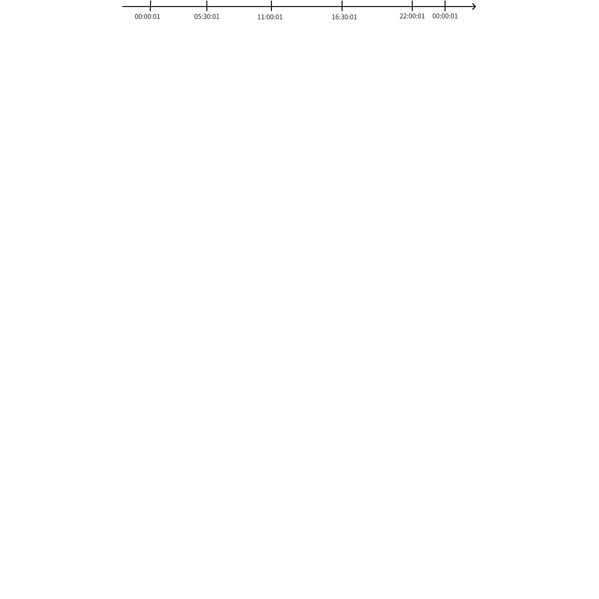
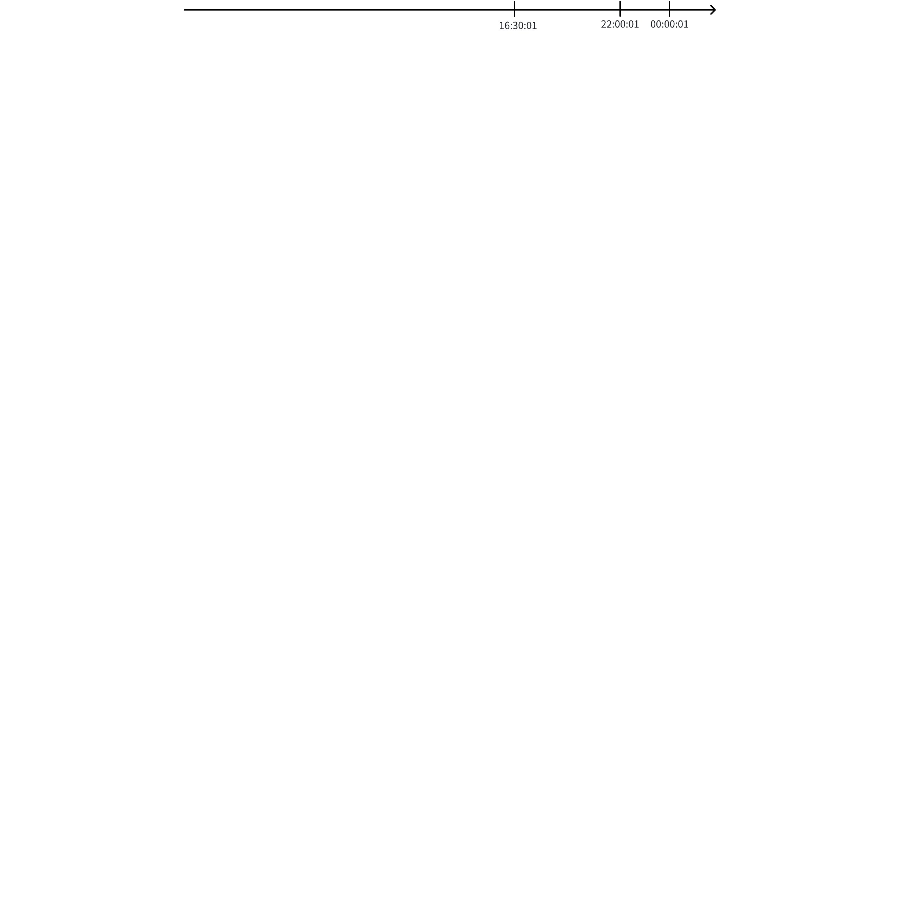
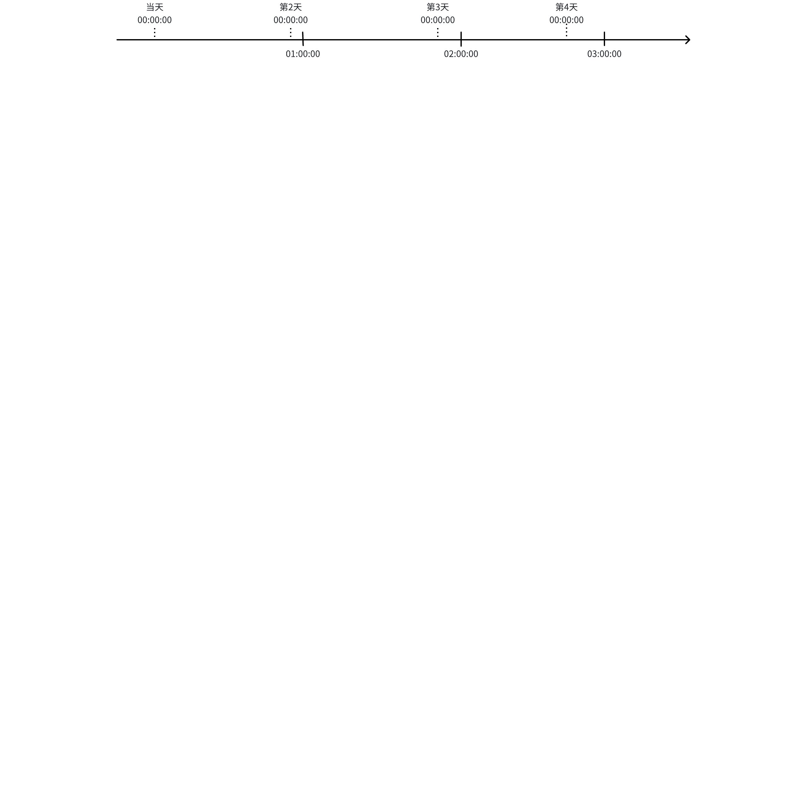
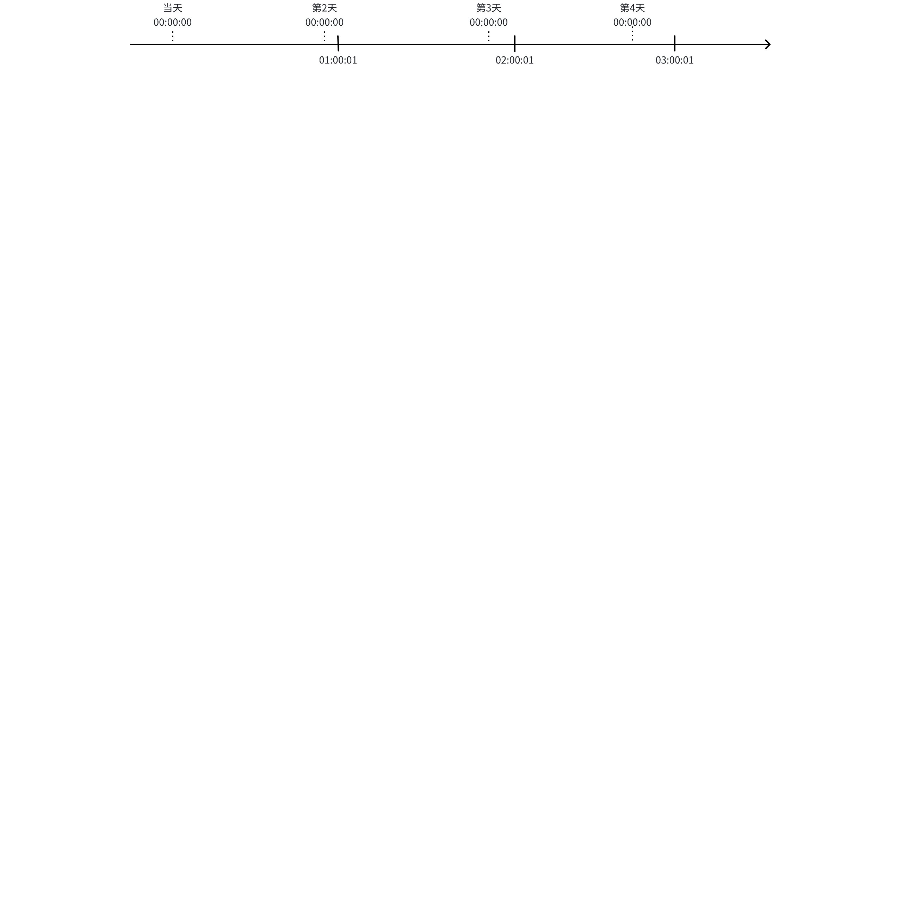

# 流计算新需求与重构 FS

## 1. 背景

本特性主要是为满足流计算新的来自 TDasset 的需求，同时针对目前的实现框架按照触发与计算分离的原则进行重构，另外之前流计算中的一些暂未实现的功能（比如高可用）一并设计处理。
[流计算的需求整理 RS](https://taosdata.feishu.cn/wiki/N3GewVEPkiAMuQk9nkjcts5Pnnh)
JIRA: [TS-6100](https://jira.taosdata.com:18080/browse/TS-6100?src=confmacro)

## 2. 变更历史

| 日期 | 版本 | 负责人 | 主要修改内容 |
| --- | --- | --- | --- |
| 2025/04/05 | 0.1 | 潘魏 | 初稿 |
| 2025/04/09 | 1.0 | 潘魏 | 初步定稿 |
|  |  |  |  |
|  |  |  |  |

## 3. 定义

- 触发：触发是流计算启动计算的前提，只有当特定事件产生且条件满足时才会产生触发。
- 触发方式：触发方式是指流计算支持的事件和条件的种类，后续可以根据需要扩展添加。
- 窗口触发：如果某个触发方式产生触发的过程中形成了窗口则该触发方式属于窗口触发，对于触发过程中没有窗口产生的触发方式则不属于窗口触发。
- 触发行为：触发发生后可以根据用户需求或实现优化进行的行为，例如立即计算、批量计算、通知等。
- 计算任务：触发引发的真正的计算行为，语句可以是任何满足写入要求的查询语句。
- 触发表：触发表是用来决定事件触发的表，可以是任意表类型（包括虚拟表，不包括系统表），不支持视图，可以有分组。
- 数据源表：事件触发后计算的数据来源表，可以跟触发表相同，也可以不同，可以是单个或多个，可以是任意类型的表（包括虚拟表），可以是视图，可以跨库。
- 输出表：每个触发表分组对应的计算结果输出到一个输出表中（可选输出到带复合主键的表中）。
- 输出表主键：输出表主键时间戳需要用户在计算 SQL 中指定来源，既可以来自触发条件中产生的合法值，也可以来自计算语句生成的合法值。
- 数据更新：数据更新是指触发表同一个主键时间戳的数据被多次写入的场景，同一个写入块中的数据会被客户端预先处理，这里考虑的是不同块中可能出现的多次写入场景。
- 数据乱序：数据乱序是指触发表出现写入主键时间戳非单调递增的场景，同一个写入块中的数据会被客户端预先排序，因此这里考虑的是不同块中出现写入的乱序场景。乱序数据可以是新写入的数据，也可以是既有数据的更新。
- 实时计算：实时计算是流计算最主要的计算任务，它是根据从创建流计算时刻起触发表最新写入的数据开始进行触发的计算。
- 历史数据：流计算创建时数据库中已经写入的数据被当做历史数据，历史数据可选是否需要计算输出。
- 实时数据：流计算创建后数据库中新写入的数据被当做实时数据。
- 历史计算：根据历史数据触发产生的计算即为历史计算。
- 事件时间：记录时序数据产生时刻的时间戳，数据库中为每条时序数据的主键时间戳。
- 处理时间：流计算进行触发或计算的当前系统时间。
- 按子表分组：partition by 后面含 tbname 且不含普通列时即为按子表分组，与有无 Tag 列无关，与顺序无关。

## 4. 功能说明

与传统的流计算相比，新的流计算进行了功能和边界上的扩展。传统定义的流计算是一种以低延迟、持续性和事件时间驱动为核心，处理无界数据流的实时计算范式。TDengine 的流计算采用的是触发与计算分离的处理策略，处理的依然是持续的无界的数据流，但是进行了以下几个方面的扩展：
- 处理对象的扩展 - 传统的流计算其事件驱动对象与计算对象往往是统一的，根据同一份数据产生事件和计算。TDengine 的流计算支持触发（事件驱动）与计算的分离，也就意味着触发对象可以与计算对象进行分离。触发表与计算的数据源表可以不相同，甚至可以不需要触发表，处理的数据集合无论是列、时间范围都可以不相同。
- 触发方式的扩展 - 除了传统的数据写入触发方式外，TDengine 的流计算支持更多触发方式的扩展，例如 TDengine 支持的各种窗口计算。通过支持窗口触发，用户可以灵活的定义和使用各种方式的窗口来产生触发事件，并且窗口可以选择在开窗、关窗以及开关窗时进行触发。除了通过这些与触发表关联的事件时间驱动外，TDengine 还支持与事件时间无关的驱动，例如按照处理事件定义的定时触发等。在事件触发之前，TDengine 还支持对触发数据进行预先过滤处理，只有符合条件的数据才会进入触发。
- 计算的扩展 - 除了可以对触发表进行计算外，也可以对其他库表进行计算。计算的类型不受限制，任何查询语句都可以支持。计算结果的应用也可以根据需要进行选择，可以用来发送通知（不写入保存）、写入输出表，也可以两者同时使用。
除了对触发与计算的扩展外，TDengine 的流计算还对用户提供了其他使用上的便利。例如，针对不同用户对结果延迟的不同需求，可以支持用户在结果时效性与资源负载之间进行平衡。针对不同用户对非正常顺序写入场景的不同需求，可以支持用户灵活选择适合的处理方式与策略。

### 4.1 事件触发

事件触发是流计算运行的驱动方式，只有产生了事件触发之后才会驱动流计算的运行。当流计算引擎检测到一个符合用户定义的触发条件时，一次触发将会产生，在一个流的运行过程中检测到多少次条件符合就会产生同样数量的触发，因此一个流产生的计算结果是由流计算引擎运行过程中的所有触发共同产生。事件触发有多种方式，每种方式也有可选的触发时机，同时事件触发也可以有分组，触发后也可以选择执行不同的动作。

#### 4.1.1 触发方式

事件触发产生的来源可能多种多样，它可以来自于某个表的数据写入，也可以来自于对某个表的计算分析结果，甚至可以不来自于任何表。TDengine 目前支持的触发方式包括：

##### 4.1.1.1 定时触发(PERIOD)

定时触发时采用与连续查询（Continuous query) 类似的方式使用系统时间的固定间隔来驱动的触发，可以指定触发表与分组，也可以不指定触发表。定时触发本质上就是我们常说的定时任务，定时触发不属于窗口触发。
定时触发是以建流时当天的系统时间的零点作为起始的定时触发的基准时间点，然后根据间隔来确定下次触发的时间点，可以通过指定时间偏移的方式来改变基准时间点。根据时间间隔的不同，定时触发的时间点也有所不同，具体的规则如下：

###### 4.1.1.1.1 定时间隔小于 1 天

在这种使用场景下，时间偏移在每天生效，表现为相对于每日零点的偏移，定时触发在每日的基准时间点进行重置，也就是说以前后两日的基准时间点为一个周期，在周期内按照间隔进行定时触发，最后一次定时触发的时间点与下一日的基准时间点之间的间隔可能小于固定的定时间隔。
举例，定时间隔为 5 小时 30 分钟，那么在一天内的触发时刻将如下图所示，后续每一天内的触发时刻都是相同的。


同样的定时间隔，如果指定了偏移为 1 秒，那么在一天内的触发时刻将如下图所示，后续每一天内的触发时刻都是相同的。


同样条件下，如果建流时当前系统时间为 12：00：00，那么在当天的触发时刻将如下图所示，后续每一天内的触发时刻将如上图所示一样保持不变。


###### 4.1.1.1.2 定时间隔不小于 1 天

在这种使用场景下，时间偏移只在第一次是相对于每日零点的偏移，定时触发是连续进行的触发，过程中没有重置。
例如，定时间隔为 1 天加 1 小时，建流时当前系统时间为 12：00：00，那么在当天及随后几天的触发时刻将如下图所示，后续将延续当前触发继续按照固定间隔触发。


同样条件下，如果指定了偏移为 1 秒，那么在当天及随后几天的触发时刻将如下图所示，后续将延续当前触发继续按照固定间隔触发。


**适用场景**：需要按照系统时间连续定时驱动计算的场景，例如：每小时计算生成一次当天的统计数据，每天定时发送统计报告等场景。

##### 4.1.1.2 滑动触发(SLIDING)

滑动触发是指对触发表的写入数据按照事件时间的固定间隔来驱动的触发，不可以指定 INTERVAL 窗口，不属于窗口触发，必须指定触发表。
滑动触发的触发时刻、时间偏移规则同定时触发（PERIOD）完全相同，唯一的区别是系统时间变更为事件时间。
触发表为超级表时支持按 tag、子表分组，支持不分组。
支持对写入数据进行处理过滤后（有条件）的滑动触发。
**适用场景**：需要按照事件时间连续定时驱动计算的场景，例如：每小时计算生成一次当天的统计数据，每天定时发送统计报告等场景。

##### 4.1.1.3 滑动窗口触发(INTERVAL)

滑动窗口触发是指对触发表的写入数据按照事件时间和固定窗口大小滑动而形成的触发，必须指定 INTERVAL 窗口，属于窗口触发，必须指定触发表。
滑动窗口触发的起始时间点是窗口的起始点 ，窗口默认是从Unix time 0（1970-01-01 00:00:00 UTC）开始划分，可以通过指定窗口时间偏移的方式来改变窗口的划分起始点。
触发表为超级表时支持按 tag、子表分组，支持不分组。
支持对写入数据进行处理过滤后（有条件）的滑动触发。
**适用场景**：需要按照事件时间定时窗口计算的场景，例如：每小时计算生成该小时内的统计数据，每隔1小时计算最后5分钟窗口内的数据等场景。

##### 4.1.1.4 会话窗口触发(SESSION)

会话窗口触发是指对触发表的写入数据按照会话窗口的方式进行窗口划分，当窗口启动和（或）关闭时进行的触发，属于窗口触发，必须指定触发表。
支持对写入数据进行处理过滤后（有条件）的窗口触发。
**适用场景**：需要通过会话窗口驱动计算和（或）通知的场景。

##### 4.1.1.5 状态窗口触发(STATE_WINDOW)

状态窗口触发是指对触发表的写入数据按照状态窗口的方式进行窗口划分，当窗口启动和（或）关闭时进行的触发，属于窗口触发，必须指定触发表。
触发表为超级表时只支持按子表分组。
支持对写入数据进行处理过滤后（有条件）的窗口触发。
**适用场景**：需要通过状态窗口驱动计算和（或）通知的场景。

##### 4.1.1.6 事件窗口触发(EVENT_WINDOW)

事件窗口触发是指对触发表的写入数据按照事件窗口的方式进行窗口划分，当窗口启动和（或）关闭时进行的触发，属于窗口触发，必须指定触发表。
触发表为超级表时只支持按子表分组。
支持对写入数据进行处理过滤后（有条件）的窗口触发。
**适用场景**：需要通过事件窗口驱动计算和（或）通知的场景。

##### 4.1.1.7 计数窗口触发

计数窗口触发是指对触发表的写入数据按照计数窗口的方式进行窗口划分，当窗口启动和（或）关闭时进行的触发，属于窗口触发，必须指定触发表。
支持列的触发，只有当指定的列有数据写入时才触发。
触发表为超级表时只支持按子表分组。
支持对写入数据进行处理过滤后（有条件）的触发。
**适用场景**：
需要对每条数据进行处理的场景，例如：故障数据写入、采样数据写入等场景。
需要根据某些列特定值进行处理的场景，例如：异常值写入场景。
需要批量处理数据的场景，例如：每写入 1000 条电压数据求平均值场景等。

#### 4.1.2 触发动作

事件触发后可以根据需要执行不同的动作，比如发送事件通知、执行一个计算或者两者同时进行。
- 只通知不计算 - 可以通过 websocket 方式向外部应用发送事件通知。
- 只计算不通知 - 可以执行任意一个查询并保存结果到流计算的输出表中。
- 既通知又计算 - 可以执行任意一个查询，同时发送计算结果或事件通知给外部应用。

#### 4.1.3 触发表与分组

通常意义来说，一个流计算只对应一个计算，比如根据一个子表触发和产生一个计算，结果保存到一张表中。根据 TDengine “一个设备一张表” 的设计理念，如果需要对所有设备分别进行计算，那就需要为每个子表创建一个流计算，这会造成使用的不便和处理效率的降低。为了解决这个问题，TDengine 的流计算支持触发分组，一个分组是流计算的最小执行单元，从逻辑上可以认为每个分组会产生一个单独的流计算，每个分组也对应一个输出表和单独的事件通知。如果未指定分组或未指定触发表（某些触发方式允许），那么整个流计算将只产生一个计算，从逻辑上也可以认为此时只有一个分组，最终对应一个输出表和通知。所有触发方式都可以指定触发表与分组。
因为每个分组都具有独立的流计算，所以每个分组的计算进度、输出频率等都会是不同的，因此，从逻辑上讲，每个分组的流计算都是完全独立的。
**总结来说，一个流计算输出表（子表或普通表）的个数与触发表的分组个数相同，****未指定分组时则只产生一个输出表（普通表）****。**

目前支持的触发方式与分组组合如下：

| 触发方式 | 支持的分组类型 |
| --- | --- |
| PERIOD、SLIDING、INTERVAL、SESSION | 按表分组、按 Tag 分组、不分组 |
| 其他窗口触发 | 按表分组 |

### 4.2 事件通知

事件通知是流在事件触发后可选的执行动作，目前是支持通过 websocket 协议发送事件通知到应用。事件通知有不同的分类，需要用户指定需要的通知类型。通知中可以会包含本次触发以及计算的相关内容，可以包含计算结果，也可以在没有计算结果时只通知事件相关信息。

### 4.3 计算任务

计算任务是流在事件触发后执行的计算动作，计算执行的是任意查询 SQL 语句，可以查询触发表的数据，也可以查询其他库表的数据。计算任务可以指定查询触发相关联的数据，例如：触发窗口内的数据，也可以查询与触发窗口无关的数据。计算产生的结果信息默认写入到流计算的输出表中，用户也可以选择不保存到输出表中，只发送结果通知外部应用，当然用户也可以选择既写入输出表又发送通知的方式。
因为计算任务的灵活度很高，用户要确保流的使用正确性，有以下几点需要注意：
- 查询输出的第一列将作为输出表的主键列 - 这就要求查询输出的第一列为合法的主键列数值，具体来说就要求第一列为不含 NULL 值的时间戳列。如果列类型不符则建流时会报错，如果运算过程中出现 NULL 值则对应的计算结果会被自动丢弃处理。
- 每个触发分组的计算结果都会写入到该分组的同一个输出表（子表或普通表）中 - 这就意味着如果查询语句也包含了分组子句，那所有查询语句产生的分组结果将写入到同一个输出表中，而不同的查询语句分组有可能产生相同的主键时间戳值。因此，如果用户需要使用这种用法，最好是输出表使用复合主键写入，否则不同分组间可能出现数据覆盖，结果是不确定的。
- 每次触发计算的结果都会覆盖写入到同一个输出表（子表或普通表）中 - 这就意味着如果多次触发产生的主键时间戳相同，那么它们会互相覆盖写入；如果多次触发产生的主键时间戳不相同，那么它们就不会被更新。因此，用户需要根据这一行为特点进行输出主键时间戳的合理设计，确保输出结果符合预期。
当然，如果用户指定了只通知不保存结果的模式，意味着查询输出的结果不需要保存到结果表，此时计算语句包括输出列可以没有任何限制；如果没有指定只通知模式就意味着查询输出的结果需要保存到结果表，用户就需要参考上述几点注意事项，在建流前进行合理的设计。

### 4.4 重新计算

TDengine 支持的窗口类型大多是与主键列相关联的，比如事件窗口要根据按主键列排序好的数据进行窗口启动与关闭的计算，因此在使用窗口触发时就要求触发表的数据写入应该是尽可能有序的，这样才能保证流计算处理的效率是最高的。因此，一旦存在乱序写入的数据，这些数据将可能影响已经触发完成的窗口的计算结果正确性。同理，数据如果存在更新和删除的情况，也可能会影响计算结果的正确性。
TDengine 支持使用传统流计算的 `WATERMARK`来解决一定程度的乱序、更新、删除场景带来的问题。`WATERMARK`是用户可以指定的一个基于事件时间的时长，它代表的是事件时间在流计算中的进展**，**体现了用户对于乱序数据的容忍程度。当前处理的最新事件时间 - `WATERMARK`指定的固定间隔即为当前水位线，只有写入数据的事件时间早于当前水位线才会进入触发判断，只有窗口或其他触发的时间条件早于当前水位线才会启动触发。`WATERMARK`对于定时触发（PERIOD）不生效，定时触发模式下不会有重新计算。
对于超出 `WATERMARK`的乱序、更新、删除场景，TDengine 流计算使用重新计算的方式来保证最终结果的正确性，重新计算意味着对于乱序、更新和删除的数据覆盖区间重新进行触发和运算。重算时输出表中已经产生的计算结果不会被删除，重算会重新写入新的结果，因此为了保证这种方式的有效性，用户需要确保其计算语句和数据源表是与处理时间无关的，也就是说同一个触发即使执行多次其结果依然是有效的。
重新计算可以分为自动重新计算与手动重新计算，如果用户不需要自动重新计算，可以通过选项关闭。手动重新需要用户手动发起，在需要时可以通过 SQL 启动。

### 4.5 非典型场景说明

#### 4.5.1 数据乱序

数据乱序指的是触发表的乱序写入行为，计算不关心数据源表是否乱序，但是用户需要从业务的角度确保在触发发生时数据源表的数据已经写入完成。根据触发方式的不同，数据乱序的影响和处理也不相同：

| 触发方式 | 影响和处理 |
| --- | --- |
| 计数窗口触发 | 忽略，不处理 |
| 定时触发 滑动触发 | 忽略，不处理 |
| 其他窗口触发 | 默认处理：通过重算进行处理 可选处理：忽略，不处理 |

#### 4.5.2 数据更新

数据更新是指同一个时戳的数据被重复写入多次，其他列可以更新或不更新，数据更新操作也只针对触发表和触发操作有影响，对计算过程本身无影响。根据触发方式的不同，数据更新的影响和处理也不相同：

| 触发方式 | 影响和处理 |
| --- | --- |
| 计数窗口触发 | 忽略，不处理 |
| 定时触发 滑动触发 | 忽略，不处理 |
| 其他窗口触发 | 当做乱序数据处理（重算） |

#### 4.5.3 数据删除

数据删除也只针对触发表和触发操作有影响，对计算过程本身无影响。根据触发方式的不同，数据删除的影响和处理也不相同：

| 触发方式 | 影响和处理 |
| --- | --- |
| 计数窗口触发 | 忽略，不处理 |
| 定时触发 滑动触发 | 忽略，不处理 |
| 其他窗口触发 | 默认处理：忽略，不处理 可选处理：当做乱序数据处理（重算） |

#### 4.5.4 过期数据

TDengine 通过引入 expired_time 来设置数据的过期时间，流的触发产生的每个分组根据最新数据的事件时间和 expired_time 来判断新数据是否过期，过期数据的临界点是通过最新事件时间减去 expired_time 得出，所有早于过期数据临界点的数据视为过期数据。
过期数据只针对触发表的实时数据而言，历史数据与其他表的数据没有过期数据的概念。过期数据的判断是在流触发时进行的，数据是否过期与其写入数据库的时机息息相关，所有按照事件时间顺序写入的数据都不会是过期数据，只有乱序写入的数据才可能是过期数据。
过期数据不会自动触发产生计算和重算，也就意味着在所有触发方式下，过期数据都将被忽略处理（不进行计算和重算）。如果用户没有需要忽略计算和重算的时间区间，则用户不需要指定 expired_time，即没有过期数据。如果用户指定了过期数据，同时想对部分过期数据进行计算或重算，那么用户可以通过手动重算的方式实现。
过期数据只对是否产生自动触发有影响，不对计算数据的范围有任何影响，因此如果某次触发的计算范围包含触发表中的过期数据，这部分过期数据仍然会被计算使用。

#### 4.5.5 库表操作

流计算创建后，如果用户对每个流计算涉及的库和(或)表进行了操作，这些操作对流的影响和流对操作的处理总结如下：

| 操作 | 影响与流的处理 |
| --- | --- |
| 用户在触发超级表下新建子表并写入 | 新的子表自动加入当前流计算，可能加入某个分组或新产生一个分组 |
| 用户删除触发超级表的子表 | 默认忽略处理，对于某些触发方式如果需要可指定自动重算，可指定是否删除子表对应的结果表（只适用按表分组的流） |
| 用户删除触发表 | 忽略不额外处理 |
| 用户在触发表上新增列（TAG） | 忽略不额外处理 |
| 用户删除触发表的列（TAG） | 忽略不额外处理 |
| 用户修改触发超级表的子表 tag 值 | 如果该 tag 列被流作为触发分组列使用则不允许操作，报错处理；非分组列更改后立即生效 |
| 用户修改触发表的列 schema | 忽略不额外处理（读取时发现schema不一致报错） |
| 用户修改、删除数据源表 | 忽略不额外处理 |
| 用户修改、删除输出表 | 忽略不额外处理（输出子表和普通表如果写入时发现schema不一致报错，发现表不存在重新建表，输出超级表被删除不处理） |
| 用户拆分 vnode | 当被拆分 vnode 所在库为数据源库或触发表库时不允许 当存在虚拟表触发或虚拟表计算时不允许，用户在确认无影响后可指定强制执行（SPLIT VGROUP N FORCE） |
| 用户删除数据库 | 当被删库为某个流的数据源库或触发表库且不是该流的所在库时不允许 当存在非目标数据库的虚拟表触发或虚拟表计算流时不允许，用户在确认无影响后可指定强制执行（DROP DATABASE name FORCE） |

说明：
除了上表中有明确限制和额外处理的操作外，其他未说明的操作和上表中说明“忽略不额外处理”的操作都没有操作上的限制，但是如果操作对流的计算可能产生影响，需要用户根据情况自行进行处理，可选忽略或者通过手动重算的方式进行重新计算。

### 4.6 结果输出

流计算的计算结果默认会保存到输出表中，每个输出表中的计算结果是截至当前时刻已经触发和计算完成的输出。用户也可以选择不保存到输出表中，只发送结果通知外部应用，当然用户也可以选择既写入输出表又发送通知的方式。对于结果保存有以下几点说明：
- 输出表可以为超级表或普通表，当存在触发分组时输出表为超级表，当不存在触发分组时输出表为普通表。
- 每个触发分组对应的计算结果写到一个子表中，没有指定触发分组时所有计算结果写入到同一个普通表中。
- 输出表在建流时会自动创建，用户不需要自行创建，如果需要写入到已经存在的输出表中，需要表的 schema 完全匹配。
- 每个分组输出的子表也不需要提前创建，流计算在运算过程中输出计算结果时会自动创建需要的结果表。
- 默认每个分组的输出子表名由系统按照默认规则生成，用户也可以自行指定子表名的命名规则。
- 如果不同分组指定生成的子表名相同，那么不同分组的计算结果就会保存到同一个子表中，需要用户自行确认这是预期的行为，否则用户需要确保每个分组生成的子表名都是唯一的。
- 用户除了可以指定子表名外，也可以根据需要指定输出超级表的 tag 列以及每个子表的 tag 列的值。
- 输出表写入数据时，遵循主键(ts 列或者 ts + 复合主键列)唯一的约定，如果生成的数据主键不唯一，则只保留一条数据。在使用 _twstart 或者各个子表 ts 列作为输出表 ts 写入一张表时，要特别注意是否符合预期。

### 4.7 权限控制

流计算的权限控制只与数据库的权限相关联，每个流计算可能与多个数据库相关，权限要求如下：

| 关联的数据库 | 个数 | 鉴权行为 | 权限要求 |
| --- | --- | --- | --- |
| 流所属的数据库 | 1个 | 建流、删流、停止流、启动流、手动重算 | 写入权限 |
| 触发表所属数据库 | 1个 | 建流 | 读取权限 |
| 输出表所属数据库 | 1个 | 建流 | 写入权限 |
| 计算数据源所属数据库 | 可能多个 | 建流 | 读取权限 |

## 5. 使用说明

### 5.1 使用说明

流计算功能在使用上的一些规则和限制说明如下：
- 每个流属于一个特定的数据库，因此建流前系统中必须已经存在数据库，同一个数据库中的流不允许重名。
- 流的触发表与数据源表可以相同，也可以不相同，可以跨库使用。
- 流的输出表可以与流、触发表、数据源表在不同的库中，不能与触发表或数据源表相同。
- 流的输出表不需要提前创建，建流和运行时会自动创建。
- 如果建流时指定的流的输出表已经存在时，需要确保 schema 与输出表完全匹配。
- 流计算可以嵌套使用，也就是说可以基于一个流的输出表再创建一个新的流计算。
- 创建流计算前集群中必须部署 Snode，建流时必须存在可用（正常运行状态） Snode。
- 计数窗口触发不支持乱序、更新、删除的自动处理（采取忽略处理的方式），在非 `FILL_HISTORY_FIRST`模式下历史与实时窗口可能不对齐。
- 对于超级表的窗口触发方式，只有 interval 和 session 窗口支持按照 tag、子表分组和不分组，其他窗口只支持按子表分组。
- 暂不支持按列分组的场景。

### 5.2 部署说明

##### 5.2.0.1 部署要求

新的流计算从架构上支持流的存算分离，在部署时要求系统中必须部署 Snode 节点，除数据读取外所有流计算功能都只在 Snode 上运行。Snode 可以与其他节点（vnode/mnode 等）在相同的 dnode 上部署，但是从资源隔离的角度考虑，强烈推荐 Snode 部署在单独的 dnode 节点上，这样可以保证资源隔离，流计算不会对写入、查询等业务造成太大干扰。
Snode 节点是只负责运行流计算计算任务的节点，在一个集群中可以部署 1 或多个（至少 1 个），每个 dnode 中最多只能部署一个 snode 节点，每个 snode 节点都有多个执行线程。
为了保证流计算的高可用，推荐在一个集群的多个物理节点中部署多个 snode 节点，流计算在多个 snode 节点间进行负载均衡，每两个 snode 节点间互为存储副本，负责存储流的状态和进度等信息。如果集群只部署了一个 snode 节点，系统将不提供高可用保证。

##### 5.2.0.2 部署 Snode

```sql {wrap}
CREATE SNODE ON DNODE dnode_id
```

##### 5.2.0.3 查看 Snode

```plaintext
SHOW SNODES
```

用户可以通过 `SHOW SNODES` 或者从系统表 `information_schema.ins_snodes` 查看 snode 相关信息。

##### 5.2.0.4 删除 Snode

```plaintext {wrap}
DROP SNODE ON DNODE dnode_id
```

说明：
删除 snode 时，需要确保 snode 及其副本同时在线，以便同步流的状态信息。当 snode 或其副本不在线时，删除会失败。

### 5.3 配置说明

新增流计算相关配置与说明如下：

| 配置项 | 说明 | 类型 | 取值范围 | 默认值 | 是否支持动态修改 |
| --- | --- | --- | --- | --- | --- |
| numOfMnodeStreamMgmtThreads | Mnode 流计算管理线程个数 | 整数 | [2-5] | 核数/4 | 不支持 |
| numOfStreamMgmtThreads | Vnode/Snode 流计算管理线程个数 | 整数 | [2-5] | 核数/8 | 不支持 |
| numOfVnodeStreamReaderThreads | Vnode 流计算读线程个数 | 整数 | [4-INT32_MAX] | 核数/2 | 不支持 |
| numOfStreamTriggerThreads | 流计算触发线程个数 | 整数 | [4-INT32_MAX] | 默认个数=核数 | 不支持 |
| numOfStreamRunnerThreads | 流计算执行线程个数 | 整数 | [4-INT32_MAX] | 默认个数=核数，存在 snode节点时默认个数=核数*2 | 不支持 |
| streamBufferSize | 流计算可以使用的最大缓存大小，只适用于`%%trows`的结果缓存（单位：MB） | 整数 | [128-INT32_MAX] | 系统物理内存的 30% | 支持 |
| streamNotifyMessageSize | 用于控制事件通知的消息大小（单位：KB） | 整数 | [8-1048576] | 8192 | 不支持 |
| streamNotifyFrameSize | 用于控制事件通知消息发送时底层的帧大小（单位：KB） | 整数 | [8-1048576] | 256 | 不支持 |

### 5.4 建流操作

##### 5.4.0.1 SQL 语法

```plaintext {wrap}
CREATE STREAM [IF NOT EXISTS] [db_name.]stream_name options [INTO [db_name.]table_name] [OUTPUT_SUBTABLE(tbname_expr)] [(column_name1, column_name2 [PRIMARY KEY][, ...])] [TAGS (tag_definition [, ...])] [AS subquery]

options: {
    trigger_type [FROM [db_name.]table_name] [PARTITION BY col1 [, ...]] [STREAM_OPTIONS(stream_option [|...])] [notification_definition]
}
    
trigger_type: {
    SESSION(ts_col, session_val)
  | STATE_WINDOW(col) [TRUE_FOR(duration_time)] 
  | [INTERVAL(interval_val[, interval_offset])] SLIDING(sliding_val[, offset_time]) 
  | EVENT_WINDOW(START WITH start_condition END WITH end_condition) [TRUE_FOR(duration_time)]
  | COUNT_WINDOW(count_val[, sliding_val][, col1[, ...]]) 
  | PERIOD(period_time[, offset_time])
}
    
event_types:
    event_type [|event_type]    
    
event_type: {WINDOW_OPEN | WINDOW_CLOSE}    

stream_option: {WATERMARK(duration_time) | EXPIRED_TIME(exp_time) | IGNORE_DISORDER | DELETE_RECALC | DELETE_OUTPUT_TABLE | FILL_HISTORY[(start_time)] | FILL_HISTORY_FIRST[(start_time)] | CALC_NOTIFY_ONLY | LOW_LATENCY_CALC | PRE_FILTER(expr) | FORCE_OUTPUT | MAX_DELAY(delay_time) | EVENT_TYPE(event_types) | 
IGNORE_NODATA_TRIGGER}

notification_definition:
    NOTIFY(url [, ...]) [ON (event_types)] [WHERE condition] [NOTIFY_OPTIONS(notify_option[|notify_option])]

notify_option: [NOTIFY_HISTORY | ON_FAILURE_PAUSE]

tag_definition:
    tag_name type_name [COMMENT 'string_value'] AS expr

```

##### 5.4.0.2 建流介绍

###### 5.4.0.2.1 触发介绍

###### 5.4.0.2.2 触发类型

- `trigger_type`: 用来指定触发类型，目前支持的触发类型包括：
  - `SESSION(ts_col, session_val)`：会话窗口触发，参数含义如下：
    - `ts_col`：主键列名。
    - `session_val`：属于同一个会话的最大时间间隔，间隔小于等于`session_val`的记录都属于同一个会话。
  - `STATE_WINDOW(col) [TRUE_FOR(duration_time)]`：状态窗口触发，参数含义如下：
    - `col`：状态列的列名。
    - `[TRUE_FOR(duration_time)]`：指定窗口的最小持续时长，如果某个窗口的时长低于该设定值，则会自动舍弃，不产生触发。
  - `[INTERVAL(interval_val[, interval_offset])] SLIDING(sliding_val[, offset_time])`：滑动触发，参数含义如下：
    - `[INTERVAL(interval_val[, interval_offset])]`：可选，指定滑动窗口触发的事件类型和窗口时长，不指定时触发不产生窗口，指定时滑动触发变为滑动窗口触发。其中：
      - `interval_val`：窗口的时长，与滑动时长大小`sliding_val`间没有大小关系限制。
      - `[, interval_offset]`：可选，指定 INTERVAL 窗口的偏移。
    - `sliding_val`：事件时间的滑动时长。
    - `[, offset_time]`：可选，指定滑动触发的时间偏移，不适用于滑动窗口触发，支持的时间单位包括：毫秒(a)、秒(s)、分(m)、小时(h)。
  - `EVENT_WINDOW(START WITH start_condition END WITH end_condition) [TRUE_FOR(duration_time)]`：事件窗口触发，参数含义如下：
    - `START WITH start_condition END WITH end_condition`：事件起止条件的定义。
    - `[TRUE_FOR(duration_time)]`：指定窗口的最小持续时长，如果某个窗口的时长低于该设定值，则会自动舍弃，不产生触发。
  - `COUNT_WINDOW(count_val[, sliding_val][, col1[, ...]])`：计数窗口触发，参数含义如下：
    - `count_val`：计数条数，当写入数据条目数达到 `count_val`时触发，最小值为 1。
    - `sliding_val`：可选，窗口滑动的条数。
    - `[, col1[, ...]`：可选，按列触发模式时的数据列列表，具体参数信息含义如下：
      - `col1[, ...]`：触发列列表，只支持普通列，列表中任一列有非空数据写入时才为有效条目，NULL 值视为无效值。
  - `PERIOD(period_time[, offset_time])`：定时触发，参数含义如下：
    - `period_time`：定时触发的系统时间间隔，支持的时间单位包括：毫秒(a)、秒(s)、分(m)、小时(h)、天(d)，支持的时间范围为[10a, 3650d]。
    - `[, offset_time`]：可选，指定定时触发的时间偏移，支持的时间单位包括：毫秒(a)、秒(s)、分(m)、小时(h)，偏移大小应该小于1天。

###### 5.4.0.2.3 触发表

- `[FROM [db_name.]table_name]`：用来指定触发表，触发表可以为任意表类型，不支持系统表，不支持视图，不支持子查询，但支持虚拟表。除了定时触发可以不指定触发表外（也可以指定），其他触发方式必须指定触发表。

###### 5.4.0.2.4 触发分组

- `[PARTITION BY col1[, ...]]`：指定触发的分组列，支持多列，目前只支持按照 tbname（表）和 tag 进行分组。

###### 5.4.0.2.5 控制介绍

- `[STREAM_OPTIONS(stream_option [|...]]`：指定流的控制选项用于控制触发和计算行为，可以多选，同一个选项不可以多次指定，目前支持的控制选项包括：
  - `WATERMARK(duration_time)`：指定数据乱序的容忍时长，超过该时长的数据会被当做乱序数据，根据不同触发方式的乱序数据处理策略和用户配置进行处理，未指定时默认 `duration_time` 值为 0。
  - `EXPIRED_TIME(exp_time)` ：指定过期数据间隔并忽略过期数据，未指定时无过期数据，如果业务不需要感知超过一定时间范围的数据写入或更新时可以指定。`exp_time` 为过期时间间隔，支持的时间单位包括：毫秒(a)、秒(s)、分(m)、小时(h)、天(d)。
  - `IGNORE_DISORDER`：指定忽略触发表的乱序数据，未指定时不忽略乱序数据，对于业务非常注重计算或通知的时效性、触发表乱序数据不影响计算结果等场景可以指定。乱序数据既包括新的乱序数据的写入，也包括对已写入数据的更新操作。
  - `DELETE_RECALC`: 指定触发表的数据删除（包含触发子表被删除场景）需要自动重新计算，只有触发方式支持数据删除的自动重算才可以指定。未指定时忽略数据删除，只有触发表数据删除会影响计算结果的场景才需要指定。
  - `~~DELETE_OUTPUT_TABLE~~`：指定触发子表被删除时其对应的输出子表也需要被删除，只适用于按表分组的场景，未指定时触发子表被删除不会删除其输出子表。
  - `FILL_HISTORY[(start_time)]`：指定需要从`start_time`（事件时间）开始触发历史数据计算，`[(start_time)]`可选，未指定时从最早的记录开始触发计算。如果未指定`FILL_HISTORY`和 `FILL_HISTORY_FIRST`则不进行历史数据的触发计算，该选项不能与`FILL_HISTORY_FIRST`同时指定 。定时触发（`PERIOD`）模式下不支持历史计算。
  - `FILL_HISTORY_FIRST[(start_time)]`：指定需要从`start_time`（事件时间）开始优先触发历史数据计算，`[(start_time)]`可选，未指定时从最早的记录开始触发计算。该选项适合在需要按照时间顺序计算历史数据且历史数据计算完成前不需要实时计算的场景下指定，未指定时优先实时计算，不能与`FILL_HISTORY`同时指定。定时触发（`PERIOD`）模式下不支持历史计算。
  - `CALC_NOTIFY_ONLY`：指定计算结果只发送通知，不保存到输出表，未指定时默认会保存到输出表。
  - `LOW_LATENCY_CALC`：指定触发后需要低延迟的计算或通知，单次触发发生后会立即启动计算或通知。低延迟的计算或通知会保证实时流计算任务的时效性，但是也会造成处理效率的降低，有可能需要更多的处理资源才能满足需求，因此只推荐在业务有强时效性要求时使用。未指定时单次触发发生后有可能不会立即进行计算，采用批量计算与通知的方式来达到较好的资源利用效率。
  - `PRE_FILTER(expr)` ：指定在触发进行前对触发表进行数据过滤处理，只有符合条件的数据才会进入触发判断，`expr`中可以包含列、tag、常量及其标量与逻辑运算，例如：`col1 > 0` 则只有 `col1`为正数的数据行可以进行触发，未指定时无触发表数据过滤。
  - `FORCE_OUTPUT`：指定计算结果强制输出选项，当某次触发没有计算结果时将强制输出一行数据，除常量外（含常量对待列）其他列的值都为 NULL。
  - `MAX_DELAY(delay_time)`：指定窗口未关闭时的最长触发等待时长（处理时间），从窗口开启时每经过该时间段且窗口仍未关闭时产生触发，适用于所有窗口触发方式，SLIDING 触发（不带 `INTERVAL`）和 PERIOD 触发不适用（自动忽略）。当窗口触发存在`TRUE_FOR`条件且`TRUE_FOR`时长大于`MAX_DELAY`时，`MAX_DELAY`仍然生效，即使最终当前窗口未满足`TRUE_FOR`条件。`delay_time`为等待时长，支持的时间单位包括：秒(s)、分(m)、小时(h)、天(d)，最小允许的值为 3 秒，误差范围在 1 秒以内，特别的是当计算时长超过`delay_time`时忽略期间的`MAX_DELAY`触发。
  - `EVENT_TYPE(event_types)`：指定窗口触发的事件类型，可以多选，未指定时默认值为 `WINDOW_CLOSE` ，选项含义如下：
    - `WINDOW_OPEN` ：窗口启动事件。
    - `WINDOW_CLOSE` ：窗口关闭事件。
    SLIDING 触发（不带 `INTERVAL`）和 PERIOD 触发不适用（自动忽略）。
  - `IGNORE_NODATA_TRIGGER`：指定忽略触发表无输入数据时的触发，适用于滑动触发（`SLIDING`）、滑动窗口触发（`INTERVAL`）、定时触发（`PERIOD`）。对于滑动触发与定时触发来说，如果两次触发时刻中间触发表没有数据则忽略该次触发。对于滑动窗口触发来说，如果窗口内触发表没有数据则忽略该次触发。未指定时不忽略无输入数据时的触发。

###### 5.4.0.2.6 通知介绍

- `NOTIFY(url [, ...]) [ON (event_types)] [WHERE condition] [NOTIFY_OPTIONS(notify_option[|...)]]`：可选，当需要发送事件通知时需要指定，详细说明如下：
  - `url [, ...]`：指定通知的目标地址，必须包括协议、IP 或域名、端口号，并允许包含路径、参数，整个 url 需要包含在引号内。目前仅支持 websocket 协议。例如：`"ws://``localhost:8080``"`、`"ws://``localhost:8080/notify``"`、`"ws://``localhost:8080/notify?key=foo``"`。
  - `[ON (event_types)]`：指定需要通知的事件类型，可多选，对于`SLIDING`（不带 INTERVAL 窗口）和`PERIOD`触发不需要指定，其他触发必须指定，支持的事件类型有：
    - `WINDOW_OPEN`：窗口打开事件，在触发表分组窗口打开时发送通知。
    - `WINDOW_CLOSE`：窗口关闭事件，在触发表分组窗口关闭时发送通知。
  - `[WHERE condition]`：指定通知需要满足的条件，`condition`中只能指定含计算结果列和（或）常量的条件。
  - `[NOTIFY_OPTIONS(notify_option[|notify_option)]]`：可选，指定通知选项用于控制通知的行为，可以多选，目前支持的通知选项包括：
    - `NOTIFY_HISTORY`：指定计算历史数据时是否发送通知，未指定时默认不发送。
    - `~~ON_FAILURE_PAUSE~~`：指定在向通知地址发送通知失败时暂停流计算任务，循环重试发送通知，直至发送成功才恢复流计算运行，未指定时默认直接丢失事件通知（不影响流计算继续运行）。

###### 5.4.0.2.7 输出表介绍

- `[INTO [db_name.]table_name] [OUTPUT_SUBTABLE(tbname_expr)] [(column_name1, column_name2 [PRIMARY KEY][, ...])] [TAGS (tag_definition [, ...])]`：建流语句的这一部分用来指定输出表的定义以及输出子表的 tag 值（存在分组时），详细说明如下：
  - `INTO [db_name.]table_name`：可选，指定输出表表名为 `table_name`，数据库名`db_name`也可以指定。对于存在触发分组的场景该表为超级表，对于不存在触发分组的场景该表为普通表。对于只触发通知不计算场景、计算结果只通知不保存输出场景都不需要指定，否则必须指定输出表表名。
  - `[OUTPUT_SUBTABLE(tbname_expr)]`：可选，指定每个触发分组的计算输出表（子表）名，没有触发分组时不可以指定。未指定时根据规则自动为每个分组生成唯一的输出表（子表）名。`tbname_expr` 为任意输出字符串的表达式，可根据需要选择任意触发表分组列（来自`[PARTITION BY col1[, ...]]`）使用，输出长度不能超过表名最大长度，超过时截断处理。如果不希望不同分组输出到同一个子表中，用户需确保每个分组输出表名都是唯一的。
  - `[(column_name1, column_name2 [PRIMARY KEY][, ...])]`：可选，指定输出表的每列列名，未指定时每列列名与计算结果的每列列名相同。可以通过`[PRIMARY KEY]`指定第二列为主键列，与第一列共同组成复合主键。
  - `[TAGS (tag_definition [, ...])]`：可选，指定输出超级表的 tag 列定义与值的列表，只有存在触发分组时才可以指定。未指定时默认的 tag 列的定义和值均来自于所有分组列，此时分组列中不可以存在相同的列名，特别的是当按表分组时产生的 tag 列的名字为: `tag_tbname`。具体的`tag_definition`参数说明如下：
    - `tag_name type_name ``~~[COMMENT 'string_value']~~`` AS expr`：指定单个 tag 列的定义与值，`tag_name` 为 tag 列名，`type_name`为 tag 列类型，`expr` 为自定义的 tag 值计算表达式，可根据需要选择任意触发表分组列（来自`[PARTITION BY col1[, ...]]`）使用。

###### 5.4.0.2.8 计算介绍

- `[AS subquery]`：可选，指定流计算的计算任务语句，可以是任意类型的查询语句，查询的对象是数据源表，可以与触发表相同或不同。未指定时触发后不产生计算，只根据需要进行事件触发。

###### 5.4.0.2.9 占位符

计算时可能需要使用触发时的一些关联信息，这些信息在 SQL 语句中以占位符的形式出现，在每次真实计数时会被作为常量替换到 SQL 语句中。这里定义和列举了计算 SQL 语句中可以使用的触发相关的一些占位符：

| 触发方式 | 占位符 | 含义与说明 |
| --- | --- | --- |
| `_tprev_ts` | 上一次触发的事件时间（精度同记录） |
| `_tcurrent_ts` | 本次触发的事件时间（精度同记录） |
| `_tnext_ts` | 下一次触发的事件时间（精度同记录） |
| `_twstart` | 本次触发窗口的起始时间戳 |
| `_twend` | 本次触发窗口的结束时间戳，只适用于`WINDOW_CLOSE`触发使用 |
| `_twduration` | 本次触发窗口的持续时间，只适用于`WINDOW_CLOSE`触发使用 |
| `_twrownum` | 本次触发窗口的记录条数，只适用于`WINDOW_CLOSE`触发使用 |
| `_tprev_localtime` | 上一次触发时刻的系统时间（精度：ns） |
| `_tnext_localtime` | 下一次触发时刻的系统时间（精度：ns） |
| `_tgrpid` | 触发分组的 ID 值，类型为 BIGINT |
| `_tlocaltime` | 本次触发时刻的系统时间（精度：ns） |
| `%%n` | 触发分组列的引用，n 为分组列（来自`[PARTITION BY col1[, ...]]`）的下标（从 1 开始） |
| `%%tbname` | 触发表每个分组表名的引用，只有触发分组含 tbname 时可用，可作为查询表名使用（`FROM %%tbname`） |
| `%%trows` | 触发表每个分组的触发数据集（满足本次触发的数据集）的引用，对于定时触发意味着上次触发与本次触发之间写入的触发表数据，只可作为查询表名使用（`FROM %%trows`），只适用于`WINDOW_CLOSE`触发使用，推荐在小数据量场景下使用。 |

###### 5.4.0.2.10 占位符使用限制

- `%%trows`只能用于 `FROM`子句，在使用`%%trows`的语句中不支持 `where`条件过滤，不支持对`%%trows`进行关联查询。
- `%%tbname`只能用于 `FROM`、`SELECT` 和 `WHERE`子句。
- 其他占位符只能用于 `SELECT` 和 `WHERE` 子句。

##### 5.4.0.3 建流示例

###### 5.4.0.3.1 计数窗口触发

需求1：表 `tb1`每写入 1 行数据时，计算表 `tb2`中在同一时刻前 5 分钟内 `col1`的平均值，计算结果写入表 `tb3`。
语句1：`create stream sm1 count_window(1) from tb1 into tb3 as select ``_twstart``, avg(col1) from tb2 where _c0 >= _twend - 5m and _c0 <= _twend;`

需求2：表 `tb1`每写入 10 行大于 0 的 `col1` 列数据时，计算这 10 条数据 `col1`列的平均值，计算结果不需要保存，需要通知到 `ws://``localhost:8080/notify`。
语句2：`create stream sm2 count_window(10, ``10``, col1) from tb1 STREAM_OPTIONS(CALC_ONTIFY_ONLY|pre_filter(col1 > 0)) notify("ws://``localhost:8080/notify``") on (WINDOW_CLOSE) as select avg(col1) from ``%%trows``;`

###### 5.4.0.3.2 滑动窗口触发

需求1：超级表 `stb1`的每个子表在每 5 分钟的时间窗口结束后，计算这 5 分钟的 `col1`的平均值（如果没有数据则忽略），每个子表的计算结果分别写入超级表 `stb2`的不同子表中。
语句1：`create stream sm1 INTERVAL(5m) ``SLIDING(5m)`` from stb1 PARTITION BY tbname STREAM_OPTIONS(IGNORE_NODATA_TRIGGER) into stb2 as select _twstart, avg(col1) from ``%%tbname`` where _c0 >= _twstart and _c0 <= _twend;`
说明：这里语句中的 `from %%tbname where _c0 >= _twstart and _c0 <= _twend` 与 `from %%trows` 的含义是不完全相同的，前者表示计算使用触发分组对应的表中在触发窗口时间段内的数据，窗口内的数据在计算时与 `%%trows` 相比较是有可能有变化的，后者则表示只使用触发时读取到的窗口数据。

需求2：超级表 `stb1`的每个子表从最早的数据开始，在每 5 分钟的时间窗口结束后或从窗口启动 1 分钟后窗口仍然未关闭时，计算窗口内的 `col1`的平均值，每个子表的计算结果分别写入超级表 `stb2`的不同子表中。
语句2：`create stream sm2 INTERVAL(5m) SLIDING(5m) MAX_DELAY(1m) from stb1 PARTITION BY tbname STREAM_OPTIONS(FILL_HISTORY_FIRST) into stb2 as select _twstart, avg(col1) from %%tbname where _c0 >= _twstart and _c0 <= _twend;`

###### 5.4.0.3.3 定时触发

需求1：每过 1 小时计算表 `tb1`中总的数据量，计算结果写入表 `tb2`(毫秒库)。
语句1：`create stream sm1 PERIOD(1h) into tb2 as select ``cast(``_tlocaltime/1000000`` as timestamp)``, count(*) from tb1;`

需求2：每过 1 小时通知`ws://``localhost:8080/notify` 一次当前系统时间。
语句2：`create stream sm1 PERIOD(1h) notify("ws://``localhost:8080/notify")``;`

### 5.5 流的查看

```sql
SHOW [db_name.]STREAMS;
```

`SHOW STREAMS` 会显示当前数据库或指定数据库所属的流计算，若要展示所有流计算的信息或者流计算的更详细的信息，可以使用：
```sql
SELECT * from information_schema.`ins_streams`;
```

#### 5.5.1 任务查看

一个流计算在执行时由多个任务组成，用户或维护人员可以从系统表 `information_schema.ins_stream_tasks` 查询更详细的流的具体的任务信息。
```plaintext
SELECT * from information_schema.`ins_stream_tasks`;
```

### 5.6 手动重算

```plaintext {wrap}
RECALCULATE STREAM [db_name.]stream_name FROM start_time [TO end_time];
```

说明：
- 用户可以根据需要来指定需要重算流的一段时间区间（事件时间）内的数据，如果未指定结束时间（`end_time`），重算区间将从指定的开始时间（`start_time`）一直到用户启动手动重算时刻流的当前计算进度截至。
- 不适用于定时触发（`PERIOD`），适用于其他所有触发类型。
- 计数窗口触发的手动重算必须同时指定开始时间与结束时间，只适用于当前流进度已经完成部分的时间区间的触发重算，如果指定的重算区间包含流当前还未启动计算的区间将自动忽略该重算请求。流计算会在该时间区间内重新划分触发窗口并进行重算，在这种情况下重新划分的窗口与重算前已经完成计算的窗口可能存在不对齐的情况，因此用户可能需要先手动删除结果表中重算区间内的结果，这样才能保证结果表中不会同时存在多次计算的结果。同理，如果未指定重算结束时间，该重算请求将自动被忽略。对于这种需要从某一时刻开始而没有结束时间的重算需求，可以通过先删流，再重建并指定`FILL_HISTORY_FIRST `含开始时间的方式来满足。

### 5.7 停止操作

```plaintext {wrap}
STOP STREAM [IF EXISTS] [db_name.]stream_name; 
```

说明：
- 如果没有指定 IF EXISTS，如果该 stream 不存在，则报错；如果存在，则停止流计算。指定了 IF EXISTS，如果该 stream 不存在，则返回成功；如果存在，则停止流计算。
- 停止操作是持久有效的，在用户重启流运行之前不会重新运行。

### 5.8 启动操作

```plaintext {wrap}
START STREAM [IF EXISTS] [db_name.]stream_name; 
```

说明：
- 没有指定 IF EXISTS，如果该 stream 不存在，则报错，如果存在，则启动流计算；指定了 IF EXISTS，如果 stream 不存在，则返回成功；如果存在，则启动流计算。
- 建流后流自动启动运行，不需要用户启动，只有在停止操作后才需要通过启动操作恢复流的运行。
- 启动流计算时，流计算停止期间写入的数据会被当做历史数据处理。

### 5.9 删流操作

```sql
DROP STREAM [IF EXISTS] [db_name.]stream_name;
```

说明：
- 仅删除流式计算任务，由流式计算写入的数据不会被删除。

### 5.10 最佳实践

因为新的流计算提供了功能上更大的灵活性，取消了很多限制，在提升了用户可用性的同时，也对用户用好用对流计算提出了更高的要求。本节是根据流计算支持的功能结合实现的特点，总结列举一些需要用户或交付人员注意的使用方面的一些最佳实践。

#### 5.10.1 部署方面

用户有条件时或使用多个流时或不希望流计算影响数据库时，推荐在单独的机器和 dnode 部署 snode，不推荐与其他节点 (vnode/mnode/qnode等）部署在一起；
推荐在集群内部署多个 snode 节点以保证高可用；
推荐在建流前先预先完成多个 snode 节点的创建以便更好的达到负载均衡；
流计算负载高时可以通过增加 snode 的方式来实现负载均衡；

#### 5.10.2 配置方面

根据部署方式和负载情况合理配置流相关的线程个数，线程数越大可能占用的 CPU 资源越高，反之则越低；
根据部署方式合理配置流最大的缓存大小，负载越大，并发流越多，单独部署时都可以调大配置；

#### 5.10.3 建流前设计

用户（交付人员）在建流前需要依次明确下列主要功能检查点，明确后可以按照对应的应对方式进行使用：

| 功能检查点 | 应对方式 |
| --- | --- |
| 根据业务特点选择触发方式 | 如果是需要每写入一条或多条数据进行处理则选择计数触发，如果是需要满足窗口条件则选择窗口触发，如果是需要根据事件时间定时运算则选择滑动触发，如果是需要根据处理时间定时运算则选择定时触发。 |
| 根据业务计算的时效性要求选择窗口触发的可选项 | 窗口触发除了要选择窗口类型外，还需要选择是开窗触发、关窗触发还是两者都触发，除此之外还可以选择在窗口未关闭时是否需要及时计算`{MAX_DELAY(delay_time)}` 。 |
| 根据事件来源选择触发表 | 事件触发的来源表选做触发表，对于定时触发可以没有触发表，但是如果需要分组输出或使用定时期间触发表数据集（`%%trows`）则必须指定触发表。 |
| 确保数据来源表与触发表的时序关系 | 如果数据来源表与触发表不相同，那么需要确保在触发表事件触发时数据来源表中数据已经可用，否则将可能影响计算结果的正确性。 |
| 根据业务最终计算的需求决定分组 | 以超级表计算为例，如果业务最终的需求是全局聚合则不需要分组，如果需要某些表聚合则选择按 tag 分组，如果需要单个子表的计算结果则可以选择按表分组。 |
| 根据流计算结果的应用方式选择分组输出子表 | 每个分组都可以有自己独立的输出子表，如果分组过多可能导致结果表过多，因此可以根据后续流计算结果的应用方式和系统资源限制选择是否每个分组需要单独的输出子表。当可以多个分组合并输出到一个子表时，可以通过设定多个分组使用相同的输出表名（`[OUTPUT_SUBTABLE(tbname_expr)]`）和输出表的复合主键设计实现分组结果合并。 |
| 使用最优的数据写入方式 | 每个分组的数据都能顺序写入是流计算最佳的写入方式，如果存在大量的乱序写入、更新写入、数据删除操作，将可能造成大量的重算处理，因此如果有条件能够保证写入顺序将可以有效提升流计算的计算效能。 |
| 确认写入数据的乱序情况 | 根据每个子表的写入乱序情况确定是否需要指定 `WATERMARK`以及确定合适的 `WATERMARK`时长。 |
| 确认乱序数据写入对流计算的影响 | 如果存在乱序写入数据，需要确认这些乱序写入的数据的计算结果的影响，对于业务非常注重计算或通知的时效性、触发表乱序数据不影响计算结果等场景可以指定`STREAM_OPTIONS(IGNORE_DISORDER)` 忽略这些乱序数据。 如果存在严重的过去时间的乱序写入数据（写入数据的事件时间与当前已经处理的事件时间相差太大）且这些数据不影响计算结果或时效性已经丧失，则可以通过`STREAM_OPTIONS(EXPIRED_TIME(exp_time))`指定其为过期数据且忽略处理。 |
| 确认重算对流计算结果的有效性 | 乱序、更新、删除场景主要是通过重算方式来解决，如果重算结果不具有幂等性或有效性，则可能会影响结果的正确性，可结合业务特点进行判断。 |
| 确认删除数据对流计算的影响 | 如果存在数据删除且需要根据删除的数据重新计算结果时则可以通过`STREAM_OPTIONS(DELETE_RECALC)`进行指定。 |
| 确认历史数据是否需要计算和计算方式 | 如果在建流时数据库中已经写入的数据需要进行计算，则需要根据业务特点和处理逻辑进一步确认是优先计算历史数据还是实时数据，例如 COUNT_WINDOW 触发只能优先历史数据计算，否则可能造成窗口无法衔接。如果优先历史数据计算则可以指定`STREAM_OPTIONS(FILL_HISTORY_FIRST）`，否则指定`STREAM_OPTIONS(FILL_HISTORY）`。 |
| 确认业务对流计算实时性要求程度 | `如果业务对流计算通知或计算的实时性要求很高，则可以指定STREAM_OPTIONS(LOW_LATENCY_CALC)`，在这种模式下会对计算资源有更高的要求。 |
| 确认使用流计算的用途 | 如果用户只需要一个事件触发通知，而不需要做计算，那可以使用只通知不计算模式（不指定计算语句）。。 |
| 确认计算后结果的应用方式 | 如果用户只需要结果通知而不需要保存，可以使用结果只通过不保存方式。`STREAM_OPTIONS(CALC_NOTIFY_ONLY)`。 |
| 确认结果写入的可靠性 | 运算过程中如果出现结果主键为 NULL 值则对应的计算结果可能会被丢弃。 如果查询语句也包含了分组子语且分组的结果写入到同一个子表时，当不同的分组产生相同的时间戳时可能出现数据覆盖。 如果同一个分组多次触发计算产生的主键时间戳相同，那么它们会互相覆盖写入。 如果同一个分组多次触发（重算）产生的主键时间戳不相同，那么它们就不会被更新。 |

#### 5.10.4 流的维护

在流的状态展示中（查询表`information_schema.`ins_streams``），会列举流的一些具体的状态信息，例如：流的实时计算是否能保持进度一致，流的重算次数多少（比例），流的错误信息等等，需要用户或运维人员关注展示的信息，判断流计算业务是否正常并据此进行分析优化处理。

## 6. 性能

希望能够通过精简设计达到更好的资源利用效率，同等条件下比之前的效率更好，能够支持更多的流计算。

## 7. 兼容性

不考虑流的兼容性，如果老用户需要升级，那么他们的 TSMA、流计算任务和 snode 都需要先通过 SQL 命令的方式删除（含结果表），然后正常关闭 taosd，snode 存储目录需要手动删除，然后在新的流计算版本上进行重建。暂时新的流计算在功能上也不能覆盖全部旧的流计算功能。

## 8. 运维

- 升级前需删除旧的TSMA、流计算任务和 snode。
- 部署上需要配置 snode。
- 使用上需要详细了解新的流的用法与行为，合理正确使用新的流计算。
- 参考最佳实践章节。

## 9. 使用场景

通过事件触发对表的持续写入数据进行通知或计算的场景。

## 10. 约束和限制

- 计数窗口触发不支持乱序、更新、删除的自动处理（采取忽略处理的方式），在非 `FILL_HISTORY_FIRST`模式下历史与实时窗口可能不对齐。
- 对于超级表的窗口触发方式，只有 interval 和 session 窗口支持按 tag、子表分组和不分组，其他窗口只支持按子表分组。
- 暂不支持 windows 平台。

#### 10.0.1 短期实现限制

- 暂不支持按列分组的场景。
- 暂不支持 interp 和 percentile 函数。
- 其他暂不支持的在文中以~~划线~~的方式划掉。

## 11. 常见错误和排查

对使用中可能遇到的错误提示以及如何排查故障进行说明。很多小型优化或功能不会有复杂的错误、排查也不困难，可以标无。但对于一些复杂的功能，容易用错、使用中容易出错的，要进行说明。

## 12. 可观测性

对 taos shell, taos Explorer， TDinsight 等基于 UI 或用户交互界面的产品组件没有影响。

## 13. 安装和卸载

无。

## 14. 文档

不需要修改企业版文档
需要修改官网文档

## 15. 参考文档

## 16. 附录

[流计算新需求与重构概要设计](https://taosdata.feishu.cn/wiki/DGQ1wjuvkiyhlskZW44cy4WvnUd)
