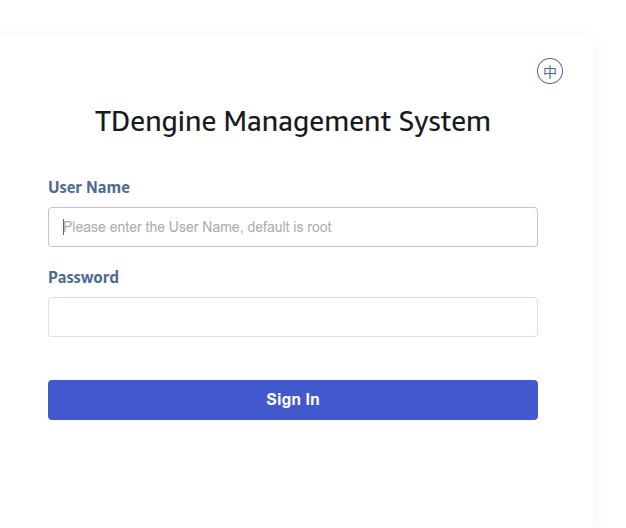
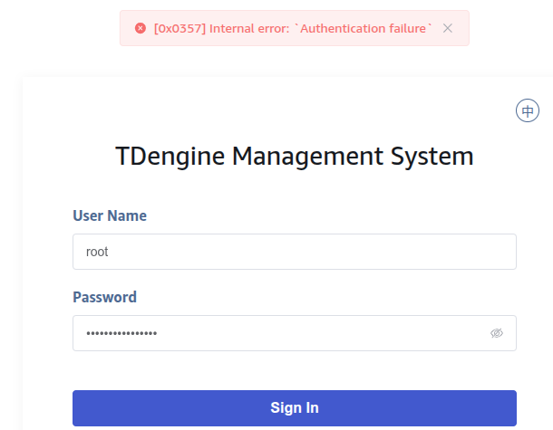
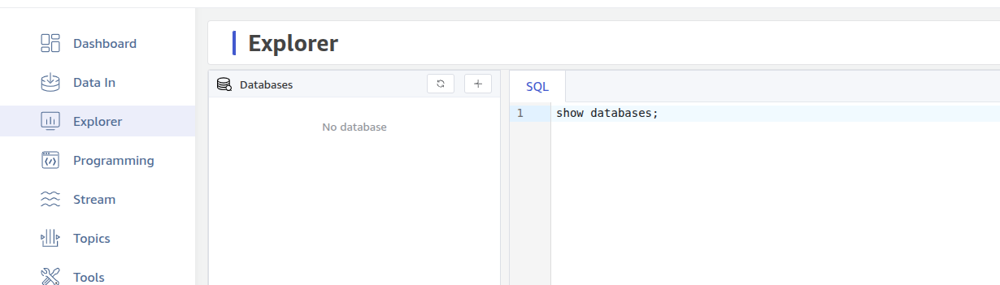
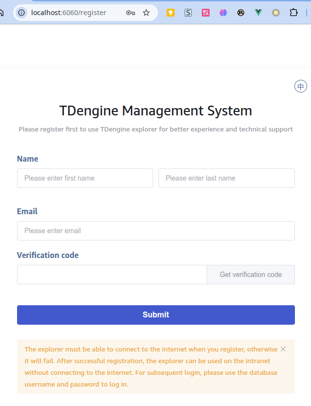

# Explorer 企业版试用时需要注册 - FS

## 1. 背景

根据[TDengine 品牌、产品命名说明](https://taosdata.feishu.cn/wiki/JzjOw6YKbiDGpskD2O0cMO4EnNh) 的调整，以及 TDengine 企业版开放下载试用的策略调整，在新的企业版试用时 Explorer 需要注册。

## 2. 变更历史

| 日期 | 版本 | 负责人 | 主要修改内容 |
| --- | --- | --- | --- |
| 2025/07/23 | 1.0 | 霍琳贺 | 创建 |

## 3. 定义

1. 企业版：Enterprise 版本。
2. 试用版：企业版提供 15 天试用时长，此时称为试用版（`trial`），使用激活码激活后为正式版（`official`）。

## 4. 行为说明

### 4.1 登录流程变更

使用浏览器打开 Explorer 后，首先进入登录页面：

登录验证不通过则报错：

登录验证通过后，如果是企业正式版（已授权），则直接进入视图展示页面：

如果是社区版或试用版，首次登录则进入注册页面：

注册成功后，进入 Explorer 视图页面。

## 5. 性能

无。

## 6. 兼容性

兼容现有行为。

## 7. 运维

无。

## 8. 使用场景

1. 需要展示普通表和虚拟表的场景。

## 9. 约束和限制

无。

## 10. 常见错误和排查

无。

## 11. 可观测性

无。

## 12. 安装和卸载

该组件随 TDengine 产品安装包一同发布，随 TDengine 安装和卸载。

## 13. 文档

无。

## 14. 参考文档

1. RS - [Explorer 企业版试用时需要注册](https://taosdata.feishu.cn/wiki/BZ67wq7LriTD3YkqL8uc5hezn8d)

## 15. 附录

无。
