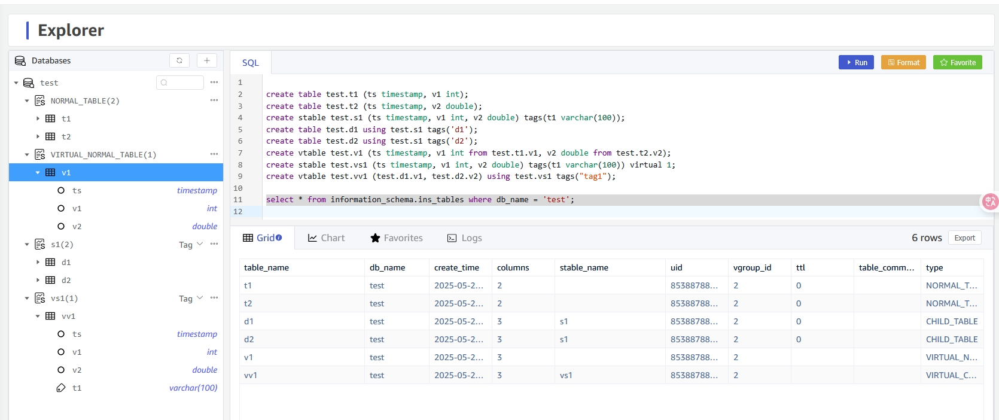
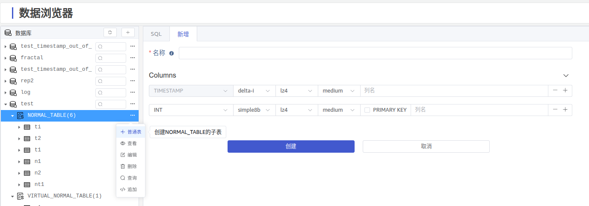
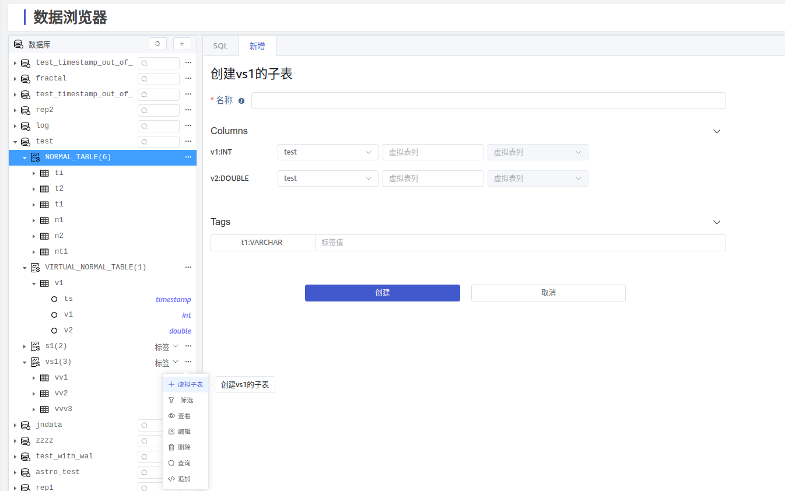
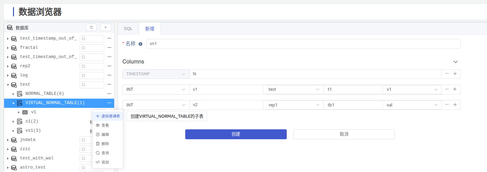

# Explorer 展示普通表和虚拟表 - FS

## 1. 背景

TDengine 从 3.3.6.0 开始支持[虚拟表](https://docs.taosdata.com/reference/taos-sql/virtualtable/)。
Jira：https://jira.taosdata.com:18080/browse/TS-6405

## 2. 变更历史

| 日期 | 版本 | 负责人 | 主要修改内容 |
| --- | --- | --- | --- |
| 2025/05/27 | 1.0 | 霍琳贺 | 创建 |

## 3. 定义

1. **普通表**：普通表建表语句不包含标签，仅包含时间戳和数据列。
2. **虚拟表**：虚拟表是一种动态数据结构，根据多表的列和时间戳组合规则生成逻辑表，见  https://docs.taosdata.com/reference/taos-sql/virtualtable/ 。
  根据表模板的不同，分为虚拟超级表和虚拟普通表：
   - **虚拟超级表**：通过 `CREATE STABLE stable_name (timestamp_col, value_col [, value_col]) tags(tag_col[, tag col] VIRTUAL 1` 创建。
   - **虚拟子表**：通过虚拟超级表模板 `USING virtal_stable_name TAGS(const_tag_value)`创建。
   - **虚拟普通表**：通过子表或普通表列组合创建。

## 4. 行为说明

在 Explorer 的视窗左侧数据库树形结构展示页，能够展示普通表、虚拟表并能够区分是否是虚拟表。

### 4.1 展示普通表、虚拟表

1. 普通表：使用 `NORMAL_TABLE` （沿用 `information_schema.ins_tables.type` 中对普通表的定义）作为普通表的展示入口，点击时展开为所有普通表的列表，展示逻辑同超级表的子表。
2. 虚拟普通表：使用 `VIRTUAL_NORMAL_TABLE` （沿用 `information_schema.ins_tables.type` 中对虚拟普通表的定义）作为虚拟普通表的展示入口，点击时展开为所有虚拟普通表的列表，展示逻辑同超级表的子表。
3. 虚拟超级表：与现有超级表的展示方式一致。
4. 虚拟子表：点击虚拟超级表可以展示虚拟普通表列表。

### 4.2 新增普通表

### 4.3 新增虚拟子表

### 4.4 新增虚拟普通表

## 5. 性能

无。

## 6. 兼容性

兼容现有行为。

## 7. 运维

无。

## 8. 使用场景

1. 需要展示普通表和虚拟表的场景。

## 9. 约束和限制

无。

## 10. 常见错误和排查

无。

## 11. 可观测性

无。

## 12. 安装和卸载

该组件随 TDengine 产品安装包一同发布，随 TDengine 安装和卸载。

## 13. 文档

无。

## 14. 参考文档

无。

## 15. 附录

无。
