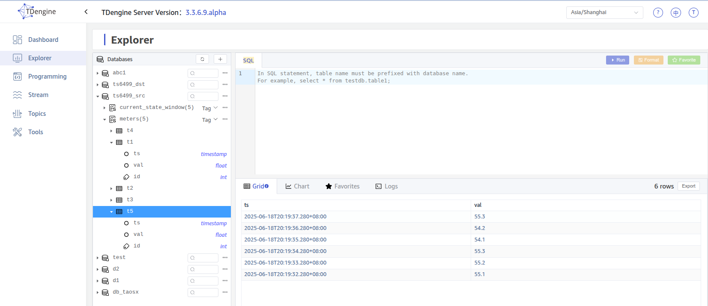
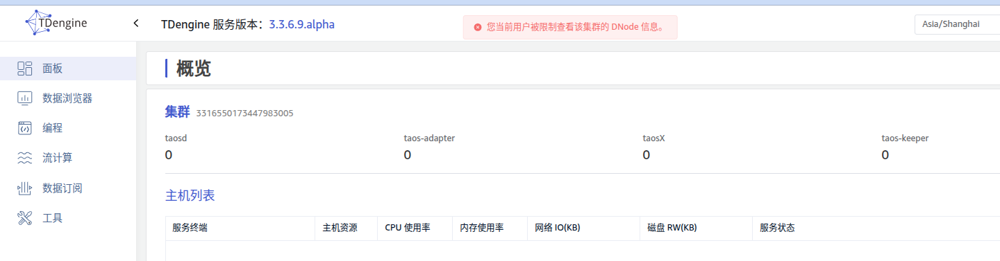

# Explorer 支持 sysinfo = 0 的用户登录

## 1. 背景

相关 Jira 需求：
- https://jira.taosdata.com:18080/browse/TS-5987

## 2. 变更历史

注：版本变更规则，初始版本为 0.1，中间若经过几次较大修改要增加版本号为 0.2， 0.3，最后定稿时的版本号为 1.0，以下为示例

| 日期 | 版本 | 负责人 | 主要修改内容 |
| --- | --- | --- | --- |
| 2025/06/19 | 0.1 | 霍琳贺 | 新增 |
|  |  |  |  |
|  |  |  |  |
|  |  |  |  |

## 3. 定义

- Sysinfo = 0：TDengine 中允许创建 sysinfo = 0 的只读用户，该用户仅限制查看授权的数据库信息，而不能查看集群信息。

## 4. 行为说明

### 4.1 登录

允许 sysinfo = 0 的用户登录，登录后无权限查看 DataIn（数据源）、Management（管理）页面。

因 sysinfo = 0 的用户无法查看授权信息，显示的 Server Version 不包含授权提示（如是否为试用版、是否已过期等）。

### 4.2 面板

查看 Dashboard 报错：您当前用户被限制查看该集群的 DNode 信息。

### 4.3 数据浏览器

数据浏览器可正常查询。

### 4.4 数据订阅

数据订阅可正常查看。

## 5. 性能

无。

## 6. 兼容性

无影响。

## 7. 运维

无需特殊说明。

## 8. 使用场景

### 8.1 允许只读用户使用 Explorer 查看允许查看的数据记录

## 9. 约束和限制

无。

## 10. 常见错误和排查

对使用中可能遇到的错误提示以及如何排查故障进行说明。很多小型优化或功能不会有复杂的错误、排查也不困难，可以标无。但对于一些复杂的功能，容易用错、使用中容易出错的，要进行说明。

## 11. 可观测性

对 taos shell, taos Explorer， TDinsight 等基于 UI 或用户交互界面的产品组件是否有影响，如果有则说明清楚这几个组件的行为变化

## 12. 安装和卸载

描述对安装和卸载脚本有什么要求才能够使用户能够顺畅地使用本特性/优化

## 13. 文档

是否需要修改企业版文档
是否需要修改官网文档
如果需要，要在产品发布前准备好相应的文档 PR，发送 Wade Review & Merge

## 14. 参考文档

## 15. 附录

对于关键的实现方案，不想单独再准备一份文档的，可以写在这一节中，目的仍然是让 spec 尽量不出现实现相关的内容，让行为和实现分离。
