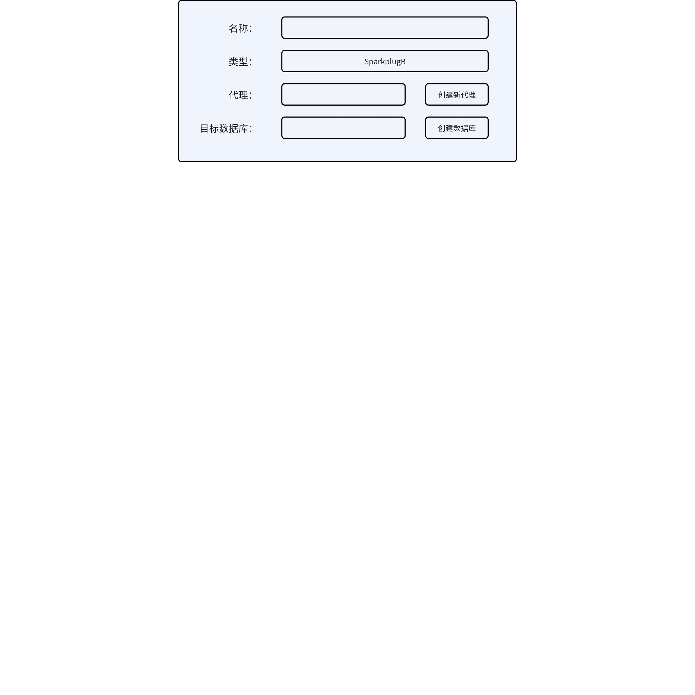
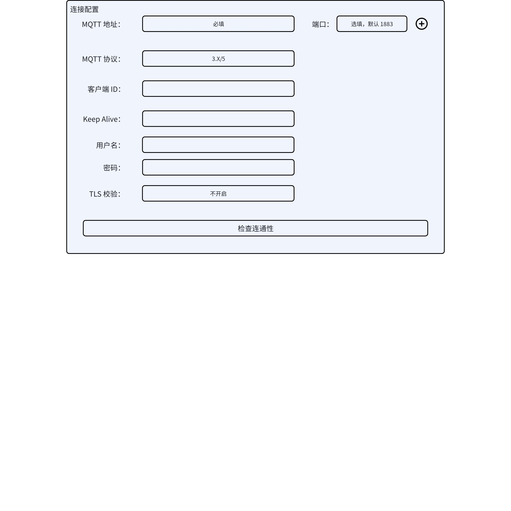
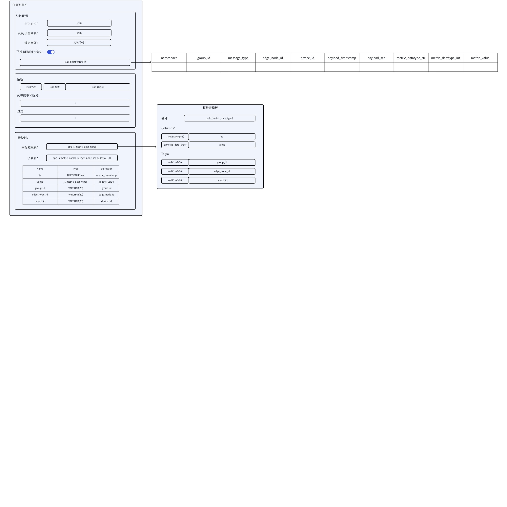

# Functional Spec - MQTT SparkplugB 集成

## 1. 背景

TS-6067

[Sparkplug](https://www.eclipse.org/tahu/spec/sparkplug_spec.pdf) 是由 [Eclipse Foundation 的 TAHU 项目](https://www.eclipse.org/tahu/) 开发的开源规范，旨在为 MQTT 提供一套明确定义的 payload 和状态管理体系。其主要目标是在工业物联网领域实现互操作性和一致性。
Sparkplug B 定义了用于监控控制和数据采集（SCADA）系统、实时控制系统和设备的 MQTT 命名空间。它通过封装结构化数据格式，包括指标、过程变量和设备状态信息，确保了标准化的数据传输，使其呈现为简洁易处理的格式。通过使用Sparkplug B，组织可以提高运营效率，避免数据孤岛，并在 MQTT 网络中实现设备间的无缝通信。
本次 MQTT 数据源改造旨在使 taosX 具有使用 SparkplugB 协议读取工业物联网系统数据并保存到 TDengine 的能力。

## 2. 变更历史

| 日期 | 版本 | 负责人 | 主要修改内容 |
| --- | --- | --- | --- |
| 2025/04/01 | 0.1 | @闫宇星 | 初稿 |

## 3. 定义

1. 设备节点：不可以直接以 MQTT 协议上报数据的节点，通常使用 Modbus，OPC-UA 等协议连接到边缘网关节点，由网关节点统一管理并代理上报。
2. 边缘节点（edge node）：可以直接以 MQTT 协议上报数据的节点，其下可以挂载任意设备节点。
3. 主机应用程序（host application）：用于接收边缘节点上报的数据，进行应用级处理的程序，也可以对设备进行命令下发，控制设备的行为。
4. SparkplugB 协议的 Topic 由 5 部分组成
```plaintext
spBv1.0/group_id/message_type/edge_node_id/[device_id]
```

1. 第一部分为 namespace，固定使用 `spBv1.0`
2. 第二部分为 `group_id` 用于对边缘节点/设备进行分组，可以表示一个公司，也可以表示一条生产流水线
3. 第三部分为消息类型，第四部分为 边缘节点 ID，第五部分为挂载到边缘节点的设备 ID
SparkplugB Topic 共包含以下几种：

### 3.1 边缘节点上线

```plaintext
spBv1.0/group_id/NBIRTH/edge_node_id
```

```plaintext
{
        "timestamp": 1486144502122,
        "metrics": [{
                "name": "bdSeq",
                "timestamp": 1486144502122,
                "dataType": "Int64",
                "value": 0
        }, {
                "name": "Node Control/Reboot",
                "timestamp": 1486144502122,
                "dataType": "Boolean",
                "value": false
        }, {
                "name": "Node Control/Rebirth",
                "timestamp": 1486144502122,
                "dataType": "Boolean",
                "value": false
        }, {
                "name": "Properties/OS",
                "timestamp": 1486144502122,
                "dataType": "String",
                "value": "Raspbian"
        }, {
                "name": "Properties/OS Version",
                "timestamp": 1486144502122,
                "dataType": "String",
                "value": "Jessie with PIXEL/11.01.2017"
        }, {
                "name": "Supply Voltage",
                "timestamp": 1486144502122,
                "dataType": "Float",
                "value": 12.1
        }],
        "seq": 0
}
```

### 3.2 边缘节点下线

```plaintext
spBv1.0/group_id/NDEATH/edge_node_id
```

```json
{
        "timestamp": 1486144502122,
        "metrics": [{
                "name": "bdSeq",
                "timestamp": 1486144502122,
                "dataType": "UInt64",
                "value": 0
        }]
}
```

### 3.3 设备上线

```plaintext
spBv1.0/group_id/DBIRTH/edge_node_id/device_id
```

```plaintext
{
        "timestamp": 1486144502122,
        "metrics": [{
                "name": "Inputs/A",
                "timestamp": 1486144502122,
                "dataType": "Boolean",
                "value": false
        }, {
                "name": "Outputs/E",
                "timestamp": 1486144502122,
                "dataType": "Boolean",
                "value": false
        }],
        "seq": 1
}
```

### 3.4 设备下线

```plaintext
spBv1.0/group_id/DDEATH/edge_node_id/device_id
```

```plaintext
{
        "timestamp": 1486144502122,
        "seq": 123
}
```

### 3.5 边缘节点上报数据

```plaintext
spBv1.0/group_id/NDATA/edge_node_id 
```

```plaintext
{
        "timestamp": 1486144502122,
        "metrics": [{
                "name": "Supply Voltage",
                "timestamp": 1486144502122,
                "dataType": "Float",
                "value": 12.3
        }],
        "seq": 2
}
```

### 3.6 设备上报数据

```plaintext
spBv1.0/group_id/DDATA/edge_node_id/device_id
```

```plaintext
{
        "timestamp": 1486144502122,
        "metrics": [{
                "name": "Inputs/A",
                "timestamp": 1486144502122,
                "dataType": "Boolean",
                "value": true
        }, {
                "name": "Inputs/C",
                "timestamp": 1486144502122,
                "dataType": "Boolean",
                "value": true
        }],
        "seq": 0
}
```

### 3.7 下发边缘节点控制命令

```plaintext
spBv1.0/group_id/NCMD/edge_node_id
```

```plaintext
{
        "timestamp": 1486144502122,
        "metrics": [{
                "name": "Node Control/Rebirth",
                "timestamp": 1486144502122,
                "dataType": "Boolean",
                "value": true
        }]
}
```

### 3.8 下发设备控制命令

```plaintext
spBv1.0/group_id/DCMD/edge_node_id/device_id
```

```plaintext
{
        "timestamp": 1486144502122,
        "metrics": [{
                "name": "Outputs/LEDs/Green",
                "timestamp": 1486144502122,
                "dataType": "Boolean",
                "value": true
        }, {
                "name": "Outputs/LEDs/Yellow",
                "timestamp": 1486144502122,
                "dataType": "Boolean",
                "value": true
        }]
}
```

### 3.9 主机应用程序的上下线消息

```plaintext
spBv1.0/STATE/host_application_id
```

```plaintext
{
    "timestamp": 1486144502122,
    "online": true
}
```

```plaintext
{
    "timestamp": 1486144502122,
    "online": false
}
```

### 3.10 Payload 定义

```protobuf
// * Copyright (c) 2015-2021 Cirrus Link Solutions and others
// *
// * This program and the accompanying materials are made available under the
// * terms of the Eclipse Public License 2.0 which is available at
// * http://www.eclipse.org/legal/epl-2.0.
// *
// * SPDX-License-Identifier: EPL-2.0
// *
// * Contributors:
// *   Cirrus Link Solutions - initial implementation

//
// To compile:
// cd client_libraries/java
// protoc --proto_path=../../ --java_out=src/main/java ../../sparkplug_b.proto
//

syntax = "proto2";

package org.eclipse.tahu.protobuf;

option java_package         = "org.eclipse.tahu.protobuf";
option java_outer_classname = "SparkplugBProto";

enum DataType {
    // Indexes of Data Types

    // Unknown placeholder for future expansion.
    Unknown         = 0;

    // Basic Types
    Int8            = 1;
    Int16           = 2;
    Int32           = 3;
    Int64           = 4;
    UInt8           = 5;
    UInt16          = 6;
    UInt32          = 7;
    UInt64          = 8;
    Float           = 9;
    Double          = 10;
    Boolean         = 11;
    String          = 12;
    DateTime        = 13;
    Text            = 14;

    // Additional Metric Types
    UUID            = 15;
    DataSet         = 16;
    Bytes           = 17;
    File            = 18;
    Template        = 19;

    // Additional PropertyValue Types
    PropertySet     = 20;
    PropertySetList = 21;

    // Array Types
    Int8Array = 22;
    Int16Array = 23;
    Int32Array = 24;
    Int64Array = 25;
    UInt8Array = 26;
    UInt16Array = 27;
    UInt32Array = 28;
    UInt64Array = 29;
    FloatArray = 30;
    DoubleArray = 31;
    BooleanArray = 32;
    StringArray = 33;
    DateTimeArray = 34;
}

message Payload {

    message Template {

        message Parameter {
            optional string name        = 1;
            optional uint32 type        = 2;

            oneof value {
                uint32 int_value        = 3;
                uint64 long_value       = 4;
                float  float_value      = 5;
                double double_value     = 6;
                bool   boolean_value    = 7;
                string string_value     = 8;
                ParameterValueExtension extension_value = 9;
            }

            message ParameterValueExtension {
                extensions              1 to max;
            }
        }

        optional string version         = 1;          // The version of the Template to prevent mismatches
        repeated Metric metrics         = 2;          // Each metric includes a name, datatype, and optionally a value
        repeated Parameter parameters   = 3;
        optional string template_ref    = 4;          // MUST be a reference to a template definition if this is an instance (i.e. the name of the template definition) - MUST be omitted for template definitions
        optional bool is_definition     = 5;
        extensions                      6 to max;
    }

    message DataSet {

        message DataSetValue {

            oneof value {
                uint32 int_value                        = 1;
                uint64 long_value                       = 2;
                float  float_value                      = 3;
                double double_value                     = 4;
                bool   boolean_value                    = 5;
                string string_value                     = 6;
                DataSetValueExtension extension_value   = 7;
            }

            message DataSetValueExtension {
                extensions  1 to max;
            }
        }

        message Row {
            repeated DataSetValue elements  = 1;
            extensions                      2 to max;   // For third party extensions
        }

        optional uint64   num_of_columns    = 1;
        repeated string   columns           = 2;
        repeated uint32   types             = 3;
        repeated Row      rows              = 4;
        extensions                          5 to max;   // For third party extensions
    }

    message PropertyValue {

        optional uint32     type                    = 1;
        optional bool       is_null                 = 2;

        oneof value {
            uint32          int_value               = 3;
            uint64          long_value              = 4;
            float           float_value             = 5;
            double          double_value            = 6;
            bool            boolean_value           = 7;
            string          string_value            = 8;
            PropertySet     propertyset_value       = 9;
            PropertySetList propertysets_value      = 10;      // List of Property Values
            PropertyValueExtension extension_value  = 11;
        }

        message PropertyValueExtension {
            extensions                             1 to max;
        }
    }

    message PropertySet {
        repeated string        keys     = 1;         // Names of the properties
        repeated PropertyValue values   = 2;
        extensions                      3 to max;
    }

    message PropertySetList {
        repeated PropertySet propertyset = 1;
        extensions                       2 to max;
    }

    message MetaData {
        // Bytes specific metadata
        optional bool   is_multi_part   = 1;

        // General metadata
        optional string content_type    = 2;        // Content/Media type
        optional uint64 size            = 3;        // File size, String size, Multi-part size, etc
        optional uint64 seq             = 4;        // Sequence number for multi-part messages

        // File metadata
        optional string file_name       = 5;        // File name
        optional string file_type       = 6;        // File type (i.e. xml, json, txt, cpp, etc)
        optional string md5             = 7;        // md5 of data

        // Catchalls and future expansion
        optional string description     = 8;        // Could be anything such as json or xml of custom properties
        extensions                      9 to max;
    }

    message Metric {

        optional string   name          = 1;        // Metric name - should only be included on birth
        optional uint64   alias         = 2;        // Metric alias - tied to name on birth and included in all later DATA messages
        optional uint64   timestamp     = 3;        // Timestamp associated with data acquisition time
        optional uint32   datatype      = 4;        // DataType of the metric/tag value
        optional bool     is_historical = 5;        // If this is historical data and should not update real time tag
        optional bool     is_transient  = 6;        // Tells consuming clients such as MQTT Engine to not store this as a tag
        optional bool     is_null       = 7;        // If this is null - explicitly say so rather than using -1, false, etc for some datatypes.
        optional MetaData metadata      = 8;        // Metadata for the payload
        optional PropertySet properties = 9;

        oneof value {
            uint32   int_value                      = 10;
            uint64   long_value                     = 11;
            float    float_value                    = 12;
            double   double_value                   = 13;
            bool     boolean_value                  = 14;
            string   string_value                   = 15;
            bytes    bytes_value                    = 16;       // Bytes, File
            DataSet  dataset_value                  = 17;
            Template template_value                 = 18;
            MetricValueExtension extension_value    = 19;
        }

        message MetricValueExtension {
            extensions  1 to max;
        }
    }

    optional uint64   timestamp     = 1;        // Timestamp at message sending time
    repeated Metric   metrics       = 2;        // Repeated forever - no limit in Google Protobufs
    optional uint64   seq           = 3;        // Sequence number
    optional string   uuid          = 4;        // UUID to track message type in terms of schema definitions
    optional bytes    body          = 5;        // To optionally bypass the whole definition above
    extensions                      6 to max;   // For third party extensions
}
```

## 4. 行为说明

### 4.1 新增数据源



1. 新增名为 "SparkplugB" 的数据源，其他部分不变

### 4.2 连接配置



1. 由于 SparkplugB 支持设备和应用节点连接到多个 MQTT broker，因此连接配置中用户可以配置多个 MQTT broker 地址，其中端口默认 1883
2. 由于 MQTT 客户端只支持连接单个 broker，因此对于多 MQTT broker 的情况，数据源会使用每个地址创建一个客户端，每个客户端各自独立消费数据，互不影响
3. 对于认证部分，保持不变，多个地址要求使用相同的用户名和密码进行连接
4. MQTT 协议选项有两个：3.x 和 5.0，必选项
5. 客户端 ID 为客户自由填写
6. KeepAlive 选项单位为秒，可以不填但不可为 0

### 4.3 任务配置



表配置沿用 MQTT 数据源的超级表模板和表映射，从而可以沿用 flat 数据组装和表达式计算功能，但是有几点不同：
1. 超级表模板不支持在列名和 tag 名上使用 `${}` 格式的模板变量，只能从已知变量中选取
2. 列类型

#### 4.3.1 任务订阅配置

1. 节点设备列表使用逗号分隔，如果需要指定节点下的某设备，需要使用 `edge_node_id/device_id` 格式
2. 节点设备如果指定，则在任务启动时，会给所有指定的下发 `ReBirth` 命令来获取最新值和指标别名
3. 节点/设备列表如果不填，则表示处理所有上报的数据，如果遇到只包含别名的消息，则会对该节点下发 `ReBirth`命令
4. 下发的 `spBv1.0/group_id/``**NCMD**``/edge_node_id` 命令
```plaintext
{
        "timestamp": 1486144502122,
        "metrics": [{
                "name": "Node Control/Rebirth",
                "timestamp": 1486144502122,
                "dataType": "Boolean",
                "value": true
        }]
}
```

1. 消息类型可以选取多个，可选值为 `NBIRTH`, `NDEATH`, `DBIRTH`, `DDEATH`, `NDATA`, `DDATA`, `NCMD`, `DCMD`, `STATE`

#### 4.3.2 表映射配置

1. 超级表和子表名自由填写，可以使用预定义的变量作为模板变量
2. 自定义列和自定义 tag 列的列名自由填写，列值只可以从预定义的变量中选取
3. 此版本暂不支持值转换计算操作，后续可以增加

### 4.4 任务中可以使用的变量

1. Topic 解析：`group_id`, `message_type`, `edge_node_id`, `device_id`
2. Payload 解析：`payload_timestamp`,`payload_seq`, `payload_uuid`, `payload_body`, `payload_online`
3. Metric 解析：`metric_name`, `metric_data_type`, `metric_value`, `metric_is_historical`, `metric_is_transient`, `metric_is_null`
4. Metric Meta 解析：`meta_is_multipart`, `meta_content_type`, `meta_size`, `meta_seq`, `meta_file_name`, `meta_file_type`, `meta_md5`, `meta_description`
5. Properties 解析：`prop_{name}_type`, `prop_{name}_value`，其中 name 为属性列表中的 key，如果不存在此 key，则值为 null

## 5. 性能

无

## 6. 兼容性

新数据源，transform 部分可以沿用当前的，但对于此数据源，包含两个类型的消息解析，或许会启动两个 transform 流程

## 7. 运维

无

## 8. 使用场景

仅适用于使用 MQTT Sparkplug B 协议进行数据交换的工业场景

## 9. 约束和限制

无

## 10. 常见错误和排查

无

## 11. 可观测性

同 MQTT 数据源

## 12. 安装和卸载

无

## 13. 文档

需要修改企业版文档

## 14. 参考文档

1. https://github.com/eclipse-sparkplug/sparkplug/blob/master/specification
2. https://github.com/eclipse-tahu/tahu

## 15. 附录

无
