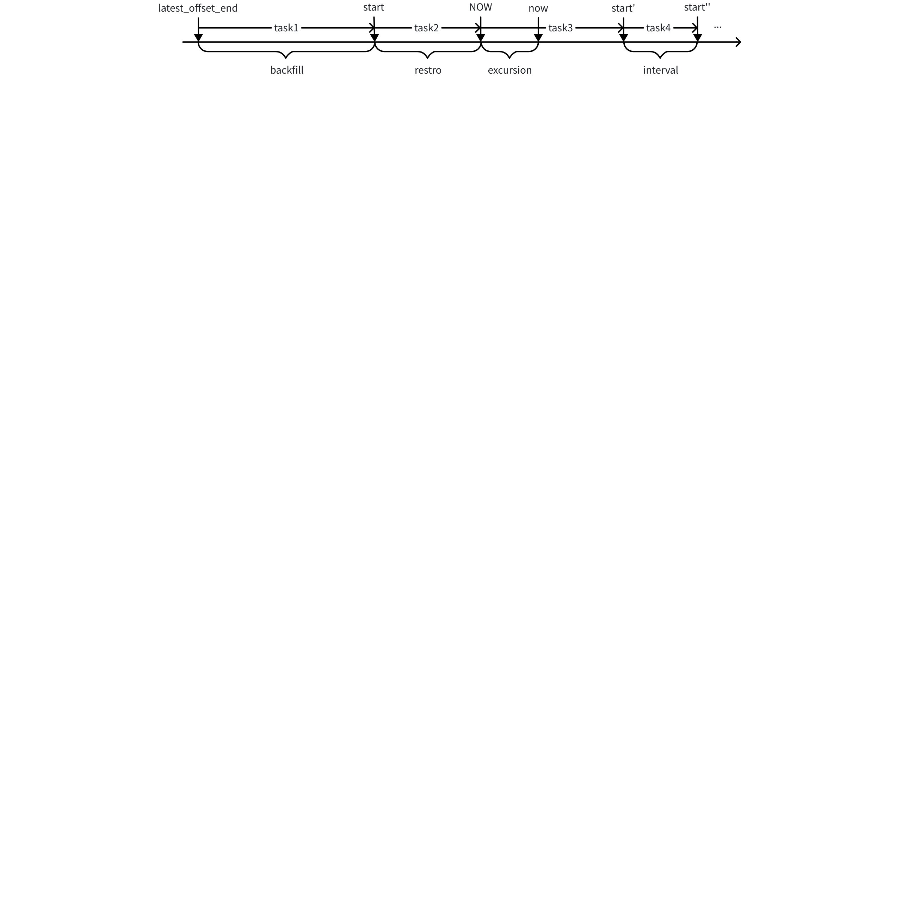

# TDengine Query DataIn 支持从断点同步 - FS

## 1. 背景

TDengine Query 使用 realtime 模式，进行数据同步。如果任务中断很长时间，下次任务重启后，只会从 restro 参数指定的时间间隔前，重启同步任务。用户希望能够从上一次任务结束的地方开始，继续同步数据。
相关的 JIRA：https://jira.taosdata.com:18080/browse/TS-6402

## 2. 变更历史

| 日期 | 版本 | 负责人 | 主要修改内容 |
| --- | --- | --- | --- |
| 2025/5/10 | 0.1 | @杨志宇 | 初稿 |
|  |  |  |  |

## 3. 定义

无

## 4. 行为说明

### 4.1 Realtime 模式下的数据同步

如上图所示，数据同步任务中，包含以下时间点：
1. now（字母小写）：taosX 的当前时间；
2. excursion：taosX 和 database 之间，时钟误差。
3. NOW（字母大写）：now - excursion 的时间戳，即：同步任务的开始时间戳。
4. restro：同步任务开始时，回溯的时间间隔。
5. interval：同步任务的步长。
Realtime 数据同步的流程：
1. 从断点中查询 latest offset end，创建 backfill task，timeRange 为：[ latest_offset_end, start)；如果无断点，则不创建。
2. 创建 restro 任务，timeRange 为：[ start, NOW)；如果 restore 为 0，不创建；
3. 创建 sync 任务，每 interval 创建一次，timeRange 为：[NOW, NOW+ interval)。

## 5. 性能

无

## 6. 兼容性

无

## 7. 运维

无

## 8. 使用场景

1. 数据恢复成功，直接删除备份文件。
2. 数据恢复成功，移动到其他目录。

## 9. 约束和限制

无

## 10. 常见错误和排查

无

## 11. 可观测性

无

## 12. 安装和卸载

无

## 13. 文档

无

## 14. 参考文档

## 15. 附录
