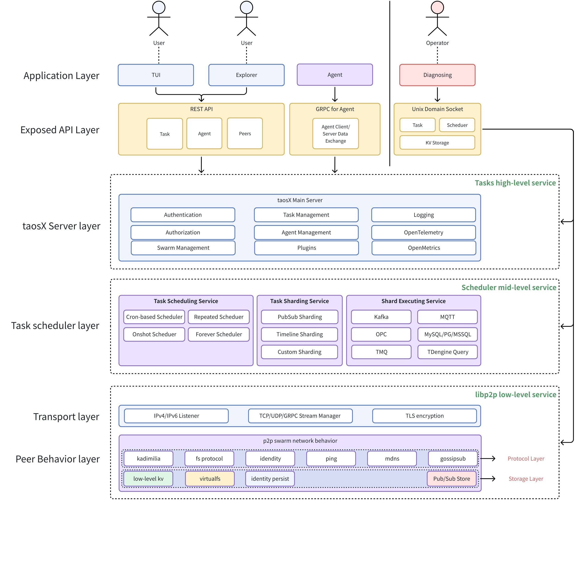

# （已废弃）taosX 高可用 - DS

## 1. 引言

1. 目的
  本文档的目的是对 taosX 高可用架构进行完整的设计阐述，对高可用功能涉及的架构变更、设计实现、安装部署、运行维护等方面的具体问题做说明。
1. 范围
2. 受众
  taosX 开发者。

## 2. 修订记录

注：版本变更规则，初始版本为 0.1，中间若经过几次较大修改要增加版本号为 0.2， 0.3，最后定稿时的版本号为 1.0，以下为示例

| 日期 | 版本 | 负责人 | 主要修改内容 |
| --- | --- | --- | --- |
| 2025/05/24 | 0.1 | 霍琳贺 | 初稿 |
|  | 0.3 |  |  |
|  | 1.0 |  |  |

## 3. 术语

- **ETL**：抽取（Extract）、转换（Transform）、加载（Load）的数据处理过程。
- **高可用**：系统在大部分时间内可运行，即使在部分节点发生故障时。
- **服务降级**：在系统资源不足或出现故障时，降低服务质量，保证核心功能可用。对于 taosX 服务，服务降级可能发生在主节点宕机，且无法满足 RAFT 协议要求的节点数量时；此时 taosX 服务降级，仅支持已有任务的运行和可用性。
- **负载均衡**：在节点正常服务时，任务节点可在指定数量的节点间均衡分布执行其子任务（本文档中称作 Shard）。
- **分片（ Sharding）**：一个 taosX 运行任务，可配置其分片机制，将一个 taosX 运行任务分成多个碎片（称作 Shard），以便执行多线程调优或在多节点中分别执行。
- **libp2p**：libp2p 是一系列点对点网络堆栈的集合，被世界上最重要的分布式系统使用，例如 Ethereum、IPFS、Filecoin、Optimism 等。Go、Rust、Javascript、C++、Nim、Java/Kotlin、Python、.Net、Swift 和 Zig 中有原生实现。它是全球规模点对点网络的最简单解决方案，包括对发布-订阅消息传递、分布式哈希表、NAT 打孔和浏览器到浏览器直接通信的支持。taosX 使用 libp2p 的 Rust 原生实现 https://crates.io/crates/libp2p，其使用 MIT 协议，我们可以直接使用。在本文后续提到 libp2p，一般指 libp2p 的 Rust 库。我们使用 libp2p 实现对等分布式哈希表并在节点间进行数据通信。
- **Swarm（群）**：Swarm 是 libp2p 点对点网络的管理器，本文档中，使用首字母大写的 Swarm 表示该分布式网络本身和其管理器，使用全小写的代码形式 `swarm` 表示 taosX 对外提供的命令行管理工具。
- **节点（Peer）**：Peer 指 libp2p 网络中的节点。
- **Kadmilia**：是一个分布式哈希表协议，我们使用 libp2p 中的协议实现一个持久化的分布式对等哈希表，用于存储元数据。Kadmilia 协议保证 taosX 在任意节点存活情况下均可正常获取元数据。
- **Gossipsub**：是一个在点对点网络上进行发布-订阅的协议。我们使用 Gossipsub 协议进行任务状态等数据的实时通知。

## 4. 概述

### 4.1 架构

taosX 是一个分层设计的分布式系统架构，专注于任务调度、数据管理和多数据源支持。其核心设计理念是通过分层解耦实现模块化扩展，同时通过统一的 API 层和协议适配层兼容多样化数据源与通信场景。其基础架构如下图所示：

以下是各层的关键设计要点：
1. 应用层（Application Layer）​：应用层按照用户角色和权限，区分为 `User`（普通用户）和 `Operator`（运维人员），提供如下功能：
  - Explorer：在UI 层面，适配和兼容当前的 taosExplorer 实现，支持对数据接入任务、Agent 、分布式节点进行可视化管理。
  - TUI：除了传统 Explorer WebUI 支持，我们将对命令行模式进行增强，新增 TUI（终端用户界面），以在 HTTP 被禁用模式下进行用户和任务管理。
  - 代理（Agent）：代理模块与当前版本下的 Agent 功能保持一致，支持跨平台和跨网络非直连模式。
  - 诊断模块（Diagnosing）：供管理或运维人员监控系统健康状态，在必要时进行问题诊断和定位，修改底层数据等。
1. API 层（Exposed API Layer）​：支持多协议 API 接口​：
  - REST API​：标准化 HTTP 接口，用于任务提交、状态查询等，兼容旧版本 API 接口。
  - gRPC​：高性能二进制协议，专为 Agent 间通信优化。
  - Unix Domain Socket​：新增本地高效任务调度通道。
1. taosX 服务层（Server Layer）：这是核心功能服务层，包括以下模块：
  - 认证授权​（Authentication & Authorization）：基于 TDengine 的用户权限控制。
  - 日志与监控（Logging & OpenTelemetry & OpenMetrics）​：集中式日志收集，实时性能指标分析等。支持 OpenTelemetry 和 OpenMetrics 协议，便于接入日志管理平台。
  - 集群管理（Swarm Management）：集群节点管理，新增、下线或删除节点。
  - 任务管理（Task Management）​：全生命周期任务管理（创建、修改、运行、暂停、恢复、终止）。
  - 插件管理（Plugins Management）​：提供易于扩展的数据 Source/Transform/Sink 插件 SDK，进行自定义插件管理。
1. 任务调度器层（Task Schedule Layer）​
  - 支持多样化调度策略​控制：
    - 定时任务​（Cron-based Scheduler）：类似 CRONTAB 的定时任务调度策略。
    - 重复任务（Repeated Scheduler）：根据起始时间和重复频率、次数等进行任务调度。
    - 即时任务​（Onshot Scheduler）：单次有效的一次性任务。
    - 常驻任务（Forever Scheduler）：可以重复执行的任务，任务失败可根据当前进度继续执行。
  - 支持可配置的数据源分片策略：通过任务分片（Sharding）提升并行处理能力，以使数据可在多节点下执行。
    - 发布 / 订阅模式：TMQ、MQTT、Kafka 支持按照发布 / 订阅模式进行分片，每个分片即为一个消费者。
    - 时间线模式：MySQL、PostgreSQL、MSSQL 等支持按照时间线模式进行分片，每个分片为一个时间片。
    - 自定义模式：数据源可按照自定义的表名、标签、占位符等进行自定义分片，每个分片为一组 KV 对。自定义模式可与时间线模式共同生效来确定一个分片。
1. 传输层（Transport Layer）​
  - 支持 IPv4/IPv6：IPv6 支持是新增功能之一：，本次修改应当兼容当前行为。
    TX-461

  - 安全通信​：支持 TLS 加密连接。
  - 流管理​：高效处理高并发连接，优化大规模数据传输。
1. 协议层（Protocol Layer）
  - 服务发现：基于 mdns 协议实现节点发现。
  - Identity：基于 libp2p `identity` 协议实现节点互信。
  - Kademlia 协议​：基于 libp2p 的 `Kademlia` 协议实现分布式 KV 。
  - 文件同步：基于 `request-response` 协议实现各节点文件同步。
  - Gossipsub 协议：基于 libp2p 的 `Gossipsub` 协议实现节点消息和状态通知。
  - Stream：实现基于流的高效通信机制，支持点对点数据通信。
1. 存储层（Storage Layer）​：
  - 键值存储​：底层使用嵌入式 KV 库支持高性能持久化存储。
  - 虚拟文件系统​：抽象存储后端，以提供本地存储、网络存储和 S3 存储支持。
  - 发布/订阅消息持久化​：提供消息发布、订阅的持久化，为上层实现分布式最终一致性提供持久化存储能力。

### 4.2 技术

该分布式架构的核心在实现低 - 中 - 高三个层级的分布式服务：
1. 基于 libp2p 基础组件的分布式网络服务：其核心是分布式哈希表（DHT：Distributed Hash Table）。支持文件同步、点对点数据通信、消息订阅 / 发布等组网能力。
2. 基于 sharding 分片机制实现分布式任务调度器：构建在底层服务之上，其核心是分片（Sharding）机制。
3. 基于 source-transform-sink 架构的 ETL 高级服务：构建在分布式任务调度器之上，提供上层服务抽象，包括提供 source/transform/sink 不同层面的插件抽象和相关实现。用户的所有调用，只能通过高级服务提供。
这要求：
- 分层解耦：各层通过明确定义的接口通信，禁止跨层调用。
- 扩展能力：通过插件化设计支持新数据源和分片策略。
- 安全性：传输层强制加密，服务层实现细粒度权限控制。

### 4.3 依赖项

新增依赖项包括：
- libp2p: https://crates.io/crates/libp2p

## 5. 设计考虑

### 5.1 假设和限制

- 假设​：
  - 网络可靠性​：依赖 P2P（Kademlia）和 TCP 通信，假设网络延迟可控且节点可稳定连接。
  - 网络一致性：各节点网络状况和数据源访问能力基本一致，各任务可在节点间安全切换。
  - 数据一致性​：假设节点间数据同步最终一致，允许短暂不一致。
  - 用户角色分离​：区分 `User`（普通用户）和 `Operator`（运维人员），假设两者需求无重叠。
- 限制​：
  - 存储兼容性​：分布式键值存储底层存储兼容。
  - 协议支持​：
    - 如需使用 TDengine 原生连接，则要在每个节点都部署客户端库。
    - 各节点需保证对同一数据源的接入性保持一致。

### 5.2 设计模式和原则

- 分层架构（Layered Architecture）​​：
  - 关注点分离​：严格划分六层（应用层→存储层），每层仅依赖下层服务（如传输层不直接调用应用层）。
  - 接口隔离​：通过 `Exposed API Layer`（REST/gRPC）隐藏实现细节，符合 依赖倒置原则。
- 模块化​：
  - 工厂模式​：`Task Schedule Layer` 中多种调度器（如 `Cron-based Scheduler`、`Onshot Scheduler`）可能通过工厂方法动态创建。
  - 观察者模式​：节点间状态同步基于事件监听（Pub/Sub 模式）。
  - 单例模式​：核心服务（如 `Authorization`）可能分布式全局唯一。
- 可观测性​：全链路集成 `OpenTelemetry`，遵循可观测性原则。

### 5.3 风险和缓解措施

- 风险 1：分布式节点通信不可靠
  - 表现​：Kademlia P2P 网络可能出现分区或节点失效。
  - 缓解​：
    - 实现 `/ping` 心跳检测和自动重连。
    - 引入仲裁机制（如 Raft）保障关键数据一致性。
- 风险 2：任务调度过载
  - 表现​：高并发任务导致任务执行和状态同步阻塞。
  - 缓解​：
    - 任务执行器和调度器进程隔离。
- 风险 3：存储后端性能瓶颈
  - 表现​：分布式哈希表抽象层可能因数据库差异导致查询效率下降。
  - 缓解​：
    - 为高频操作提供缓存（如 LRU）。
- 风险 4：安全漏洞
  - 表现​：REST API 暴露攻击面。
  - 缓解​：
    - 强制 TLS 加密（HTTPS）。
    - 在 `Authorization` 模块实现细粒度 RBAC（基于 `Operator/User` 角色和权限控制项）。
- 风险 5：P2P 高频节点入网攻击导致 Kademlia 无法响应
  - 表现：坏节点集中高频入网，可能导致分布式网络瘫痪
  - 缓解：
    - 使用 Identity 协议，进行入网节点安全验证，保证仅可信节点入网；
    - 黑名单机制，将可疑节点特征放入黑名单。
- 风险 6：节点不同时间上下线导致数据不一致
  - 表现：当不同节点在不同时间上下线时，对同一数据进行操作可能导致数据不一致
  - 缓解：
    - 提供节点间数据仲裁机制，在不同节点数据不一致时，可以按照一定原则（如 RAFT）重新同步数据；
    - 服务降级：在多个节点下线后，仅提供任务执行能力，不提供元数据修改能力；数据修改可以通过删除不在线的节点实现。
    - 最终，基于本地优先原则，任务执行时以本地数据为准。

## 6. 详细设计

### 6.1 应用层

#### 6.1.1 Explorer

Explorer 管理页面新增

#### 6.1.2 TUI

#### 6.1.3 Tools

### 6.2 API 层

#### 6.2.1 REST API

#### 6.2.2 GRPC

#### 6.2.3 UDS

为 Unix Domain Socket 接口添加更多底层功能，提供追踪、调试能力，并为底层 API 操作提供接口。

### 6.3 核心功能

#### 6.3.1 集群管理

#### 6.3.2 认证

#### 6.3.3 授权

#### 6.3.4 任务管理

#### 6.3.5 Agent 管理

#### 6.3.6 数据源接口

### 6.4 任务调度器

#### 6.4.1 调度器 API

对外提供通用任务调度器的相关接口：

#### 6.4.2 执行器 API

#### 6.4.3 元数据存储

使用底层分布式 KV 存储元数据。

### 6.5 分布式集群

对外提供封装的集群管理接口，包括服务发现、节点管理、KV 存储、点对点通信、发布／订阅接口等。

## 7. 接口规范

1. API 文档（如果有超过 20 个API，应将其拆分为 API 组，可以使用工具生成 API 文档）
2. 用户界面（如适用）：概述 UI/UX 设计考虑

## 8. 安全考虑（如适用）

1. 安全要求，如数据加密、用户认证、授权和其他在设计模块时考虑的安全措施
2. 概述如何缓解漏洞以及如何处理敏感数据

## 9. 性能和可扩展性（如适用）

1. 性能要求：定义模块的性能期望（例如响应时间、吞吐量）
2. 可扩展性：讨论模块如何处理增加的负载，是否有任何特定策略确保模块水平或垂直扩展

## 10. 部署和配置

### 10.1 兼容性

#### 10.1.1 升级

taosX 服务启动时，进行数据迁移操作，保证旧版本的配置文件可平滑迁移到新版本，但以下情况除外：
1. 多个节点仅可使其中一个节点作为 Setup 节点进行数据迁移，其他节点的数据不会迁移。

#### 10.1.2 降级

允许降级，降级后原数据保持不变。用户可手动删除升级过程新增的数据文件。
---

1. 部署流程：解释模块的部署流程，如何部署到生产环境，是否有任何特定的暂存、测试环境等？
2. 配置管理：描述模块正常运行所需的任何配置文件、环境变量或设置。
3. 版本控制：包括向后兼容性、发布说明和回滚策略

## 11. 监控和维护

1. 监控：概述任何监控机制，以跟踪模块的健康状况和性能
2. 日志记录和诊断：讨论日志策略，包括将记录哪些数据以及如何诊断和追踪问题
3. 维护：描述随着时间的推移维护模块的方法，包括更新、修复漏洞和支持新需求

## 12. 参考资料

1. 功能规格说明
2. 测试规格说明
