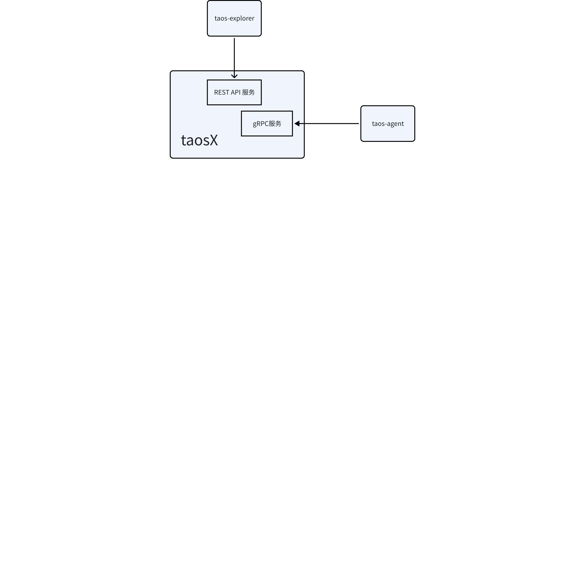

# taosX支持IPv6-Design Spec

## 1. 引言

1. 目的
       本文旨在详细阐述 taosX 服务端支持 IPv6 的设计目标和实现细节，为 taosX 在需要 IPv6 的客户场景提供服务支持。
1. 范围
      taosX 是一个易于使用、功能丰富的 TDengine 数据管道工具，taosX 支持 IPv6 功能主要影响服务端模块的 REST API 服务和 gRPC 服务，影响的外部相关组件主要是：
- taos-explorer
- taos-agent
1. 受众
       本设计文档的目标读者包括：
- **开发人员**：负责实现和优化 taosX 的工程师。
- **系统架构师**：需要理解 taosX 的整体架构和技术决策。
- **运维工程师**：负责部署和维护 taosX 的人员。

## 2. 修订记录

| 日期 | 版本 | 负责人 | 主要修改内容 |
| --- | --- | --- | --- |
| 2025/05/22 | 0.1 | 张贵川 | 文档撰写 |

## 3. 术语

**TDengine：**一个高性能、分布式的时序数据库。
**IP 协议：**是为网络上的计算机提供识别和定位系统，并在互联网上传输流量的通信协议。
**IPv6：**新一代互联网地址协议，用于替代 IPv4。
**REST API：**一种基于 HTTP 协议强调资源操作的 API 设计风格。
**端口：**网络通信中用于区分同一设备上不同服务的逻辑编号（范围 0-65535）。
**gRPC：**由 Google 开发的高性能、开源、通用的远程过程调用（RPC）框架，专为分布式系统和微服务架构设计。
**taosX：** 为 TDengine 提供桥接功能的适配器工具，支持与第三方数据采集代理和主流协议的集成。

## 4. 概述

1. 架构：


1. 技术：
- 开发语言：Rust
- 异步运行时：Tokio - https://crates.io/crates/tokio
- HTTP 框架: Actix - https://crates.io/crates/actix-web
- GRPC 框架：Tonic - https://crates.io/crates/tonic
1. 依赖项：
  - Clang 12+ 或 GCC 10+
  - Rust 1.81.0

## 5. 设计考虑

1. 假设和限制
  - **假设**：
    - 使用 taosX 的系统运行在可靠的网络环境中。
1. 设计模式和原则（例如 MVC、单例、工厂）：
无。
1. 风险和缓解措施：识别潜在风险和缓解策略
无。

## 6. 详细设计

1. 组件设计：
       涉及组件主要是 Cli 中模块的 listen 和 grpc 两个参数，这两个参数如果用户传入的是 IPv4/IPv6 的地址，就直接开启服务；如果用户未传入任何地址，则先判断当前系统是否支持 IPv6, 如果支持 IPv6 则绑定 IPv6 的 UNSPECIFIED 地址，否则绑定 IPv4 的 UNSPECIFIED 地址。由于 IPv6 兼容 IPv4，绑定 IPv6 的 UNSPECIFIED 地址，也支持 IPv4 地址的访问。
使用默认监听参数启动方式：
```plaintext {wrap}
./taosx
```

用户传入的 REST API 和 gRPC 端口参数可以指定多个地址，用英文逗号,分割，例子：
```plaintext {wrap}
./taosx serve -l 172.18.0.5:6050,[2001:db9:2::6]:6050
./taosx serve -g 172.18.0.5:6055,[2001:db9:2::6]:6055
./taosx serve -l 172.18.0.5:6050,[2001:db9:2::6]:6050 -g 172.18.0.5:6055,[2001:db9:2::6]:6055
```

配置文件taosx.toml修改：
默认参数：
```plaintext {wrap}
listen = "0.0.0.0:6050"

grpc = "0.0.0.0:6055"
```

配置文件同样可指定多个地址并用英文逗号,分割：
```plaintext {wrap}
listen = "172.18.0.5:6050,[2001:db9:2::6]:6050"

grpc = "172.18.0.5:6055,[2001:db9:2::6]:6055"
```

启动方式：
```plaintext {wrap}
./taosx serve -c /etc/taos/taosx.toml 
或
./taosx serve
```

1. 列出系统中的关键数据结构
判断 IP 地址的函数：
```cpp {wrap}
se std::net::{Ipv6Addr, SocketAddr, TcpListener, ToSocketAddrs};
use std::vec::IntoIter;

pub fn is_support_ipv6() -> bool {
    let addr = (Ipv6Addr::UNSPECIFIED, 0);
    TcpListener::bind(addr).is_ok()
}

pub fn str_to_socket_addr(addrs: &str) -> anyhow::Result<Vec<SocketAddr>> {
    let rs: anyhow::Result<Vec<IntoIter<SocketAddr>>> = addrs
        .split(',')
        .filter_map(|addr| {
            let addr = addr.trim();
            if addr.is_empty() {
                return None;
            }
            Some(
                addr.to_socket_addrs()
                    .map_err(|e| anyhow::anyhow!("parse addr {addr} meet err: {e}")),
            )
        })
        .collect();
    Ok(rs?.into_iter().flatten().collect())
}

pub fn check_address_format(addrs: &str) -> anyhow::Result<()> {
    let mut ports: Vec<u16> = vec![];
    addrs.split(',').try_for_each(|addr| {
        let addr = addr.trim();
        if addr.is_empty() {
            return Ok(());
        }
        let rs = addr.to_socket_addrs();
        if rs.is_err() {
            return Err(anyhow::anyhow!(
                "invalid address format: {addr}, detail error: {rs:?}"
            ));
        }
        for port in rs.unwrap() {
            if port.port() == 0 {
                return Err(anyhow::anyhow!("port cannot be 0, addr: {addr}"));
            }
            ports.push(port.port());
        }
        Ok(())
    })?;
    if ports.is_empty() {
        return Err(anyhow::anyhow!("no valid addresses provided"));
    }
    let port = ports.first().unwrap();
    if ports.iter().any(|p| p != port) {
        return Err(anyhow::anyhow!("all ports must be the same, addr: {addrs}"));
    }
    Ok(())
}
```

REST API 绑定：
```sql {wrap}
let server = {
    fn handle_error(
        err: impl std::fmt::Debug,
        addr: impl std::fmt::Display,
    ) -> anyhow::Error {
        tracing::error!("Start HTTP server error: {:?} (addr: {})", err, addr);
        anyhow::format_err!("Start HTTP server error: {err:?} (addr: {addr})")
    }

    if let Some(tls) = tls {
        addrs.into_iter().try_fold(server, |server, addr| {
            server
                .bind_rustls_0_23(addr, tls.clone())
                .map_err(|err| handle_error(err, addr))
        })?
    } else {
        addrs.into_iter().try_fold(server, |server, addr| {
            server.bind(addr).map_err(|err| handle_error(err, addr))
        })?
    }
};
let server = server.run();
```

gRPC的绑定：
```yaml {wrap}

#[derive(Debug, Deserialize)]
#[allow(dead_code)]
pub struct RpcConfig {
    pub tcp: Vec<SocketAddr>,
    pub unix: Option<PathBuf>,
    pub ssl_cert: Option<String>,
    pub ssl_key: Option<String>,
    pub ssl_ca: Option<String>,
}

impl Default for RpcConfig {
    fn default() -> Self {
        let tcp = if is_support_ipv6() {
            vec!["[::]:6055".parse().unwrap()]
        } else {
            vec!["0.0.0.0:6055".parse().unwrap()]
        };
        Self {
            tcp,
            unix: Default::default(),
            ssl_cert: Default::default(),
            ssl_key: Default::default(),
            ssl_ca: Default::default(),
        }
    }
}

```

```python {wrap}
let servers = self
    .tcp
    .iter()
    .map(|addr| {
        builder
            .add_service(flight_service.clone())
            .serve_with_shutdown(*addr, async {
                let _ = tokio::signal::ctrl_c().await;
                tracing::info!("Ctrl+C invoked, shutdown RPC service")
            })
    })
    .collect::<Vec<_>>();
futures::future::try_join_all(servers).await?;
```

1. 使用几种类型的图表来解释设计
  无。

## 7. 接口规范

无。

## 8. 安全考虑（如适用）

无。

## 9. 性能和可扩展性（如适用）

无。

## 10. 部署和配置

1. 部署流程：taosX 随 TDengine 安装包一起安装部署，单独部署时需要安装好 TDengine 客户端
2. 配置管理：无
3. 版本控制：
   - 保持了对外接口兼容性，并且未破坏用户行为

## 11. 监控和维护

1. 监控：无
2. 日志记录和诊断：无
3. 维护：无

## 12. 参考资料

- IPv6协议：https://en.wikipedia.org/wiki/IPv6
- Arrow Flight: https://arrow.apache.org/docs/format/Flight.html#rpc-methods-and-request-patterns
- tonic: https://github.com/hyperium/tonic?tab=readme-ov-file
