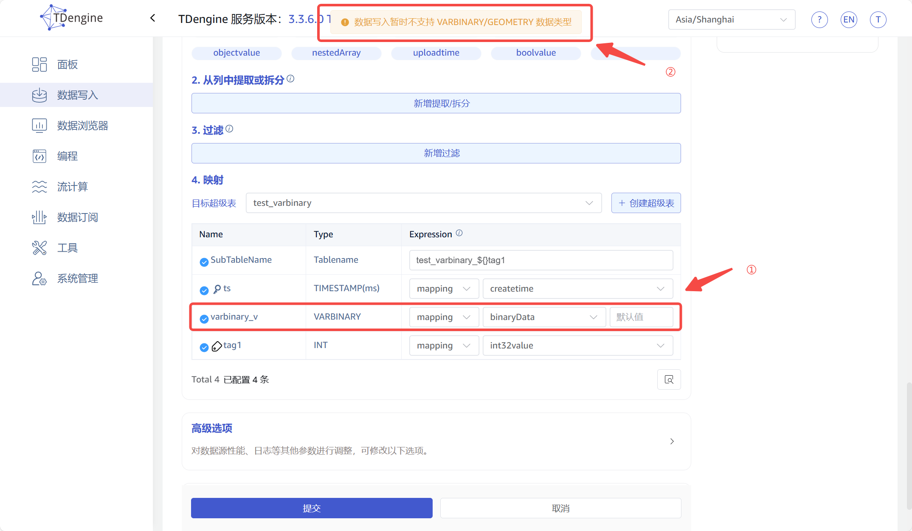

# taosx 支持 VarBinary类型写入 - FS 

## 1. 背景

MongoDB 等数据源有数据类型为 binary 的列，TDengine 支持 VarBinary 类型，所以需要 taosx 在数据迁移时支持两者的映射。相关 jira 如下：
https://jira.taosdata.com:18080/browse/TD-30589
https://jira.taosdata.com:18080/browse/TD-31014
https://jira.taosdata.com:18080/browse/TD-31239

## 2. 变更历史

| 日期 | 版本 | 负责人 | 主要修改内容 |
| --- | --- | --- | --- |
| 2025/03/28 | 0.1 | @张元湃 | 初稿 |
|  |  |  |  |
|  |  |  |  |
|  |  |  |  |

## 3. 定义

- VarBinary：TDengine 中存储可变长的二进制数据，最大长度为 65517 字节，标签列最大长度为 16382 字节。

## 4. 行为说明

本次优化的行为仅涉及任务的创建与运行，其中创建任务的行为变更可见，而运行任务的行为变更不可见，以下将分别进行介绍。

### 4.1 创建任务

#### 4.1.1 允许映射到 VarBinary 列

在目前 3.3.6.0 版本中创建数据写入任务时，如果在 transform 中配置了 VarBinary 类型的映射，页面将会看到如下图所示的报错：

本次优化将会去掉对 VarBinary 类型的限制。

#### 4.1.2 数据预览

当`映射`中配置了 VarBinary 类型的列，点击预览，此版本只支持二进制类型写入到 TDengine 的 varbinary 类型

### 4.2 运行任务

运行任务过程中的数据转换与映射，不同的数据源在处理方式上有所不同，以下分别进行说明。

#### 4.2.1 TDengine 2.x & 3.x

TDengine 2.x 使用查询方式获取源数据，TDengine 3.x 使用 topic 订阅获取源数据，均得到 RawBlock 数据，直接使用 write_block 方式写入目标库，不涉及 VarBinary 类型优化问题。

#### 4.2.2 PI & OPC & InfluxDB & OpentsDB

这四种数据源中不包含 Binary 存储的数据，而且没有 transform 配置，所以也不涉及 VarBinary 类型优化问题。

#### 4.2.3 CSV

CSV 数据源中所有字段均按照字符串进行处理，暂不支持写入 VARBINARY 类型。

#### 4.2.4 MQTT & Kafka & MongoDB

这类数据源的消息均序列化为 json 格式，对于二进制类型数据，在 json 中直接序列化为形如 `[100, 98, 65]` 的列表类型，再结合 `cast` 转换时指定的目标数据库 `VARBINARY` 类型，将此类型字段转换为 VARBINARY 类型写入数据库

#### 4.2.5 MySQL & Oracle & SQL Server & PostgreSQL

这四种关系型数据库中包含 Binary 类型数据，之前直接转成了字符串格式进行数据流转，将改为 BinaryArray 类型进行数据流转，因此在后续的 transform cast 中需要增加对 BinaryArray 的支持，并且符合二进制转换规则。

## 5. 性能

不涉及。

## 6. 兼容性

新版本 taosx 创建的带有 VarBinary 类型映射的任务，在旧版本 taosx 中无法正常运行。

## 7. 运维

无。

## 8. 使用场景

数据源中存在 binary 类型数据时，可以考虑将它映射到 TDengine 的 VarBinary 类型。

## 9. 约束和限制

VarBinary 类型的列长度最大为 65517 字节，标签长度最大为 16382 字节，映射时需要注意源数据的长度，避免数据被截取或丢弃。

## 10. 常见错误和排查

暂无，开发过程中补充。

## 11. 可观测性

无。

## 12. 安装和卸载

无。

## 13. 文档

不需要修改企业版文档。
不需要修改官网文档。

## 14. 参考文档

[数据类型 | TDengine 文档 | 涛思数据](https://docs.taosdata.com/reference/taos-sql/data-type/)

## 15. 附录
