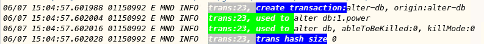
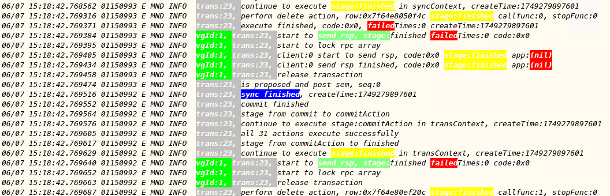
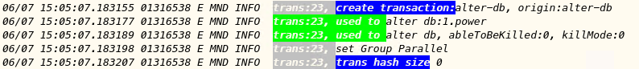
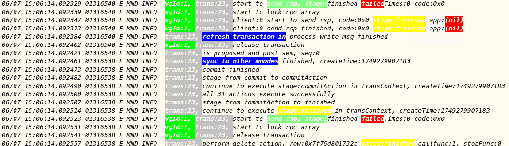
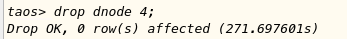
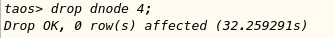
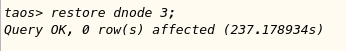
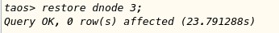

# 优化事务机制以提升节点恢复和副本变更的性能 TS

## 1. 测试目标

测试事务优化机制的优化效果

## 2. 参考文档

<quote-container>
列出与本测试有关的背景资料，如 JIRA 链接。

TS-6089

</quote-container>

## 3. 变更历史

| 日期 | 版本 | 作者 | 备忘 |
| --- | --- | --- | --- |
| 2025/6/7 | 1.0 | 陈东明 |  |
|  |  |  |  |

## 4. 测试结论

<quote-container>
事务执行时间加快
</quote-container>

## 5. 测试环境

- OS: Windows, Linux, macOS
- Browser: Chrome

## 6. 功能测试

### 6.1 变更副本

测试环境，30个vgroups。
执行操作：alter database power replica 3;

#### 6.1.1 优化前执行效果，执行时间：840秒

#### 6.1.2 优化后执行效果，执行时间：59秒

### 6.2 Drop dnode

测试环境，30个vgroups。
执行操作：drop dnode 4;

#### 6.2.1 优化前执行效果，执行时间：271秒

#### 6.2.2 优化后执行效果，执行时间：32秒

### 6.3 Restore dnode

测试环境，30个vgroups。
执行操作：restore dnode 3;

#### 6.3.1 优化前执行效果，执行时间：237秒

#### 6.3.2 优化后执行效果，执行时间：23秒

## 7. 易用性测试（可选）

无

## 8. 长期稳定性测试（可选）

无

## 9. 性能测试

无

## 10. 安全测试

无

## 11. 兼容性测试

无

## 12. 已知问题和限制（可选）

无
