# 双副本授权优化 TS

## 1. 相关链接

JIRA：[TS-6191](https://jira.taosdata.com:18080/browse/TS-6191)

## 2. 集群信息：

```plaintext {wrap}
taos> show cluster machines\G;
*************************** 1.row ***************************
       id: 668101937379817027
dnode_num: 3
  machine: A2uKO0ZAKzAQT5cDB3PMVOGv,A2uKO0ZAKzAQT5cDB3PMVOGv,A2uKO0ZAKzAQT5cDB3PMVOGv
  version: 3.3.6.3.alpha
Query OK, 1 row(s) in set (0.006748s)

测试过程中的集群 id:
668101937379817027
542267071100479068
508388713183341145
444333800522837468
```

## 3. 测试记录

| 序号 | 集群信息 | 集群授权信息满足以下检查条件 limitDnode: 2 dualReplica: 1(包含双副本授权，无论是否过期) | 测试结果 | 集群授权信息不满足检查条件 limitDnode: 2 没有双副本授权 | 测试结果 |
| --- | --- | --- | --- | --- | --- |
| 1.1 | dnode 4 | 执行授权： DB error: Number of dnodes has reached the licensed upper limit | 通过 | 执行授权： taos> alter cluster 'activeCode' '3k2kWtqKNodU4MVGfTKs6BA6ksvUzbJunaggkJZEFSNy7TmEmTk3v31fFx5xuFgRxzo1X6k2iuzDt'; DB error: Number of dnodes has reached the licensed upper limit [0x80000801] (0.008215s) | 通过 |
| 1.2 | dnode 3 vgroup 0 | 执行授权： taos> alter cluster 'activeCode' '4CjvjoKBTsbp71Je7A969QGN6GAP8tnAXvCpsbmPswWdZe87xL5MptGKDCzd4CXS77xhfL5VDHT5ftZkJMYFPhoE'; Query OK, 0 row(s) affected (0.009030s) | 通过 | 执行授权： 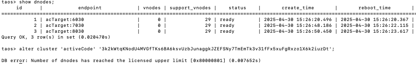 taos> alter cluster 'activeCode' '3k2kWtqKNodU4MVGfTKs6BA6ksvUzbJunaggkJZEFSNy7TmEmTk3v31fFx5xuFgRxzo1X6k2iuzDt'; DB error: Number of dnodes has reached the licensed upper limit [0x80000801] (0.007652s) | 通过 |
| 1.3 | dnode 3 vgroup 1 | 执行授权： taos> alter cluster 'activeCode' '4aprc3fbQwHmBh2XxHu6wWAcm3uinhD2cqFNpAyAUUG3AkW2H4zeDnnYaPAmKyYS3b1UoL62AvMAWkeEHrcri7wj'; Query OK, 0 row(s) affected (0.012047s) | 通过 | 执行授权： 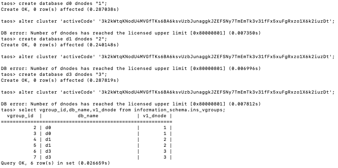 | 通过 |
| 1.4 | dnode3 vgroup 2 | 执行授权： taos> alter cluster 'activeCode' '3NVBh7FY4aG4AFN7VNqc5e9j4wqV5AN28u9A2pMZAeKnFxjMGzniGM5Er9KBy22TtyDCmKLjwf1LFhmhUAjb7KdP'; Query OK, 0 row(s) affected (0.010533s) | 通过 | 同上 | 通过 |
| 1.5 | dnode 3 vgroup 3 | 执行授权： taos> alter cluster 'activeCode' 'NLj6zwwehCq8nub9FzdZLVGYE8BXNdjvdZ5phjDaD7HkxjFEMEEkr4BoJ8KvvD7djFWKZjVDD8ke'; DB error: Number of dnodes has reached the licensed upper limit [0x80000801] (0.005587s) | 通过 | 同上 | 通过 |
| 2.1 | dnode 3 | 创建 dnode: taos> show dnodes; ... Query OK, 3 row(s) in set (0.005941s) taos> create dnode "acTarget:9030"; DB error: Number of dnodes has reached the licensed upper limit [0x80000801] (0.002259s) | 通过 | limitDnode: 2 创建 dnode 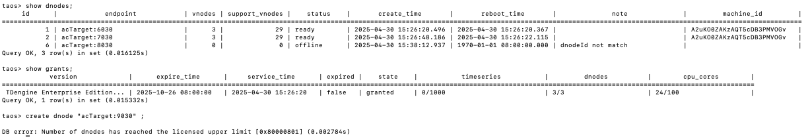 | 通过 |
| 2.2 | dnode 2 | 创建 dnode: taos> show grants; version | expire_time | service_time | expired | state | timeseries | dnodes | cpu_cores | ============================================================================================================================================================================================== TDengine Enterprise Edition... | 2025-10-26 08:00:00 | 2025-04-30 13:49:03 | false | granted | 0/1000 | 2/2 | 24/100 | Query OK, 1 row(s) in set (0.015090s) taos> create dnode "acTarget:8030"; Create OK, 0 row(s) affected (0.013022s) | 通过 | 创建 dnode: 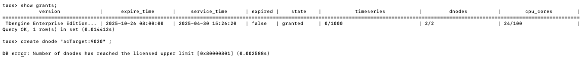 | 通过 |
| 3.1 | dnode 3 vgroup in 0 dnodes vgroup in 2 dnodes | 创建 database，最多只能在 2 个 dnode 上分配 vgroup 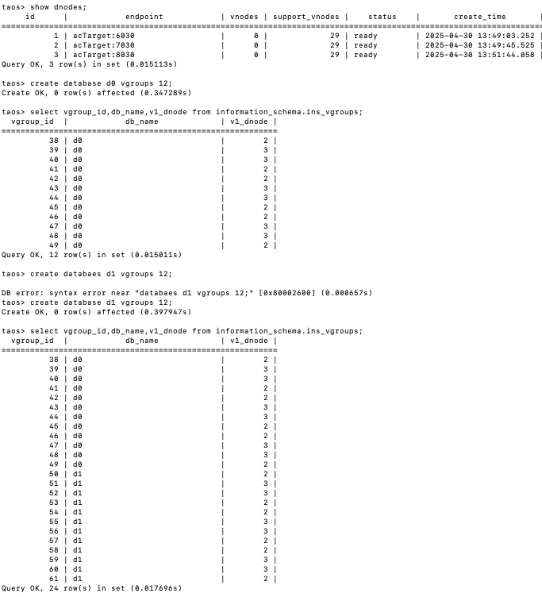 | 通过 | limitDnode: 3 创建 database，可在 3 个 dnode 上分配 vgroup 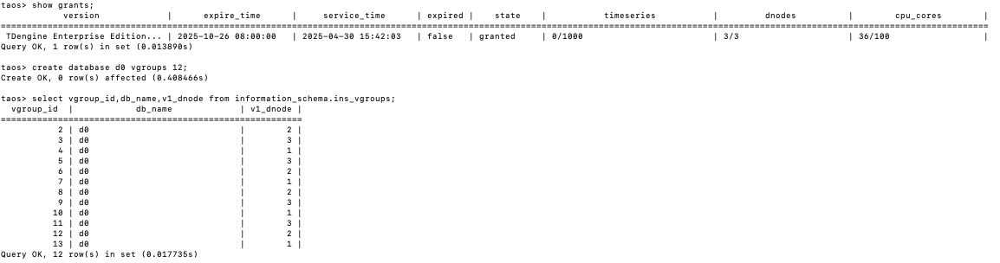 | 通过 |
| 3.2 | dnode 3 Vgroup in 2 dnodes | 创建 database，观察 vgroup 分布的 dnode，只能在已经分配 vgroup 的 2 个节点创建。 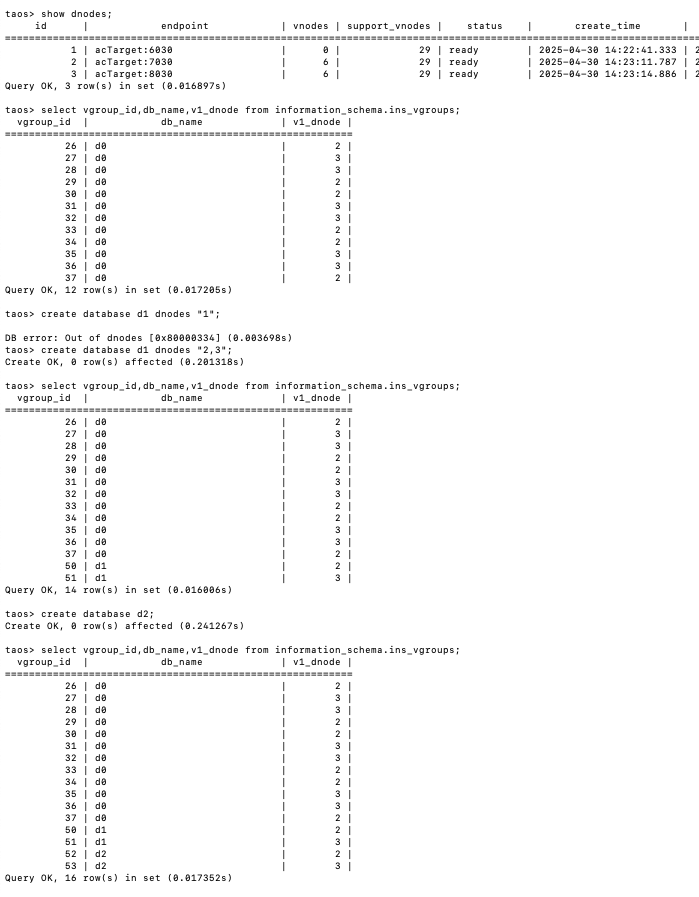 指定 dnode 创建 database 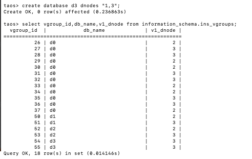 | 通过 | limitDnode: 3 创建 database，观察 vgroup 分布的 dnode，可以在 3 个 dnode 节点创建。 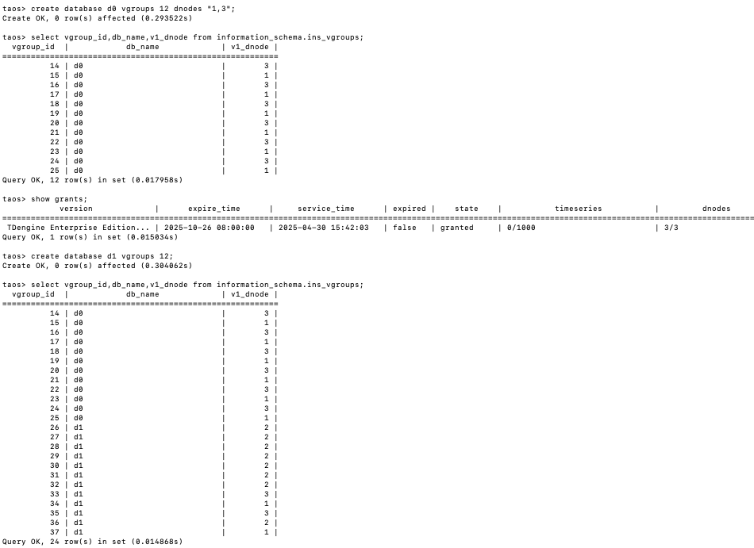 | 通过 |
| 3.3 | dnode 3 Vgroup in 1 dnodes | 创建 database，观察 vgroup 分布的 dnode，必须在在已经分配 vgroup 的 节点上创建，且分布节点不超过 2 个。 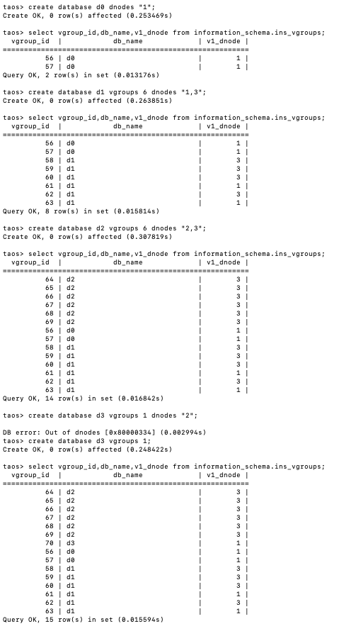 |  | limitDnode: 3 创建 database，观察 vgroup 分布的 dnode，可以在 3 个 dnode 节点创建。 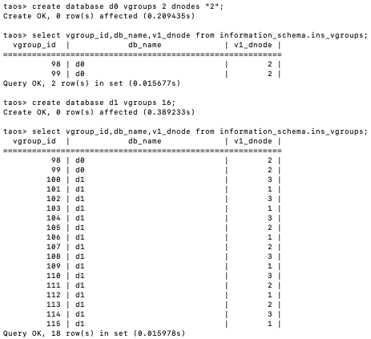 | 通过 |
