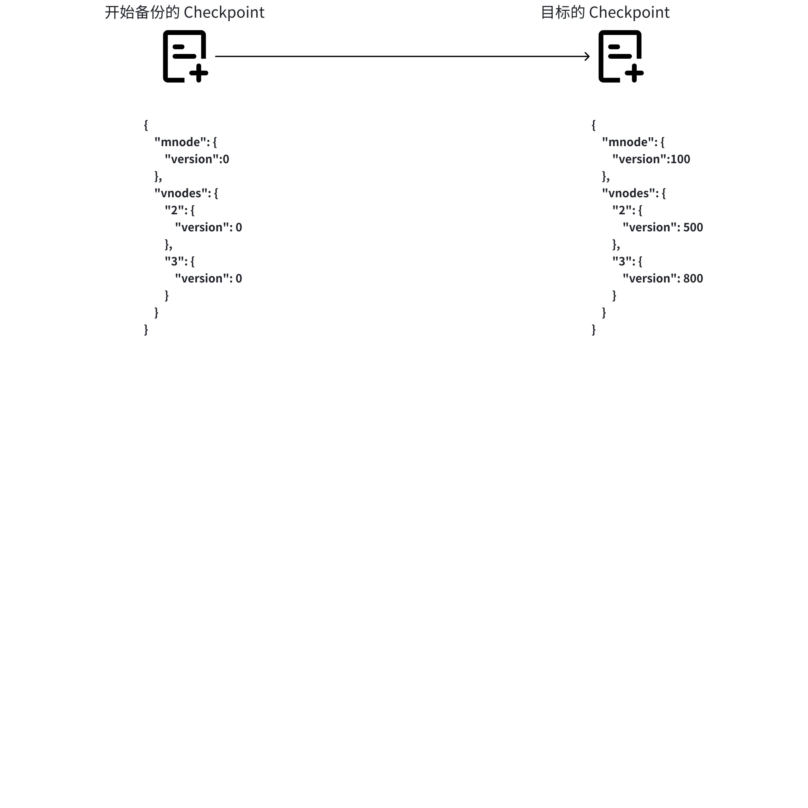
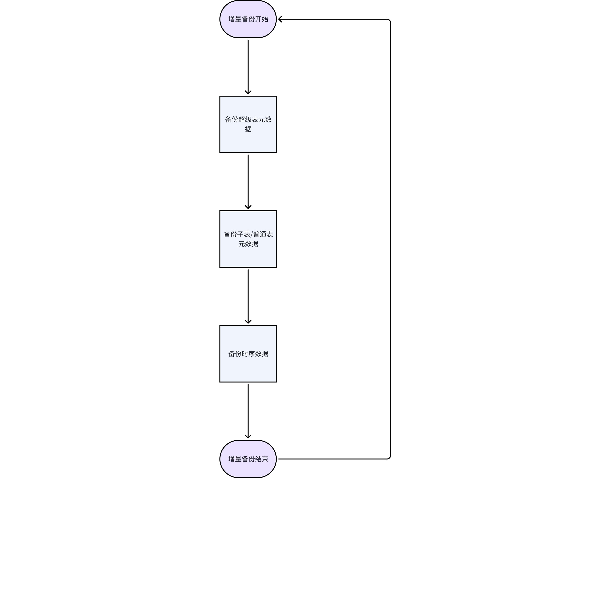
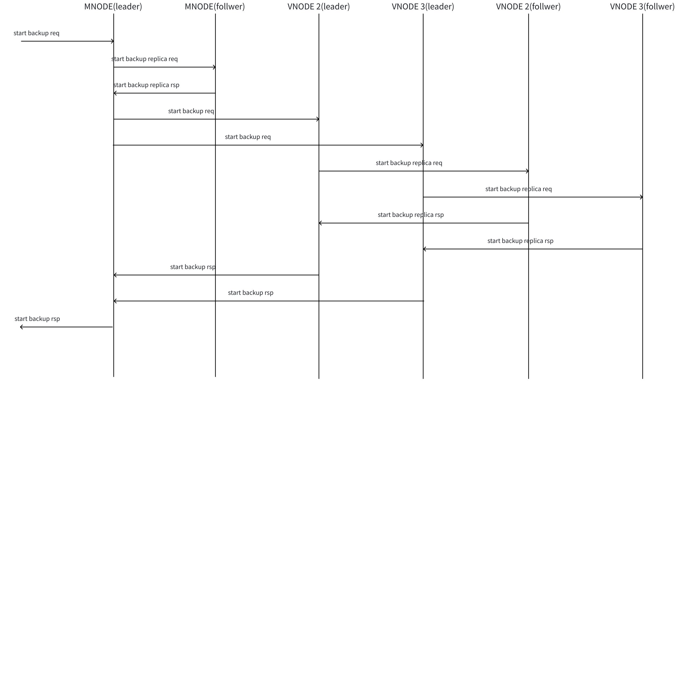
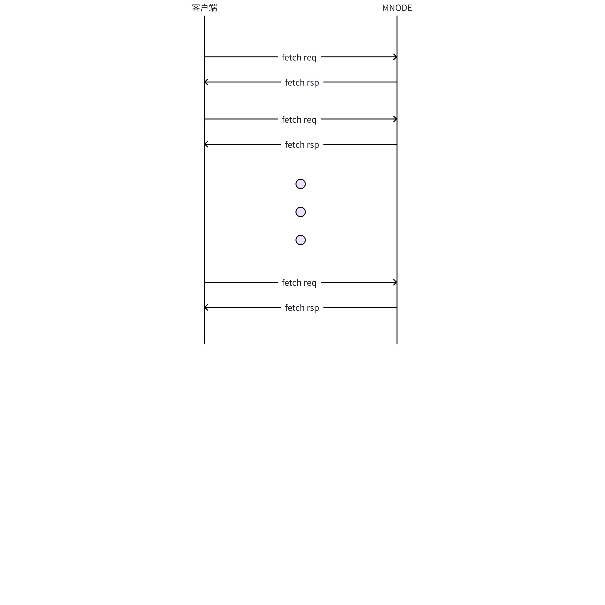
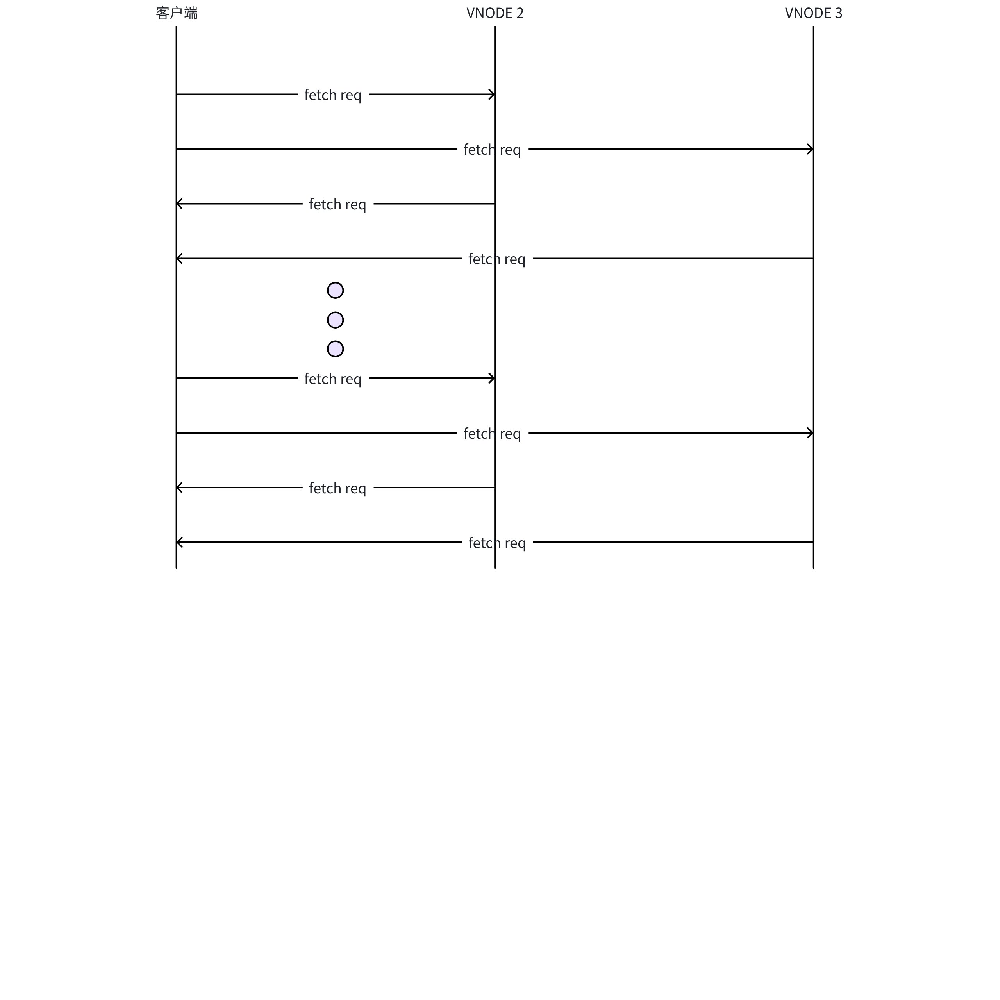
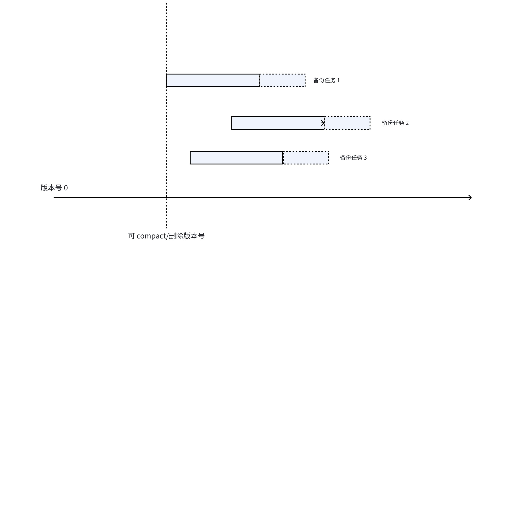
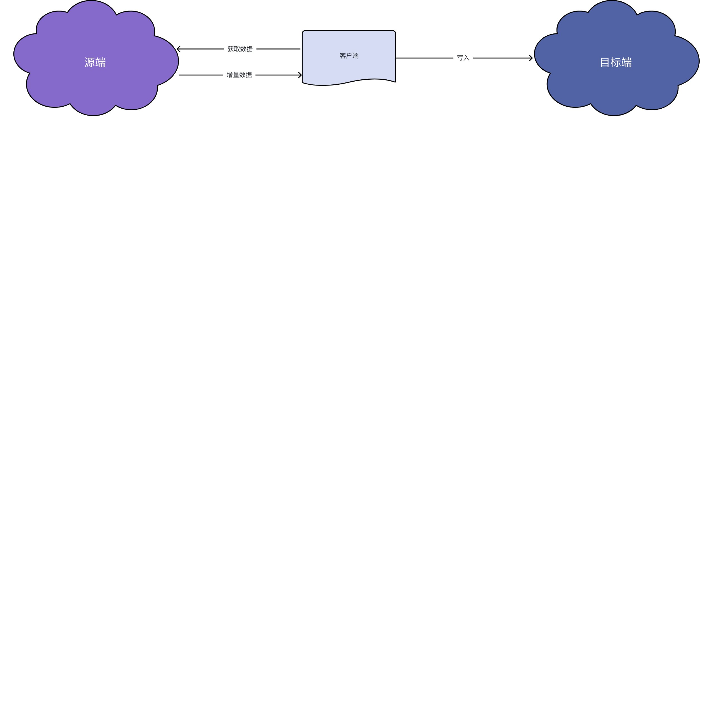
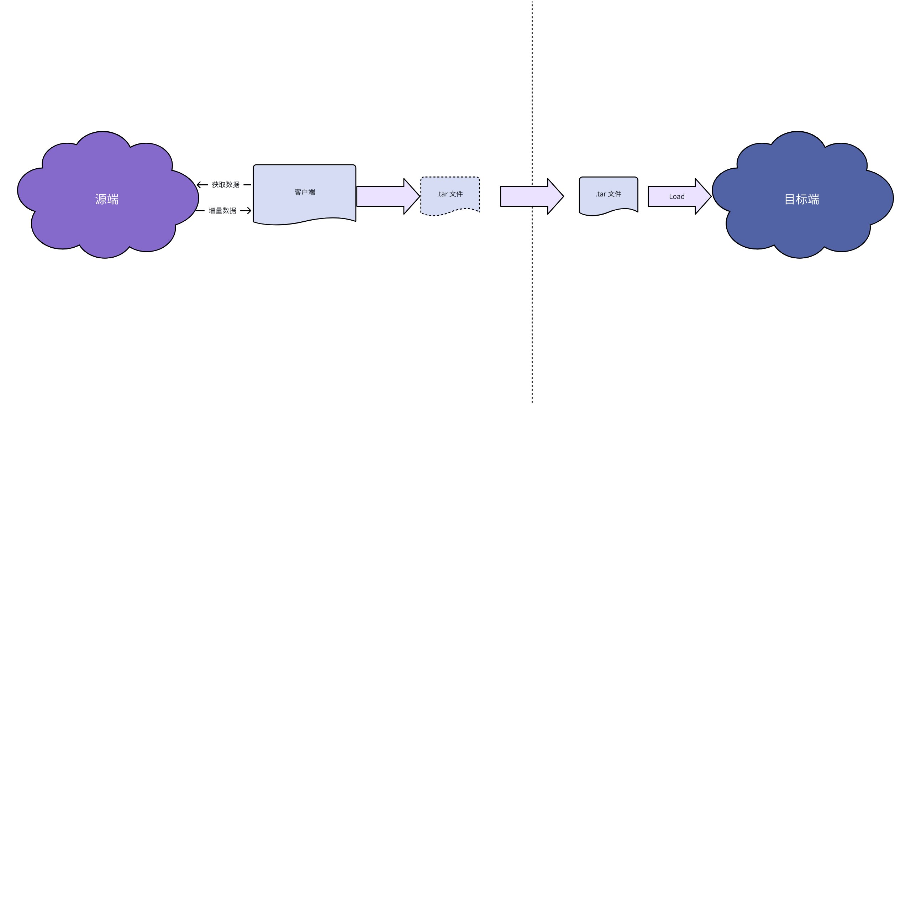

# TDengine 增量备份方案

## 1. 需求描述

具体问题场景，请参考
1. 
  TS-6077

1. 
  TS-6129


根据增量备份时效性的需求，增量备份可以分为实时增量备份和定时增量备份两种。此文档主要针对**定时增量备份**的需求。 

## 2. 现有方案及问题分析

当前，TDengine 的增量备份完全依赖于 taosX（基于数据订阅功能实现），其详细实现原理参见[taosX 增量备份和恢复](https://taosdata.feishu.cn/wiki/VwpywqMkviooHYkhqbccUQrqnnh)一文。
由于 taosX 是独立于 TDengine 集群的第三方应用，无法完全精准获取集群增量数据。加之 TDengine 的分布式架构特性（如超级表元数据存储在 mnode、子表元数据和时序数据分布在 vnode）以及数据处理的依赖关系（如子表必须在超级表创建后才能创建、时序数据必须在表创建后才能写入），导致第三方增量备份存在以下核心问题：
1. WAL 保留策略导致的数据丢失
  - 问题描述：
    - 若两次增量备份间隔超过 `WAL_RETENTION_PERIOD`，未被备份的 WAL 数据会被自动清理，导致增量数据缺失。
    - 若丢失的 WAL 包含关键元数据（如子表创建语句），后续依赖该子表的所有时序数据备份均会失败。
  - 影响范围：
    - 数据完整性无法保证（部分增量数据永久丢失）。
    - 备份链断裂，需依赖全量备份重建基准。
1. 元数据变动引发的同步不一致
  - 问题描述：
    - 当超级表 schema 发生多次修改后，taosX 可能仅捕获最终状态，导致目标端元数据版本与源端不一致。
    - 例如：源端超级表经历 `v1→v2→v3` 变更，而目标端仅同步 `v3`，后续数据备份可能因版本不匹配失败。
  - 影响范围：
    - 数据正确性受损（写入拒绝或 schema 冲突）。
    - 需人工介入修复元数据。
1. 无效数据的同步问题
  - 问题描述
    - 在两次增量备份间隔期间，如果源集群发生高频写入并删除操作（如临时数据写入后立即清理），基于订阅的增量备份方案（如 taosX）会完整记录这些操作的 WAL 日志，并在目标端重放整个流程（先写入再删除）。
  - 影响范围：
    - 性能损耗：
      - 目标端需额外执行无效的写入和删除操作，占用网络带宽、CPU 及存储 I/O 资源。
      - 同步延迟增加，影响关键数据的实时性。
    - 存储压力：
      - WAL 日志中保留大量无效操作记录，可能导致备份存储空间浪费。
总之，现有的增量备份方案在 WAL 缺失的场景下会出现很多无法解决的问题，既不能保证数据同步的成功，也无法保证同步数据的正确性，在部分场景之下也会造成无效备份的问题。为此，有同事曾提出[废弃 - 备份超出WAL_RETENTION_PERIOD时间范围的数据 - FS](https://taosdata.feishu.cn/wiki/CDNbwxv0aiKjXek4u8XcEPnTnkf)的解决方案。但是，该解决方案也存在相应的问题，如第三方应用会干扰集群 WAL 保存策略从而导致 WAL 无法按时删除，导致存储空间的耗尽从而影响 TDengine 集群服务。因此，我们需要一个能够正确增量备份 TDengine 集群数据的新方案。

## 3. 基于存储引擎的增量备份方案

基于数据订阅的增量备份方案原生具有很多无法解决的问题。为了解决这些问题，新的增量备份方案必须是基于分布式存储引擎的。接下来，此文档将详细阐述基于存储引擎的增量备份方案。

### 3.1 增量备份的数据类型

下表总结了备份涉及到的数据类型及备份的数据来源：

| 数据类型 |  | 数据备份来源 | 备份顺序 |
| --- | --- | --- | --- |
| 超级表创建/更新/删除 | MNODE | 1 |
| 子表/普通表创建/更新/删除 | VNODE | 2 |
| 时序数据 | 时序数据写入/更新/删除 | VNODE | 3 |

TDengine 集群备份的数据包括两种：元数据和时序数据。而根据数据来源的不同，元数据又区分为超级表元数据和子表/普通表元数据。无论元数据还是时序数据，备份数据都包括数据的更新和删除。启动一次增量备份时，需要先增量备份超级表的元数据。之后，可以**并发**增量备份各个 VNODE 中的数据。对于一个 VNODE 而言，首先需要增量备份 VNODE 中的元数据，之后才增量备份 VNODE 中的时序数据。

### 3.2 Checkpoint

在增量备份过程中，checkpoint 是我们用来记录备份进度及备份目标的标识，其基本结构如下：
```json
{
    "mnode": {
        "version":100
    },
    "vnodes": {
        "2": {
            "version": 500,
            "detail": {
                "fid": -1,
                "uid": 0,
                "ts": 0
            }
        },
        "3": {
            "version": 1000,
            "detail": {
                "fid": -1,
                "uid": 0,
                "ts": 0
            }
        }
    }
}
```

备份的 Checkpoint 包含 `mnode` 和 vnodes 两部分。其中 `mnode` 部分标识 MNode 的增量备份节点，目前只有一个版本号，后续会根据功能的扩展添加。`vnodes` 部分是备份任务所涉及到的所有 VNode 的增量备份节点，每个 VNode 都包含一个目标版本号及相应的备份详细信息。在创建一个备份任务时，备份任务所记录的 checkpoint 的所有版本号都为 0。在进行一轮增量备份工作时，首先会确定目标 checkpoint，然后迭代备份各 Node 中的数据，直到达到目标 checkpoint。


上图展示了由初始 checkpoint 迭代备份直到目标 checkpoint 的示意图。

### 3.3 增量备份步骤

增量备份从较大粒度可以分为以下三个步骤：
1. 创建备份任务
2. 定时增量备份
3. 删除备份任务

#### 3.3.1 创建备份任务

在进行增量备份之前，必须通过 SQL 语句创建一个增量备份任务，类似于订阅中 Topic。同一个 TDengine 集群中，允许存在多个备份任务同时进行，但是考虑到备份对于集群负载的影响，需要运维人员控制好同时进行的增量备份任务的个数。
创建增量备份任务的 SQL 语句如下：
```sql
CREATE BACKUP backup_name DATABASE db_name [STABLE stb_name] [where condition];
```

用户可以通过 `show` 命令查看系统中的增量备份任务：
```sql
SHOW BACKUPS；
```

还可以通过 `show` 命令展示详细的增量备份任务状态：
```sql
SHOW BACKUP backup_name;
```

#### 3.3.2 定时增量备份

定时增量备份阶段是主要的备份流程。其包含以下几个子步骤：
1. 开始增量备份
2. 超级表元数据备份（串行）
3. 子表/普通表元数据备份（并行）
4. 时序数据备份（并行）
5. 结束增量备份
备份流程如下图所示：


##### 3.3.2.1 开始增量备份

当要进行一轮增量备份时，客户端首先调用接口，通知 TDengine 集群新一轮增量备份的开始。其处理流程如下所示：


开始增量备份的消息流程类似于创建一个超级表。当 mnode 收到开始备份的请求后，会向自己及备份所涉及的各 VNode 发送开始备份的消息。这个消息为一写消息。当 VNode 收到开始备份的消息后，按照写入消息处理，并返回处理该消息的版本号。最终，MNode 收到所有 response 消息后，确定此轮增量备份的目标 checkpoint，并返回给客户端。然后，客户端调用接口，迭代获取增量数据。

##### 3.3.2.2 超级表元数据备份

在调用开始备份接口，确定增量备份目标 checkpoint 后，应用程序可以调用接口，迭代获取增量数据。在迭代过程中，首先会从 mnode 中获取增量超级表数据。这个过程只能是串行的。


##### 3.3.2.3 子表/普通表元数据备份

在完成超级表元数据的增量备份迭代后，客户端可以并发备份各个 vnode 中的子表和普通表的元数据。这个迭代是按照版本号进行迭代的。


##### 3.3.2.4 时序数据备份

与备份子表和普通表的元数据一样，客户端在备份时序数据时，可以并发进行，并发数目小于等于 vnode 的个数。与子表和普通表元数据备份不同的是，在时序数据的迭代过程中，是按照 （fid，uid，ts）进行迭代的。

##### 3.3.2.5 结束增量备份

当本轮增量备份迭代结束后，客户端需要调用接口结束本轮增量备份任务。客户端需要选择正常结束本轮增量备份还是放弃本轮增量备份。如果正常结束本轮增量备份，则备份任务的 checkpoint 则更新为本轮备份的目标 checkpoint。若放弃本轮增量备份，则备份任务的 checkpoint 回滚为本轮增量备份的初始值，下次备份时重新开始。

##### 3.3.2.6 Commit 备份进度

在迭代获取增量数据的过程中，为了避免数据回滚过多，我们提供类似 topic 中 commit offset 的接口，该接口用于更新一次迭代任务中的 checkpoint。

#### 3.3.3 删除备份任务

用户可以通过 SQL 语句删除备份任务：
```sql
DROP BACKUP [IF EXISTS] backup_name;
```

### 3.4 增量备份下 compact 及数据删除的处理

为了保证备份数据在源端和目标端的一致性，源端集群需要根据订阅任务，处理 compact 及 删除数据。其大致逻辑如下所示：


对于任何一个 Node，无论是 MNode 或 VNode，假设目前有三个备份任务进行中，其中任务进度的左端为本轮备份的初始 checkpoint，最右端为目标 checkpoint。那么在一个 Node 中能够被 compact 和删除的数据必须小于最小的初始 checkpoint 的版本号。

### 3.5 增量备份的形式

增量备份的数据可以有以下两种形式：
1. 端到端的增量备份


1. 文件形式的批量备份


## 4. 其他相关问题讨论

1. 此增量备份方案是否可以应用到边云协同的场景中？
本方案可以用于边云协同的增量备份方案，但是由于此方案还是存在相关数据的解析和重组，因此性能还是相对较低。此方案可能存在性能问题。

## 5. 相关参考链接

1. [taosX 增量备份和恢复](https://taosdata.feishu.cn/wiki/VwpywqMkviooHYkhqbccUQrqnnh)
2. [废弃 - 备份超出WAL_RETENTION_PERIOD时间范围的数据 - FS](https://taosdata.feishu.cn/wiki/CDNbwxv0aiKjXek4u8XcEPnTnkf)
3. [数据订阅原理使用及实现](https://taosdata.feishu.cn/wiki/R0ofwcyNIim1PKkmHj5ckSajnhe)
