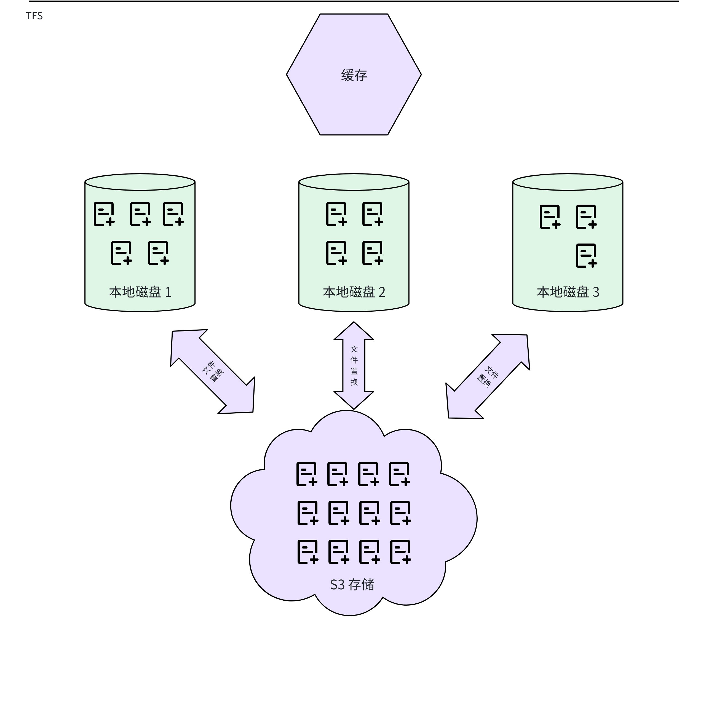
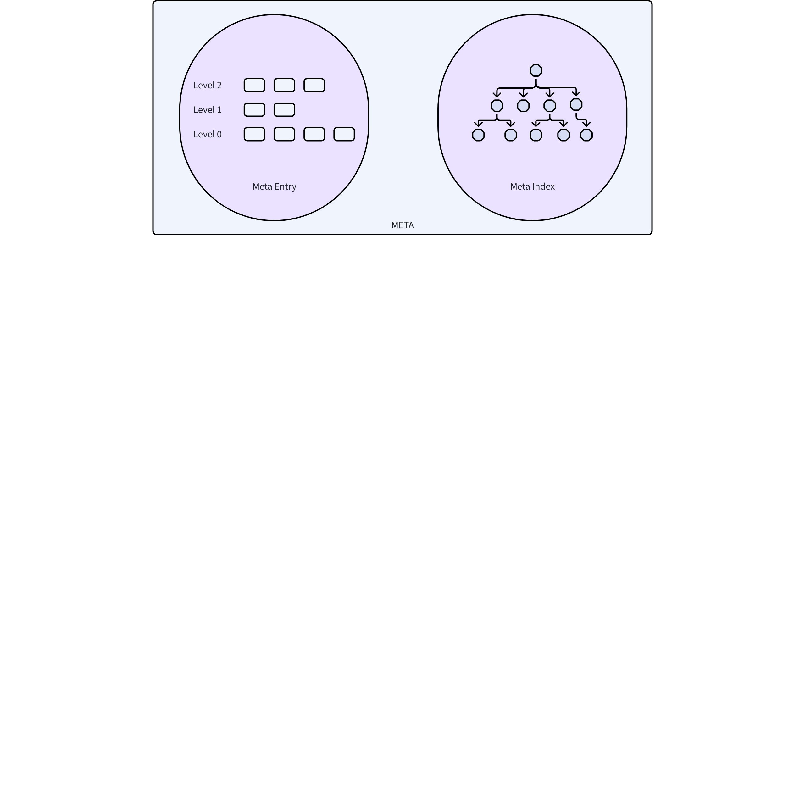
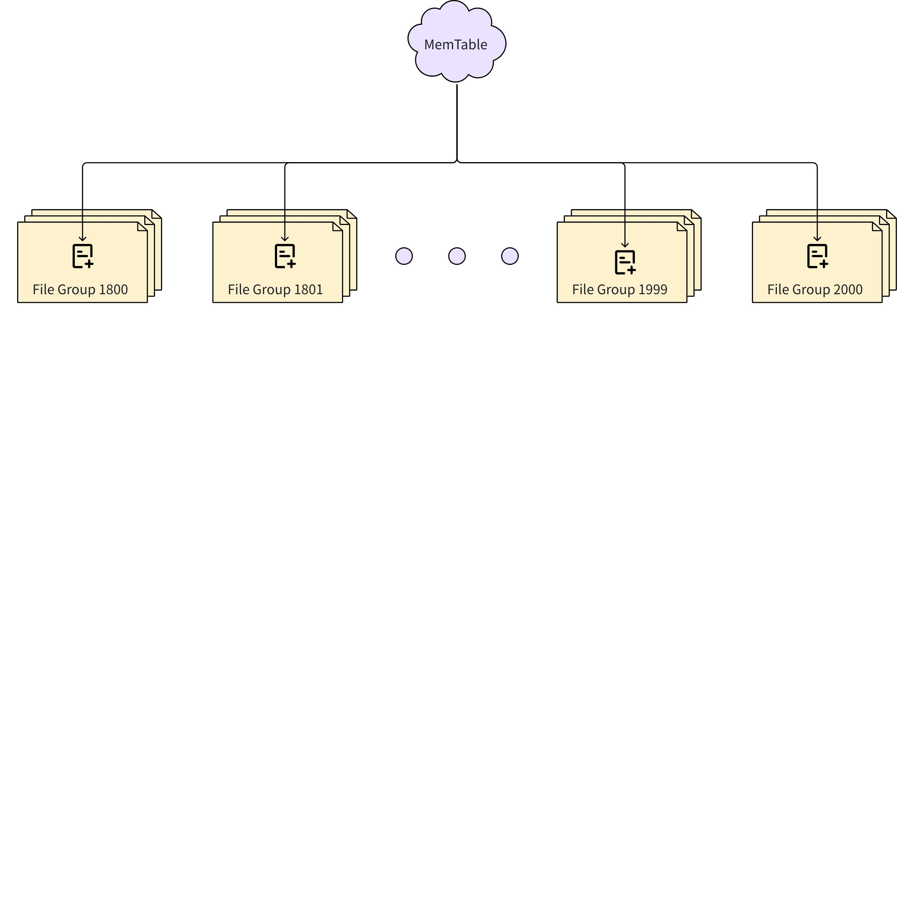
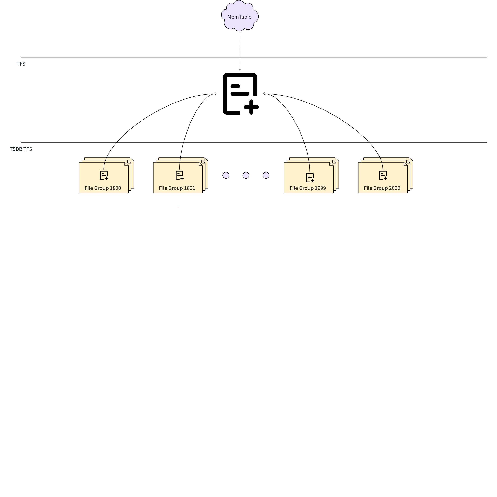
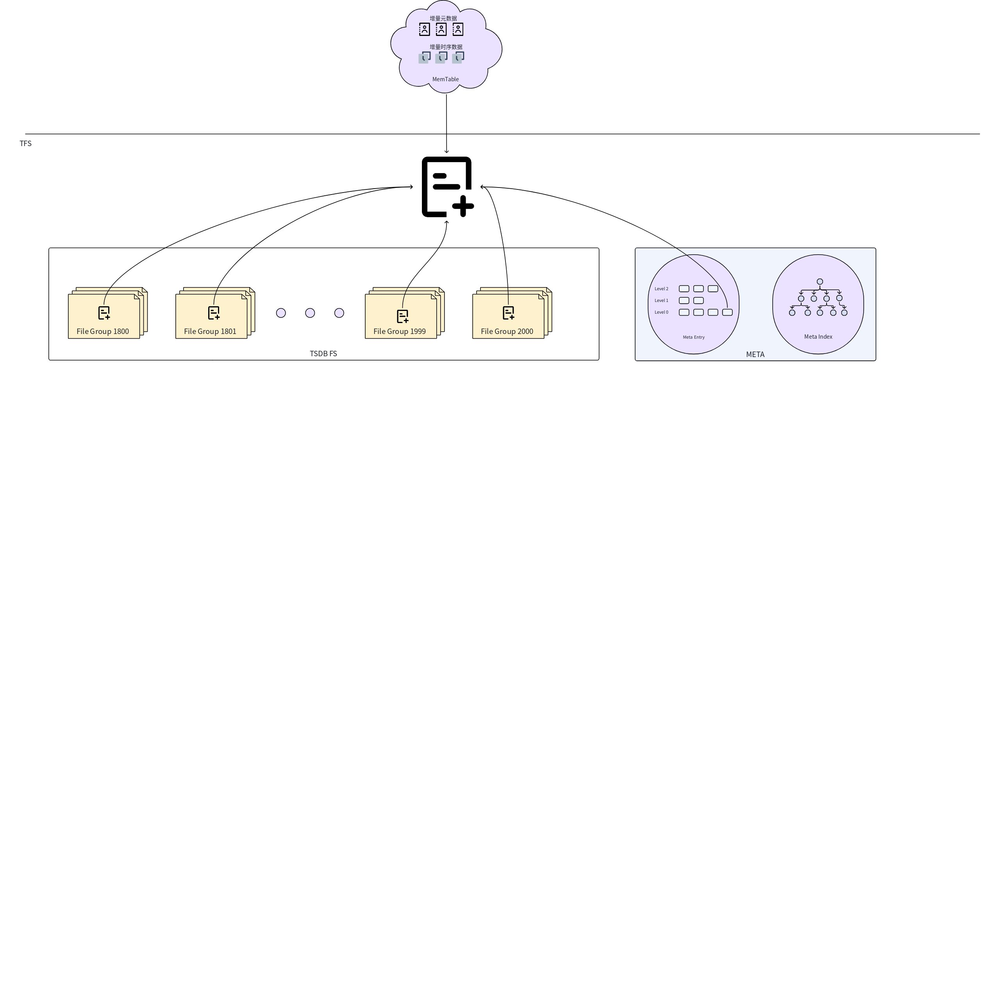
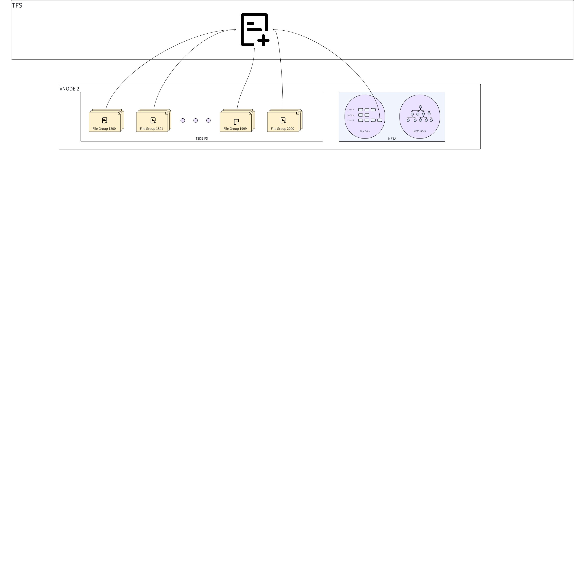
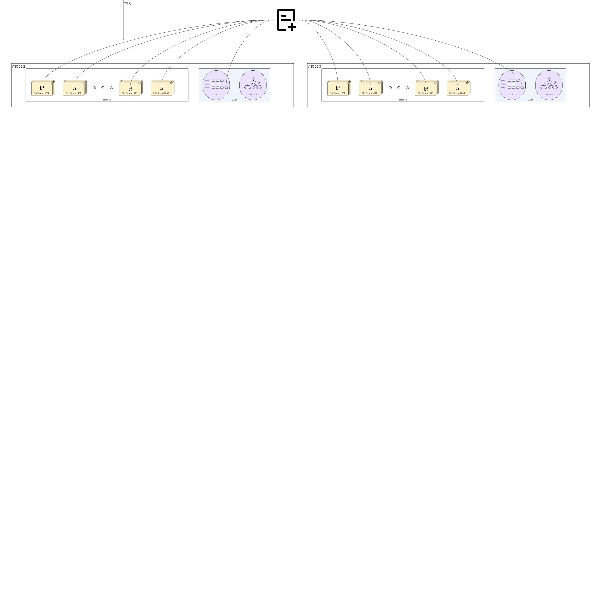
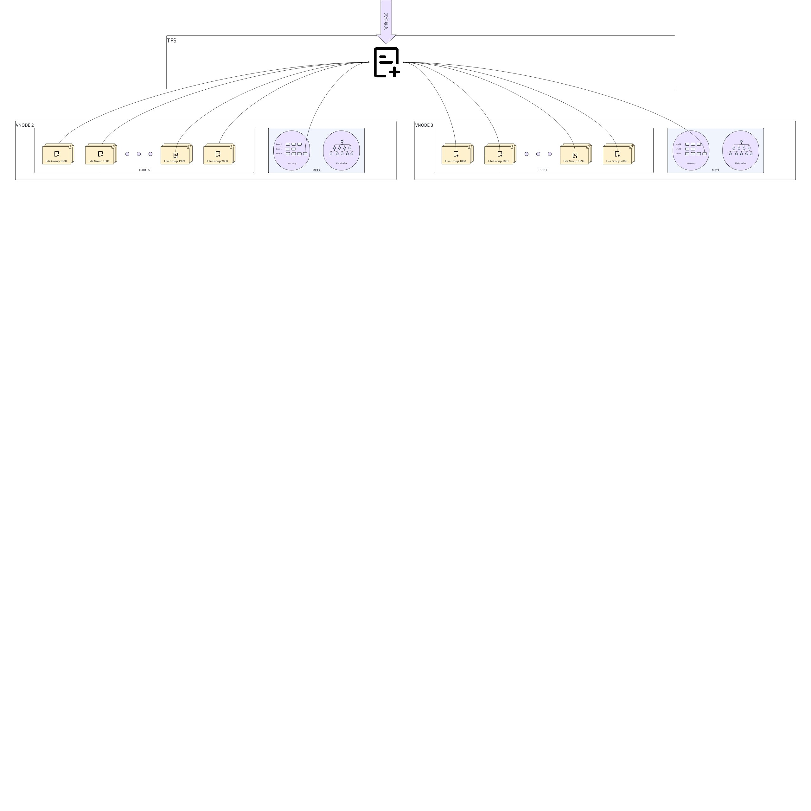
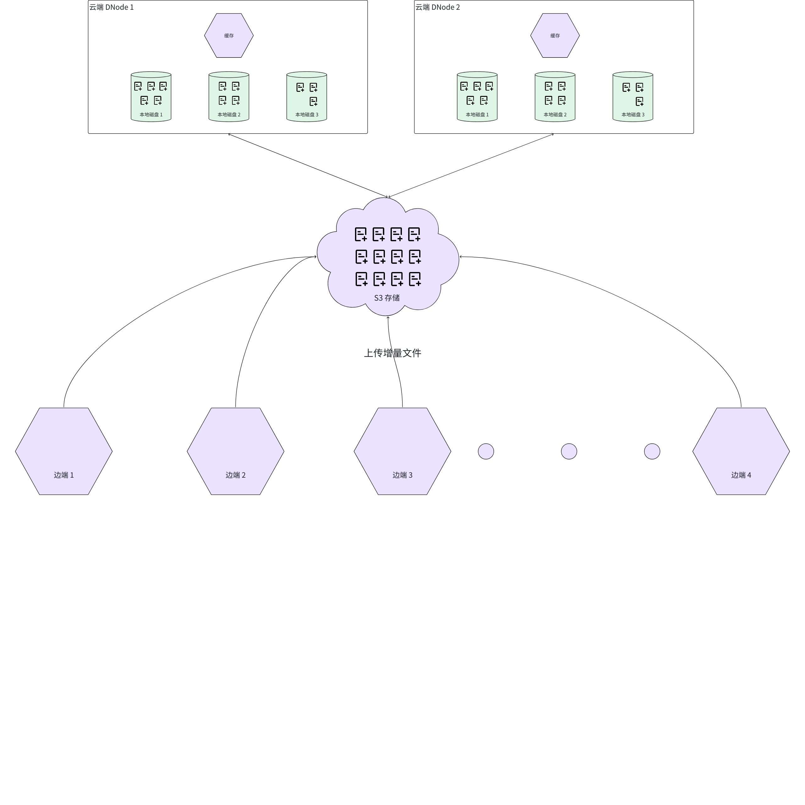

# TDengine 边云场景下低资源消耗方案

## 1. 需求描述

相关问题链接：[TS-6128](https://jira.taosdata.com:18080/browse/TS-6128)
在物联网（IoT）应用场景中，边云协同已成为关键需求，尤其在车联网等低时延、高可靠性场景中表现尤为突出。当前TDengine的存储引擎架构在边云协同场景中存在显著局限性：系统必须依赖第三方应用（如taosX等）实现边端数据到云端的导出和导入流程，这种架构不仅引入了额外的性能开销，更在数据一致性和实时性方面存在潜在风险。
针对这一技术瓶颈，本文档系统性地分析了现有存储引擎架构的缺陷，并基于边云协同场景的特殊需求，提出了存储引擎的优化改造方案。
本方案旨在建立一套高吞吐、低延迟的边云数据通道，以替代现有的第三方依赖方案，从而全面提升系统在边缘计算场景下的性能表现。现提出以下技术提案供评审讨论。

## 2. 现有存储引擎问题分析

TDengine 的存储引擎从 1.0 到 3.0 经历了两次大的重构，目前 TDengine 的存储引擎相对稳定，也能高效处理时序物联网场景下的存储需求，但是还是存在一些问题，在此一并整理列出。
1. **元数据和时序数据的分开存储**
*元数据和时序数据分开存储*这一特性是 TDengine 最基础的设计之一。这一设计带来了非常充分好处，如避免了元数据的冗余存储，大大节省了存储空间。但是，这样的设计也带来了一些问题，尤其是在做增量数据传输，如边端向云端传输增量数据时，要么以来 WAL，要么依赖第三方应用处理。总之这样的存储设计，使得边云协同变得十分复杂。
1. **存储引擎分片机制的性能瓶颈**
当前TDengine的存储引擎采用基于时间戳的分片策略，将数据按时间区间划分到不同的文件组（File Group）中，且每个存储文件严格归属于单一文件组。该设计在理想时序场景下（即所有测点数据严格按时间戳顺序写入）表现良好，但在以下实际业务场景中会引发严重的性能劣化：
   - 乱序数据场景
当写入数据的时间戳分布离散（如高乱序率）时，单批次落盘操作可能涉及多个文件组的随机I/O，导致写入吞吐显著下降。
   - 脏数据或历史数据清洗场景
典型案例如一汽红旗项目，其原始数据包含时间跨度达数十年的脏数据，需经预处理后按清洗后时间戳入库。此类跨时代（cross-era）数据写入会触发大量文件组的并发修改，加剧I/O竞争。
   - 按表迁移的数据导入场景
在表级数据迁移过程中，若单表数据的时间戳分布广泛，每次批量写入将强制跨多个文件组执行非连续写操作，造成磁盘寻址开销激增。
上述场景的共同本质问题是：时间局部性（Temporal Locality）假设失效，导致原本优化的顺序写退化为随机写，严重制约存储引擎的吞吐性能。
1. **元数据 compact 阻塞写入**
TDengine 的元数据存储在自研的 B+ Tree 存储中。在经过大量的元数据更新以后，系统中存在大量的无效元数据，需要通过 compact 命令删除。但是目前自研的 B+ Tree 并不能支持并发写入和整理，因此元数据的 compact 会阻塞表的创建，可能导致业务阻塞。 
1. **vnode 的 merge 与 split 十分复杂且困难**
目前，TDengine 的集群支持 vnode 的 split，但是并不支持 vnode 的 merge。在做 vnode 的 split 时，会首先将 vnode 的数据整体复制一份，然后两边同时做 compact，将不属于该 vnode 的表数据摘除，从而实现 split 的功能。从实现可以看出，vnode 的 split 会导致数据的大量复制和重整，造成严重的 IO 压力，严重时，可能会导致业务的阻塞。
1. **在边云协同场景下效率低下**
由于各种设计原因，边端将增量数据导出发送到云端目前只能依赖于工具，如 taosX。但是，taosX 也是通过订阅等功能将数据读出，然后组装成写入请求，再发送到云端，进行数据的写入。可以看出，此流程链条非常长，涉及到边端的数据读取、数据解析、数据组装，还涉及到云端的数据解析、数据写入以及数据归档等操作，因此注定了目前的 TDengine 在边云协同场景下存在严重的效率问题。

## 3. 存储引擎改造方案

为了解决 TDengine 存储引擎存在的各种问题，并使 TDengine 能够高效处理边云协同场景下的业务需求，本文提供一个存储引擎的改造方案。

### 3.1 抽象文件系统 （TFS）

在此方案中，建议将文件系统单独抽象成出来，叫做 TFS 层。此层主要功能如下：
1. 负责管理并兼容不同的存储介质，如本地存储、HDFS 存储、S3 存储等。
2. 提供不同存储介质下同一的文件接口。
3. 负责管理文件的生命周期，如实现无引用时文件自动删除功能等。
4. 在同时配置本地磁盘和 S3 存储时，可以利用本地磁盘作为缓存，根据 LRU 等策略实现文件在本地磁盘和 S3 存储上的置换功能。
5. 统一管理文件缓存，提高文件访问性能
下图为 TFS 层的功能示意图：

### 3.2 VNODE 文件系统改造

VNODE 的文件系统改造涉及多个方面。

#### 3.2.1 原始元数据采用 LSM 方式存储

为了解决元数据并发 compact 的问题，我们调整元数据的存储，将原始的元数据（Meta Entry）与时序数据一样，以 LSM 的形式进行存储。而针对元数据的索引则依然存储在 B+ Tree 中，保证元数据查询的性能。下图为调整后的元数据存储：

#### 3.2.2 VNODE 每次落盘只生成一个 STT 文件

前面已经提到，在 TDengine 中，一个数据文件严格属于一个 vnode 中的一个文件组，而本方案下，一个数据文件可以属于多个文件组，甚至这些文件组可以属于不同的 vnode。下图表示了当前 TDengine 中落盘生成文件的方式：

如上图所示，在 vnode 落盘时，会根据数据的时间跨度，在每个覆盖的文件组中，各生成一个 STT 文件。如果时间跨度特别大，且文件数目特别多的情况下，会产生大量的文件，从而导致系统写入性能下降明显。
改造后的示意图如下：

改造后，vnode 每次落盘时，只在 TFS 层生成一个文件对象（具体该文件对象是什么，取决于 TFS 层对文件的抽象实现）。与此同时，将该文件注册到时间范围覆盖的所有文件组中，相当于在相应文件组中注册软链，我们称此软链接为虚拟文件。每个虚拟文件通过接口只能访问该文件所在文件组时间范围内的数据，这样便可以保证上层查询逻辑不变。这样便解决了时间跨度大、文件多、写入性能慢的问题。由于每个文件组都是一个 LSM，因此虚拟文件会在后续的合并中删除。当虚拟文件被删除后，TFS 中的文件对象的引用计数做相应的减操作，当文件对象的引用计数归 0 后，则删除该文件对象。

#### 3.2.3 元数据与时序数据物理存储上合并，逻辑上分开处理

前面已经讲过，我们存储引擎的改造要将原始元数据也进行 LSM 的存储，为了实现这个，我们将增量元数据的改动也存储到 MemTable 中，并在 flush 的时候，随时序数据存储在 TFS 中同一个文件对象里。与前面提到的一样，注册该文件进 Meta 的 LSM 系统中，其示意图如下：

这样处理的好处是可以轻易将增量的元数据和时序数据以一个文件的形式导出，这对边云协同有极大的好处。后面会详细描述。

### 3.3 VNODE 的 split 和 merge

有了上述的改造工作之后，vnode 的 split 和 merge 将变得十分简单。假设 vnode 在 split 前如下图所示：

那么，split 后将如下图所示：

可见，vnode 在 split 后，只需要在新的 vnode 中注册新的虚拟文件，并指向 TFS 中的文件对象即可，无需文件拷贝。在查询时，虚拟文件只能读取属于该 vnode 中的表的数据。在 split vnode 后，相应的文件对象的引用计数要相应增加。与此类似，vnode 的 merge 也可如此操作。

### 3.4 文件直接导入

有了上面的改造工作，我们可以接着做一个重要的功能：**文件的直接导入**。其具体实现示意图如下：

我们可以直接将增量 STT 文件导入到 TFS 层，然后在该文件涉及的所有 vnode 的所有文件组中创建对应的虚拟文件。

### 3.5 边云协同高效数据同步

实现了文件的直接导入，我们便可实现高效的边云协同机制。

如上图所示，边端持续不断地产生增量 STT 文件，并上传到云端配置的 S3 上。通过命令，直接将增量文件整个导入云端集群中，避免第三方应用读取、解析、组装的过程，也避免了云端处理写入的场景，性能提升会十分明显。
