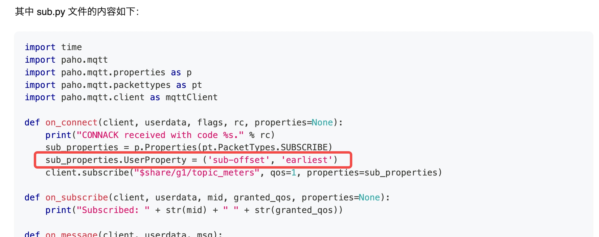
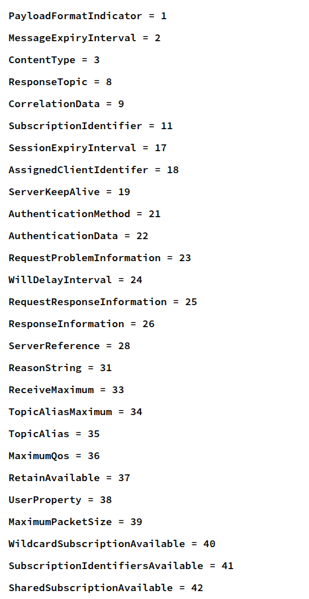

# MQTT 数据源支持用户订阅属性 RS

## 1. 引言

### 1.1 术语与缩写名词

1. MQTT 用户订阅属性​：Subscribe User Properties，指MQTT协议中允许在 SUBSCRIBE 消息中附加的键值对元数据。
2. MQTT v5​：支持属性功能的MQTT协议版本，此需求仅对支持 v5 协议的 MQTT Broker 实现。

### 1.2 相关文档资料

- JIRA https://jira.taosdata.com:18080/browse/TS-7052
- https://docs.oasis-open.org/mqtt/mqtt/v5.0/os/mqtt-v5.0-os.html#_Toc3901167

### 1.3 优先级要求

中

### 1.4 版本要求

仅企业版支持

## 2. 变更历史

| 日期 | 版本 | 负责人 | 主要修改内容 |
| --- | --- | --- | --- |
| 2025/08/13 | 1.0 | 霍琳贺 | 新建 |

## 3. 需求目标

1. 针对 MQTT v5 协议新增用户定义属性支持
2. 扩展需求：针对 MQTT v5 协议新增连接属性支持

## 4. 功能需求

### 4.1 支持 3.3.7.0 TDengine 新增的 MQTT 订阅协议

TDengine 支持使用 `sub-offset` 用户属性设置订阅起始点。taosX 需要支持此特性以在 TDengine 产品内部能够完成功能闭环。

### 4.2 扩展需求：连接属性

MQTT v5 新增了连接属性：https://docs.oasis-open.org/mqtt/mqtt/v5.0/os/mqtt-v5.0-os.html#_Toc3901027，包括如下：

添加连接属性可以更好的适配不同的 MQTT Broker 实现。

## 5. 性能需求

无

## 6. 安全需求

无

## 7. 其他需求

Explorer UI 应对应修改。
