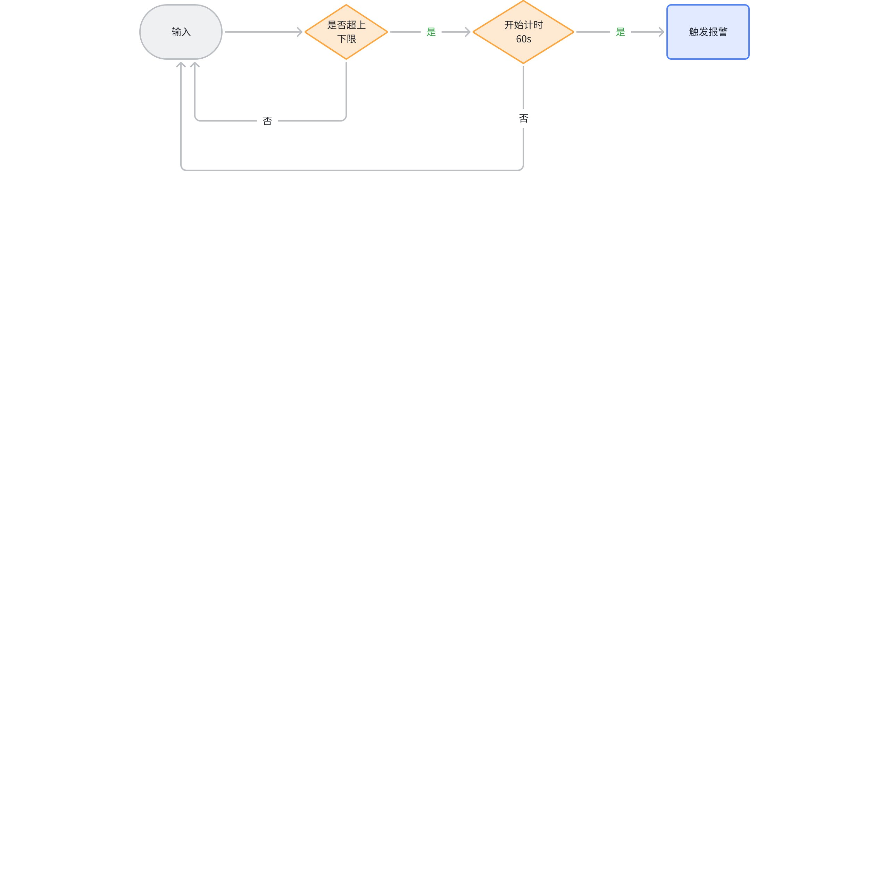

# 电力流计算需求讨论

## 1. 南网CEP流计算

### 1.1 新增变化次数函数

需求说明：计算在指定时间窗口内(典型窗口：时、日、月、年)某个测点的变化次数：当前值与最近值不一致判为变化一次。

### 1.2 新增越限次数函数

需求说明：越限次数是指，质量码列quality的8位从不设置任何一位到设置了任何一位，次数加一
```plaintext {wrap}
const ku64_t HI_REASON_ALM     = ((ku64_t)1<<4);  //0x10; 越合理上限
const ku64_t LO_REASON_ALM     = ((ku64_t)1<<5);  //0x20; 越合理下限
const ku64_t HI_SHORT_ALM      = ((ku64_t)1<<7);  //0x80;  事故上限
const ku64_t HI_LONG_ALM       = ((ku64_t)1<<8);  //0x100; 紧急上限
const ku64_t HI_OPER_ALM       = ((ku64_t)1<<9);  //0x200; 操作上限
const ku64_t LO_OPER_ALM       = ((ku64_t)1<<10);  //0x400; 操作下限
const ku64_t LO_LONG_ALM       = ((ku64_t)1<<11);  //0x800; 紧急下限
const ku64_t LO_SHORT_ALM      = ((ku64_t)1<<12);  //0x1000; 事故下限
```

越限次数可以按照8位中每一位的从0到1的变化次数进行统计：
- 8位中的每一位从0到1，是越限，次数加1
- 从1到0，是恢复，次数不变
例如质量码位的第5位为由0变成1时（0x10，0001 0000），为越合理上限次数加一次，第6位由0变位1时（0x20，0010 0000）为越合理下限次数加一次。

### 1.3 新增合格率函数

需求说明：
针对质量码列quality，8位中有任何一位变位为1均视为不合格，计算变位后到下一次全部都为0的时间h，h/24 就是当天的整体不合格率。
不合格率需支持时、天、月、年等不同的时间窗口切分。
合格率按照8位中每一位的从0到1的变化次数进行判读，8位中的每一位从0到1，为不合格；从1到0，是恢复正常，为合格。例如质量码位的第5位为由0变成1时（0x10，0001 0000），为越合理上限判为不合格，第6位由0变位1时（0x20，0010 0000）为越合理下限判为不合格。
8个位，每个位：
1. 变化上送，但不排除偶尔会多上送
2. 需要取前值，不限制前向查找的时间范围
3. 窗口关闭时计算、推送结果，期望按小时定时计算推送准实时结果(每天的场景)
4. 8个标志位分别计算不合格率，同时能计算整体不合格率(可能有叠加，需要剔除)
意味着，目前state_window的计算窗口的方式要修正：从某个值变B时，ts_B之前都属于上一个窗口，从B变A，[ts_B, ts_A) 这个区间属于状态B的窗口。
```plaintext {wrap}
const ku64_t HI_REASON_ALM     = ((ku64_t)1<<4);  //0x10; 越合理上限
const ku64_t LO_REASON_ALM     = ((ku64_t)1<<5);  //0x20; 越合理下限
const ku64_t HI_SHORT_ALM      = ((ku64_t)1<<7);  //0x80;  事故上限
const ku64_t HI_LONG_ALM       = ((ku64_t)1<<8);  //0x100; 紧急上限
const ku64_t HI_OPER_ALM       = ((ku64_t)1<<9);  //0x200; 操作上限
const ku64_t LO_OPER_ALM       = ((ku64_t)1<<10);  //0x400; 操作下限
const ku64_t LO_LONG_ALM       = ((ku64_t)1<<11);  //0x800; 紧急下限
const ku64_t LO_SHORT_ALM      = ((ku64_t)1<<12);  //0x1000; 事故下限
```


## 2. 江苏国信火电场景流计算

### 2.1 定值报警

需求说明：数据到达后判断是否超上下限，超限后持续时长超过指定时间，发出报警
业务示例图：


<quote-container>
0416 与@潘魏讨论记录 讨论记录
新的流计算event_window + true_for(duration) + max_delay 可以初步满足需求
- event_window 可以定义窗口起始、终止条件，支持标签列取值
- true_for(duration) 可以定义窗口最小持续时长 - 该参数未来需要支持表达式，从标签读取值
  - 该参数可以不设置，根据实际情况决定
- max_delay 定义周期性检查、触发的时长，在一个窗口内如满足条件将会触发多次报警 - 该参数未来需要支持表达式，从标签读取值
  - 当前方案下，需按不同的检查、触发时长设立分组，每组拥有相同标签值，根据标签值筛选创建流计算
</quote-container>

需求分析：
- 比较参数值是否超过上下限阈值(随测点变化而变，需要从标签取值)，持续指定的时间(需从标签取值)，输出到结果表
  - 上下限阈值两种设定方式：绝对值(下限阈值、上限阈值)，相对值(基础值±比率)
  - 待确认：基础值是固定值(从标签取值)，还是计算得出(如前一窗口平均值)  
   --可能是固定值，也可能随着季节不同而不同，比如线圈温度，在夏季和冬季的定值可能不同
  - 待确认：输出的具体内容：起始超限时间...
   --记录第一条记录的时间+子表名+字段值
- 流计算触发方式：事件驱动 + event_window + max_delay
  - 超限后持续指定时间，拟采用max_delay 定义周期性检查、触发的时长，在一个窗口内如满足条件将会触发多次报警 - 该参数未来需要支持表达式，从标签读取值
- 判断条件：参数值超过上下限阈值(需从标签取值)，持续时间超过持续时长阈值(需从标签取值)

### 2.2 速率报警

需求说明：“参数在一定时间内变化速率...”，在连续计算的场景下，TDengine 2.6 derivative函数满足需求，期望在3.3 上的流计算实现同样的功能要求
结论：Q2流计算重构后将满足该需求

### 2.3 晃动报警

需求说明：“参数在一段时间内上下晃动频率、幅度过大”，新增两个函数：晃动幅度、晃动频率。
需求分析：
- 在给定时间窗口内，逐一计算每行参数值与上一窗口的平均值的偏差，超过晃动幅度阈值(随测点变化而变，需要从标签取值)，则判晃动幅度过大；晃动次数超过参数指定次数(随测点变化而变，需要从标签取值)，则判晃动频率过大，输出到结果表
  - 晃动幅度： 逐一计算每行在指定时间窗口内的晃动幅度： ABS((当前值-平均值)/上一窗口平均值)，超过指定的晃动幅度阈值(需从标签取值)，输出表名/测点
  - 晃动频率：指定时间窗口内晃动次数超过指定的次数(需从标签取值)，输出子表名/测点
- 示例：如定义一分钟的时间窗口，温度基础值为最近时间窗口的平均值，允许的变动比率为10%。逐一判断窗口的温度值是否超出上下限，判定是否晃动
- 流计算触发方式：时间窗口流计算，窗口关闭时触发计算
<callout emoji="round_pushpin" background-color="light-orange" border-color="light-orange">
补充说明：如无法提供内嵌函数支持，则必须要求UDF框架能支持该需求、且该UDF能用于流计算
</callout>


### 2.4 偏差报警 

需求说明：“一组同类参数，单个或数个参数偏离其他大部分参数”
业务场景说明：为防止传感器故障，在工业场景，同一个物理量通过多个传感器进行采集，当某个传感器数据和其他传感器偏差过大，定义为数据偏差。每个物理量均可设置偏差阈值(随测点变化而变，需要从标签取值)，输出到结果表。
需求分析：
- 在给定时间窗口内一组同类参数变化幅度超过该物理量偏差阈值，输出到结果表
  - “一组同类参数”，通过标签筛选
  - 单行输出，输出结果为偏离过大的测点名（单列数据子表名 或 多列模型的某列名）
- 流计算触发方式：时间窗口流计算，窗口关闭时触发计算
- 判断条件：ABS((当前值-平均值)/平均值) > 该物理量偏差阈值(需从标签取值)
<callout emoji="art" background-color="light-orange" border-color="light-orange">
建议先考虑单列模型下的需求实现，在多列模型下如何实现存在疑问，需与产研探讨
物理量偏差阈值如何存放，由产研给出建议
</callout>


### 2.5 死点报警

需求说明：“参数在一段时间内保持不变，不符合设备运行机理或以往经验”
需求分析：
- 在给定时间窗口内参数值变化幅度低于指定死点阈值(随测点变化而变，需要从标签取值)
- 流计算触发方式：时间窗口流计算，窗口关闭时触发计算
- 死点计算：ABS((当前值-平均值)/平均值) <= 该测点死点阈值(需从标签取值)
  - 平均值为当前窗口该参数平均值
- 判断条件：窗口内任意一条变化率超过死点阈值，结果输出为0，不是死点；窗口内所有记录变化率均未超过死点阈值，输出1

### 2.6 超限预警

需求说明：“实时计算参数的超限时间，达到临近时间点，提前报警”
<quote-container>
**需求访谈记录**
0416 张总现场反馈：根据上一窗口计算所得的变化率derivative，结合当前值，按照变化率，计算大概多久能到达超限阈值。
目前客户已实现
设定的阈值为目标，参数当前值按照变化速率计算，参数值多久可以达到设定的阈值。
</quote-container>

需求分析：
- 根据实时算得的参数变化率(derivative)、当前值，推算出到达指定超限阈值(随测点变化而变，需要从标签取值)的时间，输出预计超限时间至结果表
  - 输出时间单位可指定：秒、分钟...
  - 待确认：如计算结果为无穷大，是否输出、如何输出
  --超过超限时间（到达指定超限阈值(随测点变化而变，需要从标签取值)的时间）不输出
  - 待确认：是否简化为固定时间窗口的流计算，而非事件驱动流计算
  --事件驱动流计算（一般预留的处理时间也就在十几秒到1分钟，如果时间窗口设为15秒或1分钟，可能无法及时处理）
- 参数变化率计算：derivative需支持流计算，时间窗口time_interval需支持从标签取值
  - 待确认：derivative的时间窗口time_interval，是否随测点变化而变化
  --不同测点time_interval也不同
- 超限时间计算：根据上一步算得的参数变化率、当前值及超限阈值(需从标签取值)，算得预计超限时间
- 判断条件：在给定时间窗口内算得的最大超限时间大于指定超限阈值(随测点变化而变，需要从标签取值)

### 2.7 残差报警

需求说明：“实时计算单参的期望值(预测值)，与实际值的残差过大报警”
<quote-container>
**需求访谈记录**
根据N个T0时间其他参数，推理出T0目标参数值 - 多元线性回归，目前采用TensorFlow训练实现
-> TGgpt的应用场景 @陈肃肃总来把握下 肃总来把握下
这里的阈值是机器学习模型计算的结果，在不同的工况条件下，参数的期望值是不同的，如电机线圈温度，即使电流相同，在不同的环境温度下，其运行区间也不同。
建立期望值模型：
输入：电流、环境温度 输出：线圈温度
通过不同环境温度和电流的历史数据进行训练，获得一个模型。
参数预期值=期望值模型（电流、环境温度）
残差=线圈实际值-预期值
如果残差超过设定的阈值（一般是绝对值）（持续超过设定的时间后）即报警
 目前参数预期值客户自行计算，带着时间标签存入时序库。
</quote-container>

需求分析：
- 根据t0多个相关参数值实时算得t0目标参数期望值，算得残差：ABS(目标参数实际值-期望值)。残差值超过指定残差阈值(随测点变化而变，需要从标签取值)，输出报警到结果表
  - 目前客户采用TensorFlow多元线性回归进行训练得到的模型，进行期望值计算，TDgpt能否支持
  - 待确认：输出的具体内容
  --子表名+记录的时间+实际值+期望值
  - 待确认：是否简化为固定时间窗口的流计算，而非事件驱动流计算
  --固定时间窗口，类似于定值报警
- 判断条件：在给定时间窗口内算得的最大残差大于指定残差阈值(随测点变化而变，需要从标签取值)
<callout emoji="art" background-color="light-orange" border-color="light-orange">
TDgpt如能支持工业常用的机器学习算法，将是一个重要卖点。
</callout>


### 2.8 概率报警

需求说明：“直接给出故障概率，设定概率高于定值，持续定长就报警”
<quote-container>
**需求访谈记录**
概率报警，可以理解为通过分析参数变化，得到发生某种故障的概率。
目前实现的方法：
建立概率模型，通过机器学习中分类器或者回归，目前采用TensorFlow实现。例如：火电厂运行场景中，磨煤机入口堵煤，其主要特征参数表现为：磨煤机电流A下降，其出口温度T快速上升。选择发生该故障的历史数据进行训练，获得一个概率模型。
-> TGgpt的应用场景 @陈肃肃总来把握下 肃总来把握下
运行中，通过模型不断的对参数进行计算得出：磨煤机进口堵煤的概率。
目前是客户自己进行训练和计算。
如果在TD的流式计算中实现，需要TD能对接训练好的概率模型。
</quote-container>

需求分析：
- 根据预训练的机器学习模型实时算得目标参数概率值，超过指定概率阈值(随测点变化而变，需要从标签取值)，持续指定的时间(需从标签取值)，输出报警到结果表
  - 目前客户采用TensorFlow分类器、回归进行训练得到的模型，进行概率计算，TDgpt能否支持
  - 待确认：输出的具体内容
  --时间+故障类型，几个关联参数按照某种特征变化时，定义为某种故障类型
- 流计算触发方式：事件驱动 + max_delay
  - 超限后持续指定时间，拟采用max_delay 定义周期性检查、触发的时长，在一个窗口内如满足条件将会触发多次报警 - 该参数未来需要支持表达式，从标签读取值
- 判断条件：算得的概率值超过指定概率阈值(需从标签取值)，持续时间超过持续时长阈值(需从标签取值)
