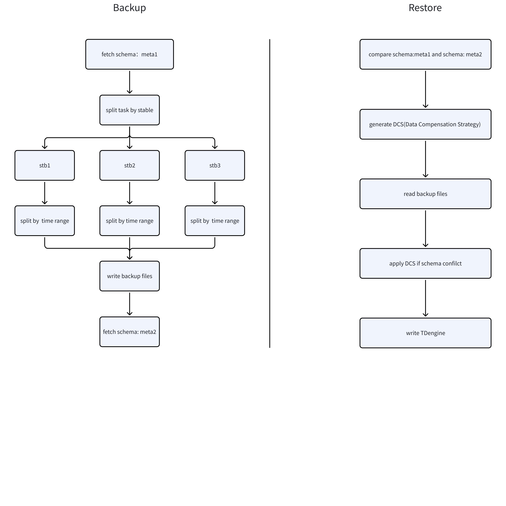
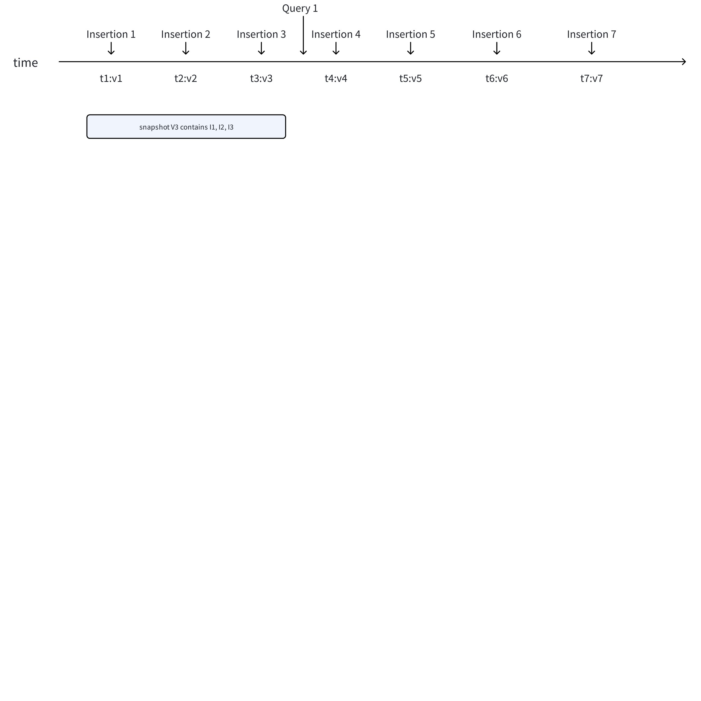
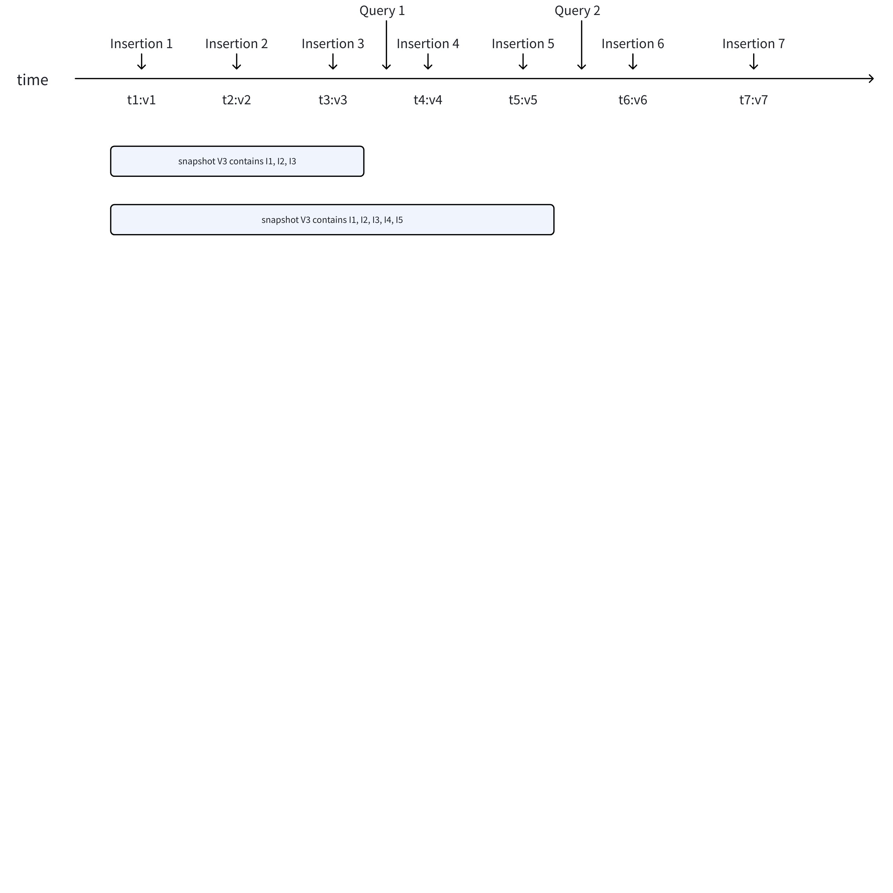
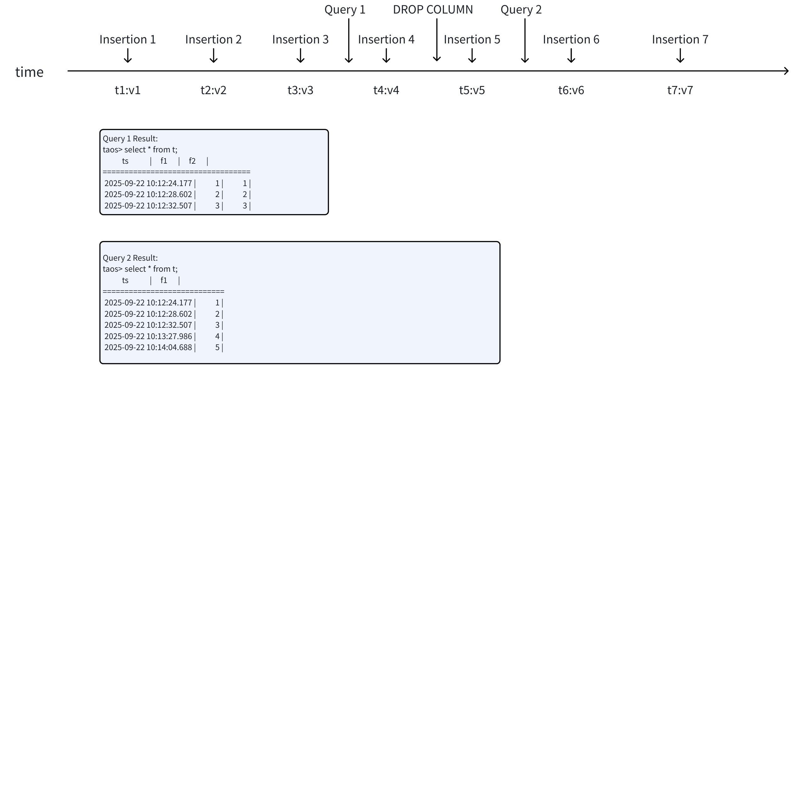

# taosX 逻辑备份与恢复 - FS

## 1. 背景

用户在诸多场景下，需要使用备份和恢复，例如：
- 在进行 TDengine 大版本升级前，需要对全库进行备份，以防升级失败后能快速回退。
- 由于应用层 bug 或误操作，某一台设备在昨天的 14:00 到 15:00 之间的数据被删除/修改了，需要被修正。
- 业务部门需要将一部分数据（如某个传感器数据）提供给合作伙伴或客户，而不可能给予整个数据库的访问权限。
这些场景不需要备份实时数据，而是需要一个快速的数据快照。因此，基于 TDengine 的查询，taosX 需要实现逻辑备份和恢复。
JIRA: 
TS-5814

## 2. 变更历史

| 日期 | 版本 | 负责人 | 主要修改内容 |
| --- | --- | --- | --- |
| 2025/9/15 | 0.1 | @杨志宇 | 初稿 |
|  |  |  |  |

## 3. 定义

- 增量备份：基于 TDengine 数据订阅（TMQ）的 taosX 数据备份和恢复解决方案，主要用于灾备恢复、实时数据同步等。增量备份可以备份实时数据，可以按照指定的时间间隔调度。
- 逻辑备份：基于 TDengine 数据查询的 taosX 数据备份和恢复，主要用于数据迁移、数据审计、数据分享、细粒度的数据修复等。逻辑备份通常是一次性执行，形成一个全量备份。

## 4. 行为说明

### 4.1 约束和限制

1. 在业务低峰时进行备份。
2. 执行备份期间，如果有 schema 变更，可能会产生数据不一致问题，原因见附录。
3. Schema 冲突的数据补偿策略，能够解决部分问题，但不能保证数据的完全一致性。
4. 所有表的列（Column）、标签（Tag）的注释（Comment）不支持备份和恢复。

### 4.2 任务流程



备份任务的流程：
1. 获取备份对象的 schema，形成 meta1，写入 .meta.1 文件。
2. 规划任务，按照 stable、vnode、time range 等维度，对数据分片，形成查询任务，并放入任务队列。
3. 从任务队列获取查询，执行 SELECT 查询，将结果写入备份文件。
4. 所有查询结束后，重新获取 schema，形成 meta2。比较 meta1 和 meta 2，如果不一致，将 meta2 写入 .meta.2 文件。
恢复任务的流程：
1. 从备份目录下获取 meta1 和 meta2，对比两者的 schema 冲突，形成数据补偿策略。
2. 从备份文件读取时序数据：
   - 如果数据的 schema 和 meta1 匹配，则直接写入；
   - 如果数据的 schema 和 meta1 不匹配，应用数据补偿策略，写入 TDengine。
3. 所有备份文件完成后，任务终止。

### 4.3 Schema 冲突的数据补偿策略

1. 加表：
   - 备份数据库/超级表（二选一）
      - meta2 中新增的子表数据，略过，不补偿。
      - ~~使用 meta1 的表结构+数据类型，使用 meta2 的 tag 值。例如：meta1 包含表 t1,t2，meta2 包含了表 t1,t2,t3，则使用 meta2 的schema 在目标数据库建新表。~~
   - 备份 SELECT 查询（二选一）
      - meta2 中新增的子表数据，略过，不补偿。
      - ~~如果查询结果中，有足够的新子表的建表数据，使用 meta1 的表结构 + meta2 的 tag 值，在目标数据库中建新子表；如果查询结果中，没有足够的新子表的建表数据，略过，不补偿。~~
2. 减表：在备份数据库/超级表/ SELECT 查询期间，发生`DROP TABLE`，会产生数据丢失。
3. 加列：使用 meta1 的 schema 为准，新增的列不需要备份/恢复。例如：meta1 中有 f1,f2 两列，meta2 中有 f1,f2,f3 三列，则最终的目标数据库中，只有 f1,f2 两列。
4. 减列：使用 meta1 的 schema 为准，丢失的列数据填 None，产生数据丢失。例如：meta1 中有 f1,f2 两列，meta2 中只有 f1 一列，则最终的目标数据库中，有 f1,f2 两列，f2 列的部分行存在空数据。
5. 修改列：
   - 数据类型为定长的，进行数据类型转换。例如，meta1 内 f1 为 int，meta2 的 f1 为 double，则将 double 转为 int。
   - 数据类型为不定长，使用更长的 schema。例如：meta1 内 f1 为 varchar(10)，meta2 的 f1 为 varchar(100)，则使用 varchar(100) 作为目标库的列的长度，执行 alter table modify column。
6. 修改列名：使用 meta1 的 schema 为准，meta1 的旧列丢失数据，meta2 内的新列不补偿，产生数据丢失。例如：meta1 中包含 f1, f2 两列，meta 包含 f1, f3(f2 改名) 两列，则目标数据库中，存在 f1, f2 两列，f2 列的部分行存在空数据。

### 4.4 备份对象

根据备份对象，备份任务可以分为以下三种：
1. 备份整个数据库
```bash {wrap}
taosx run --from "taos://127.0.0.1:6030/db_name" --to "local:/path/to/backup"
```

1. 备份一个或多个超级表
```bash {wrap}
taosx run --from "taos://127.0.0.1:6030/db_name?stables=stb1,stb2" --to "local:/path/to/backup"
```

1. 备份一个 SELECT 查询
```bash {wrap}
taosx run --from "taos://127.0.0.1:6030/db_name?sql=SELECT * FROM stb" --to "local:/path/to/backup"
```

1. 备份 schema
```bash {wrap}
taosx run --from "taos://127.0.0.1:6030/db_name?schema_only=true" --to "local:/path/to/backup"
```

### 4.5 配置参数

#### 4.5.1 数据备份

```bash {wrap}
taosx run --from "taos://HOST:PORT/database[?key1=val1[&key2=val2]...]" --to "local:/path/to/backup[?key1=val1[&key2=val2]...]"
```

`--from` DSN 的参数：

| **参数** | **说明** | **值域** | **必填** |
| --- | --- | --- | --- |
| database | 要备份的数据库。不包含 information_schema 和 performance_scheam。 | 字符串 | 是 |
| stables | 要备份的超级表，一个或多个。以逗号间隔 | 字符串 | 否 |
| upcoming | 下次执行任务的日期时间。如果不填，立即开始。 创建计划时，需要校验这个时间，应该比 taosX 当前时刻晚 | 符合 rfc3339 格式的日期时间 | 否 |
| schema_only | 是否只备份 schema。默认为 false。 | true/false | 否 |
| max_retry | 最大错误重试次数。默认为：10 | 整数，>= 0 | 否 |
| retry_interval | 错误重试的间隔，单位：秒。默认为 5s。 | 正整数，>= 5s | 否 |
| conn_pool_size | 连接池的大小 | 正整数 | 否 |
| conn_timeout | 连接超时，单位是秒，默认为30s | 正整数 | 否 |
| s3_enable | 启用 S3 存储 | 布尔值 | 否 |
| s3_endpoint | S3 节点，S3 服务域名 | URI encoded 字符串 | 否 |
| s3_access_key_id | 访问密钥 ID | URI encoded 字符串 | 否 |
| s3_secret_access_key | 访问密钥 | URI encoded 字符串 | 否 |
| s3_bucket | 存储桶 | URI encoded 字符串 | 否 |
| s3_region | 区域 | URI encoded 字符串 | 否 |
| s3_object_prefix | 对象前缀，类似于目录 | URI encoded 字符串 | 否 |

`--to` DSN的参数：

| **参数** | **说明** | **值域** | **必填** |
| --- | --- | --- | --- |
| backup_max_size | 单个备份文件的最大字节数，默认值为：1 GB。 1. 用户可以选择单位，GB/ MB/ KB /B | 大于 1024 的正整数，单位为 Byte，最小是1 K | 否 |
| compression_level | 备份文件的压缩等级，默认为 fastest。 | - fastest：压缩最快。 - best：压缩最好 - balanced：兼具速度和压缩率 | 否 |

#### 4.5.2 数据恢复

```bash {wrap}
taosx run --from "local:/path/to/back" --to "taos://host:port/db"
```

`--from` DSN 的参数：

| **参数** | **说明** | **值域** | **必填** |
| --- | --- | --- | --- |
| s3_enable | 启用 S3 存储 | 布尔值 | 否 |
| s3_endpoint | S3 节点，S3 服务域名 | URI encoded 字符串 | 否 |
| s3_access_key_id | 访问密钥 ID | URI encoded 字符串 | 否 |
| s3_secret_access_key | 访问密钥 | URI encoded 字符串 | 否 |
| s3_bucket | 存储桶 | URI encoded 字符串 | 否 |
| s3_region | 区域 | URI encoded 字符串 | 否 |
| s3_object_prefix | 对象前缀，类似于目录 | URI encoded 字符串 | 否 |

`--to` DSN的参数：

| **参数** | **说明** | **值域** | **必填** |
| --- | --- | --- | --- |
| max_retry | 最大错误重试次数。默认为：10 | 整数，>= 0 | 否 |
| retry_interval | 错误重试的间隔，单位：秒。默认为 5s。 | 正整数，>= 5s | 否 |

### 4.6 异常处理

1. 任务创建时，无效的配置参数，例如：备份路径不存在，任务失败。
2. 创建备份计划前，检查 S3 连通性，如果出错，前端页面提示报错，任务创建失败。
3. 任务执行过程中，数据库连接失败，一直尝试重连。重试由`max_retry`和`retry_interval`2个参数控制。
   - 重试可以恢复：继续执行；
   - 重试后仍然不能恢复的：日志记录错误，任务失败。
4. 任务执行中，出现 S3 连通性错误，使用`max_retry`和`retry_interval`尝试重连。
   - 重试可以恢复：继续执行；
   - 重试后仍然不能恢复的：日志记录错误，任务失败。
5. 任务执行过程中，磁盘满或磁盘损坏，写文件失败等不可恢复的错误：任务失败。

### 4.7 备份文件

1. 存储时，使用 raw data 格式，并且与增量备份文件能够兼容，使用 ZSTD 算法进行二次压缩。
2. 提供工具，可以将 raw data 格式的备份文件，转为 CSV / JSON 格式，便于数据分析。
3. 逻辑备份的文件能够支持使用 S3 存储：
   - 能配置 `retention_period` 和 `retention_size`，控制备份文件的保留时间和保留大小。
   - 执行数据恢复时，支持从 S3 上边下载边恢复。
4. //TODO：备份文件在目录下的结构

### 4.8 Explorer

// TODO：在 explorer 如何执行逻辑备份

## 5. 性能

基于查询对数据库进行备份，可以通过并发查询，提高性能，减少备份任务的执行时间。同时，备份过程要尽量不影响数据库的写入性能，支持大规模数据备份，避免内存溢出和数据库过载。
1. 在业务低峰时间，进行备份。
2. 使用连接池，管理到源数据库的连接数，复用连接。
3. 通过 vnode id 将查询任务进行切分，每个查询任务负责同一个 vnode 上的部分子表，提高查询性能。
4. 通过时间戳将查询任务进行切分， 分页查询，提高查询性能。
5. 使用任务队列管理查询任务，避免占用过高的 CPU 和内存，减少对数据库业务的影响。

## 6. 兼容性

1. 逻辑备份和恢复属于新功能，不需要考虑与之前的 taosX 版本兼容。
2. 逻辑备份形成的备份文件，可以使用 rawData 格式存储，与增量备份形成的备份文件可以兼容。

## 7. 运维

1. 在业务低峰时进行备份。
2. 执行备份期间，如果有 schema 变更，可能会产生数据不一致问题，详见附录。

## 8. 使用场景

### 8.1 数据备份和恢复

#### 8.1.1 备份数据库

- 场景：需要定期（如每日凌晨）对整个业务数据库进行完整备份，作为数据保护的基线。或者，在进行 TDengine 大版本升级前，需要对全库进行备份，以防升级失败后能快速回退。
- 解决方案：通过 taosX 对整个数据库进行备份。

#### 8.1.2 备份超级表

- 场景：不同业务线的数据，按照采集频率不同，可能存储在不同的超级表下。不同的超级表，可能需要使用不同的备份周期，进行备份。
- 解决方案：通过 taosX 对指定的一个或多个超级表进行备份。

#### 8.1.3 备份指定的 SQL 查询结果

- 场景：无需备份整表，只需根据特定条件（如时间范围、设备ID、某个标签值）备份部分数据。
- 解决方案：首先，在 TDengine Cli 中，使用 SQL 查询确定需要的数据；再通过 taosX 指定 SQL 备份。

#### 8.1.4 备份 schema

- 场景：在开发、测试环境中快速创建一个与生产环境数据结构一致的数据库，但无需真实数据。
- 解决方案：通过 taosX 只备份指定的数据库/超级表的 schema，不备份数据。

### 8.2 离线数据同步

- 场景：对数据实时性要求不高（允许小时级或天级的延迟），但强调数据一致性和操作可靠性的离线数据同步场景。
- 解决方案：在源数据库上，每过一个指定的周期（如每天一次）进行一次全量的逻辑备份，形成一个全量备份包。然后用此备份包，完全覆盖目标数据库（通常是测试环境、报表环境或容灾备份库），从而完成源和目标之间的数据同步。

### 8.3 冷数据归档 S3

- 场景：某些历史数据（如 5 年前的数据）几乎不再被访问，但法规要求必须保留。为了节省昂贵的数据库存储成本，可以将其归档到更便宜的对象存储（如 S3）或文件系统中。
- 解决方案：定期执行逻辑备份，将超期数据导出为压缩文件，上传到对象存储。如果需要查询，可以按需将特定归档文件下载并恢复到临时分析库中进行查询。

### 8.4 其他场景

#### 8.4.1 数据审计

- 场景：审计部门需要定期获取某个时间段内特定设备（表）的数据，用于合规性检查。
- 解决方案：编写一个 `SELECT * FROM <table_name> WHERE _c0 >= 'start_time' AND _c0 < 'end_time'` 的查询，将结果（CSV、JSON 等格式）提供给审计部门。这种纯文本格式易于被各种工具（如 Excel, Python Pandas）处理和分析。

#### 8.4.2 细粒度数据修复

- 场景：由于应用层 bug 或误操作，某一台设备在昨天的 14:00 到 15:00 之间的数据被删除/修改了，需要被修正。
- 解决方案：
  - 首先，使用最近一次的备份文件，在临时库中恢复数据。
  - 接着，通过 SELECT 查询，精确定位误操作之前正确数据。
  - 然后，通过 taosX 将细粒度的正确数据，导出为备份文件。
  - 最后，将导出的正确数据恢复到原始数据中。

#### 8.4.3 开发和测试环境数据构建

- 场景：开发人员需要一份生产环境的子集数据（例如，仅 10 个设备的一周数据）来调试新功能，但不能直接连接生产库。
- 解决方案：从生产环境通过逻辑备份导出这小部分数据，然后导入到开发测试环境的 TDengine 实例中。

#### 8.4.4 数据共享与交换

- 场景：需要将一部分数据（如某个传感器数据）提供给合作伙伴或客户，而不可能给予整个数据库的访问权限。
- 解决方案：通过逻辑备份，可以非常方便地导出特定超级表下的特定子集数据，进行共享。

## 9. 常见错误和排查

无

## 10. 可观测性

### 10.1 备份任务的指标

数据备份的指标：
- backup.written.files: 生成的备份文件数量
- backup.written.bytes：生成的备份文件的总字节数
- backup.written.rows: 备份数据的总行数

### 10.2 恢复任务的指标

数据恢复的指标：
- backup.processed.files: 处理过的文件数量
- backup.processed.bytes：处理过的文件的总字节数
- backup.processed.rows：处理过的数据行数
- backup.failed.rows: 处理过但失败的数据行数，backup.processed.rows - backup.failed.rows 即为恢复成功的数据行数

## 11. 安装和卸载

无

## 12. 文档

无

## 13. 参考文档

无

## 14. 附录

### 14.1 基于查询的备份数据一致性问题

#### 14.1.1 数据查询

TDengine 中，时序数据存储在 vnode（虚拟节点），一个 database 包括多个 vnode，每个 vnode 存储一组表的时序数据。在 TDegnine 执行 SQL 查询时，执行器会先获取到最新时刻的 snapshot version，然后，使用这个 version，去 vnode 中拉取 version 对应的时序数据。
举个例子：vnode 有持续写入，分别在 t1, t2, t3...t10 都在写入，分别对应 v1, v2, v3 ... v10 共 10 个 version。当用户在 t4 时刻之前，执行查询 SELECT * FROM table，则：首先获取到当前最新的 snaphost version = v3，然后，获取 v3 对应的时序数据，返回结果应该是包含 t1, t2, t3 的时序数据。


#### 14.1.2 并发查询的数据不一致问题

如果想通过子表划分查询任务，通过并发查询来提高备份的性能。可能会造成数据不一致的问题。例如：一个查询 Q1 在 t4 时刻之前执行，查询 `SELECT * FROM t1`，则查询结果返回的 snapshot version = v3 的时序数据；另一个查询 Q2 在 t6 时刻之前执行，查询 `SELECT * FROM t2`，则查询结果返回 snapshot version = v5 的时序数据。


因此，并发查询不同子表会造成获取到的时序数据没有按照时间戳对齐，没有一致性的版本。同理，只要并发查询之间，存在数据变更，那么，数据不一致的问题就会存在。本质上，Q1 和 Q2 使用的是不同的 snapshot version 进行查询。

#### 14.1.3 Schema 变更的数据不一致问题

每个 SELECT 查询，隐含着查询使用的最新的 schema 版本来获取数据。对于同一个子表，如果有 2 次查询中间，存在 schema 变更，那么，查询结果的 schema 是不一致的。例如：
- 在 t4 时刻之前，执行查询 Q1 `SELECT * FROM t`，获得查询结果包含了ts、f1、f2 三列；
- 在 t5 时刻之前，执行 schema 变更`ALTER TABLE t DROP COLUMN f2`；
- 在 t6 时刻之前，执行查询`SELECT * FROM t`，获得查询结果只包含了 ts、f1 两列。


因此，两次查询之间如果包含了 schema 变更，也会造成数据不一致。

#### 14.1.4 数据一致性的解决方案

为了解决前面所说的数据不一致问题，需要对 TDengine 支持以下改进：
1. 在备份前，获取 vnode 的 snaphost version。例如：
```bash {wrap}
taos> show vgroups\G;
*************************** 1.row ***************************
           vgroup_id: 88
             db_name: zyyang
              tables: 1
            v1_dnode: 1
           v1_status: leader
v1_applied/committed: 9/9
            v2_dnode: NULL
           v2_status: NULL
v2_applied/committed: NULL
            v3_dnode: NULL
           v3_status: NULL
v3_applied/committed: NULL
            v4_dnode: NULL
           v4_status: NULL
v4_applied/committed: NULL
           cacheload: 0
       cacheelements: 0
                tsma: 0
     mount_vgroup_id: 0
    snapshot_version: 0xab123
```

1. 在执行查询时，带着 version 执行查询。
```bash {wrap}
taos> SELECT * FOM table_name WHERE _version = '0xab123';
```

1. 执行备份期间，对 schema 加锁。
（1）可以加列（ADD COLUMN），不可以删列（DROP COLUMN）。
（2）可以修改列（MODIFY），可以修改列的数据类型，可变长的数据类型，可以增大length，不可以改小。
（3）不可以删除表（DROP TABLE）。
```bash {wrap}
taos> 
```
