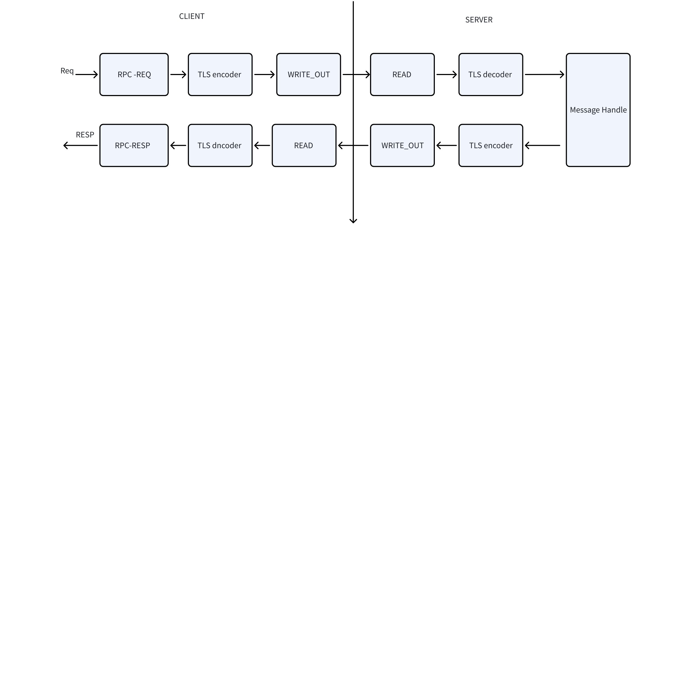

# 传输层 TLS 证书认证 FS

## 1. 背景

  给传输层提供加密通信支持。

## 2. 变更历史

| 日期 | 版本 | 负责人 | 主要修改内容 |
| --- | --- | --- | --- |
| 2025/09/04 | 0.1 | yihaoDeng | 初稿 |
| 2025/09/11 | 0.2 | yihaoDeng | 按评论修改 |

## 3. 定义

1. TLS：Transport Layer Security, 传输层安全协议
2. OpenSSL:  开源的软件库，在其之上可以建立安全通信，避免窃听，同时确认另一端连接者的身份，通过设置参数，我们支持的TLS 版本为1.3  

## 4. 行为说明

### 4.1 新增参数

1. tlsCaPath: ca 证书路径，客户端和服务端都要配置，不可以动态调整
2. tlsSvrCertPath：服务端证书路径，服务端配置，不可动态调整
3. tlsSvrKeyPath：服务端私钥路径， 服务端配置，不可动态调整
4. tlsCliCertPath:  客户端的证书路径，客户端和服务端都需要配置，服务端需要该参数用来进行集群间（包含单节点）通信， 不可动态调整
5. tlsCliKeyPath: 客户端私钥路径，客户端和服务端都需要配置，服务端需要该参数用来进行集群间（包含单节点）通信， 不可动态调整
6. enableTLS，客户端和服务端参数， 是否开启TLS，需要先配置1/2/3/4参数，如果配置错误或者配置不全，则无法启动。 

### 4.2 查看参数

```sql
SHOW VARIABLES LIKE '%tls%';
```

说明： 查看集群中各个节点的 TLS 关文件的具体路径。

### 4.3 行为说明

下面是简化版本的消息流转，实际开发涉及了比较多的状态控制比如：
1. SSL_connect
2. SSL_do_handshake
3. SSL_read
4. SSL_write


### 4.4 约束说明

1. 对于服务端，如果要开启 TLS,  4.1 章节 5 个参数需要全部配置，如果配置不全，则启动失败。 如果 5 个参数都不配置，则以非 TLS 的模式启动。 
2. 对于客户端，如果需要开启 TLS,  4.1 章节 1/4/5 参数需要配置，如果配置不全，则启动失败。如果三个参数都不配置，则以非 TLS 模式启动。   
3. 集群节点需要全部以 TLS 模式启动，或者非 TLS 模式启动，否则集群之间互相访问失败。 
4. 非T LS 模式的客户端访问不了 TLS 的集群，会返回连接失败
5. TLS 模式的客户端访问不了非 TLS 的集群， 会返回连接失败。 
6. 开启 TLS 之后，任何通过网络的数据都会双向鉴权认证，即使只部署一个 taosd, 该 taosd 内部模块之间的访问如果通过 RPC 互相通信，也是需要双向鉴权认证。 

### 4.5 部署说明 

生成客户端和服务端的私钥和证书
```shell {wrap}

## 5. 生成CA私钥和自签名证书

openssl req -newkey rsa:2048 -nodes -keyout ca.key -x509 -days 365 -out ca.crt -subj "/CN=MyCA"

## 6. 生成服务器私钥和证书签名请求(CSR)

openssl genrsa -out server.key 2048
openssl req -new -key server.key -out server.csr -subj "/CN=localhost" # CN通常设为服务器域名或IP

## 7. 用CA证书签发服务器证书

openssl x509 -req -in server.csr -CA ca.crt -CAkey ca.key -CAcreateserial -out server.crt -days 365

## 8. 生成客户端私钥和证书签名请求(CSR)

openssl genrsa -out client.key 2048
openssl req -new -key client.key -out client.csr -subj "/CN=Client"

## 9. 用CA证书签发客户端证书

openssl x509 -req -in client.csr -CA ca.crt -CAkey ca.key -CAcreateserial -out client.crt -days 365
```

上面的方式已经生成了所有需要的证书 ca.key, server.key, server.crt, client.key, client.crt 
在客户端的 taos.cfg 配置 
```shell
tlsCliKeyPath /path/client.key
tlsCliCertPath /path/client.crt
tlsCaPath  /path/ca.crt
enableTLS  1
```

在服务端的 taos.cfg 配置
```shell
tlsCliKeyPath /path/client.key
tlsCliCertPath /path/client.crt
tlsSvrKeyPath /path/server.key
tlsSvrCertPath /path/server.crt
tlsCaPath  /path/ca.crt
enableTLS  1
```

之后，按需启动即可。
**note**: 这里只展示一个最简单的部署方式，具体以实际参数为准。 

## 10. 性能

有一定的影响，整体性能影响下降不到5%，实际约为之前的96%~99%

## 11. 兼容性

 无

## 12. 运维

不支持动态升级

## 13. 使用场景

安全级别要求高的业务

## 14. 可观测性

1. Info 级别的日志，追查是否开启了 TLS， 和 TLS read/write 过程中错误和异常
2. 通过 SQL 查询查看各个节点 TLS 证书的路径。 

## 15. 安装和卸载

无特殊要求

## 16. 安全性

强依赖于 openssl 本身的安全性， 当前使用的 TLS 版本为 1.3 

## 17. 文档

## 18. 参考文档

## 19. 附录

无
