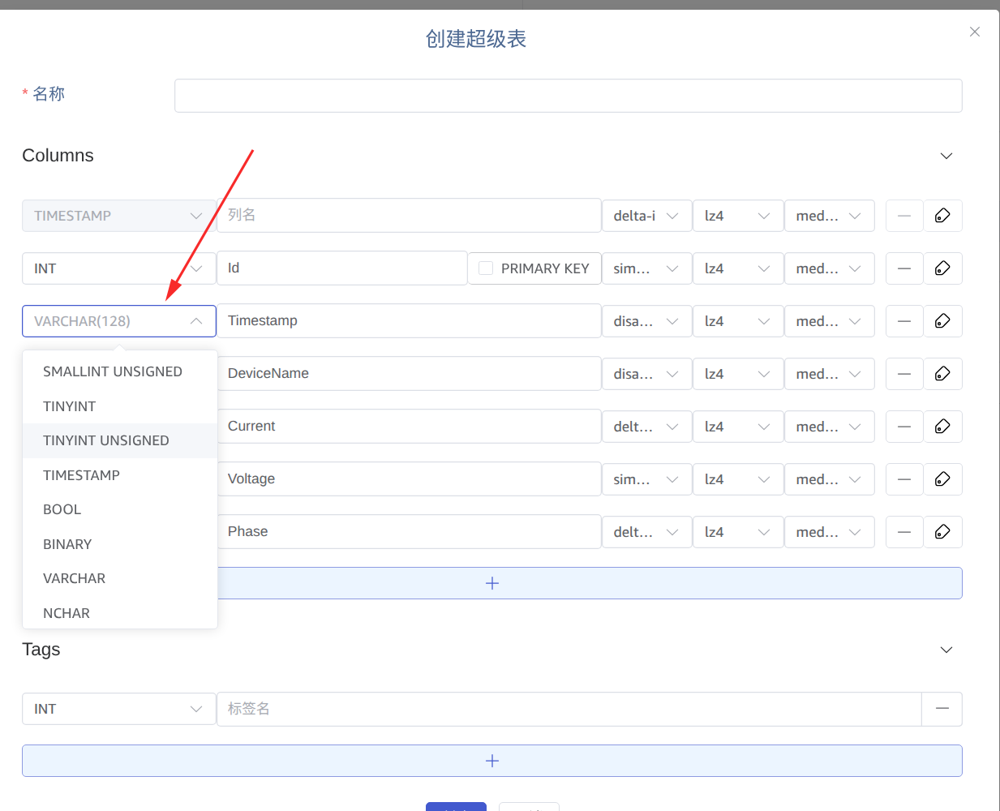
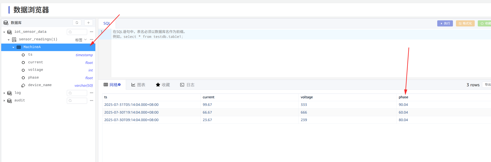

# 支持 blob 数据类型-Functional Spec

## 背景

Mysql, oracle 等数据源有 blob 数据类型，目前 TDengine 已支持 blob 数据源，当前需要将数据源中的 blob 类型，同步到 TDengine 数据库中。
相关jira:
https://jira.taosdata.com:18080/browse/TS-5820

## 变更历史

| 日期 | 版本 | 负责人 | 主要修改内容 |
| --- | --- | --- | --- |
| 2025/08/5 | 0.1 | 张贵川 | 文档撰写 |

## 定义

blob数据类型: 一种数据库的数据类型，一般是长度很大的二进制数据。比如 mysql 的 blob 数据类型一般2G。

## 行为说明

需求涉及页面的任务创建，数据预览部分，任务执行过程中涉及数据源部分的数据类型转换，transform 过程中对数据类型转换部分。
下面模块描述。

### 4.1 任务页面修改

1. 类型支持 blob

1. 展示页面需要支持 blob

### 4.2 运行任务说明

任务运行中的数据类型转换分数据源是否有 blob 数据类型进行修改。有 blob 数据类型的数据源有 mysql 和 oracle，其他数据源比如 mssql 等有 varbinary 数据类型，要转为 td 的 blob 数据类型，需要在 transform 的 mapping 进行映射配置。如果是 kafka, mqtt 等数据源类型，转为 blob 类型需要以数组格式或字符串形式提供数据。
特殊任务比如 tmq-to-td, legacy-to-td 会单独说明。

#### 4.2.1 有 blob 类型数据源

数据类型在内部转换关系：

| 数据源 | 源类型 | 最大长度 | 内部 IPCDataType | Arrow RecordBatch 类型 | 目标库 td 类型 |
| --- | --- | --- | --- | --- | --- |
| mysql | TINYBLOB | BLOB | MEDIUMBLOB | LONGBLOB | 2G | Blob | LargeBinary | blob |
| oracle | BLOB | BFILE | 128T | blob | LargeBinary | blob |

#### 4.2.2 无 blob 类型数据源

无 blob 数据源比较多，比如 mssql，内有 varbinary 类型，最直接的对应即 td 的 varbinary 类型，如果需要转为 blob 数据类型，需要 mapping 配置字段映射支持。

| 数据源 | 源类型 | 最大长度 | 内部 IPCDataType | Arrow RecordBatch 类型 | 目标库 td 类型 |
| --- | --- | --- | --- | --- | --- |
| mssql | varbinary | 4G | VarBinary | Binary | 需要 mapping 配置支持 |

消息队列里的数据比如 kafka，mqtt 等要存储为 blob 类型，也需要 mapping 配置字段映射支持。
InfluxDB, OpenTSDB，mangodb 读取类似，二进制数据类型字段也需要 mapping 配置字段映射支持。

#### 4.2.3 legacy-to-td

这是 td 到 td 的数据同步任务，如果 td 3.3.7.0 版本后，有 blob 数据类型，这里也涉及 blob 数据类型的同步。

#### 4.2.4 tmq-to-td

tmp 到 td 也涉及 blob 数据类型的同步。

#### 4.2.5 tmq-to-local

tmp 侧涉及 blob 数据类型的同步。主要用于数据备份任务。

#### 4.2.6 local-to-td

local，tmp 侧涉及 blob 数据类型的同步。主要用于数据恢复任务。

#### 4.2.7 taos-to-csv

td 侧涉及 blob 数据类型的同步。

#### 4.2.8 taos-to-parquet

td 侧涉及 blob 数据类型的同步。

## 性能

无

## 兼容性

兼容旧的数据同步任务

## 运维

无

## 使用场景

无

## 约束和限制

约束 和 限制 参见 tsdb blob  设计的约束和限制。

## 常见错误和排查

对使用中可能遇到的错误提示以及如何排查故障进行说明。很多小型优化或功能不会有复杂的错误、排查也不困难，可以标无。但对于一些复杂的功能，容易用错、使用中容易出错的，要进行说明。

## 可观测性

无

## 安装和卸载

无

## 文档

无

## 参考文档

## 附录

无
