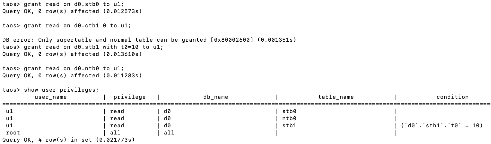
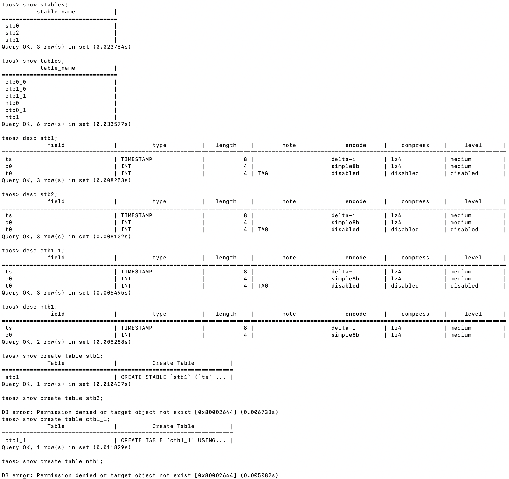
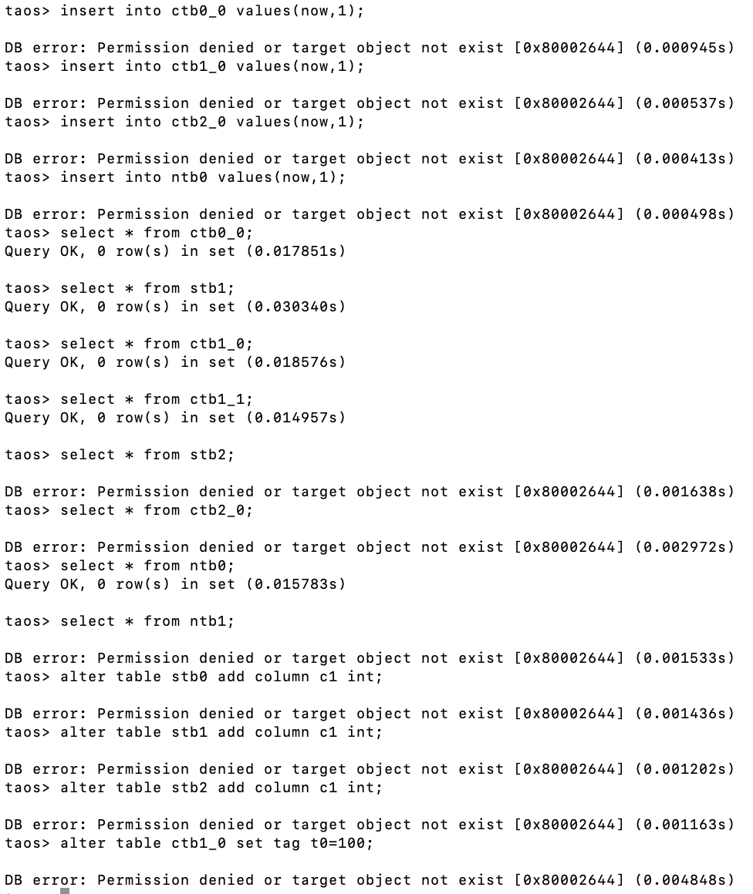

# 用户看不到无权限的超级表 - FS

## 1. 背景

1. [TS-6667](https://jira.taosdata.com:18080/browse/TS-6667) [售前][大庆油田] 用户看不到无权限的超级表
```plaintext {wrap}
【场景】客户想通过权限管理，给不同的作业区用户进行读写和操作权限，以及相应的事件记录
【问题】1.当A用户对超级表a有只读权限，对超级表b没有权限时，依然可以看到b的表信息
1. 当采集某作业区的任务时，只读权限用户依然可以看到所有任务，且可以进行启停操作，audit并没有记录相应行为
【期望】希望explorer的用户权限管理更加完善，解决上述问题。
需求报告：https://taosdata.feishu.cn/wiki/PMEsw6psJi38P2kPzSoc5g0EnMf?fromScene=spaceOverview
```

## 2. 变更历史

| 日期 | 版本 | 负责人 | 主要修改内容 |
| --- | --- | --- | --- |
| 2025/09/19 | 0.1 | 徐开礼 | 初稿 |
|  |  |  |  |

## 3. 定义

- 无

## 4. 行为说明

### 4.1 当前行为

#### 4.1.1 root 用户创建权限示例 SQL

```sql {wrap}
drop database if exists d0;
create database if not exists d0;

use d0;
create table stb0 (ts timestamp, c0 int) tags (t0 int);
create table stb1 (ts timestamp, c0 int) tags (t0 int);
create table stb2 (ts timestamp, c0 int) tags (t0 int);
create table ctb0_0 using stb0 tags(0);
create table ctb0_1 using stb0 tags(1);
create table ctb1_0 using stb1 tags(10);
create table ctb1_1 using stb1 tags(11);
create table ctb2_0 using stb1 tags(20);
create table ntb0 (ts timestamp, c0 int);
create table ntb1 (ts timestamp, c0 int);

create user u1 pass 'taosdata';
grant read on d0.stb0 to u1;
grant read on d0.ctb1_0 to u1; -- error, not allowed
grant read on d0.stb1 with t0=10 to u1;
grant read on d0.ntb0 to u1;
show user privileges;

```



#### 4.1.2 用户 u1 使用权限示例 SQL

```sql {wrap}
show databases;
use d0; 
show stables;
show tables;

desc stb1;
desc stb2;
desc ctb1_1;
desc ntb1;

show create table stb1;
show create table ctb1_1;
show create table stb2;
show create table ntb1;

insert into ctb0_0 values(now,1);
insert into ctb1_0 values(now,1);
insert into ctb2_0 values(now,1);
insert into ntb0 values(now,1);

select * from ctb0_0;
select * from stb1;
select * from ctb1_0;
select * from ctb1_1;
select * from stb2;
select * from ctb2_0;
select * from ntb0;
select * from ntb1;

alter table stb0 add column c1 int;
alter table stb1 add column c1 int;
alter table stb2 add column c1 int;
alter table ctb1_0 set tag t0=100;
```

##### 4.1.2.1 执行结果





### 4.2 期望行为

- 针对无权限的表或超级表，期望行为如下

#### 4.2.1 show stables

`无 DB 读/写 权限`，`无对应超级表的 读/写/修改 权限`, `无需对应超级表下子表的 读/写 权限` 时，输出结果不显示。

#### 4.2.2 show tables

TODO: 待定

#### 4.2.3 desc stbName

报错：`DB error: Permission denied or target object not exist [0x80002644] (0.005082s)`

#### 4.2.4 desc ctbName

报错：`DB error: Permission denied or target object not exist [0x80002644] (0.005082s)`

#### 4.2.5 desc ntbName

报错：`DB error: Permission denied or target object not exist [0x80002644] (0.005082s)`

#### 4.2.6 show  create stbName

报错：`DB error: Permission denied or target object not exist [0x80002644] (0.005082s)`

#### 4.2.7 show  create ctbName

报错：`DB error: Permission denied or target object not exist [0x80002644] (0.005082s)`

#### 4.2.8 show  create ntbName

报错：`DB error: Permission denied or target object not exist [0x80002644] (0.005082s)`

#### 4.2.9 insert/query 权限

当前行为符合预期。
如果用户 u1 无超级表 stb1 的读写权限，拥有子表 ctb1_0 的读写权限，无子表 ctb1_1 的读写权限。但是，仍然可以执行 select * ctb1_1，只是不会返回 ctb1_1 的数据。

## 5. 性能

无

## 6. 兼容性

无

## 7. 运维

无

## 8. 使用场景

无

## 9. 约束和限制

- 仅企业版支持。

## 10. 常见错误和排查

用户操作失败，错误码对照表

| Error code | description | note |
| --- | --- | --- |
|  |  |  |
|  |  |  |

## 11. 可观测性

无

## 12. 安装和卸载

无

## 13. 文档

无

## 14. 参考

- [表级权限 （企业版）](https://taosdata.feishu.cn/wiki/wikcnxR7oyJXJ1sNo27zSVlBoCg)
- [用户权限列表](https://jira.taosdata.com:18090/pages/viewpage.action?pageId=155648259)
- [用户权限设计](https://jira.taosdata.com:18090/pages/viewpage.action?pageId=135103176)
- [需求报告-TX547](https://taosdata.feishu.cn/wiki/PMEsw6psJi38P2kPzSoc5g0EnMf)

## 15. 附录

无
