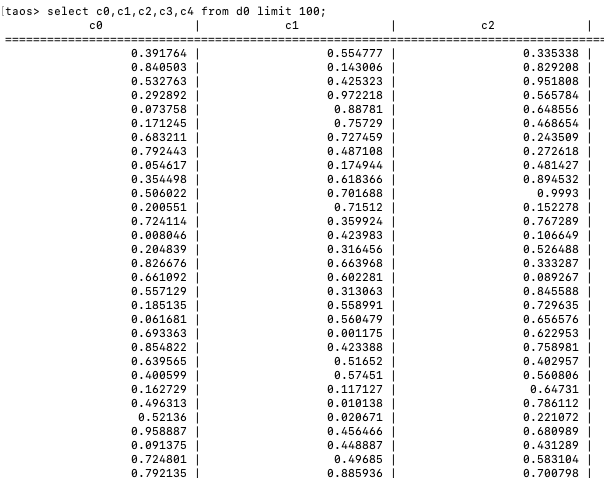
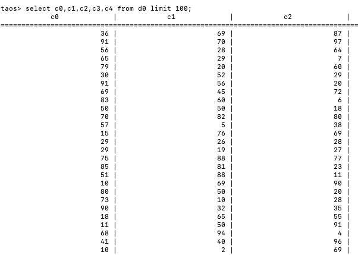
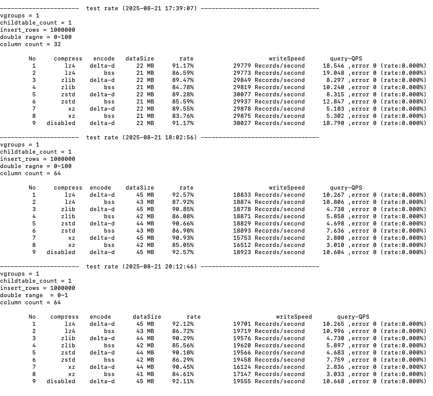
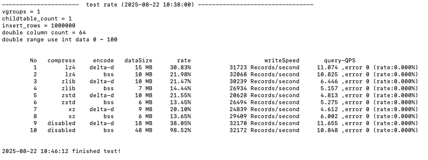

# 浮点数 BSS 编码性能测试

## 1. 测试目的

新增加的浮点数 BSS 编码与原来的 delta-d 编码在不同压缩算法下的压缩率如何

## 2. 测试环境

测试机： 192.168.2.124 （12核 64G 机器）
测试场景：1 个数据库，1 个超级表，1 张子表， 1 个VGROUPS
子表数据量： 100 万条数据
1. 表列数：
   - 32 列 double 
   - 64 列 double
2. Double 数据范围：
   - 0 ~ 100 内随机浮点数，小数位数 6 位
   - 0 ~1 内随机浮点数，小数位数 6 位
   - 0 ~100 内随机整数值，小数为零
数据样例：
1. 0 ~ 1 浮点数：

1. 0 ~ 100 整数

## 3. 测试结果

compress:  二级压缩算法
encoe  :      一级编码算法
rate:            压缩率    
dataSize:   数据库DATA文件大小
writeSpeed: 写入速度
queryQPS:   查询 QPS
数据来源说明： 
1. 压缩率及数据库文件大小由引擎计算，通过 SQL 命令 show table distributed 获取
2. 写入查询数据从 taosBenchmark 抓取

**结论：**
1. bss 比 delta-d 编码整体有 4 ~ 7% 的提升，数据越相近提升越明显
2. bss 编码对应最好的压缩算法是 xz ，0~100 浮点数据集最好 83.76%，0~100 整数数据集最好 13.65%
3. 写入速度 bss 与 delta-d 编码相差不大
4. 查询速度 bss 编码略好一些
5. 32 列 double 和 64 列对上面结论影响不大
