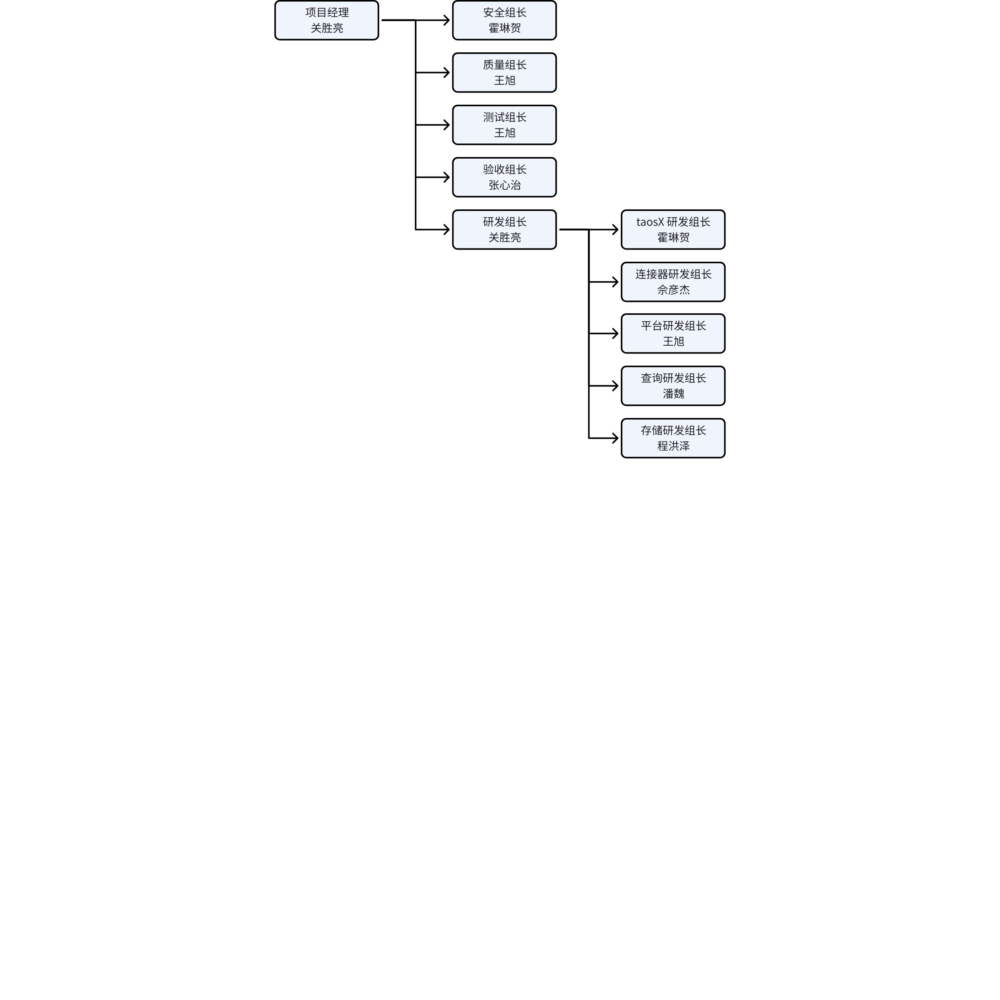

# TSDB v3.4.0 项目计划文档

## 1. 修订记录

| 编写日期 | 发布日期 | 版本 | 修订人 | 主要修改内容 |
| --- | --- | --- | --- | --- |
| 2025-9-20 | - | 1.0 | 关胜亮 | 项目计划、详细的工作范围 |
| 2025-9-24 | 2025-9-24 | 1.1 | 关胜亮 | 补充 “性能衰退” 风险项 |

## 2. 项目目标

本项目聚焦于开发与发布 TDengine 安全版（v3.4.0.0）​​，致力于达成以下核心目标：
1. 产品目标​：通过系统性的安全加固与性能优化，显著提升产品安全水位与运行可靠性。
2. 过程目标​：协同改进研发测试、质量保障与安全流程，建立高效交付高质量产品的能力。
3. 商业目标​：打造符合严苛安全要求的企业级产品，为开拓重点行业市场、提升市场份额提供关键支撑。

## 3. 项目范围

### 3.1 亮点功能

#### 3.1.1 引擎

1. 安全可靠性提升，包括
   - 身份鉴别
   - 访问控制
   - 存储安全
   - 传输安全
   - 安全函数
   - 安全审计
   - 加密算法
   - 编码安全
2. 虚拟表
   - 虚拟表继承机制
   - 虚拟表多个场景的性能提升
3. 流计算
   - 流计算支持按自然月触发
   - 流计算支持子事件
   - 流计算性能提升（与 Flink 对比）
4. TDgpt
   - 支持相关性分析
   - 支持基础模型微调

#### 3.1.2 工具

1. 安全可靠性提升
   - 各组件之间的数据完整性和加密认证
   - 解决明文密码问题
   - OAUTH 2.0 API 客户端认证
   - Explorer OAuth 2.0 (OpenID Connect) 支持（SSO）
   - taosX 分布式高可用
2. taosgen 开源（完成写入 Kafka 支持并完成 SDK 文档，开放写入其他目标端）
3. 新增数据源：
   - KingHistorian
   - Parquet

#### 3.1.3 平台

1. 安可：内网环境安全防护
   - 满足安可的最低要求
2. 缩短 PR 的运行时间至当前的三分之一
3. 云服务告警的治理
   - 将常见的消除告警的操作自动化
4. 各产品安装包的优化
   - 安装、卸载脚本的优化
   - 完善非 root 用户安装和自定义路径安装
   - 减少安装包的构建次数
5. 各产品 Docker 镜像的优化
   - 优化 Dockerfile 以减少镜像大小
   - 统一 base image
   - 多架构的实现由 manifest 迁移至 buildx

### 3.2 中国业务

#### 3.2.1 引擎

| 序号 | 关键字 | 主题 | 报告人 |
| --- | --- | --- | --- |
| 1 | [TS-7346](https://jira.taosdata.com:18080/browse/TS-7346) | [交付][中船九院] 节点时钟异常时，taosd 与 taosc 行为保持一致 | Steven Zhang |
| 2 | [TS-7348](https://jira.taosdata.com:18080/browse/TS-7348) | [售前][卡奥斯] stmt 支持虚拟表查询 | Jack Dong |
| 3 | [TS-7325](https://jira.taosdata.com:18080/browse/TS-7325) | [交付][华润电力] 单条 SQL 的长度上限可配置 | Tyler Liu |
| 4 | [TS-7294](https://jira.taosdata.com:18080/browse/TS-7294) | [售前][恒运昌] stmt2 接口速度在某些场景低于 stmt 接口 | Abraham Liu |
| 5 | [TS-7274](https://jira.taosdata.com:18080/browse/TS-7274?src=confmacro) | 调用订阅服务密码错误返回含义不明确的错误信息“init tscObj failed” | Chris Zhai |
| 6 | [TS-7224](https://jira.taosdata.com:18080/browse/TS-7224) | [售前][南网CEP] show local/dnode variables 增加参数类型的数据列 | Bo Xiao |
| 7 | [TS-7207](https://jira.taosdata.com:18080/browse/TS-7207?src=confmacro) | [售前][工银瑞信] 提高 Interlace 模式下流式计算的性能 | Zach Wang |
| 8 | [TS-7205](https://jira.taosdata.com:18080/browse/TS-7205?src=confmacro) | [售前][陕西中烟] 支持按自然月定时计算 | Abraham Liu |
| 9 | [TS-7204](https://jira.taosdata.com:18080/browse/TS-7204?src=confmacro) | [交付][海澜智云科技有限公司] 社区版在执行企业版专有功能时有报错提醒 | Tyler Liu |
| 10 | [TS-7202](https://jira.taosdata.com:18080/browse/TS-7202?src=confmacro) | [交付][南网储能-拾贝云] 虚拟超级表查询慢 | Weican Chen |
| 11 | [TS-7201](https://jira.taosdata.com:18080/browse/TS-7201?src=confmacro) | [售前][陕西中烟] 分析产生的新属性，可以作为输入继续进行分析 | Abraham Liu |
| 12 | [TS-7198](https://jira.taosdata.com:18080/browse/TS-7198?src=confmacro) | [售前][晶澳太阳能]支持多变量分析 | Abraham Liu |
| 13 | [TS-7150](https://jira.taosdata.com:18080/browse/TS-7150?src=confmacro) | [智共荟]虚拟表查询 last 值耗时长 | Jack Dong |
| 14 | [TS-7089](https://jira.taosdata.com:18080/browse/TS-7089?src=confmacro) | [交付][深开鸿] blob 类型支持 cast、substr 函数 | Weican Chen |
| 15 | [TS-7088](https://jira.taosdata.com:18080/browse/TS-7088?src=confmacro) | Display complete result of "show create database" | Abraham Liu |
| 16 | [TS-6919](https://jira.taosdata.com:18080/browse/TS-6919?src=confmacro) | [公共] show connections时，增加显示连接器/客户端的版本号字段 | Steven Zhang |
| 17 | [TS-6865](https://jira.taosdata.com:18080/browse/TS-6865?src=confmacro) | [交付][中国电建华东勘测] 支持登录失败策略 | Tyler Liu |
| 18 | [TS-6864](https://jira.taosdata.com:18080/browse/TS-6864?src=confmacro) | [交付][东方电子] 支持配置多个监控目标地址 | Weican Chen |
| 19 | [TS-6863](https://jira.taosdata.com:18080/browse/TS-6863?src=confmacro) | [售前][中国气象局] 支持在审计日志中记录查询、删除等操作 | Zach Wang |
| 20 | [TS-6668](https://jira.taosdata.com:18080/browse/TS-6668?src=confmacro) | [交付][三峡云化集控] show queries 显示执行进度 | Yanqiong Dong |
| 21 | [TS-6666](https://jira.taosdata.com:18080/browse/TS-6666?src=confmacro) | [交付][东航私有云] 独立的授权服务 | Edward Cheng |
| 22 | [TS-6665](https://jira.taosdata.com:18080/browse/TS-6665?src=confmacro) | [售前][赛力斯] 虚拟表列数量上限调整为 65535 | Abraham Liu |
| 23 | [TS-6562](https://jira.taosdata.com:18080/browse/TS-6562?src=confmacro) | [售前] 修改标签值后订阅及时生效 | Bo Xiao |
| 24 | [TS-6487](https://jira.taosdata.com:18080/browse/TS-6487?src=confmacro) | [售前][东方电子CEP] 变化持续时长函数 | Bo Xiao |
| 25 | [TS-6486](https://jira.taosdata.com:18080/browse/TS-6486?src=confmacro) | [售前][东方电子CEP] 位变化次数函数 | Bo Xiao |
| 26 | [TS-6485](https://jira.taosdata.com:18080/browse/TS-6485?src=confmacro) | [售前][东方电子CEP] 值变化次数函数 | Bo Xiao |
| 27 | [TS-6481](https://jira.taosdata.com:18080/browse/TS-6481?src=confmacro) | [交付][中石油加油站项目] 按等保要求修改密码安全策略 | Ze Lv |
| 28 | [TS-6429](https://jira.taosdata.com:18080/browse/TS-6429?src=confmacro) | [交付] 禁止删除正在被订阅使用的子表的对应的超级表 | Chris Zhai |
| 29 | [TS-6412](https://jira.taosdata.com:18080/browse/TS-6412?src=confmacro) | [交付] 通过系统表 information_schema.ins_tables 统计子表数量性能差 | Chris Zhai |
| 30 | [TS-6379](https://jira.taosdata.com:18080/browse/TS-6379?src=confmacro) | [交付][中石化] 修改表结构相关信息无需重建 topic | Ze Lv |
| 31 | [TS-6263](https://jira.taosdata.com:18080/browse/TS-6263?src=confmacro) | [交付][中国电建集团华东勘测设计研究院] 副本变更不影响数据订阅 | Tyler Liu |
| 32 | [TS-6252](https://jira.taosdata.com:18080/browse/TS-6252?src=confmacro) | [交付] Last 查询性能与 numOfVnodeQueryThreads 数量负相关 | Yanqiong Dong |
| 33 | [TS-6194](https://jira.taosdata.com:18080/browse/TS-6194?src=confmacro) | [交付][三峡新能源] fill prev 支持填充前一个非 null 值 | Yanqiong Dong |
| 34 | [TS-6146](https://jira.taosdata.com:18080/browse/TS-6146?src=confmacro) | [交付][电建华东院] 结果集带标签列时 last_row 查询性能优化 | Tyler Liu |
| 35 | [TS-5982](https://jira.taosdata.com:18080/browse/TS-5982?src=confmacro) | [售前] 执行计划无法显示索引 | Yu Chen |
| 36 | [TS-5925](https://jira.taosdata.com:18080/browse/TS-5925?src=confmacro) | [售前][宁德新能源] 并发查询较多时写入受到影响 | Edward Cheng |
| 37 | [TS-5877](https://jira.taosdata.com:18080/browse/TS-5877?src=confmacro) | [社区][明阳集团] 优化 select tag,last_row(xxx) 的查询性能 | Yu Chen |
| 38 | [TS-4996](https://jira.taosdata.com:18080/browse/TS-4996?src=confmacro) | [交付] Audit 库可以记录客户端 IP | Hui Li |

#### 3.2.2 工具

| 序号 | 关键字 | 主题 | 报告人 |
| --- | --- | --- | --- |
| 1 | [TS-7350](https://jira.taosdata.com:18080/browse/TS-7350) | [玉溪卷烟厂] explore面板中的监控界面优化 | Steven Zhang |
| 2 | [TS-7351](https://jira.taosdata.com:18080/browse/TS-7351) | [蒙西电网] taosExplorer 页面绘制曲线支持 decimal 数据类型 | Tyler Liu |
| 3 | [TS-7083](https://jira.taosdata.com:18080/browse/TS-7083) | taosX DataIn MQTT任务配置时支持多个broker | Bo Xiao |
| 4 | [TS-7052](https://jira.taosdata.com:18080/browse/TS-7052) | taosX MQTT datain增加可配置参数 sub-offset | Bo Xiao |
| 5 | [TS-6962](https://jira.taosdata.com:18080/browse/TS-6962) | [公共] taosx支持进行数据transformer的导入及导出 | Steven Zhang |
| 6 | [TS-6893](https://jira.taosdata.com:18080/browse/TS-6893) | [公共] taosX支持导入Parquet格式 | Bo Xiao |
| 7 | [TS-6892](https://jira.taosdata.com:18080/browse/TS-6892) | [亿纬锂能] JSON 数据解析能力提升--嵌套数据 | Aaron Chen |
| 8 | [TS-6856](https://jira.taosdata.com:18080/browse/TS-6856) | taosAdapter支持websocket统一连接管理、鉴权管理 | Bo Xiao |
| 9 | [TS-6723](https://jira.taosdata.com:18080/browse/TS-6723) | [积成电子][共性需求] 连接器兼容性功能增强 | Steven Zhang |
| 10 | [TS-6722](https://jira.taosdata.com:18080/browse/TS-6722) | [大庆油田、华北油田] 测试OPCDA-OPCAgent方式采集性能边界测试 | Jack Dong |
| 12 | [TS-6713](https://jira.taosdata.com:18080/browse/TS-6713) | [积成电子]未配置 ssl 时出现明文密码传输，应改进 | Tyler Liu |
| 12 | [TS-6706](https://jira.taosdata.com:18080/browse/TS-6706) | [公共] show connections时，增加显示连接器/客户端的版本号字段 | Steven Zhang |
| 13 | [TS-6455](https://jira.taosdata.com:18080/browse/TS-6455) | [内部] JDBC 绑定参数优化 | Haibin Hu |
| 14 | [TS-6299](https://jira.taosdata.com:18080/browse/TS-6299) | [沃太能源] taosX能够保证高可用，避免任务中断。 | Hui Li |
| 15 | [TS-5973](https://jira.taosdata.com:18080/browse/TS-5973) | [河北电力二期]taosx 支持通过transform写入到不同的超级表中 | Kian Wang |
| 16 | [TS-5786](https://jira.taosdata.com:18080/browse/TS-5786) | [公共需求] 工具组 - 维护系统参数版本号及默认值清单 | Hui Li |
| 17 | [TS-5724](https://jira.taosdata.com:18080/browse/TS-5724) | [宁夏天地奔牛] TDengine产品的一些安全策略不达标 | Hui Li |
| 18 | [TS-5721](https://jira.taosdata.com:18080/browse/TS-5721) | [深圳疆海] TD到TD订阅同步，需要支持Transform配置 | Linhe Huo |
| 19 | [TS-7379](https://jira.taosdata.com:18080/browse/TS-7379) | [神东集团] KingHistorian数据迁移 | Jack Dong |

#### 3.2.3 平台

无

### 3.3 海外业务

#### 3.3.1 引擎

无

#### 3.3.2 工具

| 序号 | 关键字 | 主题 | 报告人 |
| --- | --- | --- | --- |
| 1 | [TS-6852](https://jira.taosdata.com:18080/browse/TS-6852) | Better support for SQLAlchemy | Arun Arulraj |

#### 3.3.3 平台

无

### 3.4 产品规划

#### 3.4.1 引擎

| 序号 | 关键字 | 主题 | 报告人 |
| --- | --- | --- | --- |
| 1 | [TS-7276](https://jira.taosdata.com:18080/browse/TS-7276?src=confmacro) | 事件窗口支持子事件窗口 | Simon Guan |
| 2 | [TS-7270](https://jira.taosdata.com:18080/browse/TS-7270?src=confmacro) | [产品] 国密算法及 UKey 加密 | Simon Guan |
| 3 | [TS-7241](https://jira.taosdata.com:18080/browse/TS-7241) | [产品] 流计算性能测试报告（与 Flink 对比） | Jeff Tao |
| 4 | [TS-7239](https://jira.taosdata.com:18080/browse/TS-7239?src=confmacro) | [产品] 联合查询设计文档（通过 Qnode 访问其他数据源） | Simon Guan |
| 5 | [TS-7236](https://jira.taosdata.com:18080/browse/TS-7236?src=confmacro) | [产品] 安可：编码安全 | Simon Guan |
| 6 | [TS-7235](https://jira.taosdata.com:18080/browse/TS-7235?src=confmacro) | [产品] 安可：安全函数 | Simon Guan |
| 7 | [TS-7234](https://jira.taosdata.com:18080/browse/TS-7234?src=confmacro) | [产品] 安可：入侵防范 | Simon Guan |
| 8 | [TS-7233](https://jira.taosdata.com:18080/browse/TS-7233?src=confmacro) | [产品] 安可：安全审计 | Simon Guan |
| 9 | [TS-7232](https://jira.taosdata.com:18080/browse/TS-7232?src=confmacro) | [产品] 安可：访问控制 | Simon Guan |
| 10 | [TS-7231](https://jira.taosdata.com:18080/browse/TS-7231?src=confmacro) | [产品] 安可：身份鉴别 | Simon Guan |
| 11 | [TS-7230](https://jira.taosdata.com:18080/browse/TS-7230?src=confmacro) | [产品] 安可：存储安全 | Simon Guan |
| 12 | [TS-7229](https://jira.taosdata.com:18080/browse/TS-7229?src=confmacro) | [产品] 安可：传输安全 | Simon Guan |
| 12 | [TS-7134](https://jira.taosdata.com:18080/browse/TS-7134?src=confmacro) | [产品] 虚拟表继承 | Jeff Tao |
| 13 | [TS-7132](https://jira.taosdata.com:18080/browse/TS-7132?src=confmacro) | [产品] 虚拟表窗口计算性能优化 | Jeff Tao |
| 14 | [TS-6102](https://jira.taosdata.com:18080/browse/TS-6102?src=confmacro) | [产品] 窗口查询不需强制使用聚合函数 | Xinsheng Ren |
| 15 | [TS-5960](https://jira.taosdata.com:18080/browse/TS-5960?src=confmacro) | [产品] 支持输出最外侧两个窗口的实际起止时间 | Jeff Tao |
| 16 | [TD-37767](https://jira.taosdata.com:18080/browse/TD-37767) | [产品] TDgpt 支持时序数据相关性分析 | Jeff Tao |
| 17 | [TD-35163](https://jira.taosdata.com:18080/browse/TD-35163?src=confmacro) | [产品] TDgpt 支持时序基础模型的微调功能 | Jeff Tao |
| 18 | [TD-34288](https://jira.taosdata.com:18080/browse/TD-34288?src=confmacro) | [产品] TDgpt 支持优化训练自有的时序基础模型 | Haojun Liao |
| 19 | [TD-34289](https://jira.taosdata.com:18080/browse/TD-34289?src=confmacro) | [产品] TDgpt 支持时序数据分类模型 | Haojun Liao |
| 20 | [TD-37993](https://jira.taosdata.com:18080/browse/TD-37993) | event 窗口支持多个start condition | Jeff Tao |

#### 3.4.2 工具

| 序号 | 关键字 | 主题 | 报告人 |
| --- | --- | --- | --- |
| 1 | [TS-7257](https://jira.taosdata.com:18080/browse/TS-7257) | [产品] taosX 性能测试报告写入到 TDengine | Linhe Huo |
| 2 | [TS-7059](https://jira.taosdata.com:18080/browse/TS-7059) | [产品] taosX: 写入方式优化 | Linhe Huo |
| 3 | [TS-6188](https://jira.taosdata.com:18080/browse/TS-6188) | [产品] libtaos websocket 连接 CI 测试 | Linhe Huo |
| 4 | [TS-6143](https://jira.taosdata.com:18080/browse/TS-6143) | nodejs 连接器性能压测工具开发 | Yanjie She |
| 5 | [TS-6141](https://jira.taosdata.com:18080/browse/TS-6141) | [产品] python 连接器性能压测工具开发 | Yanjie She |
| 6 | [TS-6140](https://jira.taosdata.com:18080/browse/TS-6140) | C# 连接器性能压测工具开发 | Yanjie She |
| 7 | [TS-6020](https://jira.taosdata.com:18080/browse/TS-6020) | [产品] 支持HTTP Post 的数据处理，数据格式是JSON | Jeff Tao |
| 8 | [TS-5665](https://jira.taosdata.com:18080/browse/TS-5665) | [产品] 客户端兼容性：taosAdapter 高可用 | Linhe Huo |
| 9 | [TS-5183](https://jira.taosdata.com:18080/browse/TS-5183) | [产品] taosBenchmark 支持导入 CSV 文件 | Simon Guan |
| 10 | [TS-4922](https://jira.taosdata.com:18080/browse/TS-4922) | [产品] 支持 OAuth 2.0 | Simon Guan |
| 11 | [TS-7354](https://jira.taosdata.com:18080/browse/TS-7354) | [产品] Explorer: 支持 OpenID Connect 第三方认证登录 | Simon Guan |
| 12 | [TS-7353](https://jira.taosdata.com:18080/browse/TS-7353) | [产品] taosgen: 支持发布到 Kafka | Linhe Huo |

#### 3.4.3 平台

| 序号 | 关键字 | 主题 | 报告人 |
| --- | --- | --- | --- |
| 1 | [TD-38115](https://jira.taosdata.com:18080/browse/TD-38115) | 安可：内网环境安全防护 | Xu Wang |
| 2 | [TD-38119](https://jira.taosdata.com:18080/browse/TD-38119) | 内网服务器资源动态释放 | Xu Wang |
| 3 | [TD-38068](https://jira.taosdata.com:18080/browse/TD-38068) | 云服务告警治理 | Xu Wang |
| 4 | [TD-38116](https://jira.taosdata.com:18080/browse/TD-38116) | 各产品安装包的统一优化 | Xu Wang |
| 5 | [TD-38117](https://jira.taosdata.com:18080/browse/TD-38117) | 各产品镜像的统一优化 | Xu Wang |
| 6 | [TD-37675](https://jira.taosdata.com:18080/browse/TD-37675) | TSDB 安装包新增 taosgen | Xu Wang |

## 4. 项目计划

### 4.1 项目组织结构

### 4.2 项目管理策略

1. 计划管理：在每个里程碑后，根据情况，重新调整项目进度计划
2. 监控策略：通过周报查看组员工作进行情况和完成情况
3. 沟通及汇报策略：每个里程碑结束，提交月度总结
4. 决策机制：由项目经理和 “[技术评审与决策委员会](https://taosdata.feishu.cn/wiki/ARNCwJazTi9qRfkqHWAcbUfKnMh)” 共同完成，涉及重大变更的，撰写决策报告
5. 问题管理：发现的问题报告到任务管理工具（当前为 JIRA），跟踪纠正至关闭
6. 变更控制：按照 “[项目变更规则](https://taosdata.feishu.cn/wiki/JcOZwqhO3iE3qIkGTrVccER8nIf)” 进行

### 4.3 项目生命周期模型

### 4.4 项目进度计划

项目总工期为 4个月，自 2025-10-01 至 2026-01-31。项目进度计划遵循经典的 “设计-开发-测试” 瀑布模型，但各子功能的开发可以敏捷迭代，确保在紧凑的工期内高效交付。
1. 需求与设计阶段：2025-10-01 ~ 2025-11-01，完成需求分析和功能设计。
2. 开发及功能测试阶段：2025-12-16 ~ 2025-12-31 ，完成代码开发和功能测试，发布可测试的软件版本。
3. 系统测试与验收阶段：2026-01-01 ~ 2026-01-31，完成系统测试和缺陷修复，完成软件版本的验收。
4. 项目总结阶段：2026-01-25 ~ 2026-01-31，项目成果评审、文档归档、经验总结与复盘。
过程改进的安排，参照 “[研发文档编制计划](https://taosdata.feishu.cn/wiki/GSYywFkYxisymGkUJMaceGRqnqb)”，主要节点如下
1. 第一阶段：2025-09-25 至 2025-09-30 必要文档编制。
2. 第二阶段：2025-10-01 至 2025-10-24 全部初稿编写。
3. 第三阶段：2025-10-24 至 2025-10-31 审核与修改。
4. 第四阶段：2025-11-01 至 2025-11-06 流程宣贯。

### 4.5 风险管理计划

风险的状态跟踪，及新增风险，将在 “[项目进度跟踪表](https://taosdata.feishu.cn/wiki/Sik1wS9EBiQ48hkaot1cfRU8nNc)” 中描述。截止项目计划时，已经识别的风险如下
1. 将参考 CMMI 三级框架，系统化地推进研发体系建设和过程改进，公司内部的关胜亮、陈肃有这方面的经验。
2. 为有效推进安全功能开发与安全体系建设，根据进展情况考虑引入外部专业咨询机构。
3. 本项目开发的安全功能，可能引入性能衰退风险​。

### 4.6 配置管理计划

本项目的配置项管理方法参照 “[配制管理制度](https://taosdata.feishu.cn/wiki/Cq7AwqC99iVRgOkjT3gcZnFzn7d)”，其中需要特别说明的由
1. 新增保护分支 4.0，作为代码开发主分支，在此分支上构建 CI 流程，此工作需要 2025-11-01 之前完成。
2. 本项目周期可能涉及到企业版代码存放位置及仓库访问权限的变更，此工作需要 2025-11-01 之前完成。

### 4.7 质量保证计划

本项目的质量保证方法参照 “[质量保证制度](https://taosdata.feishu.cn/wiki/Jiw3wmLZAi3DUZkM5nEcfkpGnNg)”，不需要进行额外说明。

### 4.8 项目干系人参与计划

研发中心之外其他部门的主要参与人如下，在评审节点时参与。

| 姓名 | 部门 | 主要职责 |
| --- | --- | --- |
| 陈肃 | 解决方案中心 | 需求澄清与技术评审 |
| 肖波 | 专家中心 | 需求澄清与技术评审 |
| 张心治 | 交付中心 | 需求澄清与技术评审，产品验收 |
| 李珲 | 交付中心 | 需求澄清与技术评审，产品验收 |
| 李广 | 销售一组 | 项目范围变更评审 |
| 侯江燚 | 销售二组 | 项目范围变更评审 |
| 于小铁 | 销售三组 | 项目范围变更评审 |
| 王寅 | 中国业务部 | 项目范围变更评审 |

### 4.9 采购计划

项目预计采购 3-5 个 UKEY，用于完成 UKey 加密功能。在研发任务 “[TS-7270](https://jira.taosdata.com:18080/browse/TS-7270?src=confmacro) 国密算法及 UKey 加密” 的需求评审完成后，由负责的开发人员发起采购申请。

### 4.10 项目度量计划

在每个自然月的第三个周四，对项目进行度量，参照 “[度量指标规范](https://taosdata.feishu.cn/wiki/L50dwsyiciOW8TkkbFZcZEpnn9e)”。其中最为关注的指标有：
1. 缺陷关闭周期
2. 各类缺陷数目
3. 需求增加率

### 4.11 评审及决策计划

1. 项目立项评审：在项目立项时完成，参与者 “项目立项委员会”。
2. 项目计划评审：在项目计划时完成，参与者 “项目立项委员会”。
3. 项目进度评审：在每个自然月的第三个周五，召开项目进度讨论会，汇报当前项目进度，并讨论可能的范围变更，参与者 “项目立项委员会”。
4. 研发文档评审：按照 “[研发任务管理制度](https://taosdata.feishu.cn/wiki/Ap8iwYFY8iOcMgkrHAacHxEXnmO)”，对标记需要编写需求、设计、测试等文档的任务，当文档编写完成后组织评审，包括需求评审、设计评审、测试评审。由各个功能的开发人员组织， “需求评审委员会”、“设计评审委员会”、“测试评审委员会” 参与。
5. 质量评审：按照 “[质量保证制度](https://taosdata.feishu.cn/wiki/Jiw3wmLZAi3DUZkM5nEcfkpGnNg)” 进行。
6. 安全评审：按照 “[安全开发管理制度](https://taosdata.feishu.cn/wiki/Pjw6wknqQiFCPTksFUvcHI21nFf)” 进行。
7. 系统测试评审：在系统测试开始前和结束时，分别进行测试计划、测试报告的评审，参与者 “测试评审委员会”、“投产发布委员会”。
8. 项目结项评审：项目结束后，汇总所有资料进行总结，参与者 “项目立项委员会”。

### 4.12 培训计划

本项目的人员知识技能培训参照 “[培训制度](https://taosdata.feishu.cn/wiki/Fc46wcr8Di3YO8kvfcOcu2iEnFg)”。对应的产品版本进入测试阶段后，还需要进行如下培训，培训对象包括售前部门、交付部门、研发部门的所有员工。计划如下：
1. 2026-01-01 ~ 2025-01-10：
   - 制作培训材料，以在线 PPT 方式呈现。
   - 组织线下会议培训，不在公司的员工可以线上参与。
2. 2026-01-11 ~ 2025-01-15：制作考试题目，并为考试题目编写参考答案。
3. 2026-01-16 ~ 2025-01-20：组织考试并进行评分，考试不通过的要继续参加考试，直到通过为止。

### 4.13 办公网络及项目工作环境

本项目的办公网络及项目工作环境参照 “[开发环境制度](https://taosdata.feishu.cn/wiki/Ci4Aw6TnRiCAXqkg36GcMurQnPc)”，不需要进行额外说明。
