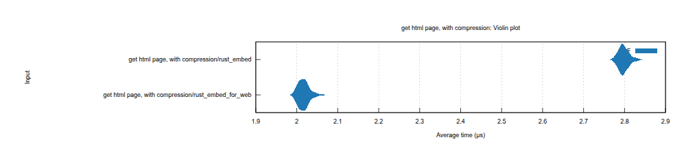

# Explorer OAuth 2.0 单点登录 - 新技术引入评估表

## 1. 修订记录

| 编写日期 | 发布日期 | 版本 | 修订人 | 主要修改内容 |
| --- | --- | --- | --- | --- |
| 2025-12-10 | 2025-12-10 | 1.0 | 霍琳贺 | Explorer OAuth 2.0 组件变更 |

## 2. 基础信息

| 技术名称 | OAuth 2.0 单点登录第三方库 |
| --- | --- |
| 技术类型 | 库/测试工具 |
| 提案部门 | 工具部 / taosX 开发组 |
| 申请人 | 霍琳贺 |
| 计划应用的组件/产品/场景 | 1. OIDC SSO 1. openidconnect：成熟的 OIDC 客户端库 1. url：用于 OIDC URL 处理 1. Session 管理： 1. actix-session：Cookie Session 管理 1. Uuid: Session ID 生成 1. 加密组件： 1. sha2 1. base64 1. aes-gcm 1. SPA 服务组件： 1. 替换 rust-embed 为性能更好和更易维护的 actix-web-rust-embed-responder + rust-embed-for-web ； 1. 测试工具：添加 vite 测试工具组件 1. `@vitest/browser` 1. `happy-dom` |

## 3. 引入理由

1. 业务/技术价值：新功能需求。
2. 与现有技术方案对比优势：
   - Openidconnect 相对其他库如 oauth2 等的优势
      - **专为 OpenID Connect 设计**
      - `openidconnect` 是专门为 OIDC 协议设计的高级封装
      - 提供了完整的 OIDC 功能，而 `oauth2` 只是通用的 OAuth 2.0 实现
      - **自动处理 OIDC Discovery**
      - 自动从 `/.well-known/openid-configuration` 获取所有端点配置
      - 无需手动配置 authorization_endpoint, token_endpoint, jwks_uri 等
      - **内置完整的 JWT 验证**
      验证内容包括：
      - JWT 签名验证（使用 JWKS）
      - Issuer (iss) 验证
      - Audience (aud) 验证
      - Nonce 验证（防止重放攻击）
      - Expiration (exp) 验证
      - Issued At (iat) 验证
      - **自动 JWKS 处理**
      - 自动从 JWKS URI 获取公钥
      - 自动缓存和更新密钥
      - 支持密钥轮换
      - 无需手动管理 JWT 验证密钥
      - **类型安全**
      - 强类型的 Claims 结构
      - 编译时类型检查
      - 减少运行时错误
      - **标准兼容**
      - 完全符合 OpenID Connect Core 1.0 规范
      - 通过了 OpenID Foundation 的兼容性测试
   - 替换 rust-embed，新组件性能更好
      - 性能测试报告见：https://seriousbug.github.io/actix-web-rust-embed-responder/reports/
    

1. 初步选型调研结论：新技术引入前置评估比较充分，需求合理，符合安全规范。

## 4. 技术评估自评

1. 技术/社区健康度自评分：5/5/10/10=30
2. 安全特性自评分：10/10/10=30
3. 合规性自评评分：均为 Apache2.0/MIT 协议 = 15
4. 集成成本评分：10

## 5. 安全团队评估意见

1. 安全评估得分：85
2. 主要风险点：
3. 建议（批准/附带条件批准/否决）：批准

## 6. 审批意见

1. 技术总监审批：批准
2. 安全负责人审批：批准
