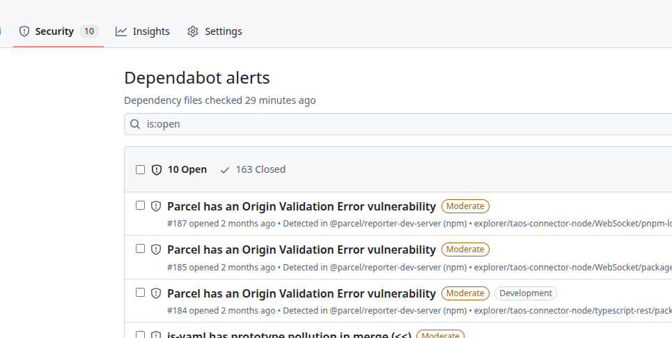

# Platform: GitHub Dependabot Alert 自动同步飞书任务

## 1. 修订记录

| 编写日期 | 发布日期 | 版本 | 修订人 | 主要修改内容 |
| --- | --- | --- | --- | --- |
| 2025-12-04 |  | 1.0 | 霍琳贺 | 初稿 |

## 2. 引言

### 2.1 术语与缩写名词

1. GitHub Dependabot Alerts: GitHub 提供的一项安全功能，用于自动检测代码仓库中依赖项（如 npm, Maven, pip 包）的已知安全漏洞，并向用户发出警报。
  

1. Webhook: 一种允许一个应用程序向另一个应用程序提供实时信息的 API 概念。当特定事件发生时，源应用程序（如 GitHub）会向配置的 URL（本服务）发送 HTTP 请求。
2. Dependabot Alert Event：
   - 漏洞状态：Dependabot Alert 的生命周期状态，主要包括：`open`（待处理）、`fixed`（已修复）、`dismissed`（已忽略）。
   - 漏洞级别：Dependabot 对漏洞的风险评级，主要包括：`critical`（严重）、`high`（高危）、`medium`（中危）、`low`（低危）。

### 2.2 相关文档资料

1. GitHub Dependabot：https://docs.github.com/en/code-security/getting-started/dependabot-quickstart-guide
2. GitHub Webhook Events for Dependabot Alert：https://docs.github.com/en/webhooks/webhook-events-and-payloads#dependabot_alert

### 2.3 优先级要求

中等。

### 2.4 版本要求

无。

## 3. 需求目标

1. 开发一个自动化处理流程或程序，接收 GitHub Dependabot Alert 的创建事件，自动创建飞书项目 Defect 任务，标注：
  - 类型：漏洞
  - 来源：GitHub Dependabot
  - 级别：漏洞风险评级
  - 初始 Owner：@霍琳贺
1. 流程优化：接收到关闭事件时，可以自动关闭飞书项目 Issue。

## 4. 功能需求

| 序号 | **功能类别** | **功能名称** | 功能描述 |
| --- | --- | --- | --- |
| 1 | 安全开发流程 | Dependabot 告警自动化 | 1. 告警自动同步到飞书项目漏洞类型任务 |
|  |  |  |  |
|  |  |  |  |
|  |  |  |  |
|  |  |  |  |

## 5. 性能需求

无。

## 6. 安全需求

1. 需要防止泄漏飞书相关认证信息。

## 7. 其他需求

1. 运维需求：托管此任务并长期运行、维护。
