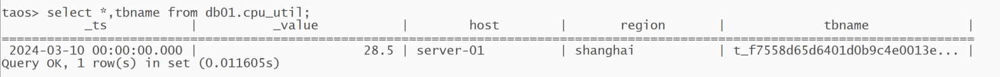
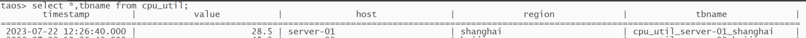
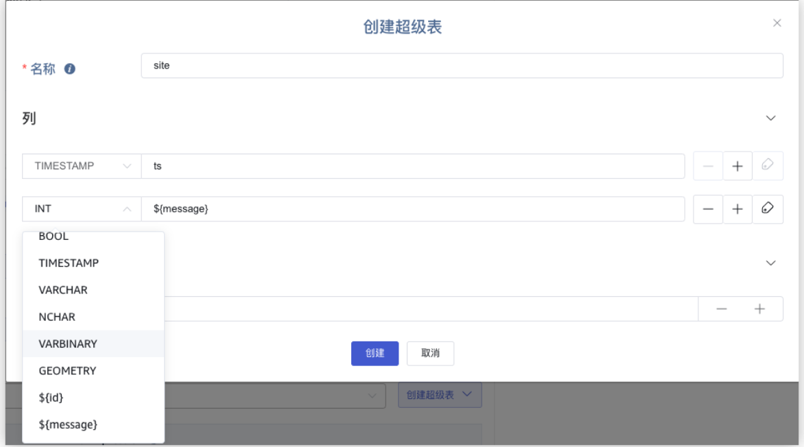
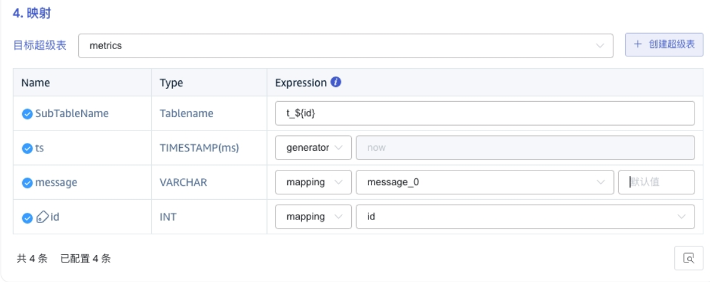

# TX-771 OpenTSDB导入功能需求文档

## 1. 引言

### 1.1 术语与缩写名词

- 无。

### 1.2 相关文档资料

无

### 1.3 优先级要求

无

### 1.4 版本要求

建议在3.3.6.x版本支持，并兼容之前低版本

## 2. 变更历史

| 日期 | 版本 | 负责人 | 主要修改内容 |
| --- | --- | --- | --- |
| 2025/10/14 | 0.1 | 董延琼 | 完成初稿 |

## 3. 需求目标

OpenTSDB 数据导入支持高度定制化，并可与 Schemaless 写入方式兼容。导入性能满足生产需要。

### 3.1 需求提出背景

长江生态环保集团/三峡环境科技-长峡数能-杰控-物联网平台项目中，客户当前使用 OpenTSDB，希望能够平滑迁移到 TDengine。项目实施涉及到实时数据的双写和历史数据迁移。
目前 taosX 的 OpentTSDB 数据导入功能，默认列名为 `timestamp `和 `value`，子表名生成规则为：超级表名+所有标签。这种方式有以下缺点：
- `timestamp `和 `value` 均为 TDengine 关键字，不符合数据建模规范；
- 当标签较多时，子表名容易超过长度限制；
- 数据建模规范中，通常使用“前缀”+唯一标识来创建子表名，使用所有标签不利于子表的查询和管理。

TDengine 兼容 OpenTSDB 的写入协议，使用同样的写入语句时，Schemaless 生成的表如下：

从 OpenTSDB 迁移到 TDengine 结果如下：

两者字段名和子表名均不相同。

## 4. 功能需求

为实现数据导入的可用性和数据写入的兼容性，建议 OpenTSDB 数据导入支持如下功能：

### 4.1 超级表名称和子表名称可定制

与 MQTT 和 Kafka 导入功能类似，客户可以手动指定超级表名称，和子表名的命名规则。

### 4.2 字段名和标签名可定制

与 MQTT 和 Kafka 导入功能类似，客户可以手动进行字段名和标签名的映射。

### 4.3 支持数据类型的转换

用户可指定进行INT, DOUBLE, FLOAT 数值类型转换。

### 4.4 兼容 Schemaless 写入规则

提供选项，可以按照 Schemaless 规则写入数据，保证客户不修改代码的前提下，实现历史数据和实时数据的兼容。

## 5. 性能需求

暂无。
1. 迁移速度应达到 10000 records/s.

## 6. 其他需求

无。
1. 数据导入行为可观测。
