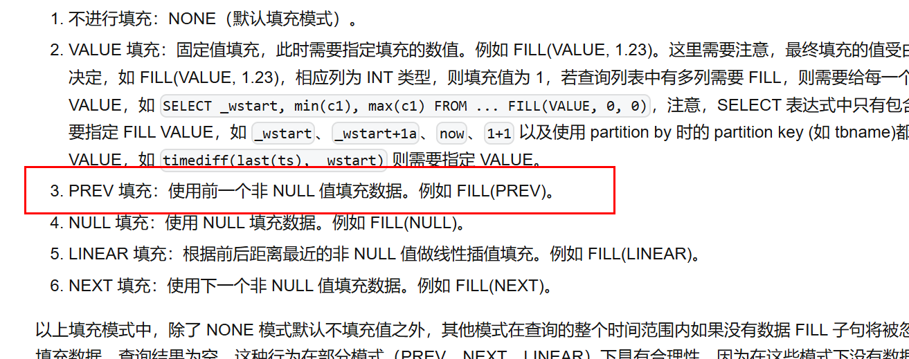

# 需求报告：fill(prev)行为调整

## 1. 需求描述

之前(2025-3-17)，公式官网关于fill(prev)行为的描述是：

**客户期望，需按照当时的文档描述，修正产品行为：fill(prev)填充时，使用前一个非NULL值填充数据。**
<callout emoji="first_place_medal" background-color="light-orange" border-color="light-orange">
目前官网已修改为：使用前一个值填充数据。规避了这个产品行为与文档描述不一致的情况，但未解决客户问题。
</callout>

目前现状，无论是interp还是interval，采用fill(prev)的行为均不满足客户场景需求：
1. 如当前窗口没有值(None)，则取前一窗口值，即便前一窗口为空值NULL
2. 如当前窗口为空值NULL，则取NULL

## 2. 需求说明

河北电力调控云、三峡新能源云化集控等项目实施过程中，客户均遇到了同样问题：无论是interp还是interval，均不支持使用前一个非 NULL 值填充数据。
期望调整fill(prev)行为：
1. 当前窗口无论为None or NULL，均取前一窗口非空值
2. 如前一窗口为None or NULL，递归往前查

## 3. 意向用户

列出本需求完成后，可以向前推动的意向用户列表。

| 序号 | 经手人 | 项目名称 | 推动策略 |
| --- | --- | --- | --- |
| 1 | 肖波 | 河北电力新一代调度云、三峡新能源云化集控 | 2025年完成项目验收 |

## 4. 用户场景

描述用户具体使用场景，多个用户请分别描述，并拆分到多个一级标题下。文档中不要出现与设计、实现相关的内容，但请包含以下内容
1. 用户及所在行业的简要说明
国网电力行业，调度SCADA数据、配网实时数据接入三区调控云后，多种业务场景需进行fill(prev)。
三峡新能源总部集控项目，全国新能源场站数据接入总部集控系统后，多种业务场景需进行fill(prev)。

1. 用户的业务场景，包括数据种类、数据来源、查询场景
数据查询分析。
数据种类包括遥测、遥信。

1. 用户的数据规模，包括设备数、测点数、采集频率、保存时长
河北电力约1.7亿测点，三峡新能源云化集控5000万测点。

1. 用户的数据模型，包括采集量描述、原始数据样例、采用 TDengine 后的库表结构

2. 用户当前系统的技术方案，以及 TDengine 在技术方案中的位置

3. 用户遇到的技术问题，在本需求实现前用户所采取的解决方案

4. 本需求实现后用户采取的解决方案
采用TDengine分析能力，对时序数据进行查询计算。

1. 提供该功能的其他厂商的产品

2. 本需求给用户带来的主要商业价值
满足查询业务需求
