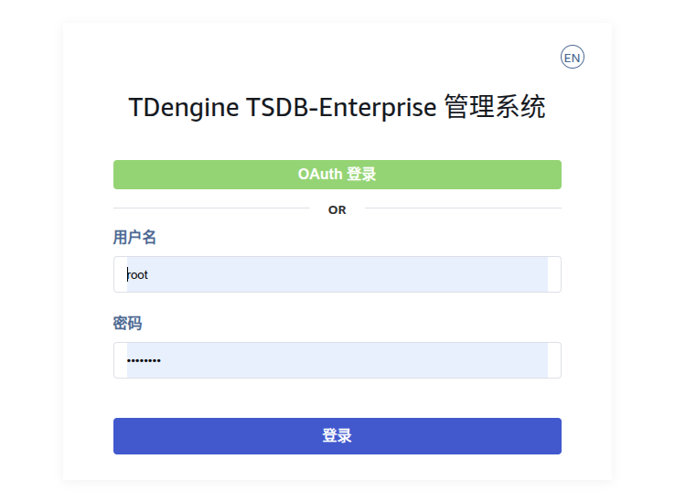
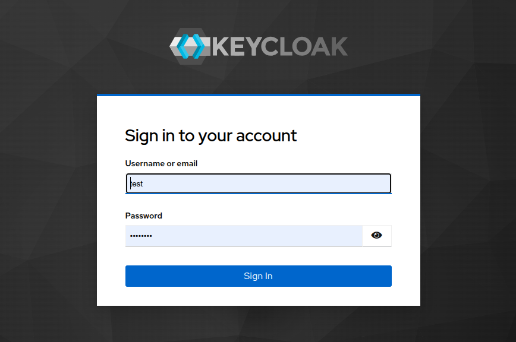
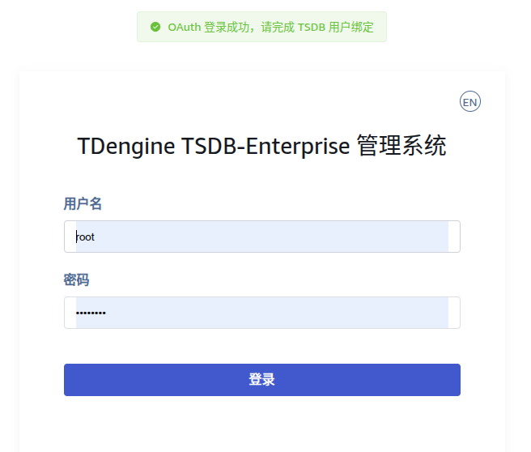
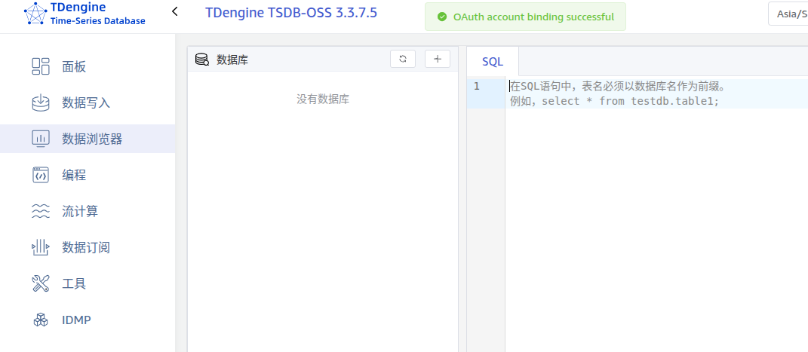
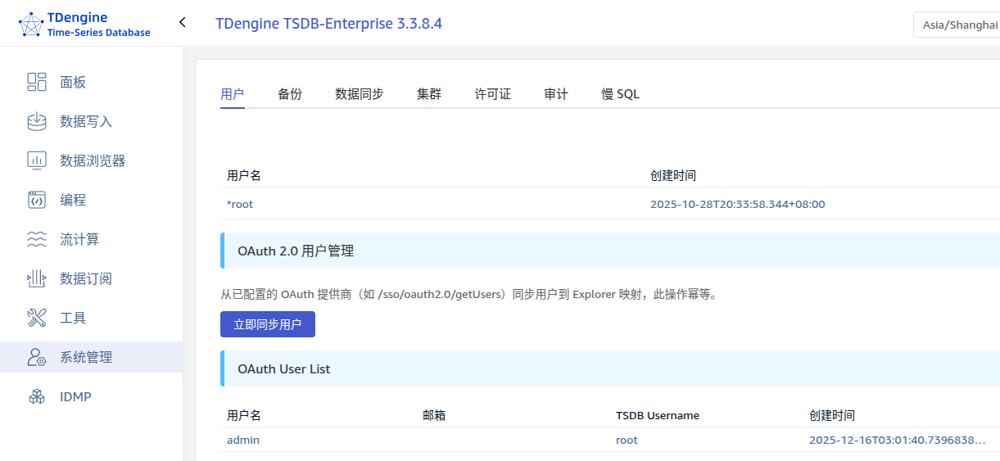
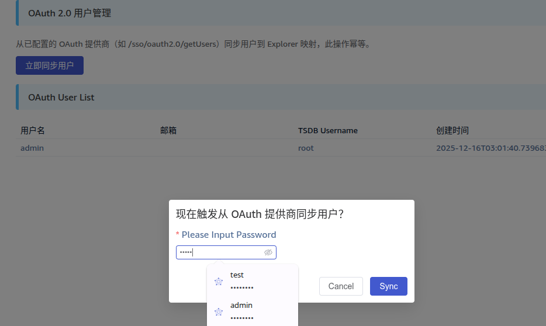
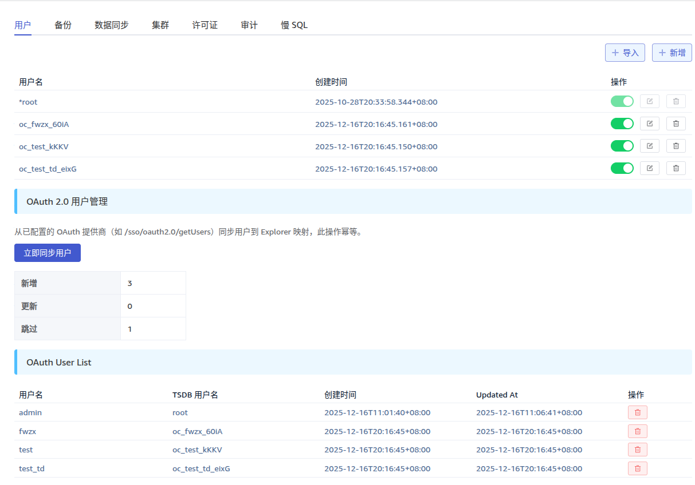
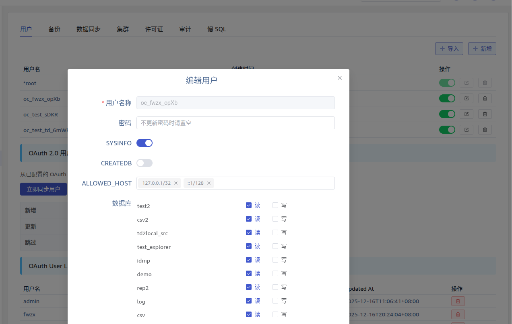
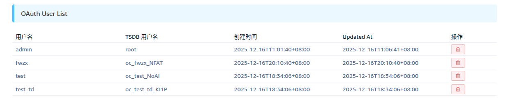

# Explorer 支持 OAuth 2.0/OIDC 单点登录 FS

## 1. 修订记录

| 编写日期 | 发布日期 | 版本 | 修订人 | 主要修改内容 |
| --- | --- | --- | --- | --- |
| 2025-12-09 | 2025-12-11 | 1.0 | 霍琳贺 | 初版：基于需求整理 OAuth2/OIDC SSO 功能规范 |
| 2025-12-18 | 2025-12-18 | 1.1 | 霍琳贺 | 1. 支持标准 OAuth 2.0 1. 支持浙江高信业务自建服务 |

## 2. 背景

本文档定义 TDengine Explorer 中 OAuth 2.0 / OpenID Connect 单点登录（SSO）的产品行为与运维要点，任何行为变动必须同时更新实现与本文件。

## 3. 定义

- OAuth 2.0：授权框架（RFC 6749）。
- OIDC：OpenID Connect（基于 OAuth 2.0 的身份层）。
- IdP：Identity Provider，身份提供商（例如 Keycloak、Azure AD、Google）。
- PKCE：Proof Key for Code Exchange，代码交换证明密钥，它是一种 OAuth 2.0 安全扩展，主要用于防止授权代码注入攻击
- JWT：JSON Web Token。
- JWKS（JSON Web Key Set）：是 OIDC 和 OAuth 2.0 中用于发布公钥的标准格式。它是一个 JSON 对象，包含一个或多个 JWK（JSON Web Key）。
- CSRF（Cross-Site Request Forgery，跨站请求伪造）：是一种攻击方式，攻击者诱使用户在已认证的 Web 应用中执行非预期的操作。
- TDengine/TSDB 用户：用于访问 TDengine 的数据库账户与密码。
- Session ID：后端为会话生成的临时凭据（实现上由后端持有并通过 httpOnly Secure cookie 提供给浏览器）。

## 4. 范围与设计原则

- 文档范围：描述用户使用 Explorer SSO 登录的流程以及受此变更影响的行为等。
- 安全原则：生产环境网络传输必须使用 HTTPS；敏感数据持久化存储时应加密；尽量避免在 URL 或 localStorage 中暴露凭据。

## 5. 行为说明

### 5.1 核心特性

#### 5.1.1 企业级安全

- **PKCE (SHA256)**：防止授权代码注入攻击。
- **CSRF 保护**：使用 OIDC State parameter 进行完整验证以进行跨站请求保护。
- **JWT 签名验证**：自动 JWKS 签名验证。
- **AES 密码加密**：安全存储 TDengine 凭据。
- **Token 自动刷新**：透明续期，优化用户体验。
- **HTTP-only Cookies**：防 XSS 攻击。
- **会话生命周期**：自动过期+清理。

#### 5.1.2 生产级功能

- **OIDC Discovery**：自动发现 IdP 配置端点。
- **混合认证模式**：Basic Auth + OAuth 无缝共存。
- **TDengine 凭据绑定**：灵活的用户权限管理。
- **自动会话清理**：后台定时清理过期会话。
- **完整错误处理**：友好的用户提示和详细日志。
- **多 IdP 兼容**：支持所有标准 OIDC 提供商。

### 5.2 快速配置

#### 5.2.1 配置文件 (explorer.toml)

```toml
[security]
encryption_key = "your-base64-encoded-32-bytes-key"

[oauth]
enabled = true
provider = "oidc" # choices: oidc/plain/custom

[oauth.provider_display_name]
zh = "统一认证平台"
en = "OAuth 2.0"

[oauth.oidc]

## 6. OIDC Standard Provider Example with KeyCloak

client_id = "your-client-id"
client_secret = "your-client-secret"
issuer_url = "http://localhost:8080/realms/taosdata"
scopes = ["openid", "profile", "email"]

## 7. Redirect URI - adjust based on your test environment

redirect_uri = "http://localhost:6060/api/-/oauth/callback"

[oauth.plain]

## 8. Example Plain OAuth 2.0 SSO with GitHub

client_id = "github client id"
client_secret = "github client secret"

authorize_url = "https://github.com/login/oauth/authorize"
token_url = "https://github.com/login/oauth/access_token"
profile_url = "https://api.github.com/user"

## 9. Redirect URI - adjust based on your test environment

redirect_uri = "http://localhost:6060/api/-/oauth/callback"

[oauth.custom]

## 10. 浙江高信自建 OAuth 2.0 服务示例

client_id = "jRYp8CqZ"
client_secret = "6D9Qq5Kmmd"

## 11. Custom OAuth endpoints

authorize_url = "http://www.dodocloud.cn:43391/sso/oauth2.0/authorize"
token_url = "http://www.dodocloud.cn:43391/sso/oauth2.0/accessToken"
profile_url = "http://www.dodocloud.cn:43391/sso/oauth2.0/profile"
login_url = "http://www.dodocloud.cn:43391/rest/v1/sso/userLogin/login"
fetch_users_url = "http://www.dodocloud.cn:43391/sso/oauth2.0/getUsers"

## 12. Redirect URI - adjust based on your test environment

redirect_uri = "http://localhost:6060/api/-/oauth/callback"
```

#### 12.0.1 环境变量 (如果设置，优先级高于配置文件)

```bash
export EXPLORER_OAUTH_ENABLED=true
export EXPLORER_OAUTH_PROVIDER=oidc
export EXPLORER_OAUTH_CLIENT_ID=taos-explorer
export EXPLORER_OAUTH_CLIENT_SECRET=secret
export EXPLORER_OAUTH_ISSUER_URL=http://localhost:8080/realms/taosdata
```

Linux 下环境变量可以配置在 `/etc/default/taos-explorer` 或 systemd 服务单元文件中。

#### 12.0.2 配置详解

安全配置项：

| 配置项 | 必需 | 说明 |
| --- | --- | --- |
| `security.encyrption_key` | No | 用于派生加密密钥 |

OAuth OIDC 配置项如下：

| 配置项 | 必需 | 说明 |
| --- | --- | --- |
| `oauth.enabled` | Yes | 是否启用 OAuth |
| `oauth.provider` | Yes | 提供商 ID： 1. `oidc`: 表示使用 OIDC 标准，在 `oauth.oidc.*` 中配置 1. `plain`: 表示使用 OAuth 2.0 标准， 在`oauth.plain.*` 配置 1. `custom`: 表示使用自定义 OAuth 2.0 服务，在`oauth.custom.*` 配置 |
| `oauth.oidc.client_id` | Yes* | OAuth Client ID |
| `oauth.oidc.client_secret` | Yes* | OAuth Client Secret |
| `oauth.oidc.issuer_url` | Yes* | OIDC Issuer URL |
| `oauth.oidc.redirect_uri` | No | 回调 URI，一般需要设置为 Explorer 服务公共访问地址 + `/api/-/oauth/callback`，如： `http://192.168.100.19:6060/api/-/oauth/callback` 。 |
| `oauth.oidc.scopes` | No | OAuth Scopes (默认：openid, profile, email) |
| `oauth.plain.client_id` | Yes* | OAuth Client ID |
| `oauth.plain.client_secret` | Yes* | OAuth Client Secret |
| `oauth.plain.issuer_url` | Yes* | OIDC Issuer URL |
| `oauth.plain.redirect_uri` | No | 回调 URI，一般需要设置为 Explorer 服务公共访问地址 + `/api/-/oauth/callback`，如： `http://192.168.100.19:6060/api/-/oauth/callback` 。 |
| `oauth.custom.client_id` | Yes* | 高信自定义 OAuth 2.0 Client ID |
| `oauth.custom.client_secret` | Yes* | 高信自定义 OAuth 2.0 Client Secret |
| `oauth.custom.issuer_url` | Yes* | 高信自定义 OAuth 2.0 Issuer URL |
| `oauth.custom.login_url` | No | 高信自定义 OAuth 2.0 登录地址 |
| `oauth.custom.fetch_users_url` | No | 高信自定义 OAuth 2.0 获取所有用户列表 |
| `oauth.custom.redirect_uri` | No | 回调 URI，一般需要设置为 Explorer 服务公共访问地址 + `/api/-/oauth/callback`，如： `http://192.168.100.19:6060/api/-/oauth/callback` 。 |
|  |

Explorer OIDC 支持配置用户映射：

| 配置项 | OIDC Claim | 说明 |
| --- | --- | --- |
| `oauth.user_mapping.username` | `preferred_username` | 用户名 |
| `oauth.user_mapping.email` | `email` | 邮箱 |
| `oauth.user_mapping.first_name` | `given_name` | 名 |
| `oauth.user_mapping.last_name` | `family_name` | 姓 |
| `oauth.user_mapping.roles` | `groups` | 角色/组，当前 TDengine 版本不支持权限映射 |

高信自建 OAuth 2.0 服务的配置如下：
```toml {wrap}

## 13. User attribute mapping

[oauth.user_mapping]
username = "username"
email = "email"
roles = "attributes.roles[].role_name"
```

### 13.1 启动服务并验证

配置完毕后，启动 Explorer：
```bash {wrap}
systemctl restart taos-explorer
```

如果配置错误，Explorer 将无法启动，错误信息示例如下：
```bash {wrap}
12月 08 13:21:58 huolinhe taos-explorer[217233]：Use configuration file path：/etc/taos/explorer.toml
12月 08 13:21:58 huolinhe taos-explorer[217233]：Error：OAuth initialization failed：Failed to discover OIDC provider metadata
12月 08 13:21:58 huolinhe systemd[1]：taos-explorer.service：Main process exited, code=exited, status=1/FAILURE
12月 08 13:21:58 huolinhe systemd[1]：taos-explorer.service：Failed with result 'exit-code'.
```

验证 OAuth 状态：
```bash {wrap}
curl http://localhost:6060/api/-/oauth/status
#{"enabled":true,"support_sync_users":false,"provider":"plain","provider_display_name":{"en":"GitHub","zh":"GitHub"}}
```

### 13.2 SSO 登录

启用 OAuth SSO 后，登录界面增加 **OAuth 登录**按钮：


点击 **OAuth 登录** 按钮，如果是第一次登录或 IdP Token 已过期，将跳转到 IdP 登录，以 Keycloak 示例如下：


登录后将自动跳转回到 Explorer 页面，如果是首次登录，需要绑定 TDengine 用户凭据：


输入TDengine 用户名、密码后，点击登录，即可进行绑定操作，绑定成功后下次登录不再需要输入 TDengine 用户名和密码。绑定成功自动跳转数据浏览器页面：


非首次绑定，登录后自动进入数据浏览器页面。

### 13.3 登出

当前登出仅登出 Explorer，不支持同时登出 IdP。

### 13.4 同步用户列表（仅支持高信自建服务）

进入 “系统管理” -> “用户”标签页，点击 “立即同步用户”：


输入统一登录平台密码：


同步成功如下：


### 13.5 用户权限

导入用户的权限是受限的，拥有所有数据库的**可读**权限，没有**写**权限。
如需修改，请在用户管理页面修改 TSDB 的用户权限：


### 13.6 用户删除

管理员可以通过用户管理界面删除已导入或登录的 SSO 用户，删除操作将强制移除已登录的会话使其立即无法访问。


## 14. 当前限制

1. TDengine Root 用户绑定以后不要修改密码；
2. 编辑 TDengine 普通用户权限时不要修改其密码；
这两个问题会在 TDengine 支持 TOKEN 登录后解决。

## 15. 性能

无。

## 16. 安全

- 使用 PKCE、state、nonce 避免 CSRF 与授权码重放。
- ID Token 通过 `openidconnect` 库进行签名和 claims 验证（iss/aud/exp/nonce）。
- TDengine 密码、Access Token 、Refresh Token 在 DB 中使用 AES-GCM 加密。
- `oauth_state`/`oauth_nonce`/`oauth_verifier` cookies 默认设置为 httpOnly、SameSite=Lax，有 10 分钟 TTL。
- `session_id` 使用 httpOnly Secure cookie。
- 日志中不记录加密密钥、Client ID 、Client Secret、Access Token、Refresh Token 等易造成凭据泄漏的信息。

## 17. 兼容性

1. 兼容多浏览器。
2. 兼容支持 OIDC 标准的所有 IdP。

## 18. 运维

- 强制在生产中设置 `EXPLORER_SECURITY_ENCRYPTION_KEY`（Base64(32 bytes)），并建议使用 Secret Manager/KMS 管理。生成方式如下：
  ```bash {wrap}
  # 推荐使用openssl或/dev/urandom
  openssl rand -base64 32
  # 或
  head -c 32 /dev/urandom | base64
  ```

- 部署必须使用 HTTPS，并保证与 IdP 的网络连通性。
- 安全事件：若怀疑 session 或 token 泄露，应尽快撤销会话。

## 19. 使用场景

适用于企业用户使用认证中心管理所有信息系统时对单点登录的要求。

### 19.1 使用 Keycloak

Keycloak 可以使用 docker-compose 启动（生产系统请参考 Keycloak 官网 Docker 配置指南：https://www.keycloak.org/getting-started/getting-started-docker）：
```yaml
services:
  keycloak:
    image: quay.io/keycloak/keycloak:latest
    container_name: keycloak
    command: start-dev
    ports:
      - '8080:8080'
      - '8443:8443'

    environment:
      # 使用 KC 前缀的环境变量（新版本推荐）
      KC_HOSTNAME_STRICT: 'false'
      KC_HOSTNAME_STRICT_HTTPS: 'false'

      # 设置管理员凭据
      KC_BOOTSTRAP_ADMIN_USERNAME: admin
      KC_BOOTSTRAP_ADMIN_PASSWORD: admin123

      # 开启管理端口健康检查
      KC_HEALTH_ENABLED: 'true'
      KC_HTTP_MANAGEMENT_HEALTH_ENABLED: 'true'
      KC_HTTP_MANAGEMENT_PORT: '9000'
      KC_HTTP_MANAGEMENT_SCHEME: 'http'
      KC_LEGACY_OBSERVABILITY_INTERFACE: 'true'

      # 开发模式配置
      KC_HTTP_ENABLED: 'true'
```

访问：http://localhost:8080  
管理员账号：`admin` / `admin123`
配置 Keycloak：
1. **创建 Realm**：`taosdata`
2. **创建 Client**：`taos-explorer`
  - Client Protocol：`openid-connect`
  - Access Type：`confidential`
  - Valid Redirect URIs：`http://localhost:6060/api/-/oauth/callback`
  - Web Origins：`http://localhost:6060`
1. **获取 Client Secret**：Credentials 标签页
2. **创建用户**：Users → Add user → 设置密码
配置 Explorer：
```toml {wrap}
[oauth]
enabled = true
provider = "oidc"
[oauth.oidc]
client_id = "taos-explorer"
client_secret = "your-secret-key"
issuer_url = "http://localhost:8080/realms/taosdata"
```

## 20. 约束和限制

### 20.1 OAuth 提供商支持

当前仅支持标准 OIDC 登录流程。
支持 OIDC 的提供商列表请参考：https://openid.net/developers/certified-openid-connect-implementations/。

### 20.2 TDengine 用户约束

由于 TDengine 后端技术限制，OAuth 实现遵循以下设计约束：
1. OAuth 用户需预先在 TDengine 中创建对应用户；
2. 首次 OAuth 登录时需绑定现有 TDengine 凭据；
3. 不支持用户权限映射，用户权限由 TDengine 原生权限系统管理；

### 20.3 未实现的功能

1. 单点登出
2. 权限映射
3. 自动创建用户
4. 多 IdP 支持

## 21. 常见错误和排查

### 21.1 OAuth 未启用

**现象：**登录页没有 SSO 按钮
**检查：**
```bash
curl http://localhost:6060/api/-/oauth/status

## 22. 应该返回：{"enabled":true,"provider":"keycloak"}

```

**解决**:
- 检查 `explorer.toml` 中 `oauth.enabled = true`
- 检查 `client_id` 和 `client_secret` 是否配置
- 查看后端日志：`grep OAuth /var/log/taos/taosexplorer.log`

### 22.1 OIDC Discovery 失败

**现象**：后端启动失败，日志显示 "Failed to discover OIDC provider metadata"
**解决**:
- 确认 `issuer_url` 可访问
- 检查网络连接
- 验证 Issuer URL 格式：`http://host:port/realms/realm-name`

### 22.2 IdP 回调失败

**现象**：登录后报错 "Invalid state parameter"
**解决：**
- 检查浏览器 Cookie 是否启用
- 确认 `redirect_uri` 配置正确
- 检查 IdP 的 Valid Redirect URIs 配置

### 22.3 Token 过期

**现象**：会话突然失效
**说明**：默认会话 1 小时过期，重新登录即可

## 23. 可观测性

1. 所有登入、登出操作均在日志中记录。

## 24. 安装和卸载

无变化

## 25. 文档

1. 修改文档更新 SSO 功能说明

## 26. 参考文档

## 27. 附录
