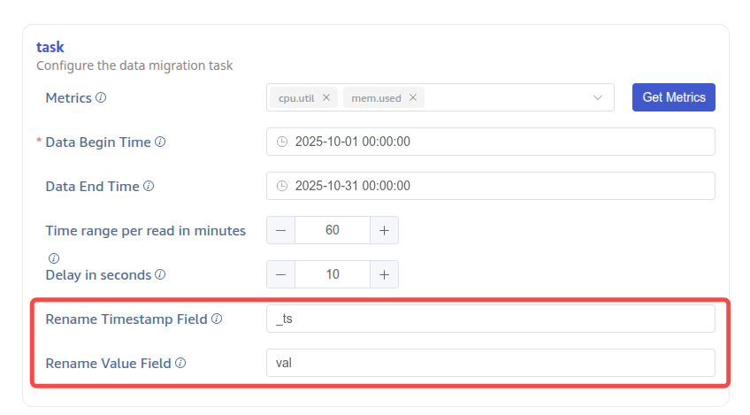
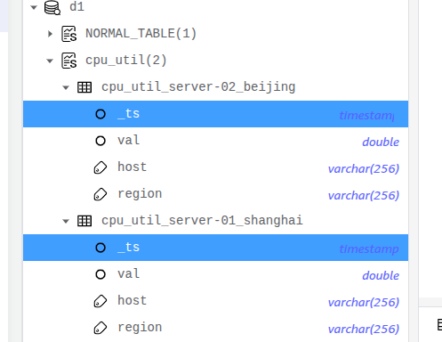

# OpenTSDB 支持字段重命名 FS

## 1. 背景

JIRA：
- https://jira.taosdata.com:18080/browse/TS-7537
- [TX-771 OpenTSDB导入功能需求文档](https://taosdata.feishu.cn/wiki/YXHEwnWBYiIiaAk6kDTc5mmfnfo)

## 2. 变更历史

| 日期 | 版本 | 负责人 | 主要修改内容 |
| --- | --- | --- | --- |
| 2025/10/31 | 0.1 | @霍琳贺 |  |
|  |  |  |  |

## 3. 定义

## 4. 行为说明

### 4.1 添加参数

| **参数** | **说明** | **值域** | **必填** |
| --- | --- | --- | --- |
| timestampFieldName | 时间戳字段重命名，默认为 timestamp （向后兼容） | string | 否 |
| valueFieldName | 值字段重命名，默认为 value（向后兼容） | string | 否 |

### 4.2 Explorer

OpenTSDB 添加两个参数：

### 4.3 重命名效果

## 5. 性能

无

## 6. 兼容性

无

## 7. 运维

无

## 8. 使用场景

## 9. 约束和限制

## 10. 常见错误和排查

无

## 11. 可观测性

无

## 12. 安装和卸载

无

## 13. 文档

## 14. 参考文档

## 15. 附录
