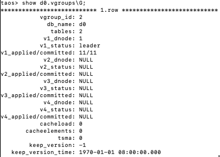
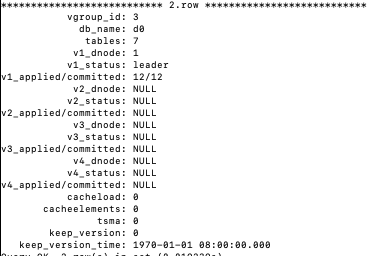
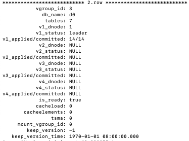

# Vgroup encode/decode 兼容描述

## 1. 问题描述

<!-- Unsupported block type: 54 -->

## 2. 问题分析

### 2.1 版本对比/升级路线表

| From \To | 3.0-3.3.6.31 | 3.3.6.32-3.3.6.36 | **3.3.6.37+** | 3.3.7 | 3.3.8.0-3.3.8.5 | 3.3.8.6-3.3.8.10 | **3.3.8.11+** |
| --- | --- | --- | --- | --- | --- | --- | --- |
| 3.0 - 3.3.6.31 version: 1 reserved: 64 no mountId no keepVersion/keepVersionTime syncConfChangeVer 后长度：0 + 0 + 0 + 64 = 64 | OK | KO | OK | OK Not Propose | OK Not Propose | KO | OK |
| 3.3.6.32-3.3.6.36 version: 1 reserved: 64 no mountId with keepVersion/keepVersionTime syncConfChangeVer 后长度：0 + 8 + 8 + 64 = 80 | N/A | OK Not Propose | OK | K0 | K0 | KO | OK |
| 3.3.6.37+ version: 2 reserved: 60 with mountId with keepVersion/keepVersionTime syncConfChangeVer 后长度：4 + 8 + 8 + 60 = 80 | N/A | N/A | OK | OK Not Propose | OK Not Propose | OK Not Propose | OK |
| 3.3.7 version: 1 reserved: 60 with mountId no keepVersion/keepVersionTime syncConfChangeVer 后长度：4 + 0 + 0 + 60 = 64 | N/A | N/A | N/A | OK Not Propose | OK Not Propose | KO | OK |
| 3.3.8.0-3.3.8.5 version: 1 reserved: 60 with mountId no keepVersion/keepVersionTime syncConfChangeVer 后长度：4 + 0 + 0 + 60 = 64 | N/A | N/A | N/A | N/A | OK | OK Not Propose | OK |
| 3.3.8.6-3.3.8.10 version: 1 reserved: 60 with mountId with keepVersion/keepVersionTime syncConfChangeVer 后长度：4 + 8 + 8 + 60 = 80 | N/A | N/A | N/A | N/A | N/A | OK Not Propose | OK |
| 3.3.8.11+ version: 2 reserved: 60 with mountId with keepVersion/keepVersionTime syncConfChangeVer 后长度：4 + 8 + 8 + 60 = 80 | N/A | N/A | N/A | N/A | N/A | N/A | OK |

### 2.2 兼容逻辑

- 根据 2.1 表的统计，3.3.6.37+ 及 3.3.8.11+ 修复逻辑如下：
```cpp
1）将 version(VGROUP_VER_NUMBER) 置为 2，reserved(VGROUP_RESERVE_SIZE) 置为 60.
2）在 mndVgroupActionDecode 时，根据 version(VGROUP_VER_NUMBER) 和 lenAfterSyncConfChangeVer 后剩余 dataLen 进行判断：
2.1）version == 1 &&  lenAfterSyncConfChangeVer < 80，不进行任何处理，此时，mountId 不影响， keepVersion 置 -1， keepVersionTime 置 0.  
                           QA: keepVersion 取值为 0，是否有影响？
2.2) version ==1 && lenAfterSyncConfChangeVer == 80，执行兼容逻辑，
2.2.1)    mountId 为 -1， 取默认值：将 mountId 置 0， keepVersion 置 -1，keepVersionTime 置 0
2.2.2)    mountId 为 0，  取默认值：将 mountId 置 0， keepVersion 置 -1，keepVersionTime 置 0 // 如果此时，用户设置了 keepVersion，有可能导致功能不生效。这时，需要在应用层重新设置。
2.2.3）   mountId 为其他值，          mountId 置 0， keepVersion 置 -1，keepVersionTime 置 0 // 如果此时，用户设置了 keepVersion，有可能导致功能不生效。这时，需要在应用层重新设置。
2.3) version > 1，即 3.3.6.37+ 和 3.3.8.11+，均执行正常逻辑。
```

## 3. 升级注意事项

### 3.3.6.32-3.3.6.36 和 3.3.8.6-3.3.8.10 升级步骤

#### 3.0.1 确认升级目标版本

- 参照 2.1 中描述的升级路线表

#### 3.0.2 升级前，检查 show vgroups 

1. 如果 keep_version 和 keep_version_time 为 -1，1970-01-01，不需要处理。


1. 如果 keep_version 和 keep_version_time 为 0，1970-01-01，不需要处理。


1. 如果 keep_version 和 keep_version_time 取值不为上述两种情况，则在升级前，记录对应  keep_version，在升级后，通过命令行进行恢复(根据沟通，目前不存在该情况。如果确实存在，再联系开发操作。因为修改命令未对外开放)。

#### 3.0.3 升级后，检查 show vgroups

1. 3.1.2 中，1/2/3 升级完成后，确认 mount_vgroup_id  为 0，keep_version 为 -1，keep_version_time 为 1970-01-01。


1. 3.1.2 中，3 如果需要重新设置 keep_version，确认设置后 mount_vgroup_id  为 0，keep_version 为设置值，keep_version_time 为设置的具体时间。

### 3.1 其他版本升级步骤

- 针对该项目描述的问题，无特殊要求。 
- 升级目标版本，参照 2.1 中描述的升级路线表。

### 3.3 升级后，不支持降级

- 因为 mnode 元数据在升级后已经发生变化，升级后不支持降级。升级前，做好 mnode 数据备份。

## 4. 自测结果

### 4.1 3.3.6.32 版本 show vgroups 输出

```sql
taos> select server_version();
 server_version() |
===================
 3.3.6.32         |
Query OK, 1 row(s) in set (0.002211s)

taos> select vgroup_id,db_name,keep_version,keep_version_time from information_schema.ins_vgroups;
  vgroup_id  |        db_name         |     keep_version      |    keep_version_time    |
=========================================================================================
           2 | d0                     |                    -1 | 1970-01-01 08:00:00.000 |
           3 | d0                     |                    -1 | 1970-01-01 08:00:00.000 |
Query OK, 2 row(s) in set (0.009205s)
```

### 4.2 使用修复前的 main 分支打开 3.3.6.32 版本生成的数据

```sql
Server is TDengine TSDB-Enterprise ver:3.3.8.8.alpha. License will expire at 2025-12-26 09:08:09.

taos> select server_version();
 server_version() |
===================
 3.3.8.8.alpha    |
Query OK, 1 row(s) in set (0.004132s)

taos> select vgroup_id,db_name,mount_vgroup_id,keep_version,keep_version_time from information_schema.ins_vgroups;
  vgroup_id  |            db_name             | mount_vgroup_id |     keep_version      |    keep_version_time    |
===================================================================================================================
           2 | d0                             |              -1 |            4294967295 | 1970-01-01 08:00:00.000 |
           3 | d0                             |              -1 |            4294967295 | 1970-01-01 08:00:00.000 |
Query OK, 2 row(s) in set (0.017388s)
```

### 4.3 再使用修复后的 main 分支打开 3.3.6.32 版本生成的数据

```sql
Server is TDengine TSDB-Enterprise ver:3.3.8.8.alpha. License will expire at 2025-12-26 09:09:24.

taos> select server_version();
 server_version() |
===================
 3.3.8.8.alpha    |
Query OK, 1 row(s) in set (0.003925s)

taos> select vgroup_id,db_name,mount_vgroup_id,keep_version,keep_version_time from information_schema.ins_vgroups;
  vgroup_id  |            db_name             | mount_vgroup_id |     keep_version      |    keep_version_time    |
===================================================================================================================
           2 | d0                             |               0 |                    -1 | 1970-01-01 08:00:00.000 |
           3 | d0                             |               0 |                    -1 | 1970-01-01 08:00:00.000 |
Query OK, 2 row(s) in set (0.018292s)
```
