# fill(prev/next) 目前行为

#### 1. 背景

jira：
TX-451

RS：[需求报告：fill(prev)行为调整](https://taosdata.feishu.cn/wiki/Mjcjw7pBviBnFEkwIeOcA5rCnrh)
目前 interp 插值和 interval 窗口语句中均支持 fill 子句，但行为略有不同。
该文档对比 fill 子句在 interp 和 interval 场景下的行为，tsdb 测试版本：
```sql {wrap}

## 1. taosd -V

TDengine TSDB-OSS
taosd version: 3.3.8.8.alpha compatible_version: 3.0.0.0
git: 3df0f2852df942a8b6824ae40779a582dec545b3
build: Linux-x64 2025-12-08 10:22:29 +0800
```

#### 1.0.1 数据

##### 1.0.1.1 普通表 - `tt`

| ts | v |
| --- | --- |
| "2025-12-05 12:00:00" | 1 |
| "2025-12-05 12:03:00" | null |
| "2025-12-05 12:04:00" | null |
| "2025-12-05 12:05:00" | null |
| "2025-12-05 12:08:00" | 2 |
| "2025-12-05 12:09:00" | null |
| "2025-12-05 12:10:00" | 3 |

说明：缺少了 01、02 分和 06、07 分的数据，用于测试 none 数据如何被 fill

##### 1.0.1.2 普通表 - `tt1`

| ts | v |
| --- | --- |
| 1761840000 ~ 1761844095 | 1 |
| 1761844096 ~ 1761848191 | null |
| 1761848192 | 2 |

说明：共 8193 行，前 4096 行为有效数据 1；中间 4096 行全部为 null；最后一行为有效数据 2，用于测试跨 datablock 场景

##### 1.0.1.3 普通表 - `tt2`

| ts | v |
| --- | --- |
| "2025-12-05 12:00:00.100" | null |
| "2025-12-05 12:00:00.300" | 1 |
| "2025-12-05 12:00:00.700" | null |

说明：共 3 行，在同一秒内，测试窗口/区间内部同时包含 null 和 non-null 的影响

##### 1.0.1.4 超级表 - `stb`

###### 1.0.1.4.1 子表 - `ctb1`

| ts | v |
| --- | --- |
| "2025-12-05 12:00:00" | 1 |
| "2025-12-05 12:03:00" | null |
| "2025-12-05 12:04:00" | null |
| "2025-12-05 12:05:00" | null |
| "2025-12-05 12:08:00" | 2 |
| "2025-12-05 12:09:00" | null |
| "2025-12-05 12:10:00" | 3 |
| "2025-12-05 12:11:00" | null |

说明：`ctb1` 末尾的 null 用于验证 fill(next) 的行为，部分数据丢失

###### 1.0.1.4.2 子表 - `ctb2`

| ts | v |
| --- | --- |
|  |  |
| "2025-12-05 12:13:00" | null |
| "2025-12-05 12:14:00" | null |
| "2025-12-05 12:15:00" | null |
| "2025-12-05 12:18:00" | 2 |
| "2025-12-05 12:19:00" | null |
| "2025-12-05 12:20:00" | 3 |

说明：`ctb2`起始数据均为 null，用于验证 fill(prev) 的行为，部分数据丢失

#### 1.0.2 当前行为

|  | fill(prev) | fill(next) | 备注 |
| --- | --- | --- | --- |
|  |
| interp (ignoreNull=0) | 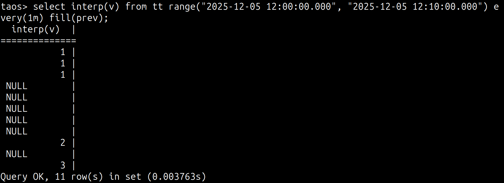 | 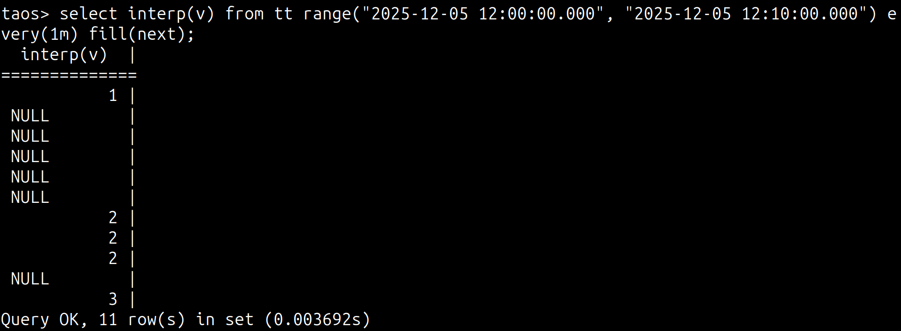 | none 被 non-null 值 fill，null 未处理 |
| interp (ignoreNull=1) | 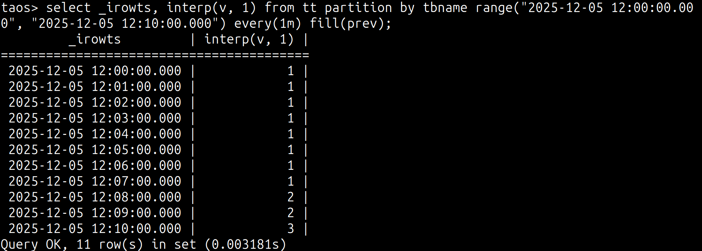 |  | none 和 null 均被 non-null 值 fill，实际是 null 数据被忽略后等同于 none |
| interval | 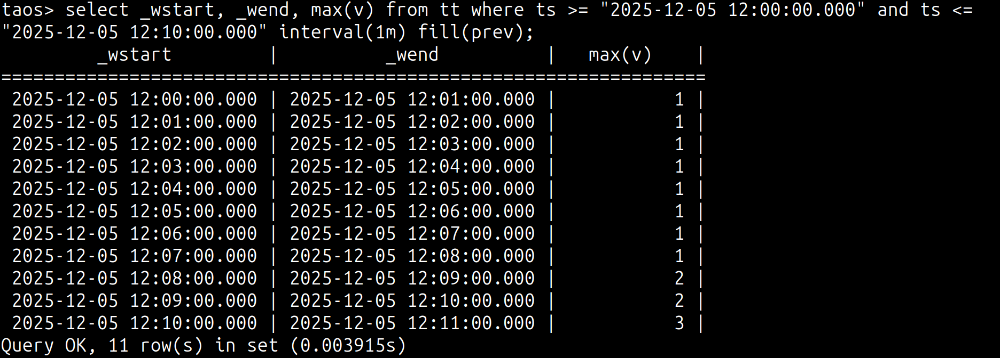 |  | none 和 null 均被 non-null 值 fill |
|  |
| interp (ignoreNull=1) | 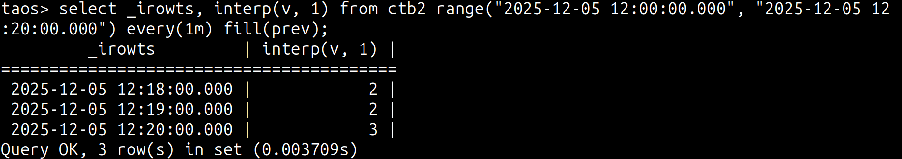 | 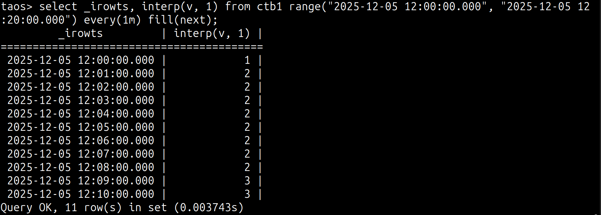 | fill(prev) 丢失前部 none 和 null 数据，fill(next)丢失后方数据 |
| interval | 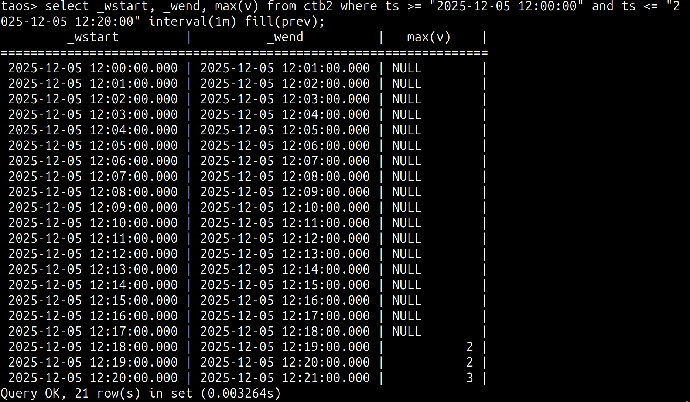 | 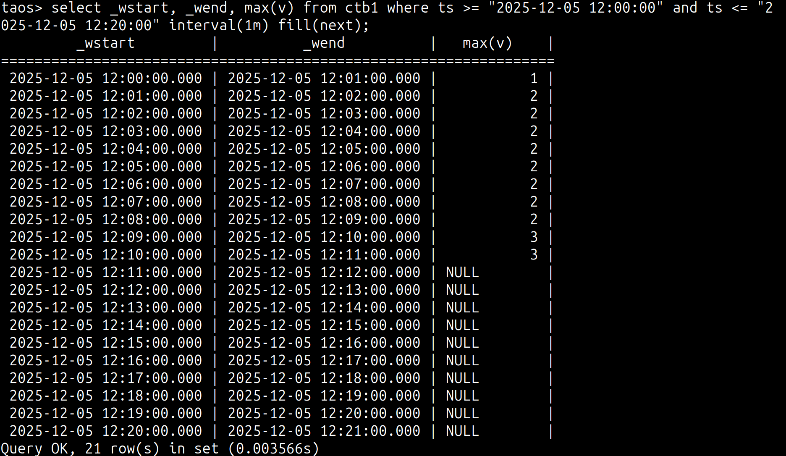 | 符合预期，由于找不到可用于 fill 的有效数据，只能保留 null |
|  |
| interp (ignoreNull=1) | 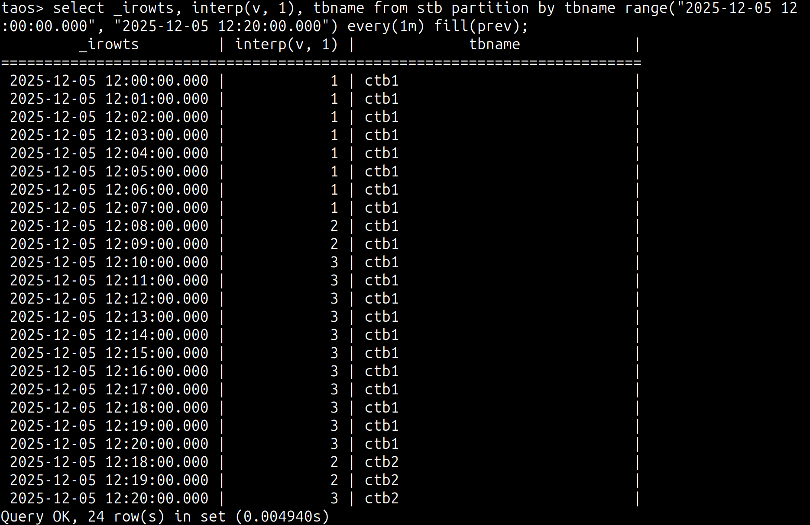 | 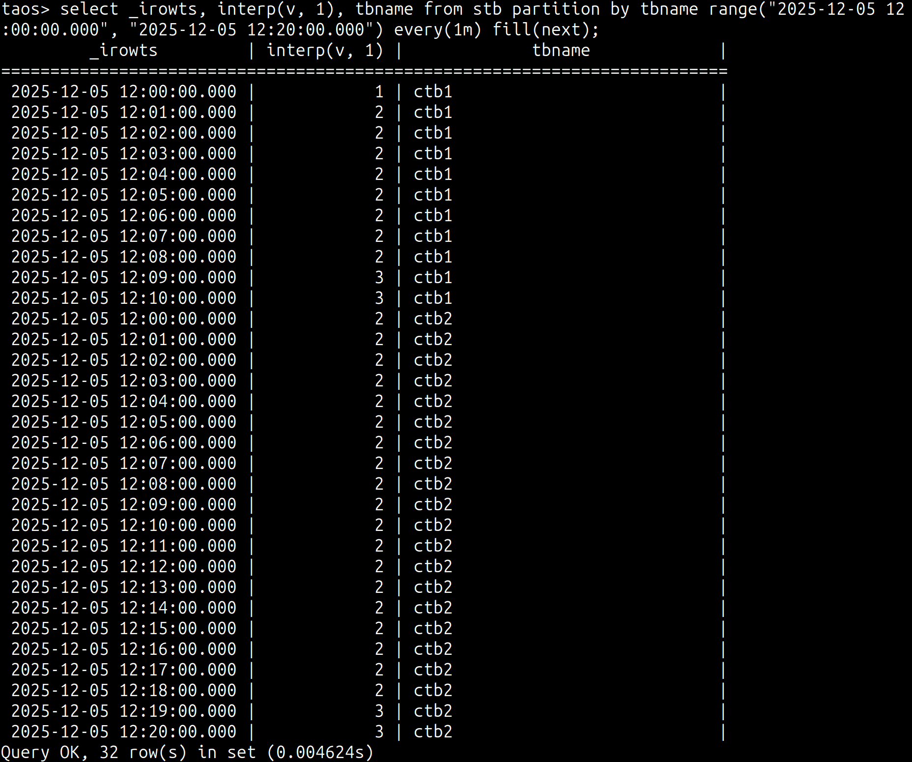 |
| interval | 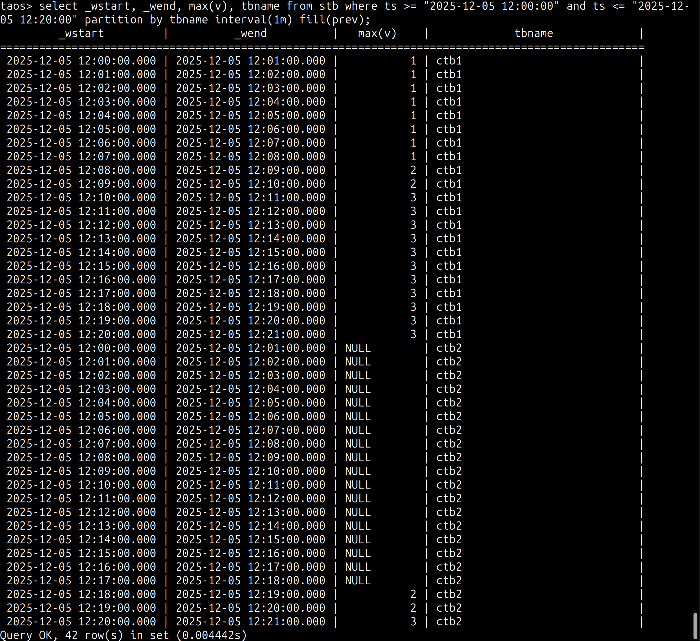 | 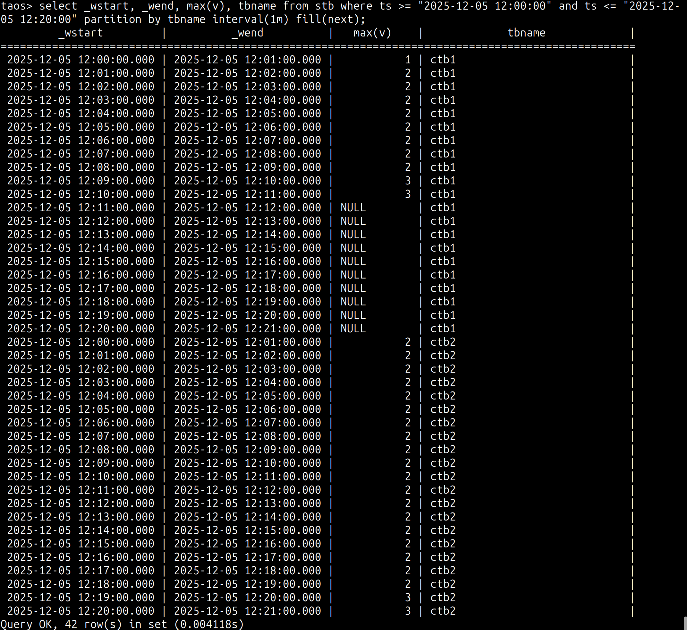 |
|  |
| interp (ignoreNull=1) |  | 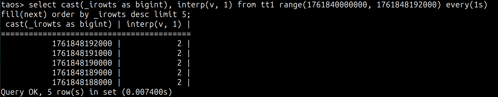 |
| interval | 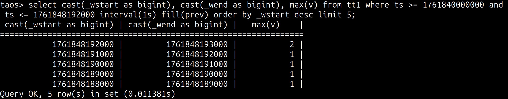 |  |
|  |
| interp (ignoreNull=0) | 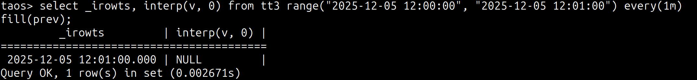 | 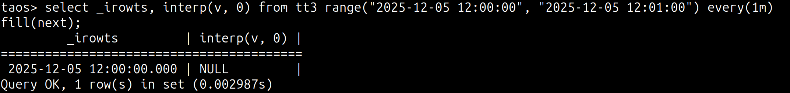 | 结果不符合预期：fill(prev)使用了最后一条 null 数据，且时间戳错误；fill(next)使用了第一条 null 数据 |
| interp (ignoreNull=1) |  | 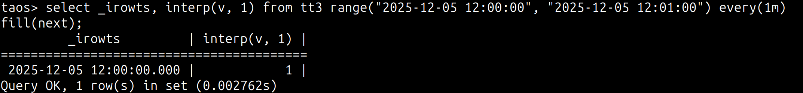 |
| interval | 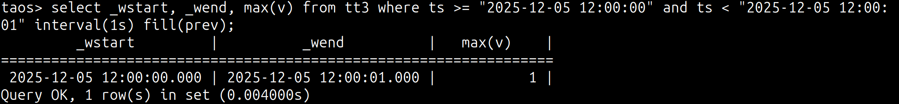 | 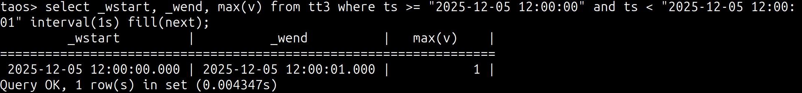 |
|  |
| interp (ignoreNull=1) | 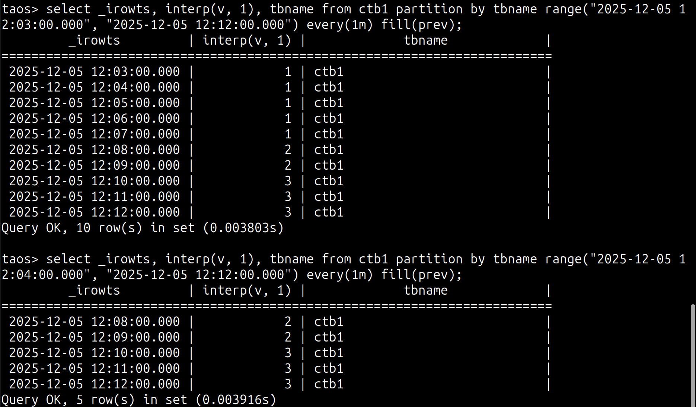 | 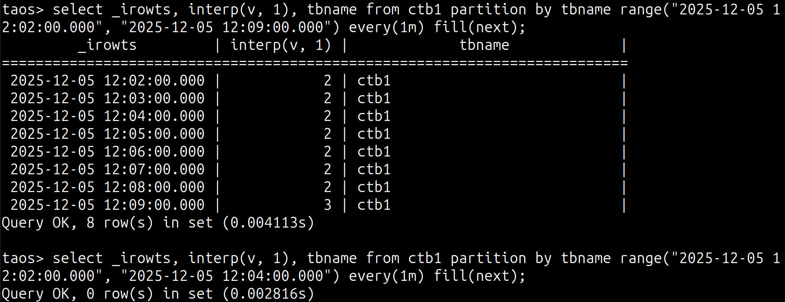 | fill(prev) 测试中，12:03通过range外12:00的数据填充，而下方的12:04似乎通过12:03的 null 填充，导致未能输出；fill(next) 类似 |
|  |
| interp (ignoreNull=1) | 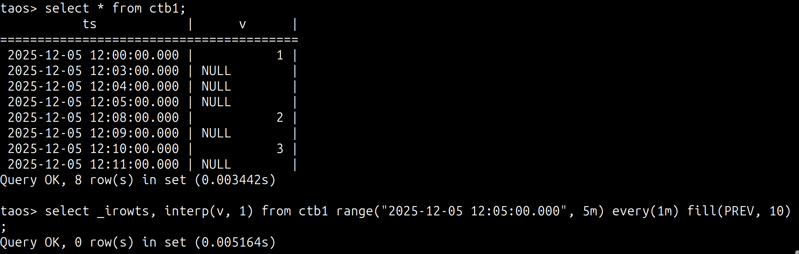 | 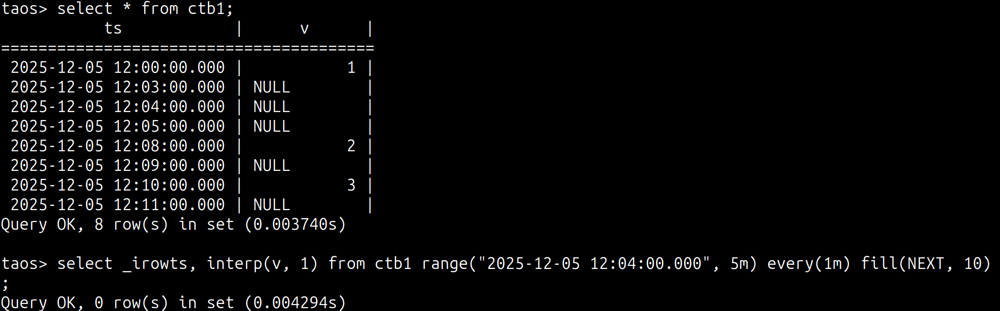 | 在通过时间范围寻找附近点时，没有忽略null数据 |
|  |
| interp (ignoreNull=1) | 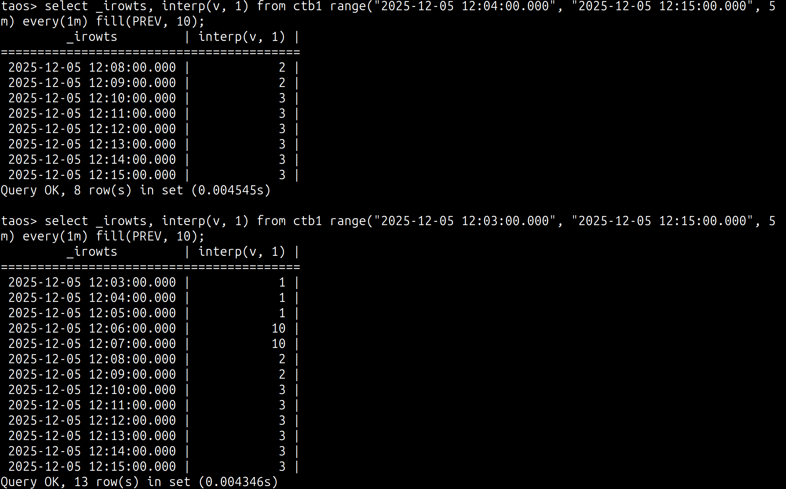 | 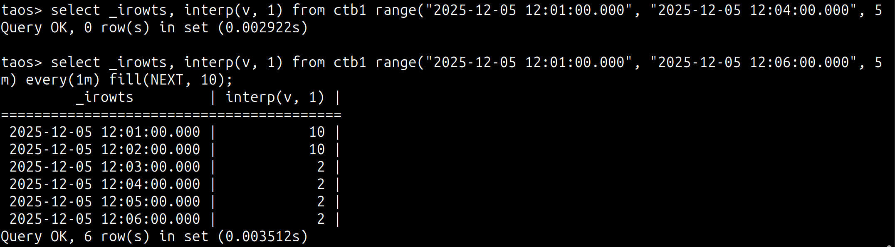 | 行为与预期不符 |

#### 1.0.3 总结

1. 目前在指定时间范围内，interp(ignoreNull=1) 和 interval 场景下的 fill 子句均能够寻找 non-null 数据去进行填充，即是 non-null 数据位于不同的 data block，所以我们文档中可以描述的更具体
2. 二者的唯一区别在于找不到 non-null 数据时：interp(ignoreNull) 场景中首尾的 null/none 数据会被丢弃，而 interval 场景中会保留 null
3. interp通过where条件确定数据范围，通过range函数控制输出时间区间，因此能够通过where条件中的数据进行fill，但在fill时没有顾及ignoreNull参数，只使用了prev/next最近的一条数据进行fill，改进这一点即可满足需求
4. interp(ignoreNull=0) 时的处理有问题，会产生错误时间戳和非预期的null数据
