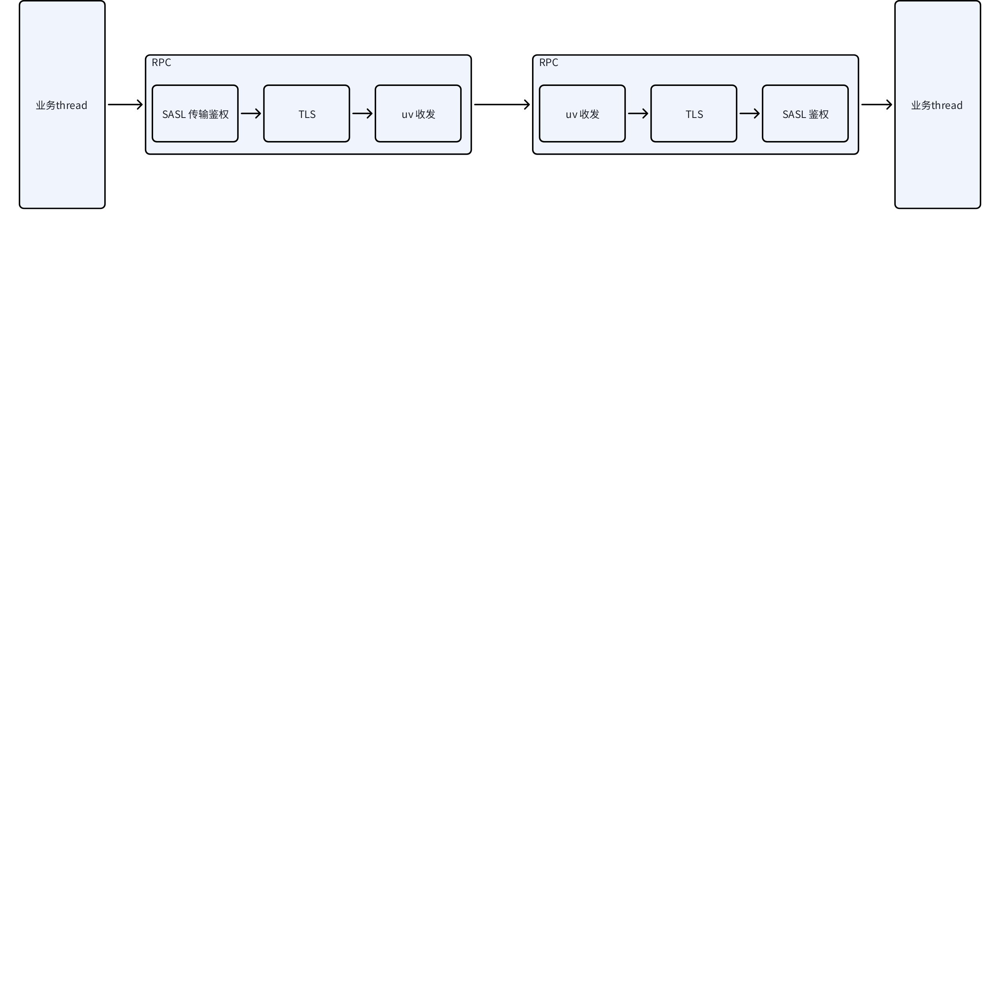
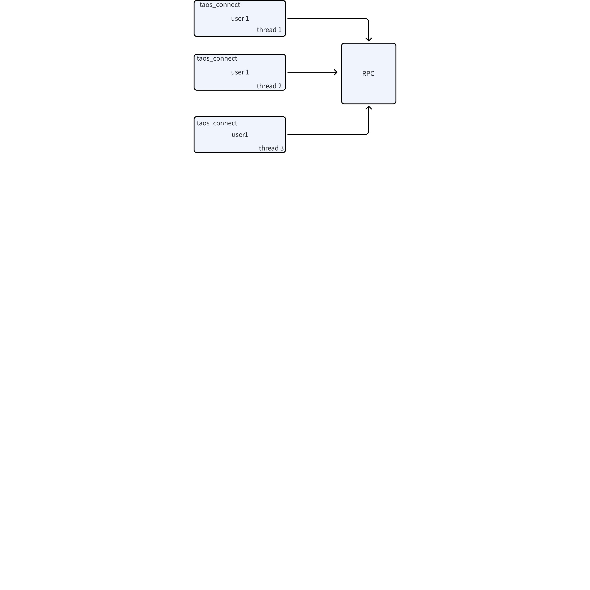
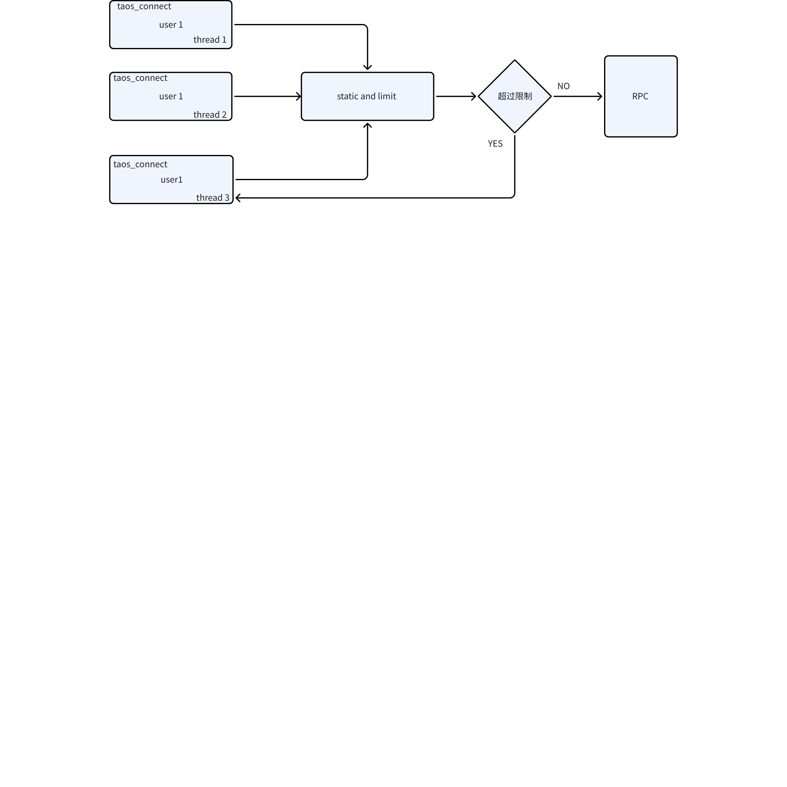
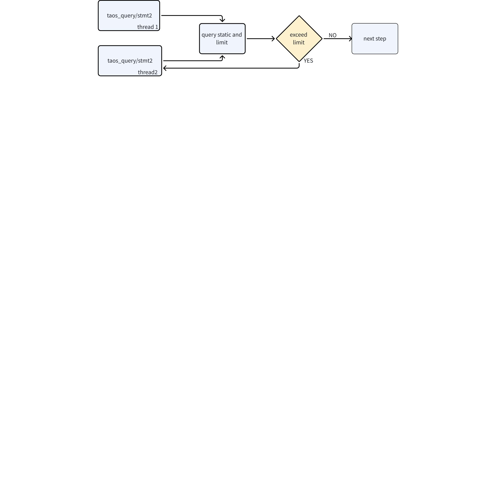

# 传输安全 FS 

## 1. 修订记录

| 编写日期 | 发布日期 | 版本 | 修订人 | 主要修改内容 |
| --- | --- | --- | --- | --- |
| 2025-10-29 | - | 0.1 | 邓怡豪 | 新建 |
| 2025-11-28 | 2025-11-28 | 1.0 | 关胜亮 | 修订格式 |

## 2. 背景

[TS-7229](https://jira.taosdata.com:18080/browse/TS-7229) 对重要数据的传输提出了新的要求，主要涉及
1. 白名单增强
2. 登录用户 session 管理
3. 用 SASL 增强传输安全
4. 资源限制
5. 动态更新 TLS 证书

## 3. 定义

Libsasl：Simple authentication and secuity layer, 结合 TLS, 验证机制（如 SCRAM）可以有效的抵御中间人攻击、数据篡改等安全威胁

## 4. 功能

### 4.1 动态更新 TLS 证书

#### 4.1.1 功能说明

集群运行过程中，动态更新TLS证书。

#### 4.1.2 SQL 

```sql
ALTER INSTANCE RELOAD TLS
```

#### 4.1.3 实现说明 

更新命令发到 mnode，mnode 做基本的验证之后，就直接返回到客户端，mnode 根据 heartbeat 来触发各个dnode1上的 TLS 证书更新，证书更新之后，并不会立即生效，原有的 conn 依然可以正常的收发数据，直到这个原有的连接关闭，或者创建新的连接。 


#### 4.1.4 其他限制

1. 企业版本
2. 实例本身就开启 enableTLS, 否则该命令直接报错。
3. 更新之前，需要手动在各个节点生成新的证书，并放置在原有目录下，建议更新之前，先备份原有的证书 
4. 考虑到集群的稳定性等问题，更新证书之后，之前已经建立且正在收发数据的 conn不受影响，只有新建立的conn 才有用新的证书。 
5. TSDB 本身并不存储证书的任何信息，完全无状态。   

### 4.2 传输层身份验证和加密服务

#### 4.2.1 功能说明

访问者身份合法性验证，结合已经开发的 TLS, 可以既能保证传输安全，又能验证访问者身份，堵住权限漏洞

#### 4.2.2 行为说明
  


### 4.3 资源限制session 控制

#### 4.3.1 功能说明

限制参数如下表

| 序号 | 名称 | Cfg 名称 | 含义 | 取值 | 备注 |
| --- | --- | --- | --- | --- | --- |
| 1 | SESSION_PER_USER | sessionPerUser | 每个用户的最大并发会话数，限制单个用户同时建立的数据库连接数量，防止资源独占 | 默认 `32`，最小 `1`，`-1` 代表 `UNLIMITED` |  |
| 2 | CONNECT_TIME | sessionConnectTime | 单次会话最大持续时间（分钟），超时后自动断开连接，避免长期空闲会话占用资源 | `480`分钟，最小 `1` 分钟，`-1` 代表 `UNLIMITED` |  |
| 3 | CONNECT_IDLE_TIME | sessionConnIdleTime | 会话最大空闲时间（分钟），连接无活动超过该时间后自动断开 | 默认 `30` 分钟，最小 `1` 分钟，`-1` 代表 `UNLIMITED` |  |
| 4 | CALL_PER_SESSION | sessionMaxConcurrency | 单会话最大并发子调用数量 | 默认 `10`，最小 `1`，`-1` 代表 `UNLIMITED` |  |
| 5 | VNODE_PER_CALL | sessionMaxCallVnodeNum | 单次调用最大涉及 vnode 数量 | 默认 `10`，`-1` 代表 `UNLIMITED` | 此项为可选功能，开发过程中根据进度和实现难度决定是否实现 |

#### 4.3.2 行为说明

1. 1-3 所涉及的参数，是对 taos_connect 接口的限制，并不是 RPC 内部的 socket 连接。
新增一个接口，上层需要该接口判断连接是否可用，可用包括是否已经被关闭或者是否超时。 
```sql
    taos_connect_is_alive(void *taos)
```

1. 4-5 所涉及的参数，主要是 taos_query 等写入查询的接口。 
2. 以上参数和user相关，且需要持久化到mnode上，需要user Object 获取。

#### 4.3.3 实现说明

##### 4.3.3.1 实现说明之 1-3 参数

当前 taos-c-driver 中，同一个用户 use 如果多线程打开多个 taos_connect，内部实际上共享了同一个 RPC 实例   


加了限制之后，大概如下所示， 即加一个 static and limit 模块，如果超过以上限制则直接打开失败，CONNECT_TIME 和 CONNECT_IDLE_TIME 也基于该模块限制


##### 4.3.3.2 实现说明之 4-5 参数

流程如下图所示，即在 query 和写入加一层统计和限制模块，如果超过配置，则直接返回失败，如果没有超过，则按之前的流程继续进行。 


#### 4.3.4 功能备注

 不涉及

### 4.4 白名单功能增强

 具体语法见[身份鉴别 FS](https://taosdata.feishu.cn/wiki/CXXqwV3Fai36rQkby6zcmBWwnMd)，传输层做具体的连接接入验证，即是否符合在白名单内，或者在黑名单内。

### 4.5 其他

  结合 JIRA: [[产品] 传输安全](https%3A%2F%2Fjira.taosdata.com%3A18080%2Fbrowse%2FTS-7229) 中的需求列表，剩余两个需求 
1. 数据包含数据大小限制。
2. 传输层做消息校验，防止恶意消息耗尽内存。
 这两个需求，传输层早已实现，不需要再额外考虑 

## 5. 性能

 传输安全引入的以下操作会带来额外开销，造成性能下降不超过10%

## 6. 安全

 已在正文中描述

## 7. 兼容性

1. 需向后兼容，不能兼容之前的版本，之前版本的消息无法访问本版本，直接报访问失败。 
2. 不能退回到旧版本

## 8. 运维

无。

## 9. 约束和限制

无。

## 10. 常见错误和排查

无。

## 11. 可观测性

无

## 12. 安装和卸载

无

## 13. 版本要求

  仅企业版本支持支持以上功能

## 14. 文档

  需要更新官网文档

## 15. 参考文档

-  [传输安全 RS](https://taosdata.feishu.cn/wiki/ACKtwrzpbi4T62kXk79cC3Ixndb)
-   [传输安全](https://jira.taosdata.com:18080/browse/TS-7229)

## 16. 附录

无。
