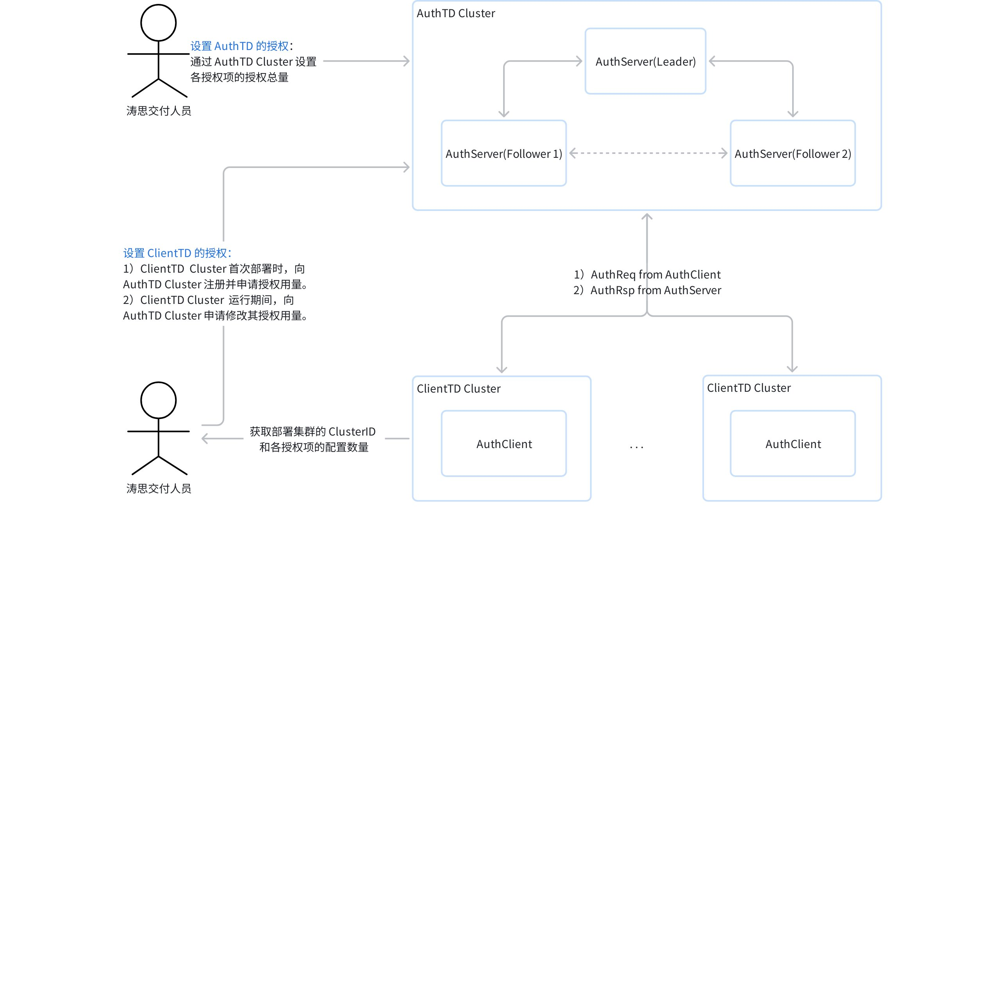

# 独立授权服务 - FS

## 1. 变更历史

| 日期 | 发布日期 | 版本 | 修订人 | 主要修改内容 |
| --- | --- | --- | --- | --- |
| 2025-07-29 | - | 0.1 | 徐开礼 | 初稿 |
| 2025-08-22 | 2025-08-22 | 1.0 | 徐开礼 | 根据 review comments 修改 |

## 2. 背景

1. [TS-6666](https://jira.taosdata.com:18080/browse/TS-6666)：东航在华为云上部署，按照合同 9 节点，可部署多套。华为以服务化的方式实现自动部署，需要部署的时候自动实现授权，无法将 cluster ID 提供给涛思，再发放授权。其它厂商是提前提供 license 授权文件，可以云化部署多套。
2. 现有的 [授权机制](https://taosdata.feishu.cn/wiki/OydKwSf1jidC04ki9V2c65NvnKe) 需要先提供 cluster ID，无法满足上述需求。为解决上述问题，需要提供[独立授权服务](https://taosdata.feishu.cn/wiki/PGn6wzFwNiZbg3kVMmscaGCDn9d)。

## 3. 定义

1. AuthTD：提供授权服务 TDengine 集群 
2. AuthServer：AuthTD 提供的授权服务
3. ClientTD：被授权服务授权的 TDengine 集群
4. AuthClient：从 ClientTD 向 AuthTD 发送授权请求的客户端

## 4. 行为说明

### 4.1 授权服务工作原理

- AuthTD 和普通集群一样由交付人员进行授权，与普通集群不同的是，授权信息为各个 ClientTD 共享。
- AuthTD 中的 AuthServer 服务和 Arbitrator 服务相似，由 AuthTD 的 Mnode Leader 启动，只提供授权服务，不提供常规读写服务。AuthTD 支持高可用，生产环境建议部署 3 个 mnode 节点。
- 通常由交付部门通过部署脚本在第一次部署 ClientTD Cluster 时向 AuthTD Cluster  完成注册并申请授权用量；后续修改同样建议通过部署脚本完成。ClientTD 的授权总量不超过 AuthTD 的授权总量（目前只支持基础项的检查：limitTimeSeries、limitStorageSize、limitCpuCores、limitDnodes、limitVnodes）。
- AuthTD 为 ClientTD 提供授权服务。AuthClient 检测到服务将要过期，向 AuthServer 发起授权请求（AuthReq），AuthServer 给予响应（AuthRsp）。


图 1. 授权服务工作原理图

#### 4.1.1 AuthTD 初始化流程

1. AuthServer 启动时，进行初始化检查。如果发现 Auth 数据库或 Grants 超级表不存在，则自动创建。初始化成功后，才可对外提供服务，否则，报错：AuthServer is starting up。
```sql {wrap}
CREATE DATABASE Auth KEEP 36500 replica 3; -- 建议部署 3 副本，以支持高可用
CREATE STABLE Auth.Grants (
  ts TIMESTAMP,              -- 本次请求时间(单位：毫秒)
  auth_time VARCHAR(24),     -- 当前授权时间(指基础授权项过期时间，来自 show grants 输出)
  auth_status VARCHAR(12),   -- 当前授权状态(未授权，已授权，已过期，回收等，来自 show grants 输出)
  auth_code INT,             -- 本次授权是否有错误发生，未有错误为0，否则为错误码
  auth_usage VARCHAR(8192),  -- 当前授权用量(包括各个授权项数量，目前只支持基础项的检查：limitTimeSeries、limitStorageSize、limitCpuCores、limitDnodes、limitVnodes)
  auth_updated BOOL,         -- 本次请求是否向 clientTD 下发更新其授权信息
  machine_code VARCHAR(7552),-- 基于 show cluster machines 的 machine 字段，多个以逗号分隔
  fqdn VARCHAR(4096),       -- 基于 select dnode_id,`name`,`value` from information_schema.ins_dnode_variables where name in ("fqdn"); 的输出，多个以逗号分隔
  first_ep VARCHAR(4096),     -- 基于 select dnode_id,`name`,`value` from information_schema.ins_dnode_variables where name in ("firstEp"); 的输出，多个以逗号分隔 
  create_time TIMESTAMP,     -- 集群创建时间，单位：毫秒，基于 select create_time,uptime from information_schema.ins_cluster; 的 create_time 字段
  boot_time DOUBLE        -- 集群启动时间，单位：毫秒，系统当前时间 - select create_time,uptime from information_schema.ins_cluster; 的 uptime 字段。
) TAGS (
  cluster_id VARCHAR(64),    -- AuthClient 集群 ID, select id from information_schema。ins_cluster;
  enable BOOL,               -- 授权是否生效。不生效时，AuthClient 的各授权项均过期。
  auth_quota VARCHAR(8192)   -- 授权用量(包括各个授权项的过期时间和数量), 根据实际需求设置，格式基于类似 show_grants_full 的输出的样式。
);
```

#### 4.1.2 授权管理

- 授权管理由涛思交付人员负责完成。

##### 4.1.2.1 设置 AuthTD 的授权

- AuthTD 和普通集群一样由交付人员进行授权，但授权信息为各个 ClientTD 共享。为了避免 AuthTD 被滥用，在授权码上加一个新授权项，判断一个 TD 集群能否成为 AuthTD。tas
```sql {wrap}
./taosGrant --auth-server {option} 取值：0 普通授权码(默认值)， 1 用于授权服务的授权码
```

##### 4.1.2.2 设置 ClientTD 的授权

1. 新增授权，Root 用户依据 ClusterID 创建子表，写入“授权用量”、"是否生效"字段
2. 如想禁用某个 Cluster 的授权，Root 用户将子表中的 “是否授权” 标签设置为 false
3. 如想修改某个 Cluster 的用量，Root 用户将修改子表中的“授权用量”标签值
4. 修改标签、创建子表时，要进行总量校验（由于 AuthTD 是一个特殊的 TD 版本，可使用宏） 
5. 以上若干步骤，通常由交付部门通过部署脚本在第一次部署集群时设置，后续修改同样建议通过部署脚本完成。示例如下：
```sql {wrap}
-- 首次部署，新增授权
create table if not exists Auth.{childTableName} using Auth.grants (now, "unlimited", "ungranted", "...", "show grants full 输出进行组装(K:V 格式，具体待定)", "A2uKO0ZAKzAQT5cDB3PMVOGv, ...

-- 后续操作：禁用授权
alter table Auth.{childTableName} set tag enable=0;

-- 后续操作：修改授权用量 
alter table Auth.{childTableName} set tag ·auth_quota='...'; -- 只对指定的授权项进行修改，未指定取 AuthServer 中 grants 表中授权项的值，进行 merge 操作。

说明：TDB 中会保存所有的修改记录，多次修改后，可使用 compact database {db_name} meta_only 对元数据进行重整，只保留最新的标签值。
```

#### 4.1.3 AuthTD/ClientTD 请求与回复

- ClientTD 和 AuthTD 进行通信，通信的主要内容采用 JSON 文本(encode/decode 高版本向低版本发送时，可能有问题)，以便于扩展。采用 JSON 格

##### 4.1.3.1 消息内容

1. 请求:
   - ClusterID
   - 集群的基本信息（机器码、FQDN、FirstEP 等）
   - 集群的状态信息（创建时间、启动时间、当前用量）
   - 用于校验的信息
2. 回复
   - 授权信息
   - 用于校验的信息

##### 4.1.3.2 安全性

- ClientTD 和 AuthTD 之间的通信内容需加密，加密方法不放在社区版中。通信中需要增加时间戳等信息，避免消息重放造成的干扰。示例如下：
```json {wrap}
{ "timestamp": 1735457222123,    // 毫秒级或秒级 Unix 时间戳
  "nonce": "a1b2c3d4e5f6g7h8",   // 一个唯一的随机字符串
  "clusterId": "client_td_001",  // 客户端标识
  "payload": {                   // 业务数据
    ... 
  },
  "signature": ""               // 数字签名
}
// 加密方法可采用 3DES/sm4 等，实现可放在 TDinternal 中，暂不需要放在 .o 文件中。
```

- AuthTD 进行合法性校验。例如，时间戳在一定范围内，nonce 不能重复。

#### 4.1.4 AuthTD 对于 ClientTD 请求的处理

##### 4.1.4.1 记录请求

- AuthTD 接收到 ClientTD 请求后，将收到的信息写到子表。子表已经被提前创建，归属 Auth 数据库的 Grants 超级表，子表名称基于 ClusterID。结构示例
1. 数据列
   - 本次请求时间
   - 当前授权时间
   - 当前授权状态
   - 当前授权用量
   - 本次请求是否更新了授权信息
   - 集群的基本信息（机器码、FQDN、FirstEP 等）
   - 集群的状态信息（创建时间、启动时间、当前用量）
2. 标签列
   - ClusterID
   - 是否生效
   - 授权用量

##### 4.1.4.2 生成响应

1. 如果子表不存在：返回错误
2. AuthServer 发现 ClientTD 无授权或者授权接近过期时，发放新的授权：
   - 授权时间：30 天
   - 发放时机：距离过期时间 15 天，可配置但最大为 30 天
   - 授权用量：读取  Auth.Grants 下子表的 “授权用量”

#### 4.1.5 ClientTD 流程

##### 4.1.5.1 ClientTD 启动 AuthClient，定期向 AuthServer 发送授权请求。

1. AuthClient 服务和 Arbitrator 服务相似，由 ClientTD 的 Mnode Leader 调度
2. AuthClient 服务读取 taos.cfg 文件中的如下配置项
   - 是否发送授权请求: authReq       0/1   0 不发送（默认值） 1 发送
   - 发送授权请求的间隔: authReqInterval    单位秒，默认值 2592000(3 天），最大值30*86400
   - 发送授权请求的目标地址: authReqUrl     
3. AuthClient 按照配置信息向 AuthServer 发送授权请求，接收到授权回复后，更新集群状态
4. AuthTD 可随时通过 Show Grants 等系列命令查看当前授权状态，并需要显示当前授权时间和下次续期时间
```sql {wrap}
select last_row(*) from Auth.grants; 
```

## 5. 性能

- 无

## 6. 兼容性

- 无

## 7. 运维

- 无

## 8. 使用场景

- 无

## 9. 可观测性

- 无

## 10. 安装和卸载

- 无特殊要求

## 11. 文档

- 改企业版文档。

## 12. 参考文档

- [独立授权服务 RS](https://taosdata.feishu.cn/wiki/PGn6wzFwNiZbg3kVMmscaGCDn9d)
- [按功能授权及授权机制优化](https://taosdata.feishu.cn/wiki/OydKwSf1jidC04ki9V2c65NvnKe)

## 13. 附录

- [独立授权服务操作手册](https://taosdata.feishu.cn/wiki/JtsfwvB4Oi178vkQ4rJc68Y3n2d)
