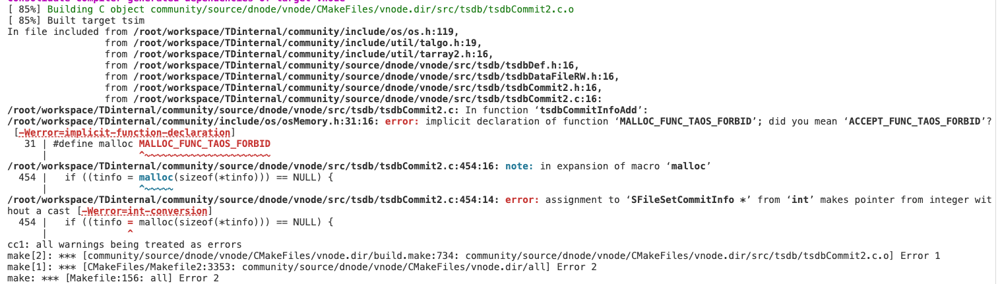

# 编码安全 FS（废弃）

## 1. 背景

为了保证 TDengine TSDB 开发过程中的代码规范及代码安全，特编写此文档，以规范编码行为及对代码进行安全性检查。参考链接：

## 2. 变更历史

| 日期 | 版本 | 负责人 |
| --- | --- | --- |
| 2025/10/22 | 0.1 | @程洪泽 |

## 3. 定义

文档中所使用的一些并非众所周知的术语的定义。

## 4. 行为说明

### 4.1 编码规范

#### 4.1.1 命名规范

##### 4.1.1.1 变量命名

1. 使用有意义的变量名，避免单字符变量（循环变量除外）
2. 局部变量使用小驼峰命名法（camelCase）
3. 常量使用全大写加下划线（UPPER_SNAKE_CASE）

##### 4.1.1.2 函数命名

1. 函数名使用小驼峰命名法（camelCase），动词开头
2. 公共 API 函数使用模块前缀（如 `tdb`、`tsdb`）
3. 内部函数使用 `static` 关键字
4. 函数名应清晰表达功能意图

##### 4.1.1.3 类型命名

1. 类型名使用大驼峰命名法（PascalCase）
2. 结构体类型使用 `S` 前缀，如 `SUser`, 对于结构体成员使用小驼峰命名法（camelCase）
3. 枚举类型使用 `E` 前缀
4. 联合体使用 `U` 前缀
5. 类型定义使用 `typedef` 简化复杂类型

##### 4.1.1.4 宏定义命名

1. 宏使用全大写加下划线
2. 函数宏添加括号保护参数
3. 避免使用可能引起副作用的宏
4. 条件编译宏使用模块前缀避免冲突

##### 4.1.1.5 文件命名

1. 源文件使用小驼峰命名法
2. 头文件使用 `.h` 扩展名
3. 实现文件使用 `.c` 扩展名
4. 文件名应反映模块功能

#### 4.1.2 注释规范

##### 4.1.2.1 文件头注释 {folded="true"}

1. 使用统一的注释模板
2. 每个源文件开头应包含如下版权声明
```c
/*
 * Copyright (c) 2019 TAOS Data, Inc. <jhtao@taosdata.com>
 *
 * This program is free software: you can use, redistribute, and/or modify
 * it under the terms of the GNU Affero General Public License, version 3
 * or later ("AGPL"), as published by the Free Software Foundation.
 *
 * This program is distributed in the hope that it will be useful, but WITHOUT
 * ANY WARRANTY; without even the implied warranty of MERCHANTABILITY or
 * FITNESS FOR A PARTICULAR PURPOSE.
 *
 * You should have received a copy of the GNU Affero General Public License
 * along with this program. If not, see <http://www.gnu.org/licenses/>.
 */
```

##### 4.1.2.2 函数注释

1. 函数注释没有强制要求
2. 如要添加函数注释，需使用 Doxygen 风格注释，说明函数功能、参数、返回值、注意事项
```c
/**
 * @brief 函数功能简要描述
 * 
 * @param param1 参数1说明
 * @param param2 参数2说明
 * @return 返回值说明
 *         - 0: 成功
 *         - -1: 失败
 * @note 特殊注意事项
 */
int functionName(int param1, char *param2);
```

##### 4.1.2.3 代码块注释

1. 复杂逻辑代码块前添加说明注释
2. 使用单行注释 `//` 解释关键步骤
3. 避免无用的冗余注释
4. 注释应与代码同步更新

##### 4.1.2.4 TODO 与 FIXME 标记

1. 使用 `// TODO:` 标记待完成的功能
2. 使用 `// FIXME:` 标记需要修复的问题
3. 使用 `// NOTE:` 标记重要说明
4. 使用 `// WARNING:` 标记潜在风险

#### 4.1.3 代码格式

##### 4.1.3.1 使用 clang-format 自动化格式化

1. 项目统一使用 `clang-format` 工具进行代码格式化，确保代码风格一致性
2. 在 CI/CD 流水线中集成 `clang-format` 检查，提交前自动格式化代码（TODO）
3. 配置 `.clang-format` 文件定义格式化规则，如缩进、换行、括号风格等
```yaml
---
Language:        Cpp

## 5. BasedOnStyle:  Google

AccessModifierOffset: -1
AlignAfterOpenBracket: Align
AlignConsecutiveAssignments: false
AlignConsecutiveDeclarations: true
AlignConsecutiveMacros: true
AlignEscapedNewlinesLeft: true
AlignOperands:   true
```

##### 5.0.0.1 局部代码格式化关闭

1. 在代码块前后使用 `// clang-format off` 和 `// clang-format on` 注释关闭局部格式化
2. 适用于特殊格式要求或第三方代码集成，避免格式化破坏原有结构
3. 仅在必要时使用
```c
// clang-format off
// 特殊格式代码块
int array[] = {
    1, 2, 3,
    4, 5, 6
};
// clang-format on
```

#### 5.0.1 函数设计原则

##### 5.0.1.1 函数单一职责原则

1. 每个函数应只负责一个明确的任务，避免多重职责导致复杂性和安全隐患
2. 通过单一职责降低函数复杂度，提高可测试性和可维护性
3. 违反此原则可能引入意外的副作用，增加安全漏洞风险

##### 5.0.1.2 函数参数设计

1. 参数数量应控制在合理范围内（建议不超过5个），过多参数使用结构体封装
2. 输入参数优先使用 `const` 修饰，防止意外修改
3. 输出参数使用指针或引用，明确标识返回值意图
4. 避免使用可变参数（variadic functions），如 `printf` 风格函数，以防缓冲区溢出

##### 5.0.1.3 函数返回值规范

1. 函数应有明确的返回值类型，避免使用 `void` 返回重要状态信息
2. 使用枚举或错误码表示函数执行结果，便于调用者处理异常
3. 对于可能失败的操作，返回值应包含成功/失败状态
4. 避免返回局部变量的指针或引用，防止悬空指针问题

##### 5.0.1.4 函数异常处理

1. 优先使用返回值或错误码处理异常，避免抛出异常（除非框架要求）
2. 函数内部捕获并处理所有可能的异常，不允许异常泄露到外部
3. 提供清理机制，确保资源在异常情况下正确释放
4. 记录异常信息到日志，但不暴露敏感细节

##### 5.0.1.5 函数安全性原则

1. 避免使用不安全函数，如 `strcpy`、`sprintf`，改用安全版本如 `strncpy`、`snprintf`
2. 对所有输入参数进行边界检查和有效性验证
3. 限制函数的可见性，使用 `static` 关键字隐藏内部函数

#### 5.0.2 错误处理规范

##### 5.0.2.1 错误码定义

1. 定义统一的错误码枚举，避免魔法数字
2. 错误码应具有描述性，使用模块前缀区分
3. 提供错误码到错误消息的映射函数

##### 5.0.2.2 错误处理流程

1. 函数失败时立即返回错误码，不继续执行
2. 调用者必须检查返回值并处理错误
3. 避免静默忽略错误，强制显式处理

##### 5.0.2.3 错误日志记录

1. 记录错误发生时的上下文信息，包括参数值和调用栈
2. 使用结构化日志格式，便于分析和监控
3. 区分错误级别（fatal、error、warning），避免过度记录

##### 5.0.2.4 错误传播机制

1. 错误应向上层传播，不在中间层吞没
2. 使用 goto 或 cleanup 标签处理资源释放和错误返回
3. 避免错误信息丢失，确保调用链完整

##### 5.0.2.5 资源清理

1. 错误发生时确保所有已分配资源正确释放
2. 使用 RAII 模式或手动清理函数
3. 防止资源泄漏导致的安全漏洞

### 5.1 内存安全

为了保证 TDengine TSDB 在编码及测试过程中的内存安全，特采取以下措施：
1. 内存安全编码规范
2. 内存安全静态检查
3. 内存不安全函数禁用
4. 内存安全运行时检查

#### 5.1.1 内存安全编码规范

1. 为了避免开发过程中不规范的内存函数调用导致的非法内存访问问题，同时满足内存问题的定位需求，在 TDengine TSDB 的`os` 模块中禁用原生的内存函数：
```c
// osMemory.h
#define malloc MALLOC_FUNC_TAOS_FORBID
#define calloc CALLOC_FUNC_TAOS_FORBID
#define realloc REALLOC_FUNC_TAOS_FORBID
#define free FREE_FUNC_TAOS_FORBID
```

所有基于 TSDB `os` 模块开发的上层模块，调用被禁用的内存函数时，会导致编译报错，如下图所示：


1. 封装自定义的内存函数。自定义的内存函数会检查入参的合法性，避免非法参数的传入导致的非法内存访问。
```cpp
void   *taosMemMalloc(int64_t size);
void   *taosMemCalloc(int64_t num, int64_t size);
void   *taosMemRealloc(void *ptr, int64_t size);
void    taosMemFree(void *ptr);
```

1. 定义内存相关宏定义重置野指针等：
```java
#define taosMemFreeClear(ptr)      \
  do {                             \
    if (ptr) {                     \
      taosMemFree((void *)ptr);    \
      (ptr) = NULL;                \
    }                              \
  } while (0)

#define TAOS_MEMORY_REALLOC(ptr, len)          \
  do {                                         \
    void *tmp = taosMemoryRealloc(ptr, (len)); \
    if (tmp) {                                 \
      (ptr) = tmp;                             \
    } else {                                   \
      taosMemoryFreeClear(ptr);                \
    }                                          \
  } while (0)
```

自定义的宏定义 `taosMemFreeClear` 除了会检查入参的合法性以外，还会将被释放的函数指针设置为 `NULL`，防止野指针访问。
1. 所有内存分配函数的调用需检查返回值，避免假设内存分配总是成功的。
2. 分配的内存资源在出错时必须调用相应的释放函数
3. 内存分配失败时需返回错误码，并用日志记录分配失败事件，便于后续定位和调试。

#### 5.1.2 内存安全编码静态检查（TODO）

#### 5.1.3 内存不安全函数禁用

除了禁用直接的内存函数调用之外，其他内存不安全函数也一并禁用。具体参考文档：[禁用内存不安全函数](https://taosdata.feishu.cn/wiki/Vit6w1oOLidH0ikZITMcYJeunsb)。

#### 5.1.4 内存安全运行时检查

- 增加编译选项 `BUILD_SANITIZER` 选项
```cmake
option(
    BUILD_SANITIZER
    "If build sanitizer"
    OFF
)
```

- 在 `BUILD_SANITIZER` 设置为 `ON` 时，使用 AddressSanitizer (ASAN) 检测堆和栈上的越界访问，提供详细错误报告
```cmake
IF(${BUILD_SANITIZER})
    SET(CMAKE_C_FLAGS "${CMAKE_C_FLAGS} -fsanitize=address -fsanitize=undefined -fsanitize-recover=all -fsanitize=float-divide-by-zero -fsanitize=float-cast-overflow -fno-sanitize=shift-base -fno-sanitize=alignment -g3 -Wformat=0")
ENDIF
```

- 调试版本默认开启运行时边界检查选项

### 5.2 文件句柄安全

#### 5.2.1 句柄编码规范

与内存安全一样，对于文件句柄同样需要制定相应的安全编码规范。尤其是在 Linux 操作系统上，其文件句柄分配机制在非安全编码的情况下，很容易出现句柄混用的情况。为了避免编码中句柄带来的资源风险，制定以下规范：
- 在 TDengine TSDB 的`os` 模块中禁用原生的句柄函数。在基于 `os` 模块开发的模块中调用原生的句柄操作函数会导致编译失败。
```c
#define open    OPEN_FUNC_TAOS_FORBID
#define fopen   FOPEN_FUNC_TAOS_FORBID
#define access  ACCESS_FUNC_TAOS_FORBID
#define stat    STAT_FUNC_TAOS_FORBID
#define lstat   LSTAT_FUNC_TAOS_FORBID
#define fstat   FSTAT_FUNC_TAOS_FORBID
#define close   CLOSE_FUNC_TAOS_FORBID
#define fclose  FCLOSE_FUNC_TAOS_FORBID
#define fsync   FSYNC_FUNC_TAOS_FORBID
#define getline GETLINE_FUNC_TAOS_FORBID
```

- 封装自定义的句柄函数
```c
TdFilePtr taosOpenFile(const char *path, int32_t tdFileOptions);
int32_t taosCloseFile(TdFilePtr *ppFile);
int64_t taosLSeekFile(TdFilePtr pFile, int64_t offset, int32_t whence);
int32_t taosFtruncateFile(TdFilePtr pFile, int64_t length);
int32_t taosFsyncFile(TdFilePtr pFile);
int64_t taosReadFile(TdFilePtr pFile, void *buf, int64_t count);
int64_t taosPReadFile(TdFilePtr pFile, void *buf, int64_t count, int64_t offset);
int64_t taosWriteFile(TdFilePtr pFile, const void *buf, int64_t count);
int64_t taosPWriteFile(TdFilePtr pFile, const void *buf, int64_t count, int64_t offset);
```

自定义的函数一方面可以透明化 API 的平台差异，同时也可以精细化资源的控制等操作。
- 所有句柄函数的调用需检查返回值。

#### 5.2.2 句柄编码静态检查

### 5.3 兼容性安全

为了保证 TDengine TSDB 在迭代开发过程中，兼顾新特性引入与现有功能的稳定性，需系统性地规划与实施兼容性安全策略。本文档旨在指导开发、测试与运维团队在设计、实现与维护 TDengine 及其生态组件时，充分考虑兼容性与安全性的平衡，确保系统在多版本、多平台、多协议环境下的安全运行。

#### 5.3.1 版本管理与兼容性安全

在 TDengine TSDB 的版本迭代中（TODO）

#### 5.3.2 兼容性安全编码规范

##### 5.3.2.1 错误码兼容安全

为了保证各版本之间错误码的兼容性安全，特制定下列错误码编程规范：
1. 定义 `TSDB_CODE_SUCCESS` 为 0，表示成功，其他错误码均表示失败且非 0
2. 所有错误码均通过 `TAOS_DEF_ERROR_CODE` 进行定义，如：
```c
#define TSDB_CODE_RPC_TIMEOUT TAOS_DEF_ERROR_CODE(0, 0x0019)
```

1. 不同的错误码不能定义相同的数值
2. 已经定义的错误码及其数值不得修改
3. 不得随意删除错误码
4. 定义的错误码需通过`TAOS_DEFINE_ERROR`定义错误码信息，如：
```c
TAOS_DEFINE_ERROR(TSDB_CODE_RPC_TIMEOUT, "Conn read timeout")
```

1. 新增错误码应在相关文档中补充，增加错误码需要改动的文件参考：[引擎新增错误码说明](https://taosdata.feishu.cn/wiki/HI5WwCrf1i3GGik7d4HctAU1npf)
2. 编写测试用例 `checkErrorCode.py`并集成到 CI 中，用于检测不合法的错误码改动。所有 PR 必须需通过该测试用例才能合并进主分支
3. 所有关于错误码改动的 PR 都需由组内成员进行 review 后方可合并进主分支

##### 5.3.2.2 消息码兼容安全

为了保证 TDengine TSDB 各版本之间消息码的兼容性安全，特制定以下消息码兼容安全编码规范：
1. 所有消息码均在 `TDengine/include/common/tmsgdef.h`文件中定义
2. 通过宏`TD_NEW_MSG_SEG`定义消息码的分段，且每个消息码分段都以`TD_CLOSE_MSG_SEG`结尾
3. 消息码段不可以嵌套定义
4. 新增消息码段时，只能在文件末尾追加，不可定义起已有消息码段的前面
5. 消息码段不允许删除
6. 所有消息码需通过宏`TD_DEF_MSG_TYPE`定义在消息码段中，且不可重复定义
7. 每个消息码段中最多定义 256个消息码
8. 在消息码定义中，需指定消息码的含义，通常以“*模块-含义”*的方式定义
9. 新增消息码必须在消息码段最后追加，不定义在消息码段之外或定义在消息码段内已有消息码之前
10. 消息码不允许删除
11. 编写测试用例`TDengine/source/util/test/tmsgTest.cpp`并集成到 CI 中，检测不合法的消息码改动
12. 所有关于消息码改动的 PR 均需由组内成员进行 review 后方可合并进主分支
下面是一个消息码段及消息码定义的示例：
```cpp
  TD_NEW_MSG_SEG(TDMT_STREAM_MSG)   //4 << 8
  TD_DEF_MSG_TYPE(TDMT_STREAM_TASK_DEPLOY, "stream-task-deploy", SStreamTaskDeployReq, SStreamTaskDeployRsp)  //1025 1026
  TD_DEF_MSG_TYPE(TDMT_STREAM_TASK_DROP, "stream-task-drop", NULL, NULL)
  TD_DEF_MSG_TYPE(TDMT_STREAM_TASK_RUN, "stream-task-run", NULL, NULL)
  TD_DEF_MSG_TYPE(TDMT_STREAM_TASK_DISPATCH, "stream-task-dispatch", NULL, NULL)
  TD_DEF_MSG_TYPE(TDMT_STREAM_TASK_UPDATE_CHKPT, "stream-update-chkptinfo", NULL, NULL)
  TD_DEF_MSG_TYPE(TDMT_STREAM_RETRIEVE, "stream-retrieve", NULL, NULL)  //1035 1036
  TD_DEF_MSG_TYPE(TDMT_STREAM_TASK_CHECKPOINT_READY, "stream-checkpoint-ready", NULL, NULL)
  TD_DEF_MSG_TYPE(TDMT_STREAM_TASK_REPORT_CHECKPOINT, "stream-report-checkpoint", NULL, NULL)
  TD_DEF_MSG_TYPE(TDMT_STREAM_TASK_RESTORE_CHECKPOINT, "stream-restore-checkpoint", NULL, NULL)  //unused
  TD_DEF_MSG_TYPE(TDMT_STREAM_TASK_PAUSE, "stream-task-pause", NULL, NULL)
  TD_DEF_MSG_TYPE(TDMT_STREAM_TASK_RESUME, "stream-task-resume", NULL, NULL)
  TD_DEF_MSG_TYPE(TDMT_STREAM_TASK_STOP, "stream-task-stop", NULL, NULL)
  TD_DEF_MSG_TYPE(TDMT_STREAM_UNUSED, "stream-unused", NULL, NULL)
  TD_DEF_MSG_TYPE(TDMT_STREAM_CREATE, "stream-create", NULL, NULL)
  TD_DEF_MSG_TYPE(TDMT_STREAM_DROP, "stream-drop", NULL, NULL)
  TD_DEF_MSG_TYPE(TDMT_STREAM_RETRIEVE_TRIGGER, "stream-retri-trigger", NULL, NULL)
  TD_DEF_MSG_TYPE(TDMT_STREAM_CONSEN_CHKPT, "stream-consen-chkpt", NULL, NULL)
  TD_DEF_MSG_TYPE(TDMT_STREAM_CHKPT_EXEC, "stream-exec-chkpt", NULL, NULL)
  TD_DEF_MSG_TYPE(TDMT_STREAM_TASK_START, "stream-task-start", NULL, NULL)
  TD_CLOSE_MSG_SEG(TDMT_STREAM_MSG)
```

##### 5.3.2.3 消息兼容性安全

为了保证各版本之间消息协议的兼容性安全，特制定以下协议编程规范：
1. 每个消息结构体需有对应的`encode`和`decode`函数，通过`encode`函数将消息结构题序列化为二进制字节序，`decode`函数将字节序反序列化为消息结构题
2. 在编写消息结构题的编码和反编码函数时，统一调用`TDengine/root/workspace/TDengine/include/util/tencode.h`文件中的接口
3. 在消息序列化时，首先需要调用`tStartEncode`函数，结束时需要调用`tEndEncode`函数，消息结构体的序列化函数调用在两个函数之间
4. 消息结构体中变量序列化和反序列化的顺序不能变换
5. 消息结构体的参数不能删除，只能增加，且新增加的参数的序列化在已有参数序列化函数调用的后面
6. 消息结构体新增加参数时，相应的反序列化函数也许增加相应代码，通过调用`tDecodeIsEnd`函数保证消息的向前和向后兼容性。其方法如下：
```c
struct SMsg {
    // Old fields
    int a;
    int b;
    // New fields
    int c;
}
// Encode 函数
int32_t tEncodeSMsg(SEncoder *pEncoder, const SMsg *pMsg) {
    int32_t code = tStartEncode(pEncoder);
    
    // Old fields
    if (!code) code = tEncodeI32(pEncoder, pMsg->a);
    if (!code) code = tEncodeI32(pEncoder, pMsg->b);
    // New fields
    if (!code) code = tEncodeI32(pEncoder, pMsg->c);
    
    tEndEncode(pEncoder）;
    return code;
}
// Decode 函数
int32_t tDecodeSMsg(SDecoder *pDecoder, const SMsg *pMsg) {
    int32_t code = tStartDecode(pDecoder);
    
    // Old fields
    if (!code) code = tDecodeI32(pDecoder, pMsg->a);
    if (!code) code = tDecodeI32(pDecoder, pMsg->b);
    // New fields
    if (!code) {
        if (!tDecodeIsEnd(pDecoder) {
            code = tDecodeI32(pMsg->c);
        } else {
            // Set default values of added fields
            // pMsg->c = C_DEFAULT_VALUE
        }
    }
    
    tEndDecode(pDecoder）;
    return code;
}
```

1. 所有关于消息体改动的 PR 均需由组内成员进行 review 后方可合并进主分支

### 5.4 第三方库集成安全

在 TDengine TSDB 的代码开发过程中，需要引入第三方代码库，以提升开发效率。为了避免第三方库的集成引入安全风险，保证最终产品的安全性，特编写本章内容。从第三方库集成规范及第三方库安全和代码审查的基础上，对集成的库从代码层面保障最终产品的安全性。

#### 5.4.1 第三方库集成规范

##### 5.4.1.1 第三方库选择原则

###### 5.4.1.1.1 许可证兼容性

1. 所有集成的第三方库必须使用与 TDengine 项目兼容的开源许可证
2. 优先选择 Apache 2.0、MIT、BSD 等宽松许可证
3. 避免使用 GPL、AGPL 等具有传染性的许可证
4. 在引入新库前必须进行许可证审查

###### 5.4.1.1.2 项目活跃度评估

1. 优先选择维护活跃、社区活跃的开源项目
2. 检查项目的更新频率、Issue 响应速度、Release 发布周期
3. 评估项目的长期维护能力和社区支持情况

###### 5.4.1.1.3 安全记录审查

1. 检查项目是否有已知的安全漏洞记录
2. 查看项目的安全响应机制和漏洞修复速度
3. 评估项目的安全开发实践

##### 5.4.1.2 版本管理规范

###### 5.4.1.2.1 版本锁定

1. 所有第三方库必须使用固定版本号，避免使用浮动版本
2. 在 CMakeLists.txt 或 external.cmake 中明确指定版本号
3. 版本更新必须经过测试和审查

###### 5.4.1.2.2 版本更新流程

1. 定期检查第三方库的安全更新
2. 版本更新前必须进行完整的回归测试
3. 重大版本更新需要安全团队审查

##### 5.4.1.3 构建集成规范

###### 5.4.1.3.1 构建配置

1. 使用静态链接方式集成第三方库，避免动态链接的安全风险
2. 在 CMake 配置中禁用不必要的功能和测试
3. 启用编译时安全选项（如 PIE、栈保护等）
4. 使用库链接的方式集成第三方库，严禁直接拷贝源码集成的方法

###### 5.4.1.3.2 依赖管理

1. 明确声明所有直接和间接依赖
2. 避免引入不必要的依赖项
3. 定期审查和清理未使用的依赖

#### 5.4.2 第三方库安全检查

##### 5.4.2.1 安全漏洞扫描

###### 5.4.2.1.1 自动化扫描

- 集成自动化安全扫描工具（如 Snyk、Dependabot）
- 定期扫描第三方库的已知安全漏洞
- 建立漏洞预警机制

###### 5.4.2.1.2 手动安全审查

- 对关键第三方库进行手动安全代码审查
- 重点关注网络通信、数据解析、内存管理等高风险模块
- 检查是否存在已知的安全反模式

##### 5.4.2.2 运行时安全检查

###### 5.4.2.2.1 边界检查

- 验证第三方库的输入输出边界检查机制
- 确保所有外部输入都经过适当的验证和清理
- 检查缓冲区溢出、整数溢出等常见漏洞

###### 5.4.2.2.2 内存安全

- 检查内存分配和释放的正确性
- 验证是否存在内存泄漏、悬空指针等问题
- 确保异常情况下的资源清理

##### 5.4.2.3 依赖安全评估

###### 5.4.2.3.1 依赖树分析

- 分析第三方库的完整依赖树
- 识别和评估间接依赖的安全风险
- 避免引入有安全问题的间接依赖

###### 5.4.2.3.2 供应链安全

- 验证第三方库的来源和完整性
- 使用签名验证确保库文件的完整性
- 建立可信的软件供应链

#### 5.4.3 第三方库代码审查

##### 5.4.3.1 代码质量审查

###### 5.4.3.1.1 代码规范检查

1. 检查代码是否符合通用的编码规范
2. 评估代码的可读性和可维护性
3. 识别潜在的代码质量问题

###### 5.4.3.1.2 安全编码实践

1. 检查是否遵循安全编码最佳实践
2. 验证错误处理机制的完整性
3. 评估异常情况下的行为

##### 5.4.3.2 安全功能审查

###### 5.4.3.2.1 加密和认证

1. 验证加密算法的正确实现
2. 检查密钥管理和存储的安全性
3. 评估认证和授权机制

###### 5.4.3.2.2 网络通信安全

1. 检查网络通信的加密和完整性保护
2. 验证 TLS/SSL 配置的正确性
3. 评估协议实现的安全性

##### 5.4.3.3 集成接口审查

###### 5.4.3.3.1 API 安全

1. 检查 API 接口的安全设计
2. 验证输入验证和输出编码
3. 评估权限控制和访问限制

###### 5.4.3.3.2 数据流安全

1. 跟踪数据在第三方库中的流动
2. 检查敏感数据的处理和保护
3. 验证数据清理和验证机制

### 5.5 代码质量安全检查

为了保证 TDengine TSDB 的代码质量安全，我们引入各种代码质量检查工具对代码安全性进行详细检查。

#### 5.5.1 代码格式检查

为了保证编码格式的规范性和统一性，避免因为编码习惯以及编码工具的不同导致大量代码的修改，特提供 formatCheck.py 工具。该工具既可以检查代码是否满足格式，也可以按照格式 format 代码。

#### 5.5.2 代码静态扫描

为了保证质量，引入并部署 Coverity Scan 作为静态扫描工具，并搭建了的内部的代码扫描平台。详情参考以下文档：
1. [Coverity Scan 账号申请指南](https://taosdata.feishu.cn/wiki/wikcner5uIELqAP8tfIOC4X3IPh)
2. [使用 Coverity Scan 进行代码静态分析的方法](https://jira.taosdata.com:18090/pages/viewpage.action?pageId=6267537)

#### 5.5.3 返回值检查

为了保证保证编码规范，提供自研的返回值检查工具，确保所有有返回值的函数的调用都要检查返回值的合理性。详细信息参考下列文档：
1. [clang-query 检测代码中未检查函数返回值 (Done)](https://taosdata.feishu.cn/wiki/UJ08wPlybieIIGkOEUZc4p3mnWc)

#### 5.5.4 CI/CD

为了保证每次代码的提交，搭建 TDengine TSDB 相关的 CI/CD 系统，在每次代码提交并要求合并到主分支时，会运行 CI/CD 的测试用例，详情参考下列文档：
1. [04-ci-cd 实践](https://taosdata.feishu.cn/wiki/wikcnOnBrKnSkvnG6RwruJ4G1Jw)
2. [TDengine Github Actions CI 使用手册](https://taosdata.feishu.cn/wiki/DnKCwivMhivMl4k4QLGce86AnVb)

#### 5.5.5 代码覆盖率检查

为了保证 CI/CD 中运行的 case 对代码测试的覆盖程度，引入代码覆盖率检查工具，并定期运行监控代码的覆盖率变化情况。如果合并的代码导致覆盖率出现较大降低，则拒绝代码合并。覆盖率检查请参考下列文档：
1. [How-to: Run local coverage](https://taosdata.feishu.cn/wiki/BAe8w7y4HiZulGklgFKcOSfPnva)

## 6. 性能

无

## 7. 兼容性

参见[兼容性安全](https://taosdata.feishu.cn/docx/Fas7dBLnNoRI1wxUZb3cJzrYnZd#share-V6ujdvAsGoYL7Kxy7HZcgvtknHn)部分。

## 8. 运维

无

## 9. 使用场景

无

## 10. 约束和限制

无

## 11. 常见错误和排查

无

## 12. 参考文档

1. [编程安全规范案例](https://taosdata.feishu.cn/wiki/NcYwwls6PiOd8LkvPnqcJBOgn6g)
