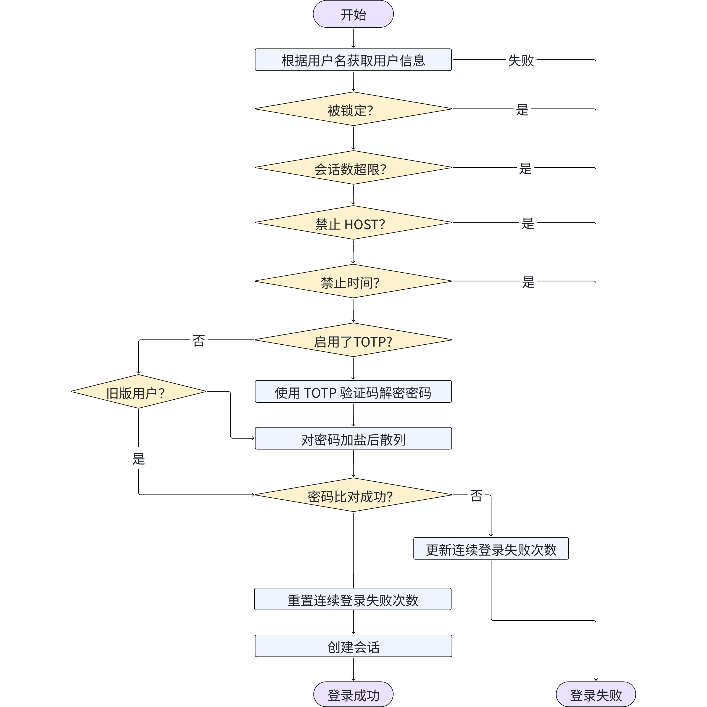
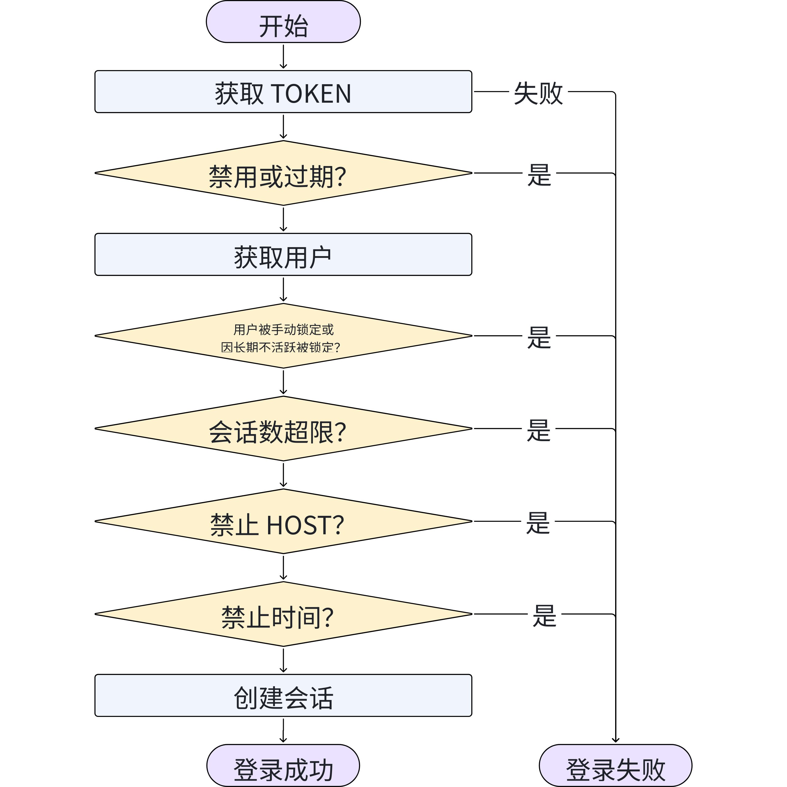
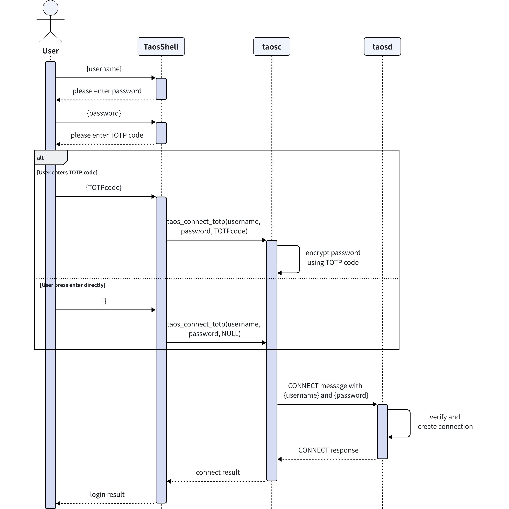

# 身份鉴别 FS

## 1. 修订记录

| 编写日期 | 发布日期 | 版本 | 修订人 | 主要修改内容 |
| --- | --- | --- | --- | --- |
| 2025-10-21 | - | 0.1 | 张博民 | 新建 |
| 2025-10-23 | - | 0.2 | 张博民 | 根据评审意见修改 |
| 2025-11-17 | 2025-11-19 | 1.0 | 张博民 | 将 ip 和时间黑白名单修改为同时支持黑名单和白名单 |
| 2025-11-24 | 2025-11-24 | 1.1 | 张博民 | 删除数据加密密钥（改为由客户端实现，密钥由用户直接输入） |
| 2025-12-09 | 2025-12-09 | 1.2 | 张博民 | 确认 TOTP 的实际实现方案，删除其他备选方案 |
| 2025-12-19 | 2025-12-19 | 1.3 | 张博民 | 增加动态获取连接信息的 api |
| 2026-01-14 | 2026-01-14 | 1.4 | 张博民 | 增加 TOKEN 通知 |

## 2. 背景

多个客户对强口令策略、登录失败锁定、密码生命周期、多因素认证、资源限制等等提出了需求，参见 JIRA
1. [TS-6481](https://jira.taosdata.com:18080/browse/TS-6481)
2. [TS-6865](https://jira.taosdata.com:18080/browse/TS-6865)
3. [TS-7231](https://jira.taosdata.com:18080/browse/TS-7231)

## 3. 定义

1. TOTP：基于时间和共享密钥生成一次性密码的算法

## 4. 行为说明

### 4.1 版本要求

1. 企业版支持
2. 社区版仅支持口令信息、用户锁定

### 4.2 创建用户

```plaintext {wrap}
CREATE USER [IF NOT EXISTS] <用户名> <口令信息> [<TOTP信息>] [<锁定子句>] [<功能限制>] [<资源限制>] [<HOST限制子句>][<时间限制子句>]

<口令信息> ::= PASS <口令>
<TOTP信息> :: TOTPSEED <totpseed>
<锁定子句> ::= ACCOUNT LOCK | ACCOUNT UNLOCK
<功能限制> ::= <功能限制项>{ <功能限制项>}
<功能限制项> ::=
        SYSINFO { 0 | 1 } |
        CREATEDB { 0 | 1 } |
        CHANGEPASS { 0 | 1 | 2 }
<资源限制> ::= <资源限制项>{ <资源限制项>}
<资源限制项> ::= 
        SESSION_PER_USER <参数设置> |
        CONNECT_IDLE_TIME <参数设置> |
        CONNECT_TIME <参数设置> |
        CALL_PER_SESSION <参数设置> |
        VNODE_PER_CALL <参数设置> |
        FAILED_LOGIN_ATTEMPTS <参数设置> |
        PASSWORD_LIFE_TIME <参数设置> | 
        PASSWORD_REUSE_TIME <参数设置> |
        PASSWORD_REUSE_MAX <参数设置> |
        PASSWORD_LOCK_TIME <参数设置> |
        PASSWORD_GRACE_TIME <参数设置>|
        INACTIVE_ACCOUNT_TIME <参数设置> |
        ALLOW_TOKEN_NUM <参数设置>
<参数设置> ::= <参数值> | UNLIMITED | DEFAULT
<HOST限制子句> ::= 
        HOST <HOST项>{,<HOST项>} |
        NOT_ALLOW_HOST <HOST项>{,<HOST项>}
<HOST项> ::= 
        <具体 IP 地址>|
        <以子网掩码表示的 IP 范围>
<时间限制子句> ::=
        ALLOW_DATETIME <时间项>{,<时间项>} |
        NOT_ALLOW_DATETIME <时间项>{,<时间项>}
<时间项> ::= 
        <具体日期> <起始时间> <时长> |
        <规则日期> <起始时间> <时长> 
<规则日期> ::= MON | TUE | WED | THU | FRI | SAT | SUN
```

#### 4.2.1 口令信息

1. 口令禁止与用户名相同
2. 口令长度为 8-255 位
3. 密码至少包含大写字母、小写字母、数字、特殊字符中的三类，特殊字符包括 `! @ # $ % ^ & * ( ) - _ + = [ ] { } : ; > < ? | ~ , .`
4. 口令采用单向散列算法变换为固定长度后存储，散列前进行随机加“盐”处理，确保相同口令的散列结果不同，盐值、散列值和散列算法一起存储在数据库中。
5. 3.3.8 版本的 EnableStrongPassword 选项，默认值应该为 1

#### 4.2.2 功能限制

1. SYSINFO：是否能够查看系统信息。`0` 表示无权查看，`1` 表示可以查看，默认为 `1`。
2. CREATEDB：表示该用户是否能够创建数据库。`0` 表示无权创建，`1` 表示可以创建，默认为 `0`。
3. CHANGEPASS：表示用户是否能够修改自己的密码。`0` 表示不能修改，`1` 表示必须修改（修改后，此限制自动变为 `2`），`2`表示可以修改，默认为 `2`。

#### 4.2.3 资源限制

以下限制中，第 1 - 5 项在  “[传输安全](https://taosdata.feishu.cn/wiki/ACKtwrzpbi4T62kXk79cC3Ixndb)” 中实现。
1. SESSION_PER_USER：每个用户的最大并发会话数，限制单个用户同时建立的数据库连接数量，防止资源独占。默认 `32`，最小 `1`，`-1` 代表 `UNLIMITED`。
2. CONNECT_TIME：单次会话最大持续时间（分钟），超时后自动断开连接，避免长期空闲会话占用资源。默认 `480`分钟，最小 `1` 分钟，`-1` 代表 `UNLIMITED`。
3. CONNECT_IDLE_TIME：会话最大空闲时间（分钟），连接无活动超过该时间后自动断开。默认 `30` 分钟，最小 `1` 分钟，`-1` 代表 `UNLIMITED`。
4. CALL_PER_SESSION ：单会话最大并发子调用数量。默认 `128`，最小 `1`，`-1` 代表 `UNLIMITED`。
5. VNODE_PER_CALL：单调用最大涉及 vnode 数量。默认 `-1`，代表 `UNLIMITED`。
6. FAILED_LOGIN_ATTEMPTS：允许的连续失败登录次数，超过次数后账户将被锁定，但不影响已经创建的会话，也不影响 TOKEN 登录。默认 `3`，最小 `1`，`-1` 代表 `UNLIMITED`。
7. PASSWORD_LOCK_TIME：密码锁定持续时间（分钟），账户因登录失败被锁定后的解锁等待时间。默认 `1440` 分钟，最小 `1` 分钟，`-1` 代表 `UNLIMITED`（即永久锁定）。
8. PASSWORD_LIFE_TIME：密码有效期（天），密码必须更改的周期，有效期内已经创建的会话在超出有效期后不受影响。默认 `90`，最小 `1`，`-1` 代表 `UNLIMITED`。
9. PASSWORD_GRACE_TIME：密码过期后的宽限期（天），密码过期后允许修改的缓冲时间，宽限期内禁止执行除修改密码以外的其他操作，宽限期内如未修改密码则锁定账户。默认 `7`，最小 `0`，`-1` 代表 `UNLIMITED`。
10. PASSWORD_REUSE_TIME：密码重用时间（天），旧密码失效后不能在此期限内重复使用。默认 `30`，最小 `0`，最大 `365` （不允许设置为 `UNLIMITED`）。
11. PASSWORD_REUSE_MAX：密码历史记录次数，需要多少次密码更改后才能重复使用旧密码。默认 `5`，最小 `0`，最大 `100`（不允许设置为 `UNLIMITED`）。新密码需同时满足 `PASSWORD_REUSE_TIME` 和 `PASSWORD_REUSE_MAX` 两项限制。
12. INACTIVE_ACCOUNT_TIME：账户不活动锁定时间（天），长期未使用的账户自动锁定。默认 `90`，最小 `1`，`-1` 代表 `UNLIMITED`（即永远不锁定）。为降低对系统性能的影响，不活动时间从用户末次成功登录起算。
13. ALLOW_TOKEN_NUM：支持的 TOKEN 个数，包括已经过期和被禁用的 TOKEN。默认 `3`，最小 `0`，`-1` 代表 `UNLIMITED`。

#### 4.2.4 密码过期

1. 密码强制过期（即 RS 上的密码过期功能），通过将功能限制中的 `CHANGEPASS` 置为`1`来实现。
2. 密码强制过期或超出有效期但在宽限期时，用户可使用原密码登录，但使用原密码创建的会话仅可更改密码，无法执行其他命令。 
3. 原密码超出宽限期后，锁定账户，用户不能使用原密码登录。

#### 4.2.5 用户锁定

在不删除用户的情况下，可手动对用户进行锁定和解锁。除手动锁定外，资源限制部分的限制项也会导致账户被自动锁定。用户被锁定后，不能使用密码（包括 TOTP 方式）登录，但不同的锁定方式对已创建的会话和TOKEN 登录等影响不同。
1. 保留 3.3.8 版本已经支持的 `ENABLE` 语法并提供 `ACCOUNT LOCK/UNLOCK`语法用于手动锁定和解锁。
2. 对于执行 `ACCOUNT LOCK`（或 `ENABLE`）导致的锁定，执行解锁命令前不会自动解锁；用户被永久锁定后不能以任何方式登录，已经创建的会话被立即关闭。
3. 对于超出资源限制中的 `FAILED_LOGIN_ATTEMPTS` 导致的锁定，在 `PASSWORD_LOCK_TIME` 后会自动解锁，也可通过 `ACCOUNT UNLOCK` 命令手动解锁；进入此种锁定状态，不影响已经创建的会话，且用户可使用 TOKEN 登录。
4. 对于超出资源限制中的 `INACTIVE_ACCOUNT_TIME` 导致的锁定，只能通过 `ACCOUNT UNLOCK` 命令手动解锁。进入此种锁定状态，不影响已经创建的会话，但用户不能以任何方式创建新的会话。
5. 对于超出资源限制中的 `PASSWORD_LIFE_TIME` 导致的锁定，只能通过修改密码解锁。进入此种锁定状态后，不影响已经创建的会话，且用户可使用 TOKEN 登录。
6. 不同的锁定原因可以共存，所有锁定的原因消除后才能最终解锁，锁定状态的功能限制以各种原因中最严格的标准执行。

#### 4.2.6 允许和禁止 HOST

1. 允许 HOST 项和禁止 HOST 项同时存在时，允许属于“允许HOST项“且不属于”禁止HOST项“的 IP 地址，禁止其他地址。
2. 支持 IPv4 和 IPv6

#### 4.2.7 允许和禁止时间

1. 允许时间和禁止时间同时存在时，允许在属于“允许时间”且不属于“禁止时间”登录，其他时间禁止登录。
2. 用户不能在禁止时间段登录，已经登录的用户需强制下线。
3. 规则中的时间和日期不包含时区信息，实际生效时，以服务端所在时区为准。
4. 具体日期采用 YYYY-MM-DD  格式，起始时间包括小时和分钟，采用 HH:mm 格式。
5. 时长以分钟为单位。

### 4.3 修改用户配置

由于用户信息中增加了很多可选项，`ALTER USER` 语句也需做相应调整，新的语法如下：
```plaintext {wrap}
ALTER USER <用户名> <ALTER_USER_CLAUSE>

<ALTER_USER_CLAUSE> ::=
        <口令信息> |
        ENABLE { 0 | 1 } |
        <锁定子句> |
        <功能限制项> |
        <资源限制项> |
        ADD HOST <HOST 项> |
        ADD NOT_ALLOWED_HOST <HOST 项> |
        DROP HOST <HOST 项> |
        DROP NOT_ALLOWED_HOST <HOST 项> |
        ADD ALLOW_DATETIME <时间项> |
        ADD NOT_ALLOW_DATETIME <时间项> |
        DROP ALLOW_DATETIME <时间项> |
        DROP NOT_ALLOW_DATETIME <时间项>
```

允许 HOST 项和禁止 HOST 项互斥，当存在允许 HOST 项时，不允许添加禁止 HOST 项，反之亦然；允许和禁止时间也按同样逻辑处理。

#### 4.3.1 客户端通知

1. 可以在客户端连接注册允许禁止 HOST 和时间的变化通知（下面的代码亦包含 TOKEN 相关通知的定义）
```cpp {wrap}
typedef enum {
  TSDB_TOKEN_EVENT_MODIFIED = 0,
  TSDB_TOKEN_EVENT_DROPPED,
  TSDB_TOKEN_EVENT_DISABLED,
  TSDB_TOKEN_EVENT_EXPIRED,
} TOKEN_EVENT_TYPE;

typedef struct {
  int8_t      type;        // token event type
  int32_t     expireTime;  // seconds since epoch
  char        tokenName[TSDB_TOKEN_NAME_LEN];
} STokenEvent;

typedef enum {
  TAOS_NOTIFY_PASSVER = 0,
//TAOS_NOTIFY_WHITELIST_VER = 1,
  TAOS_NOTIFY_HOST_WHITELIST_VER = 1,
  TAOS_NOTIFY_USER_DROPPED = 2,
  TAOS_NOTIFY_TIME_WHITELIST_VER = 3,
  TAOS_NOTIFY_TOKEN = 4, // in the callback, [ext] is 'const STokenEvent*'
} TAOS_NOTIFY_TYPE;

// 用于向前兼容（之前已有 HOST 白名单，但没有黑名单）
#define TAOS_NOTIFY_WHITELIST_VER TAOS_NOTIFY_HOST_WHITELIST_VER 

DLL_EXPORT int taos_set_notify_cb(TAOS *taos, __taos_notify_fn_t fp, void *param, int type);
```

1. 通过以下 api 获得更新后的白名单
```cpp {wrap}
// 异步获取用户 IP 黑白名单后的处理函数
typedef void (*__taos_async_ip_whitelist_fn_t)(void *param, int code, TAOS *taos, int numOfWhiteLists, char **pWhiteLists);

DLL_EXPORT void taos_fetch_ip_whitelist_a(TAOS *taos, __taos_async_ip_whitelist_fn_t fp, void *param);

// 异步获取用户时间黑白名单
typedef void (*__taos_async_datetime_whitelist_fn_t)(void *param, int code, TAOS *taos, int numOfWhiteLists, char **pWhiteLists);

DLL_EXPORT void taos_fetch_datetime_whitelist_a(TAOS *taos, __taos_async_datetime_whitelist_fn_t fp, void *param);

```

#### 4.3.2 生效时间

用户配置被修改后，新配置项生效时机如下：
- **立即生效（立即中断不符合限制条件的连接）：**锁定、允许和禁止的 HOST、允许和禁止的时间段、CONNECT_IDLE_TIME、CONNECT_TIME
- **下次使用相关功能或进行相关检查前生效：**功能限制项、SESSION_PER_USER、CALL_PER_SESSION、VNODE_PER_CALL、FAILED_LOGIN_ATTEMPTS、PASSWORD_LIFE_TIME、PASSWORD_LOCK_TIME、PASSWORD_GRACE_TIME、INACTIVE_ACCOUNT_TIME
- **PASSWORD_REUSE_TIME 和 PASSWORD_REUSE_MAX：**在下次修改密码前生效，如存在超出限制范围的历史密码，则清除
- **ALLOW_TOKEN_NUM：**在下次创建 TOKEN 前生效，不影响已经创建的 TOKEN 的有效性，但在 TOKEN 数量小于限额前，不允许创建新的 TOKEN

### 4.4 TOTP 认证

启用 TOTP 认证需要生成 TOTP 密钥，可通过 `SHOW USERS` 命令结果中的 `totp` 字段查看用户是否打开了 TOTP 认证，如打开其值为 1，否则为 0。
TOTP 密钥使用以下语句生成：
```c
CREATE TOTP_SECRET FOR USER <username>;
DROP TOTP_SECRET FROM USER <username>;
```

- CREATE 命令既用于生成 TOTP 密钥，也用于更新 TOTP 密钥，执行此命令将直接返回生成的密钥。
- DROP 命令清除用户的 TOTP 密钥。

### 4.5 TOKEN 认证

令牌信息存储在系统表 ins_tokens 表中，包括：令牌对应的 client_id（此 id 可以唯一标识一个令牌）、令牌对应的用户名、令牌（自动生成）、创建时间、有效期、禁用状态以及其他可扩展的字符串等。
```sql {wrap}
CREATE TOKEN [IF NOT EXISTS] <令牌名称> FROM USER <用户名> [<令牌属性>]

<令牌属性> ::= ENABLE { 0 | 1 } |
              PROVIDER <provider name>
              TTL <ttl>
              EXTRA_INFO <extra info>

DROP TOKEN [IF EXISTS] <令牌名称>
ALTER TOKEN <令牌名称> [<令牌属性>]
SELECT * FROM ins_tokens
SHOW TOKENS
```

其中：
- `<令牌名称>` 即 `client_id`.
- TTL 指定令牌有效期，以天为单位，0表示永不过期；创建 TOKEN 时从创建时起算，修改后以修改时间起算。
- 客户端如以 TOKEN 方式创建连接，可以注册对应 TOKEN 的事件通知，具体方法，见[第 4.3.1 节](https://taosdata.feishu.cn/wiki/CXXqwV3Fai36rQkby6zcmBWwnMd#share-HmIQdibH6o6rV7x3cFoc0gIGnHf)。

### 4.6 登录流程和会话管理

由于增加了 TOTP 和 TOKEN 登录方式，需对原有登录流程和 API 进行调整。同时，新增加的资源限制等功能会强制断开已有连接，影响 taosadapter 等应用的连接池管理逻辑，亦需调整和增加 API。

#### 4.6.1 API

```c {wrap}
TAOS *taos_connect(const char *ip, const char *user, const char *pass, const char *db, uint16_t port);

TAOS *taos_connect_totp(const char *ip, const char *user, const char *pass, const char* totpcode, const char *db, uint16_t port);

TAOS *taos_connect_token(const char *ip, const char *token, const char *db, uint16_t port);

int taos_connect_test(const char *ip, const char *user, const char *pass, const char* totpcode, const char *db, uint16_t port);

int taos_check_connection(TAOS* taos);

TAOS *taos_connect_auth(const char *ip, const char *user, const char *auth, const char *db, uint16_t port);

typedef enum {
  TSDB_CONNECTION_INFO_USER = 0,         // name of current user
  TSDB_MAX_CONNECTION_INFO
} TSDB_CONNECTION_INFO;

int taos_get_connection_info(TAOS *taos, TSDB_CONNECTION_INFO info, char* buffer, int* len);
```

1. `taos_connect` 的行为保持不变，但仅支持“用户名 + 密码”认证，不支持 TOTP 和 TOKEN 认证。
2. 增加 `taos_connect_totp`，用于 TOTP 认证，此 API 兼容 `taos_connect`，即在调用方未提供 TOTP 验证码时，其行为和 `taos_connect` 相同。当因为 TOTP 验证码错误导致登录失败时，错误代码是 `TSDB_CODE_MND_WRONG_TOTP_CODE`。
3. 增加 `taos_connect_token`，用于 TOKEN 认证。
4. 增加 `taos_connect_test`（暂定名称），实现逻辑与 `taos_connect_totp` 相同，但不创建会话，只返回身份验证的结果。此 API 内部使用，仅供 taosadapter 等进行连接池管理。
5. 增加 `taos_check_connection` (暂定名称），用于检查已有连接的状态，如是否已被服务端断开等。此 API 内部使用，在 “[传输安全](https://taosdata.feishu.cn/wiki/ACKtwrzpbi4T62kXk79cC3Ixndb)” 中实现，仅供 taosadapter 等进行连接池管理。
6. 逐步废弃 `taos_connect_auth`，后续不再做任何修改，即：此 API 仅支持旧版使用 MD5 进行密码散列的用户。
7. 增加 `taos_get_connection_info`，用于获取当前用户等联系信息，主要用于 TOKEN 登录场景（此场景下，登录时客户端不知道用户身份，故需登录后动态从服务端获取）。

#### 4.6.2 登录流程

##### 4.6.2.1 服务端密码登录流程（含 TOTP 方式）



##### 4.6.2.2 服务端 TOKEN 登录流程



##### 4.6.2.3 总体登录流程



#### 4.6.3 会话管理

1. 创建会话时记录会话的建立方式，包括“TOKEN 连接”和“密码连接”两种。
2. `SHOW CONNECTION` 语句支持展示连接方式字段。
3. 客户端通过 `taos_connect_test` 和 `taos_check_connection` 进行连接池管理。

## 5. 性能

身份鉴别引入的以下操作会带来额外开销，造成性能下降：
1. 密码过期或启用了 TOTP 但尚未创建密钥时可以执行的命令受到到限制，这需要在所有操作前执行相应的前置检查。
2. 会话时间等选项等的控制会产生额外的条件判断。
3. 新使用的加密算法可能更耗时。
在不考虑以上第 3 点的情况下，登录速度的下降控制在 30 %以内。
由于身份鉴别部分仅保存与写入和查询相关的参数，基本不实际使用这些参数，故写入和查询性能指标由 “[传输安全](https://taosdata.feishu.cn/wiki/ACKtwrzpbi4T62kXk79cC3Ixndb)” 制定。

## 6. 安全

1. 对各命令的执行权限进行控制和审计，具体见“访问控制”部分。
2. 使用 TOKEN 登录时，即使 TOKEN 对应的用户有权限修改 TOKEN 的有效期，也无权修改 TOKEN 的有效期。

## 7. 兼容性

### 7.1 总体要求

1. 需向后兼容，自 3.3.8 版本升级至本版本时，不需要手工干预
2. 尽可能不改变现有的已存在语法，不影响写入、查询
3. 不能退回到旧版本

### 7.2 旧版本创建的用户的口令

1. 旧版本数据库创建的用户的口令使用的散列算法是 MD5 且未进行加盐处理，数据库中也未记录散列算法信息，所以：
   - 进行口令比对时，如口令有对应的散列算法，则按新版本逻辑进行比对
   - 进行口令比对时，如口令没有对应的散列算法，则按旧版本逻辑进行比对
2. 用户修改密码时，使用新版本逻辑进行散列处理，完成升级

### 7.3 数据加密密钥

旧版本数据库创建的用户没有数据加密密钥，为允许这些用户通过“[安全函数](https://taosdata.feishu.cn/wiki/K6yOwulCHiwXPIk0iv0coTCYnsc)”中对数据进行加解密，需要在合适的时机为他们生成此密钥，可选时机有多个，在开发时根据实现难度选择其一：
1. 首选：新版本启动时，检查所有用户是否已经设置数据加密密钥，如果没有，则自动生成
2. 首次请求数据加密密钥时，如果用户尚未设置此密钥，则自动生成
3. 用户修改登录密码时，如果尚未设置此密钥，则自动生成

## 8. 运维

无。

## 9. 约束和限制

无。

## 10. 常见错误和排查

无。

## 11. 可观测性

无

## 12. 安装和卸载

无

## 13. 文档

需要修改官网文档

## 14. 参考文档

- [身份鉴别 RS](https://taosdata.feishu.cn/wiki/GZNPwH62SiiRtQkQHTvcM73YnDh)
- JIRA [TS-7231](https://jira.taosdata.com:18080/browse/TS-7231)
- [IP 白名单用户手册](https://taosdata.feishu.cn/wiki/TEQlwg19hizT7ukPcWscRRYunub)
- [IP 白名单-Function Spec](https://taosdata.feishu.cn/wiki/WwJiwYgrwisPTxkm2NXc73VNnMd)

## 15. 附录

无。
