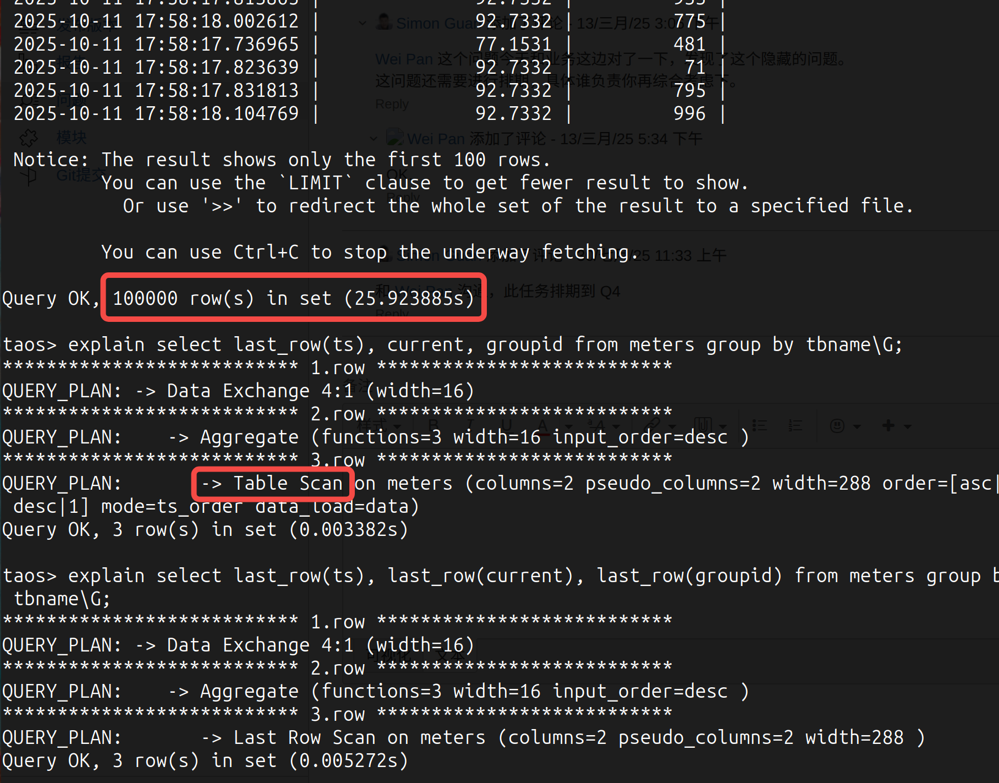
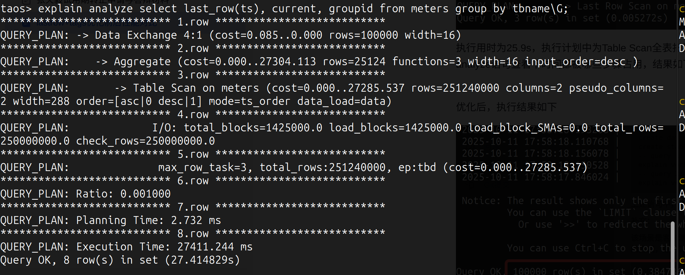
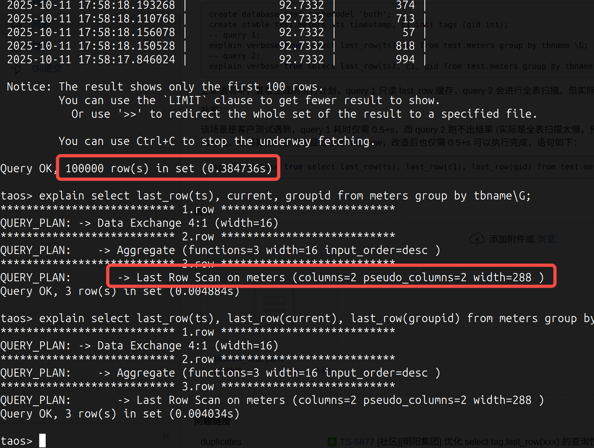

# Last_row + tags 性能优化测试报告

## 1. 修订记录

| 编写日期 | 发布日期 | 版本 | 修订人 | 主要修改内容 |
| --- | --- | --- | --- | --- |
| 2025-10-13 | - | 0.1 | 张天毅 | 创建 |
| 2025-10-13 | 2025-10-13 | 1.0 | 关胜亮 | 调整目录结构及措辞 |

## 2. 测试目标

在实际查询中，获取设备最新状态（`last_row`）并同时关联其静态属性（Tags）是一种高频场景。本测试将验证，优化后的执行计划能否显著提升此类复合查询的性能。

## 3. 参考文档

JIRA：[TS-6146](https://jira.taosdata.com:18080/browse/TS-6146)

## 4. 测试结论

执行计划优化后，查询是否读取缓存不再受标签字段的影响，缓存机制与标签数据实现解耦，从而显著提升了查询性能。具体表现如下：
1. 数据模型：10w 子表，每个子表 1w 条数据
2. 查询语句：按子表分组，查询标签及最后一条数值（`tag + last_row(value)`）
3. 性能对比：
   - 优化前执行时间：​25.9 秒
   - 优化后执行时间：​0.38 秒
   - 性能提升约 68 倍

## 5. 测试方法

### 5.1 测试环境

1. OS: Linux
2. CPU: intel core ultra 9 285H, 16core
3. Memory: 64Gb
4. Taosd: 单节点

### 5.2 测试数据与模型

1. 数据模型​：智能电表
2. 写入工具：taosgen
3. 数据规模：10w 子表的超级表，每个子表中包含 1w 行数据
taosgen 的配置文件如下所示：
<view type="1">

  > ⚠ 嵌入文件，需在飞书中查看 (token: OFUMbT2wKoDYlexmAxOcKZrbn9c)

</view>

### 5.3 查询语句

`select last_row(ts), current, groupid from meters group by tbname`

### 5.4 测试流程

1. 环境部署​：在独立的纯净测试环境中，分别部署优化前与优化后的 TDengine 版本，确保测试环境一致。
2. 元数据准备​：依次创建测试所需的数据库、超级表及子表结构。
3. 查询性能对比测试​：
   - 在优化前版本中执行指定查询语句，记录查询耗时，并观察执行计划（显示为 Table Scan​）。
   - 在优化后版本中执行相同查询语句，记录查询耗时，并观察执行计划（显示为 Last Row Scan​）。
   - 反复执行查询 10 次，排除偶发差异
4. 结果验证​：对比两次查询的结果集，确保数据准确性一致，排除优化引入的逻辑差异。

## 6. 测试结果

### 6.1 优化前

优化前，查询用时为 25.9 s，执行计划中为 Table Scan 全表扫描。

通过 explain analyze 语句，可以查看到各步骤耗时。结果如下：

可以看出大部分时间被Table Scan占据。

### 6.2 优化后

优化后，查询用时为 0.4s，且执行计划中为读 Cache。执行结果如下：

### 6.3 测试结果对比

| 测试指标 | 优化前 | 优化后 | 性能变化 |
| --- | --- | --- | --- |
| 平均查询耗时（秒） | 25.9 | 0.385 | 提升 68 倍 |

## 7. 纳入发版前流程

为确保 Last_row 性能在迭代中出现回退，本次测试用例将纳入发版前验证体系。具体实施步骤如下：
1. 在性能测试的查询用例中新增 Last_row + tags 查询语句
2. 测试优化后的版本 3.3.8.2+
3. 测试结果记录到性能测试记录中，以便下次比对
