# TS-7451 虚拟表性能优化对比测试

## 1. 修订记录

| 编写日期 | 发布日期 | 版本 | 修订人 | 主要修改内容 |
| --- | --- | --- | --- | --- |
| 2025-10-16 | - | 1.0 | 司马靖 | 创建 |
| 2025-10-17 | 2025-10-17 | 1.1 | 关胜亮 | 调整目录结构及措辞 |

## 2. 测试目标

本测试验证如下查询性能优化措施的实际效果，确保优化达到预期目标。
1. 虚拟表的投影查询性能
2. 虚拟超级表的投影查询 +  tag/tbname 过滤
3. 虚拟超级表时间范围过滤查询

## 3. 参考文档

1. JIRA：[TS-7451](https://jira.taosdata.com:18080/browse/TS-7451)
2. JIRA：[TS-7202](https://jira.taosdata.com:18080/browse/TS-7202)
3. [一种工业采集和建模方案](https://taosdata.feishu.cn/wiki/IDdew3BsyivaCOkaYi3cRBSXnnh)

## 4. 测试结论

本次性能优化取得了显著成效，优化后的虚拟表查询性能得到大幅提升。在结合了标签过滤（Tag Filtering）和时间范围过滤的复合查询场景中，性能提升更为明显，显著解决了虚拟表的查询性能瓶颈。

| 测试场景 | 优化前平均耗时 | 优化后平均耗时 | 性能提升倍数 | 非虚拟表耗时 | 虚拟表性能差距 |
| --- | --- | --- | --- | --- | --- |
| 虚拟超级表 - 全量投影查询 | 124.7 | 91.6 | 1.36倍 | 2.8 | 约 33x 较慢 |
| 虚拟超级表 - TBName 过滤 | 127.1 | 1.00 | 127倍 | 0.13 | 约 8x 较慢 |
| 虚拟超级表 - Tag 过滤 | 126.9 | 0.92 | 138倍 | 0.11 | 约 8x 较慢 |
| 虚拟超级表 - 时间范围过滤 | 126.6 | 3.55 | 35倍 | 0.14 | 约 25x 较慢 |
| 虚拟超级表 - 时间+Tag 过滤 | 127.6 | 0.074 | 1724倍 | 0.03 | 约 2.4x 较慢 |
| 虚拟子表 - 投影查询 | 0.42 | 0.26 | 1.38倍 | 0.047 | 约 5.5x 较慢 |

## 5. 测试方法

### 5.1 环境准备

1. CPU 信息：
  ```yaml
  $ lscpu
  Architecture:                x86_64
    CPU op-mode(s):            32-bit, 64-bit
    Address sizes:             46 bits physical, 48 bits virtual
    Byte Order:                Little Endian
  CPU(s):                      72
    On-line CPU(s) list:       0-71
  Vendor ID:                   GenuineIntel
    Model name:                Intel(R) Xeon(R) CPU E5-2686 v4 @ 2.30GHz
      CPU family:              6
      Model:                   79
      Thread(s) per core:      2
      Core(s) per socket:      18
      Socket(s):               2
      Stepping:                1
      CPU(s) scaling MHz:      40%
      CPU max MHz:             3000.0000
      CPU min MHz:             1200.0000
      BogoMIPS:                4588.97
      Flags:                   fpu vme de pse tsc msr pae mce cx8 apic sep mtrr pge mca cmov pat pse36 clflush dts acpi mmx fxsr sse sse2 ss ht tm pbe syscall nx pdpe1gb rdtscp lm constant_tsc arch_perfmon pebs bts rep_good nopl xtopology nonstop_tsc cpuid aperfmperf pni pc
                               lmulqdq dtes64 monitor ds_cpl vmx smx est tm2 ssse3 sdbg fma cx16 xtpr pdcm pcid dca sse4_1 sse4_2 x2apic movbe popcnt tsc_deadline_timer aes xsave avx f16c rdrand lahf_lm abm 3dnowprefetch cpuid_fault epb cat_l3 cdp_l3 pti intel_ppin ssbd ibr
                               s ibpb stibp tpr_shadow flexpriority ept vpid ept_ad fsgsbase tsc_adjust bmi1 hle avx2 smep bmi2 erms invpcid rtm cqm rdt_a rdseed adx smap intel_pt xsaveopt cqm_llc cqm_occup_llc cqm_mbm_total cqm_mbm_local dtherm ida arat pln pts vnmi md_cle
                               ar flush_l1d
  Virtualization features:
    Virtualization:            VT-x
  Caches (sum of all):
    L1d:                       1.1 MiB (36 instances)
    L1i:                       1.1 MiB (36 instances)
    L2:                        9 MiB (36 instances)
    L3:                        90 MiB (2 instances)
  NUMA:
    NUMA node(s):              1
    NUMA node0 CPU(s):         0-71
  Vulnerabilities:
    Gather data sampling:      Not affected
    Ghostwrite:                Not affected
    Indirect target selection: Not affected
    Itlb multihit:             KVM: Mitigation: Split huge pages
    L1tf:                      Mitigation; PTE Inversion; VMX conditional cache flushes, SMT vulnerable
    Mds:                       Mitigation; Clear CPU buffers; SMT vulnerable
    Meltdown:                  Mitigation; PTI
    Mmio stale data:           Mitigation; Clear CPU buffers; SMT vulnerable
    Reg file data sampling:    Not affected
    Retbleed:                  Not affected
    Spec rstack overflow:      Not affected
    Spec store bypass:         Mitigation; Speculative Store Bypass disabled via prctl
    Spectre v1:                Mitigation; usercopy/swapgs barriers and __user pointer sanitization
    Spectre v2:                Mitigation; Retpolines; IBPB conditional; IBRS_FW; STIBP conditional; RSB filling; PBRSB-eIBRS Not affected; BHI Not affected
    Srbds:                     Not affected
    Tsx async abort:           Mitigation; Clear CPU buffers; SMT vulnerable
  ```

1. 内存信息：
  ```sql
  free -h
                 total        used        free      shared  buff/cache   available
  Mem:            62Gi       2.1Gi        50Gi        14Mi        10Gi        60Gi
  Swap:          8.0Gi          0B       8.0Gi
  ```

1. 磁盘信息：
  ```bash
  lsblk
  
  NAME        MAJ:MIN RM   SIZE RO TYPE MOUNTPOINTS
  loop0         7:0    0  63.8M  1 loop /snap/core20/2669
  loop1         7:1    0     4K  1 loop /snap/bare/5
  loop2         7:2    0  73.9M  1 loop /snap/core22/2133
  loop3         7:3    0  73.9M  1 loop /snap/core22/2045
  loop4         7:4    0  11.1M  1 loop /snap/firmware-updater/167
  loop6         7:6    0   516M  1 loop /snap/gnome-42-2204/202
  loop7         7:7    0   1.7M  1 loop /snap/jump/81
  loop8         7:8    0  91.7M  1 loop /snap/gtk-common-themes/1535
  loop9         7:9    0  10.8M  1 loop /snap/snap-store/1270
  loop10        7:10   0  49.3M  1 loop /snap/snapd/24792
  loop11        7:11   0  50.8M  1 loop /snap/snapd/25202
  loop12        7:12   0   576K  1 loop /snap/snapd-desktop-integration/315
  loop13        7:13   0 516.2M  1 loop /snap/gnome-42-2204/226
  loop14        7:14   0 247.6M  1 loop /snap/firefox/6966
  loop15        7:15   0  18.5M  1 loop /snap/firmware-updater/210
  loop16        7:16   0 248.8M  1 loop /snap/firefox/7024
  nvme0n1     259:0    0 476.9G  0 disk
  ├─nvme0n1p1 259:1    0     1G  0 part /boot/efi
  └─nvme0n1p2 259:2    0 475.9G  0 part /
  ```

1. 操作系统信息：
  ```sql
  uname -a
  Linux simon-X99 6.14.0-33-generic #33~24.04.1-Ubuntu SMP PREEMPT_DYNAMIC Fri Sep 19 17:02:30 UTC 2 x86_64 x86_64 x86_64 GNU/Linux
  ```

### 5.2 数据准备

1. 原始表数据准备：insert.json
  ```json
  {
    "filetype": "insert",
    "cfgdir": "/etc/taos",
    "host": "127.0.0.1",
    "port": 6030,
    "user": "root",
    "password": "taosdata",
    "connection_pool_size": 8,
    "thread_count": 60,
    "create_table_thread_count": 4,
    "result_file": "./insert_res.txt",
    "confirm_parameter_prompt": "no",
    "num_of_records_per_req": 1000000,
    "prepared_rand": 10000,
    "chinese": "no",
    "escape_character": "yes",
    "continue_if_fail": "no",
    "databases": [
      {
        "dbinfo": {
          "name": "test_vtable_perf",
          "drop": "yes",
          "vgroups": 8,
          "precision": "ms"
        },
        "super_tables": [
          {
            "name": "stb_bool",
            "child_table_exists": "no",
            "childtable_count": 100,
            "childtable_prefix": "ctb_bool",
            "auto_create_table": "no",
            "batch_create_tbl_num": 5,
            "data_source": "rand",
            "insert_mode": "taosc",
            "non_stop_mode": "no",
            "line_protocol": "line",
            "insert_rows": 100000,
            "childtable_limit": 0,
            "childtable_offset": 0,
            "interlace_rows": 0,
            "insert_interval": 0,
            "partial_col_num": 0,
            "timestamp_step": 5,
            "start_timestamp": "2020-10-01 00:00:00.000",
            "sample_format": "csv",
            "sample_file": "./sample.csv",
            "use_sample_ts": "no",
            "tags_file": "",
            "columns": [
              {"type": "bool", "name": "bool_col", "count": 1, "max": 1, "min": 0 }
            ],
            "tags": [
              {"type": "TINYINT", "name": "groupid", "max": 10, "min": 1}
            ]
          },
          {
            "name": "stb_int",
            "child_table_exists": "no",
            "childtable_count": 100,
            "childtable_prefix": "ctb_int",
            "auto_create_table": "no",
            "batch_create_tbl_num": 5,
            "data_source": "rand",
            "insert_mode": "taosc",
            "non_stop_mode": "no",
            "line_protocol": "line",
            "insert_rows": 100000,
            "childtable_limit": 0,
            "childtable_offset": 0,
            "interlace_rows": 0,
            "insert_interval": 0,
            "partial_col_num": 0,
            "timestamp_step": 5,
            "start_timestamp": "2020-10-01 00:00:00.000",
            "sample_format": "csv",
            "sample_file": "./sample.csv",
            "use_sample_ts": "no",
            "tags_file": "",
            "columns": [
              {"type": "int", "name": "int_col", "count": 1, "max": 2147483647, "min": -2147483648 }
            ],
            "tags": [
              {"type": "TINYINT", "name": "groupid", "max": 10, "min": 1}
            ]
          },
          {
            "name": "stb_float",
            "child_table_exists": "no",
            "childtable_count": 100,
            "childtable_prefix": "ctb_float",
            "auto_create_table": "no",
            "batch_create_tbl_num": 5,
            "data_source": "rand",
            "insert_mode": "taosc",
            "non_stop_mode": "no",
            "line_protocol": "line",
            "insert_rows": 100000,
            "childtable_limit": 0,
            "childtable_offset": 0,
            "interlace_rows": 0,
            "insert_interval": 0,
            "partial_col_num": 0,
            "timestamp_step": 5,
            "start_timestamp": "2020-10-01 00:00:00.000",
            "sample_format": "csv",
            "sample_file": "./sample.csv",
            "use_sample_ts": "no",
            "tags_file": "",
            "columns": [
              {"type": "float", "name": "float_col", "count": 1, "max": 100000, "min": -100000 }
            ],
            "tags": [
              {"type": "TINYINT", "name": "groupid", "max": 10, "min": 1}
            ]
          },
          {
            "name": "stb_double",
            "child_table_exists": "no",
            "childtable_count": 100,
            "childtable_prefix": "ctb_double",
            "auto_create_table": "no",
            "batch_create_tbl_num": 5,
            "data_source": "rand",
            "insert_mode": "taosc",
            "non_stop_mode": "no",
            "line_protocol": "line",
            "insert_rows": 100000,
            "childtable_limit": 0,
            "childtable_offset": 0,
            "interlace_rows": 0,
            "insert_interval": 0,
            "partial_col_num": 0,
            "timestamp_step": 5,
            "start_timestamp": "2020-10-01 00:00:00.000",
            "sample_format": "csv",
            "sample_file": "./sample.csv",
            "use_sample_ts": "no",
            "tags_file": "",
            "columns": [
              {"type": "double", "name": "double_col", "count": 1, "max": 100000000, "min": -100000000 }
            ],
            "tags": [
              {"type": "TINYINT", "name": "groupid", "max": 10, "min": 1}
            ]
          },
          {
            "name": "stb_ubigint",
            "child_table_exists": "no",
            "childtable_count": 100,
            "childtable_prefix": "ctb_ubigint",
            "auto_create_table": "no",
            "batch_create_tbl_num": 5,
            "data_source": "rand",
            "insert_mode": "taosc",
            "non_stop_mode": "no",
            "line_protocol": "line",
            "insert_rows": 100000,
            "childtable_limit": 0,
            "childtable_offset": 0,
            "interlace_rows": 0,
            "insert_interval": 0,
            "partial_col_num": 0,
            "timestamp_step": 5,
            "start_timestamp": "2020-10-01 00:00:00.000",
            "sample_format": "csv",
            "sample_file": "./sample.csv",
            "use_sample_ts": "no",
            "tags_file": "",
            "columns": [
              {"type": "ubigint", "name": "u_bigint_col", "count": 1, "max": 18446744073709551615, "min": 0 }
            ],
            "tags": [
              {"type": "TINYINT", "name": "groupid", "max": 10, "min": 1}
            ]
          }
        ]
      }
    ]
  }
  ```

1. 虚拟表创建 sql 生成脚本 genVtable.sh：
  ```bash
  #!/bin/bash
  
  # 使用方法：
  # ./generate_sql.sh 10 output.sql
  # 第一个参数是生成的条数，第二个参数是输出文件名（可选，默认 output.sql）
  
  # 检查输入参数
  if [ -z "$1" ]; then
    echo "❌ 请提供要生成的 SQL 条数。"
    echo "用法: $0 <数量> [输出文件名]"
    exit 1
  fi
  
  count=$1
  output_file=${2:-output.sql}
  
  # 清空或创建输出文件
  > "$output_file"
  echo "create stable vst_table (ts timestamp, c_bool bool, c_int int, c_float float, c_double double, c_ubigint bigint unsigned) tags(tint int, tchar varchar(20)) virtual 1;" >> "$output_file"
  # 生成 SQL
  for ((i=0; i<count; i++)); do
    echo "create vtable vct_d${i} (c_bool from ctb_bool${i}.bool_col, c_int from ctb_int${i}.int_col, c_float from ctb_float${i}.float_col, c_double from ctb_double${i}.double_col, c_ubigint from ctb_ubigint${i}.u_bigint_col) using vst_table tags(${i}, '${i}');" >> "$output_file"
  done
  
  echo "✅ 已生成 $count 条 SQL 语句到文件：$output_file"
  ```

1. 与虚拟表同结构的超级表/子表创建 sql 生成脚本 genTable.sh:
  ```bash
  #!/bin/bash
  
  # 使用方法：
  # ./generate_sql.sh 10 output.sql
  # 第一个参数是生成的条数，第二个参数是输出文件名（可选，默认 output.sql）
  
  # 检查输入参数
  if [ -z "$1" ]; then
    echo "❌ 请提供要生成的 SQL 条数。"
    echo "用法: $0 <数量> [输出文件名]"
    exit 1
  fi
  
  count=$1
  output_file=${2:-output.sql}
  
  # 清空或创建输出文件
  > "$output_file"
  echo "create stable st_table (ts timestamp, c_bool bool, c_int int, c_float float, c_double double, c_ubigint bigint unsigned) tags(tint int, tchar varchar(20));" >> "$output_file"
  # 生成 SQL
  for ((i=0; i<count; i++)); do
    echo "create table ct_d${i} using st_table tags(${i}, '${i}');" >> "$output_file"
  done
  
  for ((i=0; i<count; i++)); do
    echo "insert into ct_d${i} select * from vct_d${i};" >> "$output_file"
  done
  
  echo "✅ 已生成 $count 条 SQL 语句到文件：$output_file"
  ```

### 5.3 测试步骤

1. 使用 taosBenchmark + 3.1 中提供的 insert.json 生成原始表数据
```json
taosBenchmark -f insert.json
```

1. 使用 3.2 中提供的脚本 genVtable.sh 生成创建虚拟表的 sql 语句：
```json
./genVtable.sh 100
```

1. 执行 4.2 中生成的 sql 语句，创建虚拟表
```sql
taos> source /home/simon/taosdata/insertJson/TS-7451/output.sql;
```

1. 使用 3.3 中提供的脚本 genTable.sh 生成与虚拟表同结构的超级表/子表创建 sql
```sql
./genTtable.sh 100 output2.sql
```

1. 执行 4.4 中生成的 sql 语句，创建对照超级表/子表，并将虚拟表的数据写入该表
```sql
taos> source /home/simon/taosdata/insertJson/TS-7451/output2.sql;
```

1. 执行测试语句，记录虚拟表查询性能

## 6. 测试结果

### 6.1 虚拟超级表性能

1. 投影查询全量数据
  ```sql
  select * from vst_table;
  select * from st_table;
  ```


  | 查询耗时(优化前) | 查询耗时(优化后) | 非虚拟超级表耗时 | （优化前） | （优化后） | （非虚拟超级表） |
| --- | --- | --- | --- | --- | --- |
| 126.019090s | 91.807655s | 2.545779s | 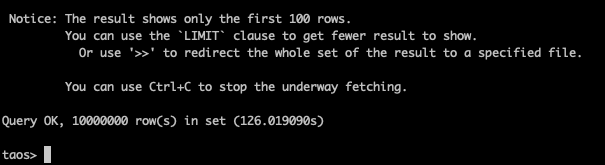 | 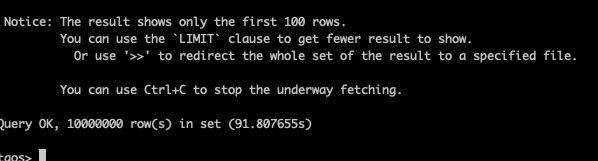 | 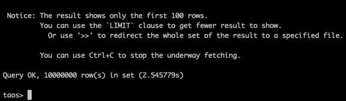 |
| 121.537200s | 91.579942s | 2.851700s | 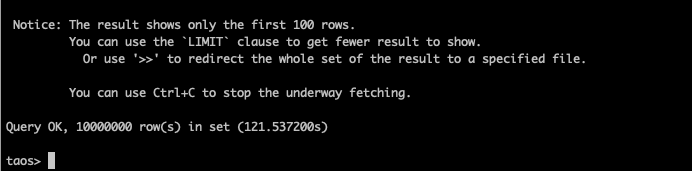 |  | 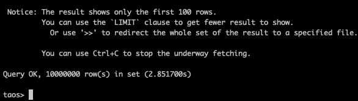 |
| 126.670313s | 91.553382s | 2.633273s |  | 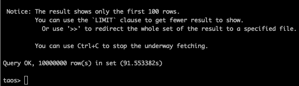 | 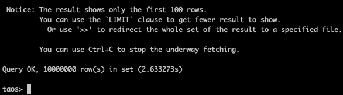 |

1. 投影查询 + tbname 过滤
  ```sql
  select * from vst_table where tbname = 'vct_d50';
  select * from st_table where tbname = 'ct_d50';
  ```


  | 查询耗时(优化前) | 查询耗时(优化后) | 非虚拟超级表耗时 | （优化前） | （优化后） | （非虚拟超级表） |
| --- | --- | --- | --- | --- | --- |
| 127.446293s | 1.031074s | 0.130324s | 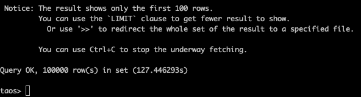 | 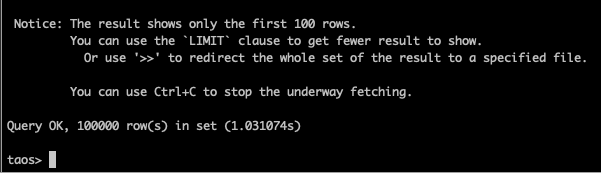 | 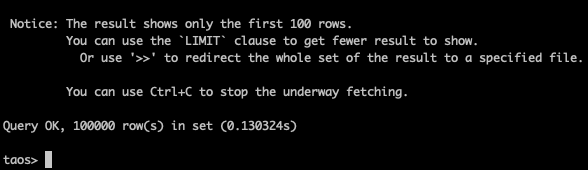 |
| 126.741417s | 0.986306s | 0.129051s | 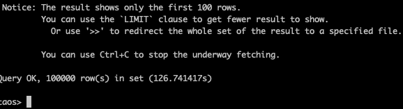 | 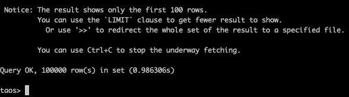 | > ⚠ 下载失败，需在飞书中查看 (token: ) |
| 127.109689s | 0.979072s | 0.128324s | 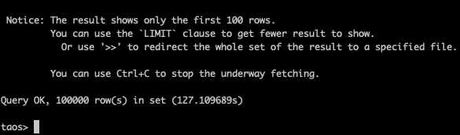 | 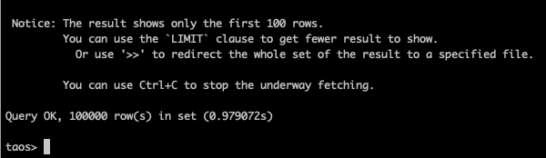 |  |

1. 投影查询 + tag 过滤
  ```sql
  select * from vst_table where tint = 20;
  select * from st_table where tint = 20;
  ```


  | 查询耗时(优化前) | 查询耗时(优化后) | 非虚拟超级表耗时 | （优化前） | （优化后） | （非虚拟超级表） |
| --- | --- | --- | --- | --- | --- |
| 126.693069s | 0.947589s | 0.112817s | 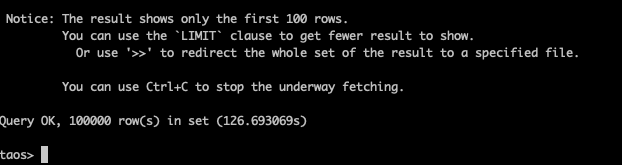 |  | 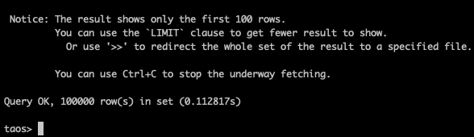 |
| 127.065070s | 0.912218s | 0.114777s | 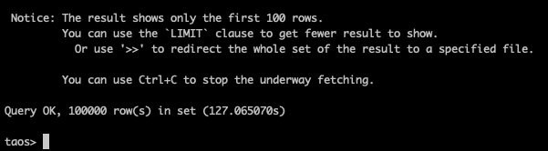 | 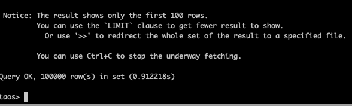 | 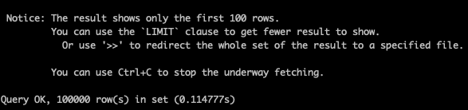 |
| 127.092236s | 0.913589s | 0.114417s | 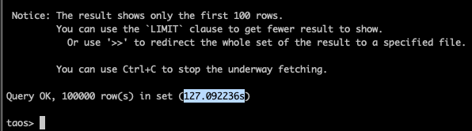 |  | 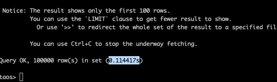 |

1. 投影查询 + 时间过滤
  ```sql
  select * from vst_table where ts >= '2020-10-01 00:00:00.000' and ts < '2020-10-01 00:00:10.000';
  select * from st_table where ts >= '2020-10-01 00:00:00.000' and ts < '2020-10-01 00:00:10.000';
  ```


  | 查询耗时(优化前) | 查询耗时(优化后) | 非虚拟超级表耗时 | （优化前） | （优化后） | （非虚拟超级表） |
| --- | --- | --- | --- | --- | --- |
| 126.404196s | 3.557385s | 0.143597s | 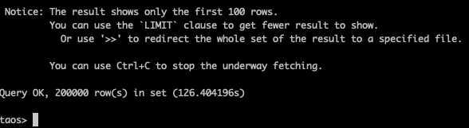 |  | 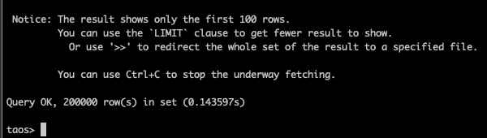 |
| 126.871643s | 3.523952s | 0.140815s | 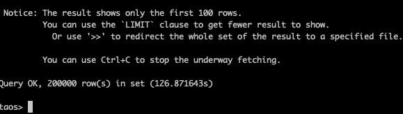 | 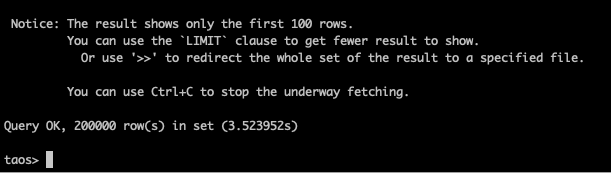 |  |
| 126.488776s | 3.557676s | 0.137972s | 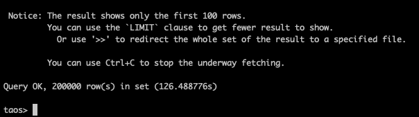 |  |  |

1. 投影查询 + 时间过滤 + tag 过滤
  ```sql
  select * from vst_table where tint = 30 and ts >= '2020-10-01 00:00:00.000' and ts < '2020-10-01 00:00:10.000';
  select * from st_table where tint = 30 and ts >= '2020-10-01 00:00:00.000' and ts < '2020-10-01 00:00:10.000';
  ```


  | 查询耗时(优化前) | 查询耗时(优化后) | 非虚拟超级表耗时 | （优化前） | （优化后） | （非虚拟超级表） |
| --- | --- | --- | --- | --- | --- |
| 127.593102s | 0.074041s | 0.029219s | 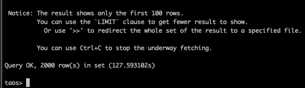 | 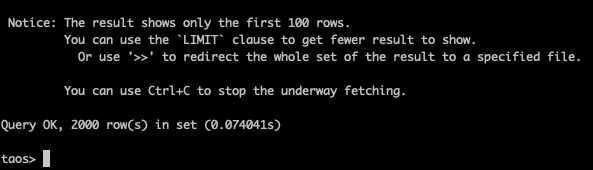 | 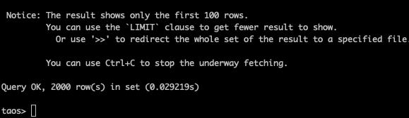 |
| 127.443869s | 0.074686s | 0.028293s | 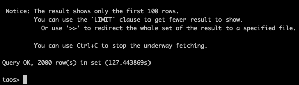 | 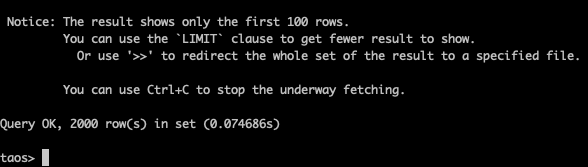 | 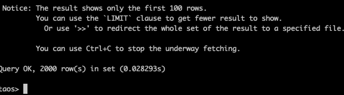 |
| 127.693397s | 0.074164s | 0.027124s | 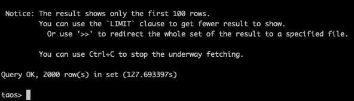 | 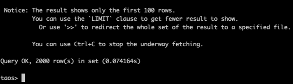 | 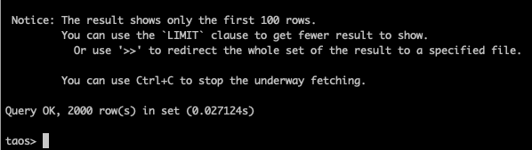 |

### 6.2 虚拟子表性能

1. 投影查询
  ```sql
  select * from vct_d0;
  select * from ct_d0;
  ```


  | 查询耗时(优化前) | 查询耗时(优化后) | 非虚拟子表查询 | （优化前） | （优化后） | （非虚拟子表） |
| --- | --- | --- | --- | --- | --- |
| 0.412796s | 0.257651s | 0.047650s | 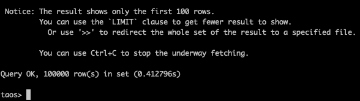 | 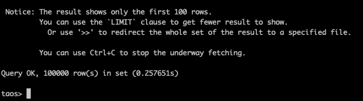 | 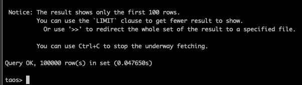 |
| 0.423766s | 0.258082s | 0.047471s |  | 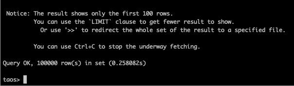 | 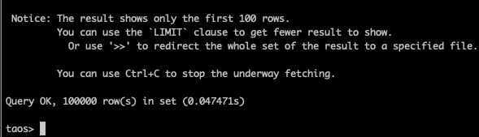 |
| 0.423652s | 0.262512s | 0.046994s | > ⚠ 下载失败，需在飞书中查看 (token: ) |  | 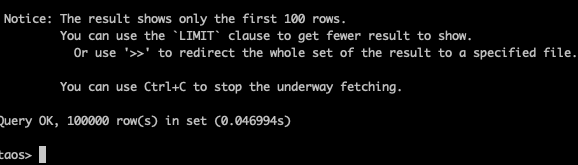 |

### 6.3 结果分析

通过对优化前后虚拟表与虚拟子表的查询性能测试结果对比，可以看出优化效果显著，具体分析如下：

#### 6.3.1 虚拟超级表性能分析

1. **投影查询全量数据**
   - 优化前平均耗时约 **124.7s**，优化后约 **91.6s**，性能提升约 **26.6%**。
   - 非虚拟超级表查询约** 2.8s**，虚拟超级表的性能下降约 **33 倍**
   - 该场景属于全量扫描场景，无法依赖 tag/tbname 过滤的优化，性能改进主要得益于算子内部的实现优化。
2. **投影查询 + tbname过滤**
   - 优化前平均耗时约 **127.1s**，优化后约 **1.00s**，性能提升约 **127倍**。
   - 非虚拟超级表查询约** 0.13s**，虚拟超级表的性能下降约 **8 倍**
   - 优化后可根据 tbname 快速定位目标子表，显著减少扫描范围。
3. **投影查询 + tag过滤**
   - 优化前平均耗时约 **126.9s**，优化后约 **0.92s**，性能提升约 **138倍**。
   - 非虚拟超级表查询约** 0.11s**，虚拟超级表的性能下降约 **8 倍**
   - 优化后可根据 tag 快速定位目标子表，显著减少扫描范围。
4. **投影查询 + 时间过滤**
   - 优化前平均耗时约 **126.6s**，优化后约 **3.55s**，性能提升约 **35倍**。
   - 非虚拟超级表查询约** 0.14s**，虚拟超级表的性能下降约 **25 倍**
   - 将时间范围下推到原始表的扫描算子上，减少扫描的数据量以及虚拟表扫描算子的排序/合并数据量，从而减小开销。
5. **投影查询 + 时间过滤 + tag过滤**
   - 优化前平均耗时约 **127.6s**，优化后约 **0.074s**，性能提升约 **1724倍**。
   - 非虚拟超级表查询约** 0.03s**，虚拟超级表的性能下降约 **2.4 倍**
   - 当时间与 tag 条件同时使用时，既通过 tag 定位目标虚拟子表，减少扫描范围，又将时间范围下推到原始表扫描，大幅减少需要扫描的数据量，大幅度提升性能。

#### 6.3.2 虚拟子表性能分析

1. 单个子表投影查询优化前耗时约 **0.42s**，优化后约 **0.26s**，性能提升约 **38%**。
2. 非虚拟子表查询约** 0.047s**，虚拟子表的性能下降约 **5.5 倍**
3. 虚拟子表投影查询性能优化主要依赖于算子内部实现的优化。

### 6.4 总体结论

1. 本次优化在虚拟表查询性能方面取得了显著提升。
2. 在包含 **tag 或 tbname 条件的查询场景** 下，性能提升最高可达千倍量级，极大改善了客户在典型查询模式下的响应速度。
3. 在全量扫描或单表查询场景中，性能提升有限，但仍体现了系统底层优化带来的收益。
4. 虚拟表与同结构同数据的非虚拟表相比，性能有** 2 ～ 33 倍**的下降

### 6.5 优化效果总结表

1. 优化前后对比

  | **测试场景** | **优化前耗时(s)** | **优化后耗时(s)** | **提升倍数** |
| --- | --- | --- | --- |
| 虚拟超级表投影查询全量数据 | 124.7 | 91.6 | 1.36x |
| 虚拟超级表投影查询 + tbname过滤 | 127.1 | 1 | 127x |
| 虚拟超级表投影查询 + tag过滤 | 126.9 | 0.92 | 138x |
| 虚拟超级表投影查询 + 时间过滤 | 126.6 | 3.55 | 35x |
| 虚拟超级表投影查询 + 时间过滤 + tag过滤 | 127.6 | 0.074 | 1724x |
| 虚拟子表查询 | 0.42 | 0.26 | 1.38x |

1. 优化后虚拟超级表查询 vs 虚拟子表查询性能对比

  | **对比维度** | **优化后耗时(s)** | **相对虚拟子表性能倍数** |
| --- | --- | --- |
| 虚拟超级表（无过滤） | 91.6 | 约 352× 较慢 |
| 虚拟超级表（tbname过滤） | 1 | 约 3.8× 较慢 |
| 虚拟超级表（tag过滤） | 0.92 | 约 3.5× 较慢 |
| 虚拟子表查询 | 0.26 | 基准性能 |

1. 虚拟表 vs 非虚拟表查询性能对比

  | **测试场景** | **虚拟表耗时(s)** | **非虚拟表耗时(s)** | **虚拟表下降倍数** |
| --- | --- | --- | --- |
| 超级表投影查询全量数据 | 91.6 | 2.8 | 33x |
| 超级表投影查询 + tbname过滤 | 1 | 0.13 | 8x |
| 超级表投影查询 + tag过滤 | 0.92 | 0.11 | 8x |
| 超级表投影查询 + 时间过滤 | 3.55 | 0.14 | 25x |
| 超级表投影查询 + 时间过滤 + tag过滤 | 0.074 | 0.03 | 2.4x |
| 子表查询 | 0.26 | 0.047 | 5.5x |

## 7. 纳入发版前流程

为确保本次性能在迭代中不出现回退，本次测试用例将纳入发版前验证体系。具体实施步骤如下：
1. 在现有的性能测试集中，为本次优化的核心场景创建新的测试用例
2. 按照第 5.2 节准备测试数据
3. 按照第 6 章执行查询语句，并保存到性能测试记录中，在版本发布前按需比对
