# TS-7451 虚拟表查询性能对比测试（补充）

此文档作为 [TS-7451 虚拟表性能优化对比测试](https://taosdata.feishu.cn/wiki/LfOswmZ8ziqYR3kYBoYcqVARn8f)的补充

## 1. 测试准备 {folded="true"}

### 1.1 环境准备

1. CPU 信息：
  ```yaml
  $ lscpu
  Architecture:                x86_64
    CPU op-mode(s):            32-bit, 64-bit
    Address sizes:             46 bits physical, 48 bits virtual
    Byte Order:                Little Endian
  CPU(s):                      72
    On-line CPU(s) list:       0-71
  Vendor ID:                   GenuineIntel
    Model name:                Intel(R) Xeon(R) CPU E5-2686 v4 @ 2.30GHz
      CPU family:              6
      Model:                   79
      Thread(s) per core:      2
      Core(s) per socket:      18
      Socket(s):               2
      Stepping:                1
      CPU(s) scaling MHz:      40%
      CPU max MHz:             3000.0000
      CPU min MHz:             1200.0000
      BogoMIPS:                4588.97
      Flags:                   fpu vme de pse tsc msr pae mce cx8 apic sep mtrr pge mca cmov pat pse36 clflush dts acpi mmx fxsr sse sse2 ss ht tm pbe syscall nx pdpe1gb rdtscp lm constant_tsc arch_perfmon pebs bts rep_good nopl xtopology nonstop_tsc cpuid aperfmperf pni pc
                               lmulqdq dtes64 monitor ds_cpl vmx smx est tm2 ssse3 sdbg fma cx16 xtpr pdcm pcid dca sse4_1 sse4_2 x2apic movbe popcnt tsc_deadline_timer aes xsave avx f16c rdrand lahf_lm abm 3dnowprefetch cpuid_fault epb cat_l3 cdp_l3 pti intel_ppin ssbd ibr
                               s ibpb stibp tpr_shadow flexpriority ept vpid ept_ad fsgsbase tsc_adjust bmi1 hle avx2 smep bmi2 erms invpcid rtm cqm rdt_a rdseed adx smap intel_pt xsaveopt cqm_llc cqm_occup_llc cqm_mbm_total cqm_mbm_local dtherm ida arat pln pts vnmi md_cle
                               ar flush_l1d
  Virtualization features:
    Virtualization:            VT-x
  Caches (sum of all):
    L1d:                       1.1 MiB (36 instances)
    L1i:                       1.1 MiB (36 instances)
    L2:                        9 MiB (36 instances)
    L3:                        90 MiB (2 instances)
  NUMA:
    NUMA node(s):              1
    NUMA node0 CPU(s):         0-71
  Vulnerabilities:
    Gather data sampling:      Not affected
    Ghostwrite:                Not affected
    Indirect target selection: Not affected
    Itlb multihit:             KVM: Mitigation: Split huge pages
    L1tf:                      Mitigation; PTE Inversion; VMX conditional cache flushes, SMT vulnerable
    Mds:                       Mitigation; Clear CPU buffers; SMT vulnerable
    Meltdown:                  Mitigation; PTI
    Mmio stale data:           Mitigation; Clear CPU buffers; SMT vulnerable
    Reg file data sampling:    Not affected
    Retbleed:                  Not affected
    Spec rstack overflow:      Not affected
    Spec store bypass:         Mitigation; Speculative Store Bypass disabled via prctl
    Spectre v1:                Mitigation; usercopy/swapgs barriers and __user pointer sanitization
    Spectre v2:                Mitigation; Retpolines; IBPB conditional; IBRS_FW; STIBP conditional; RSB filling; PBRSB-eIBRS Not affected; BHI Not affected
    Srbds:                     Not affected
    Tsx async abort:           Mitigation; Clear CPU buffers; SMT vulnerable
  ```

1. 内存信息：
  ```sql
  free -h
                 total        used        free      shared  buff/cache   available
  Mem:            62Gi       2.1Gi        50Gi        14Mi        10Gi        60Gi
  Swap:          8.0Gi          0B       8.0Gi
  ```

1. 磁盘信息：
  ```bash
  lsblk
  
  NAME        MAJ:MIN RM   SIZE RO TYPE MOUNTPOINTS
  loop0         7:0    0  63.8M  1 loop /snap/core20/2669
  loop1         7:1    0     4K  1 loop /snap/bare/5
  loop2         7:2    0  73.9M  1 loop /snap/core22/2133
  loop3         7:3    0  73.9M  1 loop /snap/core22/2045
  loop4         7:4    0  11.1M  1 loop /snap/firmware-updater/167
  loop6         7:6    0   516M  1 loop /snap/gnome-42-2204/202
  loop7         7:7    0   1.7M  1 loop /snap/jump/81
  loop8         7:8    0  91.7M  1 loop /snap/gtk-common-themes/1535
  loop9         7:9    0  10.8M  1 loop /snap/snap-store/1270
  loop10        7:10   0  49.3M  1 loop /snap/snapd/24792
  loop11        7:11   0  50.8M  1 loop /snap/snapd/25202
  loop12        7:12   0   576K  1 loop /snap/snapd-desktop-integration/315
  loop13        7:13   0 516.2M  1 loop /snap/gnome-42-2204/226
  loop14        7:14   0 247.6M  1 loop /snap/firefox/6966
  loop15        7:15   0  18.5M  1 loop /snap/firmware-updater/210
  loop16        7:16   0 248.8M  1 loop /snap/firefox/7024
  nvme0n1     259:0    0 476.9G  0 disk
  ├─nvme0n1p1 259:1    0     1G  0 part /boot/efi
  └─nvme0n1p2 259:2    0 475.9G  0 part /
  ```

1. 操作系统信息：
  ```sql
  uname -a
  Linux simon-X99 6.14.0-33-generic #33~24.04.1-Ubuntu SMP PREEMPT_DYNAMIC Fri Sep 19 17:02:30 UTC 2 x86_64 x86_64 x86_64 GNU/Linux
  ```

### 1.2 数据准备

1. 原始表数据准备：insert.json
  ```json
  {
    "filetype": "insert",
    "cfgdir": "/etc/taos",
    "host": "127.0.0.1",
    "port": 6030,
    "user": "root",
    "password": "taosdata",
    "connection_pool_size": 8,
    "thread_count": 60,
    "create_table_thread_count": 4,
    "result_file": "./insert_res.txt",
    "confirm_parameter_prompt": "no",
    "num_of_records_per_req": 1000000,
    "prepared_rand": 10000,
    "chinese": "no",
    "escape_character": "yes",
    "continue_if_fail": "no",
    "databases": [
      {
        "dbinfo": {
          "name": "test_vtable_perf",
          "drop": "yes",
          "vgroups": 8,
          "precision": "ms"
        },
        "super_tables": [
          {
            "name": "stb_bool",
            "child_table_exists": "no",
            "childtable_count": 100,
            "childtable_prefix": "ctb_bool",
            "auto_create_table": "no",
            "batch_create_tbl_num": 5,
            "data_source": "rand",
            "insert_mode": "taosc",
            "non_stop_mode": "no",
            "line_protocol": "line",
            "insert_rows": 100000,
            "childtable_limit": 0,
            "childtable_offset": 0,
            "interlace_rows": 0,
            "insert_interval": 0,
            "partial_col_num": 0,
            "timestamp_step": 5,
            "start_timestamp": "2020-10-01 00:00:00.000",
            "sample_format": "csv",
            "sample_file": "./sample.csv",
            "use_sample_ts": "no",
            "tags_file": "",
            "columns": [
              {"type": "bool", "name": "bool_col", "count": 1, "max": 1, "min": 0 }
            ],
            "tags": [
              {"type": "TINYINT", "name": "groupid", "max": 10, "min": 1}
            ]
          },
          {
            "name": "stb_int",
            "child_table_exists": "no",
            "childtable_count": 100,
            "childtable_prefix": "ctb_int",
            "auto_create_table": "no",
            "batch_create_tbl_num": 5,
            "data_source": "rand",
            "insert_mode": "taosc",
            "non_stop_mode": "no",
            "line_protocol": "line",
            "insert_rows": 100000,
            "childtable_limit": 0,
            "childtable_offset": 0,
            "interlace_rows": 0,
            "insert_interval": 0,
            "partial_col_num": 0,
            "timestamp_step": 5,
            "start_timestamp": "2020-10-01 00:00:00.000",
            "sample_format": "csv",
            "sample_file": "./sample.csv",
            "use_sample_ts": "no",
            "tags_file": "",
            "columns": [
              {"type": "int", "name": "int_col", "count": 1, "max": 2147483647, "min": -2147483648 }
            ],
            "tags": [
              {"type": "TINYINT", "name": "groupid", "max": 10, "min": 1}
            ]
          },
          {
            "name": "stb_float",
            "child_table_exists": "no",
            "childtable_count": 100,
            "childtable_prefix": "ctb_float",
            "auto_create_table": "no",
            "batch_create_tbl_num": 5,
            "data_source": "rand",
            "insert_mode": "taosc",
            "non_stop_mode": "no",
            "line_protocol": "line",
            "insert_rows": 100000,
            "childtable_limit": 0,
            "childtable_offset": 0,
            "interlace_rows": 0,
            "insert_interval": 0,
            "partial_col_num": 0,
            "timestamp_step": 5,
            "start_timestamp": "2020-10-01 00:00:00.000",
            "sample_format": "csv",
            "sample_file": "./sample.csv",
            "use_sample_ts": "no",
            "tags_file": "",
            "columns": [
              {"type": "float", "name": "float_col", "count": 1, "max": 100000, "min": -100000 }
            ],
            "tags": [
              {"type": "TINYINT", "name": "groupid", "max": 10, "min": 1}
            ]
          },
          {
            "name": "stb_double",
            "child_table_exists": "no",
            "childtable_count": 100,
            "childtable_prefix": "ctb_double",
            "auto_create_table": "no",
            "batch_create_tbl_num": 5,
            "data_source": "rand",
            "insert_mode": "taosc",
            "non_stop_mode": "no",
            "line_protocol": "line",
            "insert_rows": 100000,
            "childtable_limit": 0,
            "childtable_offset": 0,
            "interlace_rows": 0,
            "insert_interval": 0,
            "partial_col_num": 0,
            "timestamp_step": 5,
            "start_timestamp": "2020-10-01 00:00:00.000",
            "sample_format": "csv",
            "sample_file": "./sample.csv",
            "use_sample_ts": "no",
            "tags_file": "",
            "columns": [
              {"type": "double", "name": "double_col", "count": 1, "max": 100000000, "min": -100000000 }
            ],
            "tags": [
              {"type": "TINYINT", "name": "groupid", "max": 10, "min": 1}
            ]
          },
          {
            "name": "stb_ubigint",
            "child_table_exists": "no",
            "childtable_count": 100,
            "childtable_prefix": "ctb_ubigint",
            "auto_create_table": "no",
            "batch_create_tbl_num": 5,
            "data_source": "rand",
            "insert_mode": "taosc",
            "non_stop_mode": "no",
            "line_protocol": "line",
            "insert_rows": 100000,
            "childtable_limit": 0,
            "childtable_offset": 0,
            "interlace_rows": 0,
            "insert_interval": 0,
            "partial_col_num": 0,
            "timestamp_step": 5,
            "start_timestamp": "2020-10-01 00:00:00.000",
            "sample_format": "csv",
            "sample_file": "./sample.csv",
            "use_sample_ts": "no",
            "tags_file": "",
            "columns": [
              {"type": "ubigint", "name": "u_bigint_col", "count": 1, "max": 18446744073709551615, "min": 0 }
            ],
            "tags": [
              {"type": "TINYINT", "name": "groupid", "max": 10, "min": 1}
            ]
          }
        ]
      }
    ]
  }
  ```

1. 虚拟表创建 sql 生成脚本 genVtable.sh：
  ```bash
  #!/bin/bash
  
  # 使用方法：
  # ./generate_sql.sh 10 output.sql
  # 第一个参数是生成的条数，第二个参数是输出文件名（可选，默认 output.sql）
  
  # 检查输入参数
  if [ -z "$1" ]; then
    echo "❌ 请提供要生成的 SQL 条数。"
    echo "用法: $0 <数量> [输出文件名]"
    exit 1
  fi
  
  count=$1
  output_file=${2:-output.sql}
  
  # 清空或创建输出文件
  > "$output_file"
  echo "create stable vst_table (ts timestamp, c_bool bool, c_int int, c_float float, c_double double, c_ubigint bigint unsigned) tags(tint int, tchar varchar(20)) virtual 1;" >> "$output_file"
  # 生成 SQL
  for ((i=0; i<count; i++)); do
    echo "create vtable vct_d${i} (c_bool from ctb_bool${i}.bool_col, c_int from ctb_int${i}.int_col, c_float from ctb_float${i}.float_col, c_double from ctb_double${i}.double_col, c_ubigint from ctb_ubigint${i}.u_bigint_col) using vst_table tags(${i}, '${i}');" >> "$output_file"
  done
  
  echo "✅ 已生成 $count 条 SQL 语句到文件：$output_file"
  ```

1. 与虚拟表同结构的超级表/子表创建 sql 生成脚本 genTable.sh:
  ```bash
  #!/bin/bash
  
  # 使用方法：
  # ./generate_sql.sh 10 output.sql
  # 第一个参数是生成的条数，第二个参数是输出文件名（可选，默认 output.sql）
  
  # 检查输入参数
  if [ -z "$1" ]; then
    echo "❌ 请提供要生成的 SQL 条数。"
    echo "用法: $0 <数量> [输出文件名]"
    exit 1
  fi
  
  count=$1
  output_file=${2:-output.sql}
  
  # 清空或创建输出文件
  > "$output_file"
  echo "create stable st_table (ts timestamp, c_bool bool, c_int int, c_float float, c_double double, c_ubigint bigint unsigned) tags(tint int, tchar varchar(20));" >> "$output_file"
  # 生成 SQL
  for ((i=0; i<count; i++)); do
    echo "create table ct_d${i} using st_table tags(${i}, '${i}');" >> "$output_file"
  done
  
  for ((i=0; i<count; i++)); do
    echo "insert into ct_d${i} select * from vct_d${i};" >> "$output_file"
  done
  
  echo "✅ 已生成 $count 条 SQL 语句到文件：$output_file"
  ```

### 1.3 测试步骤

1. 使用 taosBenchmark + 3.1 中提供的 insert.json 生成原始表数据
```json
taosBenchmark -f insert.json
```

1. 使用 3.2 中提供的脚本 genVtable.sh 生成创建虚拟表的 sql 语句：
```json
./genVtable.sh 100
```

1. 执行 4.2 中生成的 sql 语句，创建虚拟表
```sql
taos> source /home/simon/taosdata/insertJson/TS-7451/output.sql;
```

1. 使用 3.3 中提供的脚本 genTable.sh 生成与虚拟表同结构的超级表/子表创建 sql
```sql
./genTtable.sh 100 output2.sql
```

1. 执行 4.4 中生成的 sql 语句，创建对照超级表/子表，并将虚拟表的数据写入该表
```sql
taos> source /home/simon/taosdata/insertJson/TS-7451/output2.sql;
```

1. 执行测试语句，记录虚拟表查询性能

## 2. 测试结果

### 2.1 虚拟超级表性能 {folded="true"}

1. 投影查询 1 列
  ```sql
  select c_bool from vst_table;
  select c_bool from st_table;
  ```


  | 虚拟超级表耗时 | 非虚拟超级表耗时 | （虚拟超级表） | （非虚拟超级表） |
| --- | --- | --- | --- |
| 8.999123s | 1.202063s | 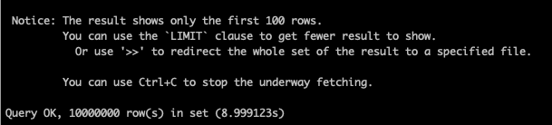 | 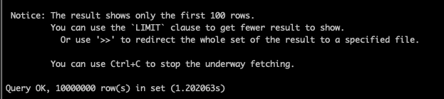 |
| 8.926403s | 1.227332s | 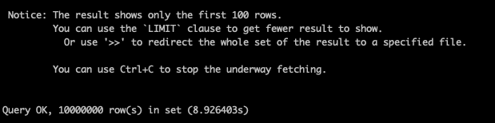 | 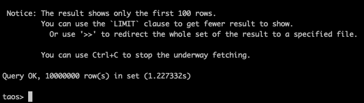 |
| 8.903929s | 1.240263s | 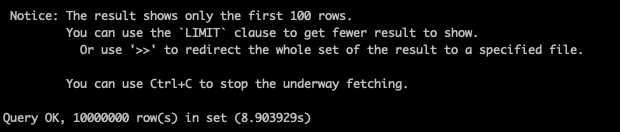 | 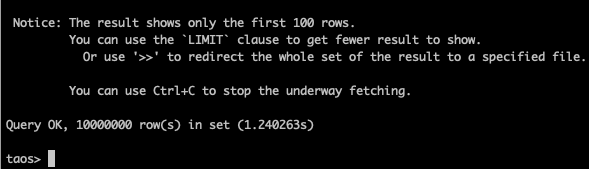 |

1. 投影查询 2 列
  ```sql
  select c_bool, c_int from vst_table;
  select c_bool, c_int from st_table;
  ```


  | 虚拟超级表耗时 | 非虚拟超级表耗时 | （虚拟超级表） | （非虚拟超级表） |
| --- | --- | --- | --- |
| 20.760531s | 1.264268s | 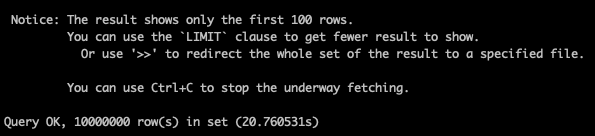 | 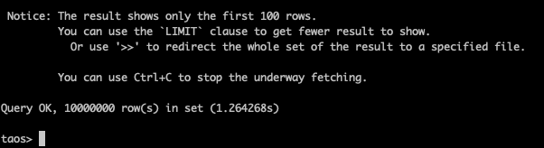 |
| 20.682219s | 1.452662s | 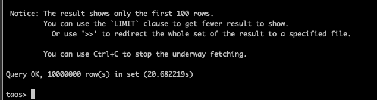 | 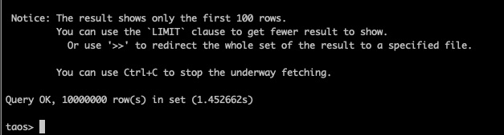 |
| 20.819820s | 1.222386s | 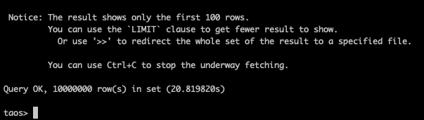 |  |

1. 投影查询 3 列
  ```sql
  select c_bool, c_int, c_float from vst_table;
  select c_bool, c_int, c_float from st_table;
  ```


  | 虚拟超级表耗时 | 非虚拟超级表耗时 | （虚拟超级表） | （非虚拟超级表） |
| --- | --- | --- | --- |
| 36.426767s | 1.516454s |  | 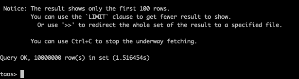 |
| 36.331874s | 1.527054s | 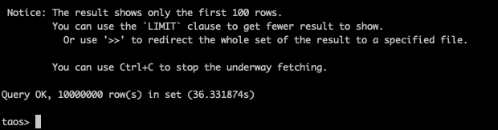 |  |
| 36.439756s | 1.565890s | 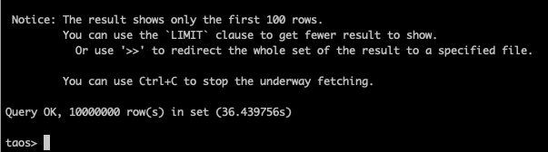 |  |

  
1. 投影查询 4 列
  ```sql
  select c_bool, c_int, c_float, c_double from vst_table;
  select c_bool, c_int, c_float, c_double from st_table;
  ```


  | 虚拟超级表耗时 | 非虚拟超级表耗时 | （虚拟超级表） | （非虚拟超级表） |
| --- | --- | --- | --- |
| 55.061545s | 1.719892s | 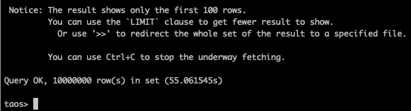 | 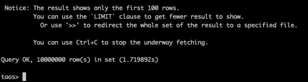 |
| 55.218130s | 1.557182s |  |  |
| 55.114765s | 1.764313s |  | 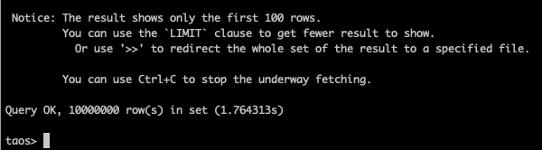 |

### 2.2 虚拟子表性能

1. 投影查询 1 列
  ```sql
  select c_bool from vct_d0;
  select c_bool from ct_d0;
  ```


  | 虚拟子表耗时 | 非虚拟子表耗时 | （虚拟子表） | （非虚拟子表） |
| --- | --- | --- | --- |
| 0.017752s | 0.018448s | 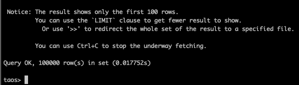 |  |
| 0.017636s | 0.017877s |  |  |
| 0.016911s | 0.017366s |  |  |

1. 投影查询 2 列
  ```sql
  select c_bool, c_int from vct_d0;
  select c_bool, c_int from ct_d0;
  ```


  | 虚拟子表耗时 | 非虚拟子表耗时 | （虚拟子表） | （非虚拟子表） |
| --- | --- | --- | --- |
| 0.100258s | 0.019954s |  | 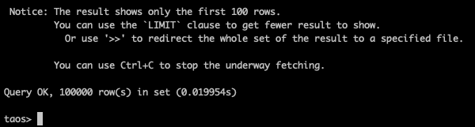 |
| 0.100705s | 0.019476s |  | 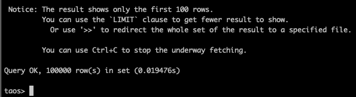 |
| 0.124743s | 0.019752s | 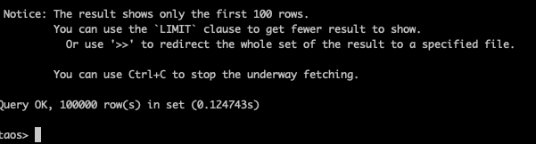 |  |

1. 投影查询 3 列
  ```sql
  select c_bool, c_int, c_float from vct_d0;
  select c_bool, c_int, c_float from ct_d0;
  ```


  | 虚拟子表耗时 | 非虚拟子表耗时 | （虚拟子表） | （非虚拟子表） |
| --- | --- | --- | --- |
| 0.139132s | 0.025401s | 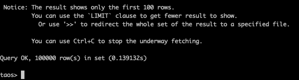 | 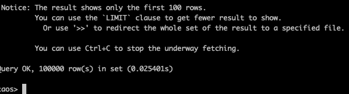 |
| 0.137374s | 0.024463s | 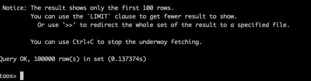 | 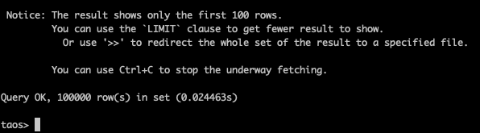 |
| 0.137912s | 0.026294s | 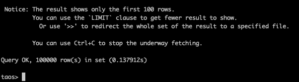 | 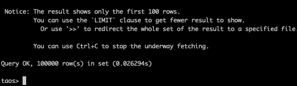 |

1. 投影查询 4 列
  ```sql
  select c_bool, c_int, c_float, c_double from vct_d0;
  select c_bool, c_int, c_float, c_double from ct_d0;
  ```


  | 虚拟子表耗时 | 非虚拟子表耗时 | （虚拟子表） | （非虚拟子表） |
| --- | --- | --- | --- |
| 0.189410s | 0.036047s | 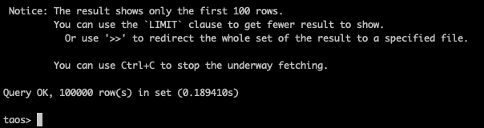 | 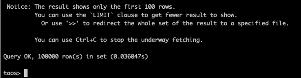 |
| 0.184296s | 0.034896s |  |  |
| 0.195725s | 0.034912s |  | 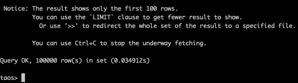 |

## 3. 测试结果汇总

### 3.1 **虚拟超级表 vs 非虚拟超级表**

| **查询列数** | **虚拟超级表耗时（秒）** | **非虚拟超级表耗时（秒）** | **性能差距** |
| --- | --- | --- | --- |
| 1 列 | 8.90–8.99 | 1.20–1.24 | **约 7.4 倍** |
| 2 列 | 20.68–20.82 | 1.22–1.45 | **约 15 倍** |
| 3 列 | 36.33–36.44 | 1.51–1.57 | **约 23 倍** |
| 4 列 | 55.06–55.21 | 1.55–1.76 | **约 33 倍** |


### 3.2 **虚拟子表 vs 非虚拟子表**

| **查询列数** | **虚拟子表（秒）** | **非虚拟子表（秒）** | **性能差距** |
| --- | --- | --- | --- |
| 1 列 | 0.0169–0.0177 | 0.0173–0.0184 | 持平 |
| 2 列 | 0.100–0.124 | 0.019–0.020 | **约 5 倍** |
| 3 列 | 0.137–0.139 | 0.024–0.026 | **约 5.5 倍** |
| 4 列 | 0.184–0.195 | 0.034–0.036 | **约 5 倍** |

## 4. 测试结论

### 4.1 **虚拟超级表查询性能显著低于非虚拟超级表**

在同等结构、同等数据量、同等投影字段数量的情况下：
- **虚拟超级表查询耗时随查询列数增加呈线性上升**（9 秒 → 20 秒 → 36 秒 → 55 秒）。
- **非虚拟超级表耗时基本稳定在 1.2–1.7 秒之间**。
- **虚拟超级表比真实超级表慢约 7–30 倍**。

### 4.2 **虚拟子表的性能与真实子表更接近，但仍有约 5 倍差距**

- **查询 1 列时，两者性能几乎相同（约 0.017s）。**
  - 这是因为在查询计划做了优化，查询虚拟子表/虚拟普通表时如果查询的列都来自同一张物理表，就会去掉按照时间戳对齐的步骤，直接将 scan 结果输出。
- 查询列数增加后差距变大：
  - 查询 2 列：虚拟子表 0.10s，真实子表 0.02s（约 5 倍）
  - 查询 3 列、4 列：虚拟子表约 0.13–0.19s，真实子表约 0.02–0.03s（约 4–6 倍）
  - 此时无法进行查询计划的优化，性能的差距主要在按照时间戳合并结果的部分。
