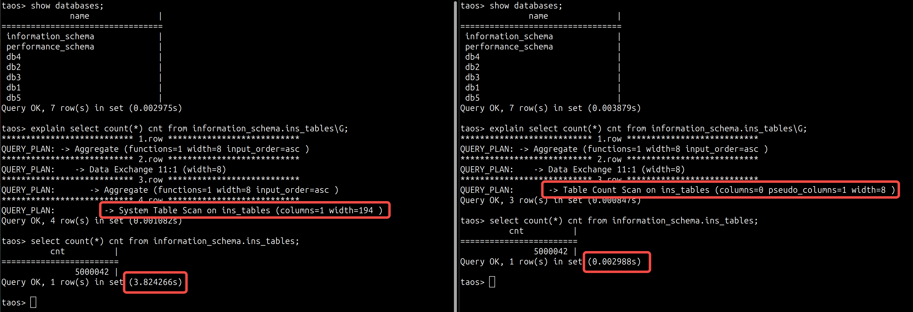
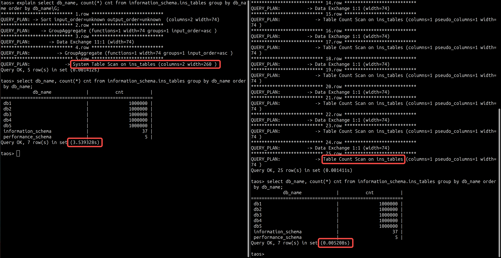
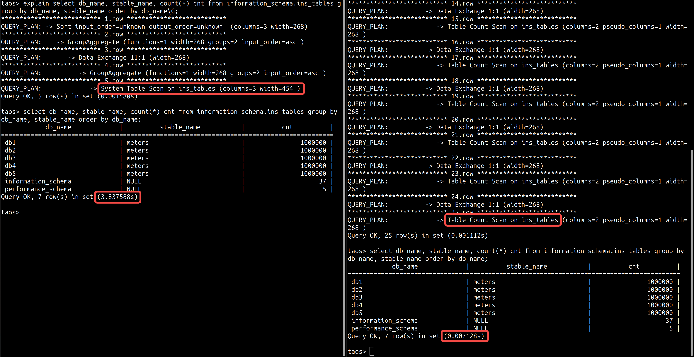
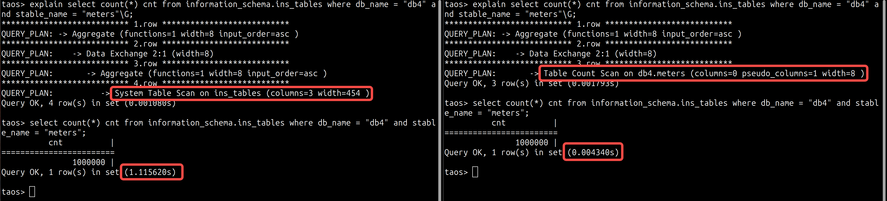

# 子表数统计性能测试报告 TS

## 1. 修订记录

| 编写日期 | 发布日期 | 版本 | 修订人 | 主要修改内容 |
| --- | --- | --- | --- | --- |
| 2025-11-28 | 2025-11-28 | 1.0 | @张天毅 | 创建文档 |

## 2. 测试目标

测试针对`select count(*) from information_schema.ins_tables`的性能优化效果：
1. 保证优化后查询结果准确
2. 对比在几个常见场景中的查询性能

## 3. 参考文档

JIRA: [TS-6412](https://jira.taosdata.com:18080/browse/TS-6412)

## 4. 测试结论

保证结果准确的情况下，统计子表数的查询性能显著提高

## 5. 功能测试

#### 5.0.1 用例列表

| # | 测试用例 | 测试描述 | 测试结果 |
| --- | --- | --- | --- |
|  | check_ins_tables_count | 1. Basic: 1. select count(*) from information_schema.ins_tables; 1. Group by: 1. select db_name, count(*) from information_schema.ins_tables group by db_name; 1. select stable_name, count(*) from information_schema.ins_tables group by stable_name; 1. select db_name, stable_name, count(*) from information_schema.ins_tables group by db_name, stable_name; 1. Where condition: 1. select count(*) from information_schema.ins_tables where db_name = 'information_schema'; 1. select count(*) from information_schema.ins_tables where stable_name = 'stb'; 1. select count(*) from information_schema.ins_tables where db_name = 'db' and stable_name = 'stb'; | 结果正确，且通过explain结果验证其执行计划为table count scan而非sys table scan |
|  | check_count_distinct | 检验count不支持distinct关键字，否则该功能的优化条件需进一步更改 | 通过 |

## 6. 性能测试

数据准备：5个数据库，每个库一个超级表，每个超级表100w子表，每个子表insert 1条数据

#### 6.0.1 数据库全表数

查询语句：
```sql {wrap}
select count(*) cnt from information_schema.ins_tables;
```

结果：`3.824s` vs `0.003s`


#### 6.0.2 Group by db_name 统计各库的表数目

查询语句：
```sql {wrap}
select db_name, count(*) cnt from information_schema.ins_tables group by db_name order by db_name;
```

结果：`3.539s` vs `0.005s`


#### 6.0.3 Group by db_name, stable_name 统计各库各超级表的子表数目

查询语句：
```sql {wrap}
select db_name, stable_name, count(*) cnt from information_schema.ins_tables group by db_name, stable_name order by db_name;
```

结果：`3.838s` vs `0.007s`


#### 6.0.4 Where db_name and stable_name 查询指定超级表的子表数

查询语句：
```sql {wrap}
select count(*) cnt from information_schema.ins_tables where db_name = "db4" and stable_name = "meters";
```

结果：`1.116s` vs `0.004s`

