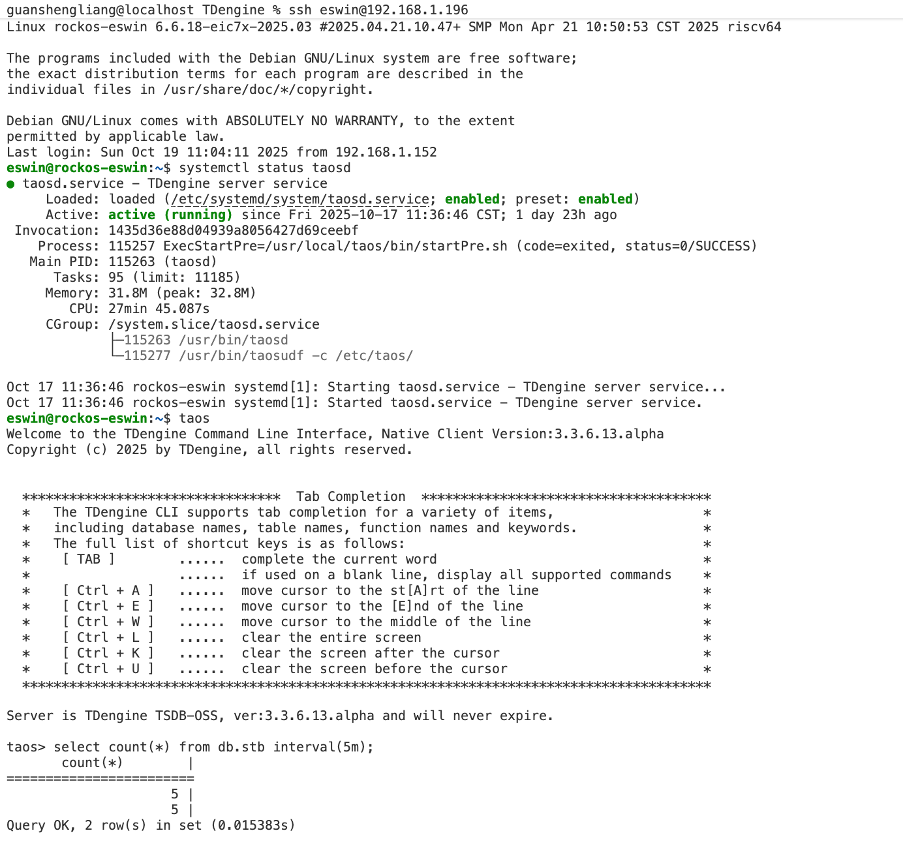

# RISC-V 移植工作量评估

## 1. 当前移植进展

TDengine v3.3.6 版本的核心功能在 RISC-V 架构的 Ubuntu 系统上已得到初步验证。以下是核心进展的概要：
1. 服务启动：使用 `systemctl`成功启动 `taosd`服务进程。
2. 数据库连接：通过 `taos`命令行工具连接至本地数据库实例
3. 数据建模与写入：
   - 创建数据库
   - 建立超级表
   - 基于超级表创建子表
   - 向子表写入样例数据
4. 查询数据：对已写入的数据执行查询操作。
演示效果如下图所示

## 2. 核心差异分析

移植工作的根本源于架构差异。与 x86 相比，RISC-V 主要有两点核心差异，直接影响运行行为。

### 2.1 弱内存序模型​

RISC-V 采用 RVWMO 内存模型，其内存访问指令的执行顺序比 x86 等强内存序架构宽松。这要求开发者必须显式使用内存屏障指令来保证多线程程序的内存可见性和执行顺序，否则可能出现极难调试的并发问题。

### 2.2 多核缓存一致性​

RISC-V 通过自定义指令或标准扩展支持缓存管理。在移植涉及多核数据共享的代码时，可能需要引入明确的缓存维护操作​，以确保数据在不同核心间的一致性是可见的。

### 2.3 编译选项差异

RISC-V 64 位架构的地址空间非常巨大，但指令中用于表示地址偏移的位数是有限的。项目中使用的所有静态库（如 OpenSSL、curl 等），都必须使用与主项目相同（或兼容）的代码模型和松弛选项进行编译。

### 2.4 移植示例

在本次验证性试验中，我花了约 5 个小时解决了一个 “rpc state already dropped” 错误，原因是 A 线程设置了一个静态变量，B 线程取不到变化后的值。

## 3. 移植工作范畴和工作量预估

总工作量预估：25 工作日，其中
1. 引擎部工作量：15 工作日
2. 工具部工作量：5 工作日
3. 平台部工作量：5 工作日

| 大项 | 关键任务 | 工作量评估 | 备注 |
| --- | --- | --- | --- |
| 调整编译选项及第三方库适配 | 4 工作日 | 1. 调整编译选项（如 -mcmodel=medany） 1. 链接器启用松弛优化（-Wl,--relax） 1. 调整 curl、rocksdb、openssl、s3 等库的编译选项 1. 其他可能的问题 |
| 企业代码适配 | 1 工作日 | 如下模块需要改造 1. 授权模块（机器码部分） 1. 禁止开源操作系统模块 |
| 社区代码适配 | 10 工作日 | 1. 全局及静态变量改造 1. 其他未知问题发现及修复 |
| 其他组件适配 | 5 工作日 | taosBenchmark、tgen、taosAdapter、taosX 等 |
| 测试运行 | 3 工作日 | 1. 测试框架少量调增 1. 全量运行，发现的问题进行基本的排查 1. 测试回归 |
| 修改打包及安装脚本 | 1 工作日 | 预计调整较少或不需调整 |
| CI workflow 构建 | 1 工作日 |  |
