# 南网广州电力调度增补两个场景测试方案-对外

### 1. 需求概述

业主希望在之前测试基础上，增加两项查询测试：
- CIM树查询
- 配变重载/过载、三相不平衡及负载率分区统计查询

#### 1.1 **CIM树查询**

针对四种常见查询场景进行并发查询性能验证
- 主网接线图界面模糊查询厂站名称
- GIS单线图界面模糊查询馈线名称
- 添加配网故障简报弹窗模糊搜索所有设备名称
- GIS台区图界面模糊搜索台区名称
目前CIM表结构【该表记录数约178万】
```sql {wrap}
CREATE TABLE "PYD"."TX6_DEV_PINYIN"
(
"URI" VARCHAR(32) NOT NULL,
"DESCRIPTION" VARCHAR(128),
"PINYIN" VARCHAR(128),
"DEV_TYPE" INT,
"SRC_FLAG" INT NOT NULL,
"LTYPE1" INT,
"C_VALUE1" VARCHAR(128),
"FD_CODE" VARCHAR(32),
"FD_DESC" VARCHAR(128),
"SS_CODE" VARCHAR(32),
"SS_DESC" VARCHAR(128),
NOT CLUSTER PRIMARY KEY("URI", "SRC_FLAG") USING INDEX TABLESPACE "PYD_INDEX" ) STORAGE(ON "PYD_PARAM", CLUSTERBTR) ;
```

#### 1.2 **配变重载/过载查询、三相不平衡查询以及配变负载率分区统计查询**

业主方关注的查询核心需求分三类：配变重载/过载界面查询，三相不平衡查询，以及配变负载率分区统计查询
其中配变界面查询是重点。其基本逻辑是，从原始数据计算得到中间表，存放重载、一般过载、严重过载的详情；所有界面都从中间表筛选、计算得出。
<quote-container>
重载：负载率大于80%到100%，持续时间2小时
一般过载：负载率大于100%到120%，持续时间2小时
严重过载：负载率大于120%，持续时间2小时
</quote-container>

- 重载/过载中间结果表：存储三类过载的每次重载、过载区间对应的起始、终止时间、时长、最大负载率、最高负载率发生时间、最大三相电流。
- TX6_TJFZL_UNBALANCE_DAY表：存储每个配变每天最大电流值，最大电流时间，最小电流值，最大三相不平衡。
- TX6_TJFZL_FZLLJ_PB_DAY表：存储每个配变每天各个负载率层级的时间（0%，10%，20%，30%，......）单位分钟，配变类型。
- 查询示例：根据给定的区局（无，则默认全局，精确匹配）、配变名称（无则默认全部，模糊匹配）、时间范围，负载率范围，单日累计时间四个条件，计算查询出符合条件的配变负载率，并统计对应配变处于负载率范围的累计时长，日均时长；时间范围内的三相最大电流，最高负载率，最高负载率发生时间。
目前表结构
```sql {wrap}
CREATE TABLE "PYD"."TX6_TJFZL_UNBALANCE_DAY"
(
"NAME" VARCHAR2(24) NOT NULL,
"YMD" NUMBER(10,0) NOT NULL,
"CURRENTDATE" TIMESTAMP(0) NOT NULL,
"MAXVALUE" NUMBER(32,4),
"MINVALUE" NUMBER(32,4),
"RATE" NUMBER(8,2),
CONSTRAINT "TX6_TJFZL_UNBALANCE_DAY_PK" NOT CLUSTER PRIMARY KEY("NAME", "CURRENTDATE") USING INDEX TABLESPACE "PYD_INDEX" )
PARTITION BY RANGE("YMD")

CREATE TABLE "PYD"."TX6_TJFZL_FZLLJ_PB_DAY"
(
"NAME" VARCHAR2(24) NOT NULL,
"YMD" NUMBER(10,0) NOT NULL,
"FZL0" NUMBER(5,0),
"FZLLESS10" NUMBER(5,0),
"FZL10" NUMBER(5,0),
"FZL20" NUMBER(5,0),
"FZL30" NUMBER(5,0),
"FZL40" NUMBER(5,0),
"FZL50" NUMBER(5,0),
"FZL60" NUMBER(5,0),
"FZL70" NUMBER(5,0),
"FZL80" NUMBER(5,0),
"FZL85" NUMBER(5,0),
"FZL90" NUMBER(5,0),
"FZL95" NUMBER(5,0),
"FZL100" NUMBER(5,0),
"FZL110" NUMBER(5,0),
"FZL120" NUMBER(5,0),
"FZL130" NUMBER(5,0),
"FZL140" NUMBER(5,0),
"FZL150" NUMBER(5,0),
"FZLOVER200" NUMBER(5,0),
"TYPEDESC" VARCHAR2(200),
CONSTRAINT "FZLPBDAY_NAME_YMD_PK" NOT CLUSTER PRIMARY KEY("NAME", "YMD") USING INDEX TABLESPACE "PYD_INDEX" )
PARTITION BY RANGE("YMD")
```


### 2. 测试方案 {folded="true"}

导入目前CIM表 pyd.tx6_dev_pinyin 数据至TDengine TSDB，在此基础上，进行CIM树查询验证。
在TDengine TSDB 已导入的偶数库配变数据表的基础上，对历史数据进行预处理，将中间计算结果存入中间表后，进行配变重载/过载查询、三相不平衡及负载率分区统计查询测试。
此外，补充针对配变实时原始数据进行配变重载、过载查询测试。
所有CIM数查询拟采用并发查询方式验证，配变相关查询拟采用即席查询与并发查询结合方式验证。
<callout emoji="beach_with_umbrella" background-color="light-orange" border-color="light-orange">
配变界面查询需求中，返回结果集字段有区局、馈线名称、配变名称、配变gis、额定容量、配变类型、配变属性等静态属性。
此次验证将同步主要配变属性至TDengine TSDB：配变gis_code、所属区局、配变名称、额定容量、配变属性，可在查询结果中呈现。
</callout>


### 3. 测试结论

<callout emoji="trophy" background-color="light-orange" border-color="light-orange">
**说明：此次测试是基于 3.2TB NVME SSD 测得。**
</callout>

1. CIM树四个查询均通过，符合预期，验证通过
   - 单次查询平均耗时 7~9 ms，1000~1300 QPS
2. 配变指定负载率区间、单日累计时长条件下，配变统计信息查询通过，符合预期，验证通过
   - 查询1个月耗时0.167秒，查询10个月耗时1.14秒
3. 实时计算配变重载、过载通过，符合预期，验证通过
   - 重载计算一周耗时2.4秒(计算10个月耗时66.56秒)，过载计算一周耗时2.07秒
   - 配变重过载实时计算无需依赖前置计算存入中间表，直接从原始数据算得，提升效率和实时性


| **序号** | **描述** | **目前方案** | **TDengine TSDB** |
| --- | --- | --- | --- |
| 1 | 主网接线图界面模糊查询厂站名称 |  | 0.007s / 1231 QPS |
| 2 | GIS单线图界面模糊查询馈线名称 |  | 0.008s / 1140 QPS |
| 3 | 添加配网故障简报弹窗模糊搜索所有设备名称 |  | 0.009s / 1063 QPS |
| 4 | GIS台区图界面模糊搜索台区名称 |  | 0.007s / 1224 QPS |
| 5 | 界面查询验证：配变重载查询 - 重载天数、过载天数、平均负载率 |  | 0.012s 1个月 0.03s 10个月 |
| 6 | 界面查询验证：配变重载查询 - 出现天数、累计时长、日均时长、三相最大电流、最高负载率 & 时间 |  | 0.011s 1个月 0.03s 10个月 |
| 7 | 界面查询验证：配变一般过载查询 - 出现天数、累计时长、日均时长、三相最大电流、最高负载率 & 时间 |  | 0.008s 1个月 0.009s 10个月 |
| 8 | 界面查询验证：配变严重过载查询 - 出现天数、累计时长、日均时长、三相最大电流、最高负载率 & 时间 |  | 0.009s 1个月 0.009s 10个月 |
| 9 | 界面查询验证：重载过载详情查询 - 开始时间、结束时间、持续时长、最大负载率 & 时间 |  | 0.013s 1个月 0.023s 10个月 |
| 10 | 界面查询验证：负载率100、单日累计时长条件下，配变统计信息查询【天河区含“村”的配变】 |  | **0.167s 1个月** **1.14s 10个月** |
| 11 | 界面查询验证：负载率10+20+30+40+50+60、单日累计时长条件下，配变统计信息查询【天河区含“村”的配变】 |  | **0.28s 1个月** **0.62s 10个月** |
| 12 | 三相不平衡查询验证：电流最大值、最小值、平均负载率 |  | 0.075s 1个月 0.141s 10个月 |
| 13 | 三相不平衡查询验证：按配变分组查询电流最大值、最小值、平均负载率 |  | 0.358s 10个月 |
| 14 | 三相不平衡查询验证：按配变分组查询 gis_code、日电流最大值、日电流最小值、三相不平衡 |  | 0.154s 10个月 |
| 15 | 负载率分区统计查询验证：按配变分组查询各分区时长求和 |  | 0.783s 1个月 0.93s 10个月 |
| 16 | 负载率分区统计查询验证：按配变分组查询各分区数据 |  | 0.175s 1个月 |
| 17 | 负载率分区统计查询验证：按配变分组查询各分区数据，筛选30个配变 |  | 0.018s 1个月 0.032s 10个月 |
| 18 | 配变过载实时计算：一般过载+严重过载 |  | **2.07s 1周** **4.93s 1个月** |
| 19 | 配变重载实时计算：重载 |  | **2.40s 1周** **5.72s 1个月** **66.56s 10个月** |


### 4. TDengine TSDB 增补场景查询测试

#### 4.1 **准备工作**

##### 4.1.1 pyd.tx6_dev_pinyin数据导入

- 将目前"PYD"."TX6_DEV_PINYIN"表的输出导出为CSV格式
- 将CSV文件导入TDengine TSDB，新建库表 pyd.tx6_dev_pinyin

##### 4.1.2 sta建库

```sql {wrap}
create database sta vgroups 16 duration 100d stt_trigger 1 minrows 10
```


##### 4.1.3 overload 重载、过载中间表初始化

###### 4.1.3.1 设计思路与建表

- 创建超级表sta.overload
- 从pbdata分别计算三种过载场景(重载、一般过载、严重过载)，将详细信息写入超级表overload，分三类子表存放：标签字段flag 取值 0/1/2 分别对应三种过载
**sta.overload 表字段说明**

| **#** | **字段名** | **定义** | **说明** |
| --- | --- | --- | --- |
| 1 | tss | TIMESTMAP | 开始时间 |
| 2 | tse | TIMESTMAP | 结束时间 |
| 3 | dur | INT | 持续时长，分钟 |
| 4 | max_loadrate | DOUBLE | 最大负载率 |
| 5 | max_ts | TIMESTMAP | 最高负载率发生时间 |
| 6 | max_current | DOUBLE | 三相最大电流 |
| 7 | sum_loadrate | DOUBLE | 本区间负载率之和，用于计算平均负载率 |
| 8 | cnt | INT | 本区间计数，用于计算平均负载率 |
| 9 | gis_code | varchar(32) | 配变ID |
| 10 | bureau | nchar(32) | 所属区局，中文 |
| 11 | feeder | nchar(32) | 所属馈线，中文 |
| 12 | station | nchar(32) | 所属站房，中文 |
| 13 | pbname | nchar(32) | 配变名称，中文 |
| 14 | pbattr | int | 配变属性，13141-油浸 13169-干式 |
| 15 | pbtype | tinyint | 配变类型，0-公变 1-私变 |
| 16 | rated_cap | int | 配变额定容量，单位KVA |
| 17 | flag | tinyint | 过载标识，0-重载 1-一般过载 2-严重过载 |

```sql {wrap}
create stable sta.overload (tss TIMESTAMP, tse TIMESTAMP, dur INT, max_loadrate DOUBLE, max_ts TIMESTAMP, max_current DOUBLE, sum_loadrate DOUBLE, cnt INT) tags (gis_code varchar(32), bureau nchar(32), feeder nchar(32), station nchar(32), pbname nchar(32), pbattr int, pbtype tinyint, rated_cap INT, flag tinyint)
```

###### 4.1.3.2 查询**pbdata计算写入 **overload 

```sql {wrap}
insert into sta.overload (tbname, gis_code, rated_cap, pbattr, flag, tss, tse, dur, max_loadrate, max_ts, max_current, sum_loadrate, cnt)
select 
concat('ol0_',tbname) as `tbname`,
gis_code, rated_cap, classify_id as pbattr, 0 as flag, 
_wstart as tss, _wend as tse, _wduration/60000 as dur, 
max(greatest(a_current,b_current,c_current)*ct_ratio*0.4*1.732/rated_cap) as max_loadrate, 
cols(max(greatest(a_current,b_current,c_current)),ts) as max_ts, 
max(greatest(a_current,b_current,c_current)) as max_current, 
sum(greatest(a_current,b_current,c_current)*ct_ratio*0.4*1.732/rated_cap) as sum_loadrate,
count(*) as cnt  
from df8600.pbdata 
where ts between '2025-1-1' and '2025-11-1' 
partition by tbname
event_window
start with 
greatest(a_current,b_current,c_current)*ct_ratio*0.4*1.732/rated_cap >= 0.8 and 
greatest(a_current,b_current,c_current)*ct_ratio*0.4*1.732/rated_cap < 1 
end with 
greatest(a_current,b_current,c_current)*ct_ratio*0.4*1.732/rated_cap < 0.8 or 
greatest(a_current,b_current,c_current)*ct_ratio*0.4*1.732/rated_cap >= 1 
having _wduration >= 2h

db313 区间10个月，执行耗时73.6秒，写入 20034 条
```

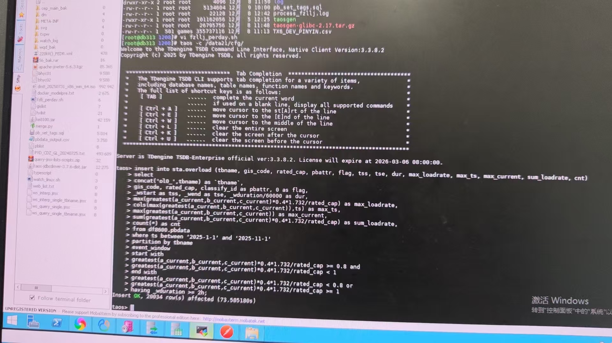


```sql {wrap}
insert into sta.overload (tbname, gis_code, rated_cap, pbattr, flag, tss, tse, dur, max_loadrate, max_ts, max_current, sum_loadrate, cnt)
select 
concat('ol1_',tbname) as `tbname`,
gis_code, rated_cap, classify_id as pbattr, 1 as flag, 
_wstart as tss, _wend as tse, _wduration/60000 as dur, 
max(greatest(a_current,b_current,c_current)*ct_ratio*0.4*1.732/rated_cap) as max_loadrate, 
cols(max(greatest(a_current,b_current,c_current)),ts) as max_ts, 
max(greatest(a_current,b_current,c_current)) as max_current, 
sum(greatest(a_current,b_current,c_current)*ct_ratio*0.4*1.732/rated_cap) as sum_loadrate,
count(*) as cnt  
from df8600.pbdata 
where ts between '2025-10-1' and '2026-10-1'
partition by tbname
event_window
start with 
greatest(a_current,b_current,c_current)*ct_ratio*0.4*1.732/rated_cap >= 1 and 
greatest(a_current,b_current,c_current)*ct_ratio*0.4*1.732/rated_cap < 1.2 
end with 
greatest(a_current,b_current,c_current)*ct_ratio*0.4*1.732/rated_cap < 1 or 
greatest(a_current,b_current,c_current)*ct_ratio*0.4*1.732/rated_cap >= 1.2 
having _wduration >= 2h

db313 区间10个月，执行耗时68.6秒，写入 437 条
```

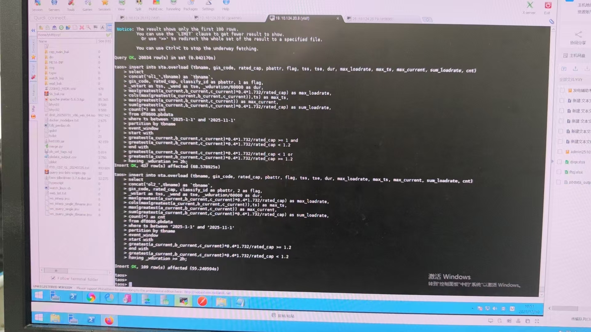

```sql {wrap}
insert into sta.overload (tbname, gis_code, rated_cap, pbattr, flag, tss, tse, dur, max_loadrate, max_ts, max_current, sum_loadrate, cnt)
select 
concat('ol2_',tbname) as `tbname`,
gis_code, rated_cap, classify_id as pbattr, 2 as flag, 
_wstart as tss, _wend as tse, _wduration/60000 as dur, 
max(greatest(a_current,b_current,c_current)*ct_ratio*0.4*1.732/rated_cap) as max_loadrate, 
cols(max(greatest(a_current,b_current,c_current)),ts) as max_ts, 
max(greatest(a_current,b_current,c_current)) as max_current, 
sum(greatest(a_current,b_current,c_current)*ct_ratio*0.4*1.732/rated_cap) as sum_loadrate,
count(*) as cnt  
from df8600.pbdata 
where ts between '2025-10-1' and '2026-10-1'
partition by tbname
event_window
start with 
greatest(a_current,b_current,c_current)*ct_ratio*0.4*1.732/rated_cap >= 1.2  
end with 
greatest(a_current,b_current,c_current)*ct_ratio*0.4*1.732/rated_cap < 1.2  
having _wduration >= 2h

db313 区间10个月，执行耗时55.2秒，写入 109 条
```


##### 4.1.4 tx6_tjfzl_fzllj_pb_day 负载率分区统计表初始化

###### 4.1.4.1 **设计思路与建表**

- 创建超级表 sta.tx6_tjfzl_fzllj_pb_day
- 从pbdata计算每台配变每天负载率各区间时长(分钟)、日最大负载率等信息，写入tx6_tjfzl_fzllj_pb_day表
```sql {wrap}
create stable sta.tx6_tjfzl_fzllj_pb_day (ts TIMESTAMP, ymd INT COMPOSITE KEY, insertdate TIMESTAMP, fzl0 INT, fzlless10 INT, fzl10 INT, fzl20 INT, fzl30 INT, fzl40 INT, fzl50 INT, fzl60 INT, fzl70 INT, fzl80 INT, fzl85 INT, fzl90 INT, fzl95 INT, fzl100 INT, fzl110 INT, fzl120 INT, fzl130 INT, fzl140 INT, fzl150 INT, fzlover200 INT, max_lr DOUBLE, max_ts TIMESTAMP, sum_lr DOUBLE, cnt INT) tags (name varchar(32), typedesc varchar(200), bureau nchar(16), pbname nchar(50), rated float))
```

###### 4.1.4.2 **查询pbdata计算后写入 tx6_tjfzl_fzllj_pb_day**

```sql {wrap}
insert into sta.tx6_tjfzl_fzllj_pb_day (tbname, name, ts, ymd, insertdate, fzl0, fzlless10, fzl10, fzl20, fzl30, fzl40, fzl50, fzl60, fzl70, fzl80, fzl85, fzl90, fzl95, fzl100, fzl110, fzl120, fzl130,fzl140, fzl150, fzlover200, max_lr, max_ts, sum_lr, cnt)
select
concat('fzllj_',tname) as `tbname`,
last(gis_code) as name,
_wstart as ts,
cast(to_char(_wstart,'YYYYMMDD') as INT) as ymd,
now as insertdate, 
sum(fzl0) as fzl0,
sum(fzlless10) as fzlless10, 
sum(fzl10) as fzl10, 
sum(fzl20) as fzl20, 
sum(fzl30) as fzl30, 
sum(fzl40) as fzl40, 
sum(fzl50) as fzl50, 
sum(fzl60) as fzl60, 
sum(fzl70) as fzl70, 
sum(fzl80) as fzl80, 
sum(fzl85) as fzl85, 
sum(fzl90) as fzl90, 
sum(fzl95) as fzl95, 
sum(fzl100) as fzl100, 
sum(fzl110) as fzl110, 
sum(fzl120) as fzl120, 
sum(fzl130) as fzl130, 
sum(fzl140) as fzl140, 
sum(fzl150) as fzl150, 
sum(fzlover200) as fzlover200,
max(lr) as max_lr, cols(max(lr), ts as max_ts), 
sum(lr) as sum_lr, count(*) as cnt 
from (
select 
ts, tname, gis_code, 
case when lr < 0 then dur end as fzl0,
case when lr >=0 and lr <0.1 then dur end as fzlless10, 
case when lr >=0.1 and lr <0.2 then dur end as fzl10, 
case when lr >=0.2 and lr <0.3 then dur end as fzl20, 
case when lr >=0.3 and lr <0.4 then dur end as fzl30, 
case when lr >=0.4 and lr <0.5 then dur end as fzl40, 
case when lr >=0.5 and lr <0.6 then dur end as fzl50, 
case when lr >=0.6 and lr <0.7 then dur end as fzl60, 
case when lr >=0.7 and lr <0.8 then dur end as fzl70, 
case when lr >=0.8 and lr <0.85 then dur end as fzl80, 
case when lr >=0.85 and lr <0.9 then dur end as fzl85, 
case when lr >=0.9 and lr <0.95 then dur end as fzl90, 
case when lr >=0.95 and lr <1 then dur end as fzl95, 
case when lr >=1 and lr <1.1 then dur end as fzl100, 
case when lr >=1.1 and lr <1.2 then dur end as fzl110, 
case when lr >=1.2 and lr <1.3 then dur end as fzl120, 
case when lr >=1.3 and lr <1.4 then dur end as fzl130, 
case when lr >=1.4 and lr <1.5 then dur end as fzl140, 
case when lr >=1.5 and lr <2 then dur end as fzl150, 
case when lr >=2  then dur end as fzlover200,
lr
from 
(select _wstart as ts, tbname as tname, _wduration/60000 as dur, gis_code,
first(greatest(a_current,b_current,c_current)*ct_ratio*0.4*1.732/rated_cap) as lr
from df8600.pbdata
where ts between '2025-1-1' and '2025-10-1' 
partition by tbname
count_window(2,1)
)
partition by tname 
)
partition by tname 
interval(1d)
```

处理脚本逻辑：将所有配变按每天从pbdata查询、计算后写入结果表
`./fzllj_perday.sh 202501 202509`  
```sql {wrap}
db313 处理9个月数据，耗时 7h16m28s
平均每天数据处理耗时 96s
```

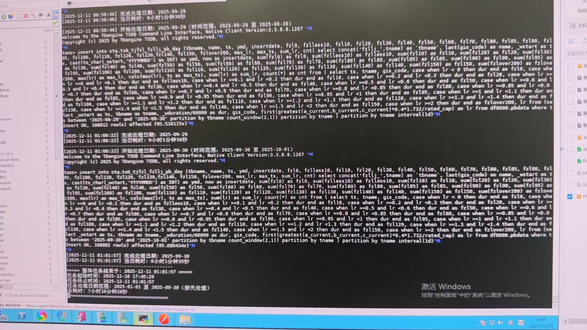

###### 4.1.4.3 **导入配变元数据至tx6_tjfzl_fzllj_pb_day**

- 运行SQL文件，将配变元数据同步至  **tx6_tjfzl_fzllj_pb_day**
  - 根据name/gis_code匹配各静态标签属性：bureau - 所属区局；pbname - 配变名称；rated - 额定容量MVA；typedesc - 配变属性，干式/油浸
`nohup taos -s 'source fzllj_settags.sql' > fzllj_settags.log  2>&1 &`

> ⚠ 嵌入文件，需在飞书中查看 (token: XRifbmHTgoEGsIxVpt7cWEnlnX1)


##### 4.1.5 tx6_tjfzl_unbalance_day 三相不平衡表初始化

###### 4.1.5.1 **设计思路与建表**

- 创建超级表 sta.tx6_tjfzl_unbalance_day
- 从pbdata计算每台配变每天最大电流值、最小电流值、最大三相不平衡，写入tx6_tjfzl_unbalance_day表
```sql {wrap}
create stable sta.tx6_tjfzl_unbalance_day (ts TIMESTAMP, ymd INT COMPOSITE KEY, insertdate TIMESTAMP,  maxvalue DOUBLE, minvalue DOUBLE, rate DOUBLE) tags (gis_code varchar(32))
```

###### 4.1.5.2 **查询pbdata计算后写入tx6_tjfzl_unbalance_day**

```sql {wrap}
insert into sta.tx6_tjfzl_unbalance_day (tbname, gis_code, ts, ymd, insertdate, maxvalue, minvalue, rate) 
select 
concat('unb_',tbname) as `tbname`, 
gis_code, 
_wstart as ts, 
cast(to_char(_wstart,'YYYYMMDD') as INT) as ymd, 
now as insertdate, 
max(greatest(a_current,b_current,c_current)) as maxvalue, 
min(least(a_current,b_current,c_current)) as minvalue, 
(max(greatest(a_voltage,b_voltage,c_voltage))-min(least(a_voltage,b_voltage,c_voltage)))/max(greatest(a_voltage,b_voltage,c_voltage)) as rate 
from df8600.pbdata 
partition by tbname 
interval(1d);
```

```sql {wrap}
db313 写入耗时 652 秒，4468万条
```

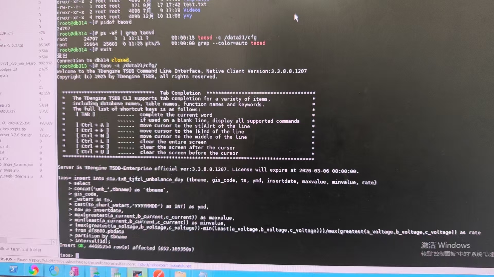


#### 4.2 **CIM树查询验证**

##### 4.2.1 **主网接线图界面模糊查询厂站名称**

> ⚠ 嵌入文件，需在飞书中查看 (token: ZIsHbAMP8ouQKhxda7kczgoBnZC)

```sql {wrap}
jmeter -n -t ws_query4.2.jmx -l result/report.jtl -e -o report
```

```sql {wrap}
select 
uri, 
pinyin, 
description, 
case 
        when dev_type = 100 then 'Company' 
        when dev_type = 101 then 'Area' 
        when dev_type = 106 then 'Zone' 
        when dev_type = 102 and (ltype1=1 or ltype1=2) then 'Station' 
        when dev_type = 107 then 'Feeder' 
        when dev_type = 102 and ltype1=3 then 'DmsStation' 
        when dev_type = 7 then 'Powertf' 
        when dev_type = 126 then 'Breaker' 
        else null end as type, 
        c_value1  
from 
        pyd.tx6_dev_pinyin a
where 
        1 = 1 
    and SRC_FLAG = 0 
    and 
        ( 
                     ( 
                       a.DEV_TYPE=100 
                   and a.LTYPE1  =0 
            ) 
             or 
            ( 
                    a.DEV_TYPE=102 
                and a.LTYPE1  =1 
            ) 
        ) 
    and description like '%TH%'
    limit 50;
    
```

**num_threads=10 loops=1000 poolMax=10 查询耗时约 8.12 秒 1231 QPS**
```json {wrap}
{
  "JDBC Request" : {
    "transaction" : "JDBC Request",
    "sampleCount" : 10000,
    "errorCount" : 0,
    "errorPct" : 0.0,
    "meanResTime" : 7.458900000000014,
    "medianResTime" : 7.0,
    "minResTime" : 6.0,
    "maxResTime" : 543.0,
    "pct1ResTime" : 9.0,
    "pct2ResTime" : 9.0,
    "pct3ResTime" : 12.0,
    "throughput" : 1231.527093596059,
    "receivedKBytesPerSec" : 44.498537561576356,
    "sentKBytesPerSec" : 0.0
  },
  "Total" : {
    "transaction" : "Total",
    "sampleCount" : 10000,
    "errorCount" : 0,
    "errorPct" : 0.0,
    "meanResTime" : 7.458900000000014,
    "medianResTime" : 7.0,
    "minResTime" : 6.0,
    "maxResTime" : 543.0,
    "pct1ResTime" : 9.0,
    "pct2ResTime" : 9.0,
    "pct3ResTime" : 12.0,
    "throughput" : 1231.527093596059,
    "receivedKBytesPerSec" : 44.498537561576356,
    "sentKBytesPerSec" : 0.0
  }
}
```


##### 4.2.2 **GIS单线图界面模糊查询馈线名称**

> ⚠ 嵌入文件，需在飞书中查看 (token: H3uubYwn8oW9koxFrAzcycNynsg)

```sql {wrap}
jmeter -n -t ws_query4.3.jmx -l result/report.jtl -e -o report
```

```sql {wrap}
select
        uri,
        pinyin,
        description,
        case 
        when dev_type = 100 then 'Company' 
        when dev_type = 101 then 'Area' 
        when dev_type = 106 then 'Zone' 
        when dev_type = 102 and (lType1=1 or lType1=2) then 'Station' 
        when dev_type = 107 then 'Feeder' 
        when dev_type = 102 and lType1=3 then 'DmsStation' 
        when dev_type = 7 then 'Powertf' 
        when dev_type = 126 then 'Breaker' 
        else null end as type,
        c_value1
from
        pyd.tx6_dev_pinyin a
where
        1 = 1
    and SRC_FLAG = 0
    and
        (
            (
                       a.DEV_TYPE=100
                   and a.LTYPE1  =0
            )
             or
            (
                    a.DEV_TYPE=107
                and a.LTYPE1  =0
            )
              or
            (
                    a.DEV_TYPE=102
                and a.LTYPE1  =3
            )
              or
            (
                    a.DEV_TYPE=7
                and a.LTYPE1  =0
            )
        )
    and description like '%TH%'
limit 50;
```

**num_threads=10 loops=1000 poolMax=10 查询耗时约 8.77 秒 1140 QPS**
```json {wrap}
{
  "JDBC Request" : {
    "transaction" : "JDBC Request",
    "sampleCount" : 10000,
    "errorCount" : 0,
    "errorPct" : 0.0,
    "meanResTime" : 8.078400000000025,
    "medianResTime" : 7.0,
    "minResTime" : 6.0,
    "maxResTime" : 560.0,
    "pct1ResTime" : 9.0,
    "pct2ResTime" : 10.0,
    "pct3ResTime" : 14.0,
    "throughput" : 1140.901312036509,
    "receivedKBytesPerSec" : 41.223973188819166,
    "sentKBytesPerSec" : 0.0
  },
  "Total" : {
    "transaction" : "Total",
    "sampleCount" : 10000,
    "errorCount" : 0,
    "errorPct" : 0.0,
    "meanResTime" : 8.078400000000025,
    "medianResTime" : 7.0,
    "minResTime" : 6.0,
    "maxResTime" : 560.0,
    "pct1ResTime" : 9.0,
    "pct2ResTime" : 10.0,
    "pct3ResTime" : 14.0,
    "throughput" : 1140.901312036509,
    "receivedKBytesPerSec" : 41.223973188819166,
    "sentKBytesPerSec" : 0.0
  }
}
```


##### 4.2.3 **添加配网故障简报弹窗模糊搜索所有设备名称**

> ⚠ 嵌入文件，需在飞书中查看 (token: HkBpbVknHo15sqxCvTRcEZfwn2f)

```sql {wrap}
jmeter -n -t ws_query4.4.jmx -l result/report.jtl -e -o report
```

```sql {wrap}
select
        T.URI DEV_URI,
        T.DESCRIPTION DEV_DESC,
        T.dev_type TYPE
        from
        pyd.tx6_dev_pinyin T
        where
        T.dev_type in (107,6,17,15,16,7)
        and
          T.PINYIN like '%TH%'
        limit 0,50;
```

**num_threads=10 loops=1000 poolMax=10 查询耗时约 9.4 秒 1063 QPS**
```json {wrap}
{
  "JDBC Request" : {
    "transaction" : "JDBC Request",
    "sampleCount" : 10000,
    "errorCount" : 0,
    "errorPct" : 0.0,
    "meanResTime" : 8.668700000000047,
    "medianResTime" : 8.0,
    "minResTime" : 7.0,
    "maxResTime" : 497.0,
    "pct1ResTime" : 10.0,
    "pct2ResTime" : 11.0,
    "pct3ResTime" : 15.0,
    "throughput" : 1063.3772862611654,
    "receivedKBytesPerSec" : 3608.6289743726074,
    "sentKBytesPerSec" : 0.0
  },
  "Total" : {
    "transaction" : "Total",
    "sampleCount" : 10000,
    "errorCount" : 0,
    "errorPct" : 0.0,
    "meanResTime" : 8.668700000000047,
    "medianResTime" : 8.0,
    "minResTime" : 7.0,
    "maxResTime" : 497.0,
    "pct1ResTime" : 10.0,
    "pct2ResTime" : 11.0,
    "pct3ResTime" : 15.0,
    "throughput" : 1063.3772862611654,
    "receivedKBytesPerSec" : 3608.6289743726074,
    "sentKBytesPerSec" : 0.0
  }
}
```


##### 4.2.4 **GIS台区图界面模糊搜索台区名称**

> ⚠ 嵌入文件，需在飞书中查看 (token: FL5gb17lCogE8exR9m8ceJGynvv)

```sql {wrap}
jmeter -n -t ws_query4.5.jmx -l result/report.jtl -e -o report
```

```sql {wrap}
select uri,
              pinyin,
              description,
              case
              when dev_type = 100 then
              'Company'
              when dev_type = 101 then
              'Area'
              when dev_type = 106 then
              'Zone'
              when dev_type = 102 and (lType1=1 or lType1=2) then
              'Station'
              when dev_type = 107 then
              'Feeder'
              when dev_type = 102 and lType1=3 then
              'DmsStation'
              when dev_type = 7 then
              'Powertf'
              when dev_type = 126 then
              'Breaker'
              else
              null
              end type,
              c_value1
              from pyd.tx6_dev_pinyin a
              where 1=1
       and
              SRC_FLAG = 0
                     and
                      (  
                            (
                            a.DEV_TYPE=100
                            and a.LTYPE1=0
                            )
                       or  
                            (
                            a.DEV_TYPE=102
                            and a.LTYPE1=1
                            )
                      ) 
                     and description like '%TH%'
                     limit 50;
```

**num_threads=10 loops=1000 poolMax=10 查询耗时约 8.17 秒 1224 QPS**
```json {wrap}
{
  "JDBC Request" : {
    "transaction" : "JDBC Request",
    "sampleCount" : 10000,
    "errorCount" : 0,
    "errorPct" : 0.0,
    "meanResTime" : 7.421600000000008,
    "medianResTime" : 7.0,
    "minResTime" : 6.0,
    "maxResTime" : 536.0,
    "pct1ResTime" : 9.0,
    "pct2ResTime" : 9.0,
    "pct3ResTime" : 12.0,
    "throughput" : 1224.589762429586,
    "receivedKBytesPerSec" : 44.247872275287776,
    "sentKBytesPerSec" : 0.0
  },
  "Total" : {
    "transaction" : "Total",
    "sampleCount" : 10000,
    "errorCount" : 0,
    "errorPct" : 0.0,
    "meanResTime" : 7.421600000000008,
    "medianResTime" : 7.0,
    "minResTime" : 6.0,
    "maxResTime" : 536.0,
    "pct1ResTime" : 9.0,
    "pct2ResTime" : 9.0,
    "pct3ResTime" : 12.0,
    "throughput" : 1224.589762429586,
    "receivedKBytesPerSec" : 44.247872275287776,
    "sentKBytesPerSec" : 0.0
  }
}
```


#### 4.3 **配变界面查询验证 - 配变重载/过载查询 & 配变条件查询**

**根据客户提供的界面，梳理核心需求：**
从pbdata原始数据计算得到中间结果表overload，存放重载、一般过载、严重过载的详情；所有界面都从中间结果表overload过滤、查询得出。
<quote-container>
重载：负载率大于80%到100%，持续时间2小时  **load_rate >=0.8 & <1**
一般过载：负载率大于100%到120%，持续时间2小时  **load_rate >=1 & <1.2**
严重过载：负载率大于120%，持续时间2小时  **load_rate >=1.2**
</quote-container>

##### 4.3.1 **界面查询验证：配变重载、过载查询**

- 静态属性：所属区局、所属馈线、所属站房、配变ID(gis_code)、配变名称(中文)、配变属性(干式/油浸)、配变类型(公变...)
- 计算列：重载天数(load_rate>0.8 & <1)、过载天数(load_rate>1)、平均负载率
**查询性能验证：时间跨度1个月、1年**
```sql {wrap}
select gis_code, 
sum(overload_indicator0) as overload_days0, 
sum(overload_indicator1+overload_indicator2) as overload_days12, 
sum(sum_lr)/sum(sum_cnt) as average_load_rate 
from (
select _wstart as ts, gis_code,  
case when count(*)>0 and flag=0 then 1 else 0 end as overload_indicator0, 
case when count(*)>0 and flag=1 then 1 else 0 end as overload_indicator1, 
case when count(*)>0 and flag=2 then 1 else 0 end as overload_indicator2,  
sum(sum_loadrate) as sum_lr, sum(cnt) as sum_cnt
from sta.overload
where tss between '2025-1-1' and '2025-11-1' 
partition by tbname,flag 
interval(1d)
) 
partition by gis_code

db313
区间1个月，执行耗时0.012秒，结果集 212 条
区间10个月，执行耗时0.03秒，结果集 3098 条
```

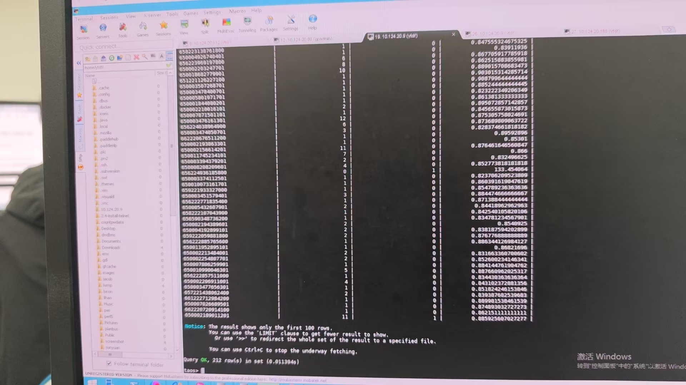

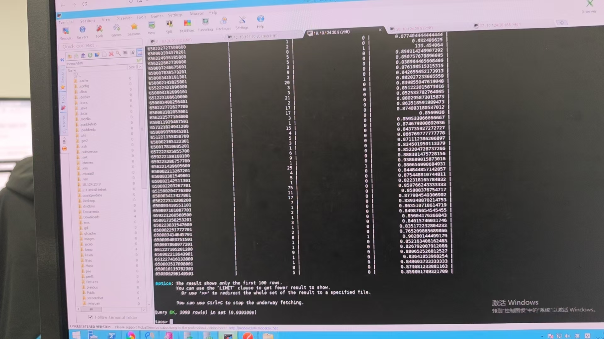

##### 4.3.2 **界面查询验证：配变条件查询 - 重载、一般过载、严重过载**

- 静态属性：配变名称(中文)、台区GIS编号(gis_code)、额定容量、配变类型(公变...)、配变属性(干式/油浸)
- 计算列：出现天数(load_rate在指定范围内)、累计时长、日均时长、三相最大电流、最高负载率发生时间、最高负载率
- 下面的示例SQL是针对重载 flag=0 的计算逻辑，如需：
  - 计算一般过载或严重过载，则将flag改为1或2、overload_indicator1或2
  - 如希望计算所有过载类型，则：删除 flag=0/1/2的过滤条件、其余参考上面4.3.1 配变重过载查询的SQL
**查询性能验证：时间跨度1个月、10个月**
```sql {wrap}
select gis_code, 
sum(overload_indicator0) as overload_days, 
sum(sum_dur) as sum_overload_duration,
sum(sum_dur)/sum(overload_indicator0) as average_overload_min_perday,
max(max_current) as max_current,
cols(max(max_loadrate), mts as max_ts), 
max(max_loadrate) as max_loadrate
from (
select gis_code,  
case when count(*)>0 and flag=0 then 1 else 0 end as overload_indicator0,   
sum(dur) as sum_dur, 
max(max_current) as max_current,
cols(max(max_loadrate),max_ts as mts), 
max(max_loadrate) as max_loadrate 
from sta.overload
where tss between '2025-1-1' and '2025-11-1' 
and flag = 0
partition by tbname,flag 
interval(1d)
) 
partition by gis_code

db313 
重载 flag=0
区间1个月，执行耗时0.011秒，结果集 207 条
区间10个月，执行耗时0.03秒，结果集 3083 条
一般过载 flag=1
区间1个月，执行耗时0.008秒，结果集 10 条
区间10个月，执行耗时0.009秒，结果集 169 条
严重过载 flag=2
区间1个月，执行耗时0.009秒，结果集 6 条
区间10个月，执行耗时0.009秒，结果集 23 条
```

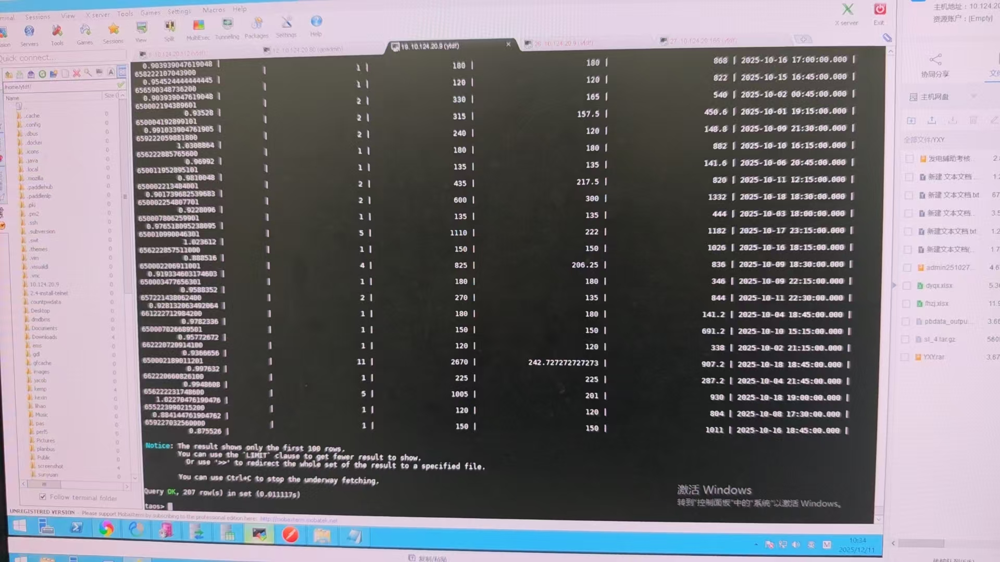

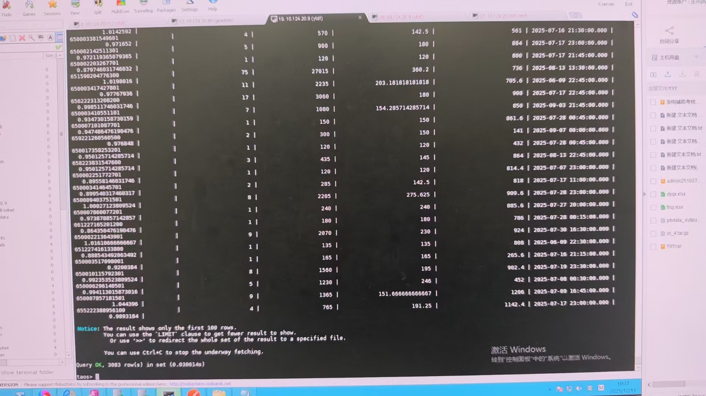

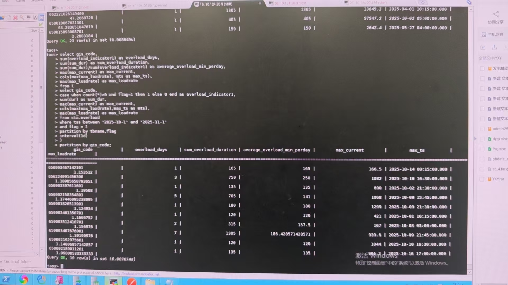

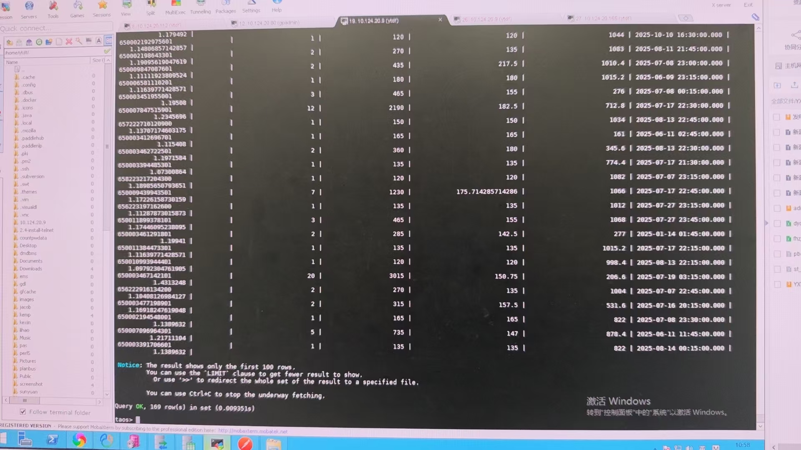

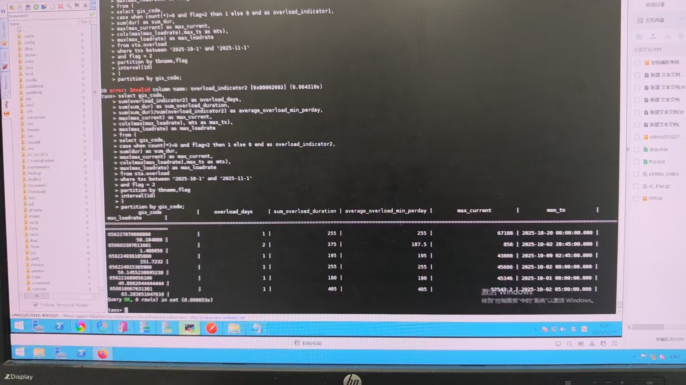

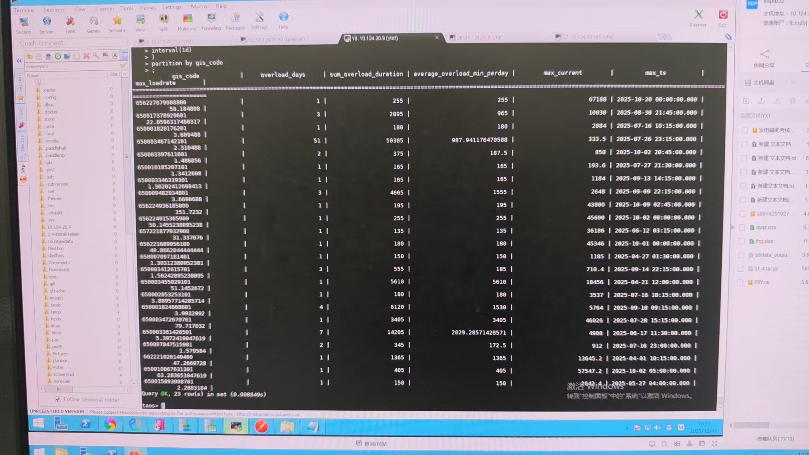

##### 4.3.3 **界面查询验证：重载过载详情查询**

- 静态属性：所属区局、所属馈线、所属站房、配变ID(gis_code)、配变名称(中文)、配变属性(干式/油浸)、配变类型(公变...)
- 计算列：开始时间、结束时间、持续时间、最大负载率、(最高负载率发生时间、三相最大电流、本区间负载率之和、本区间计数)
**查询性能验证：**
```sql {wrap}
select gis_code, 
tss, tse, dur, max_loadrate, max_ts, max_current, sum_loadrate, cnt 
from sta.overload
where tss between '2025-10-1' and '2025-11-1' 
and flag = 0 
and bureau like '%天河%' 
and pbname like '%公变%'
partition by tbname,flag slimit 200 limit 20

db313 
重载 flag=0
区间1个月，执行耗时0.013秒，结果集 18 条
区间10个月，执行耗时0.023秒，结果集 290 条
```

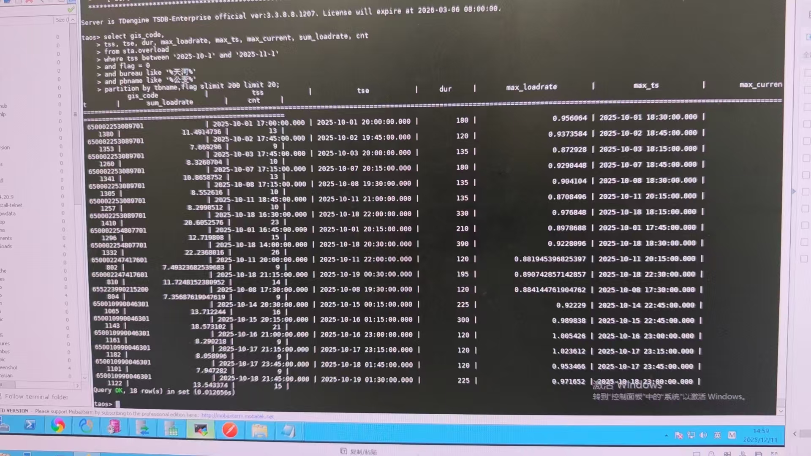

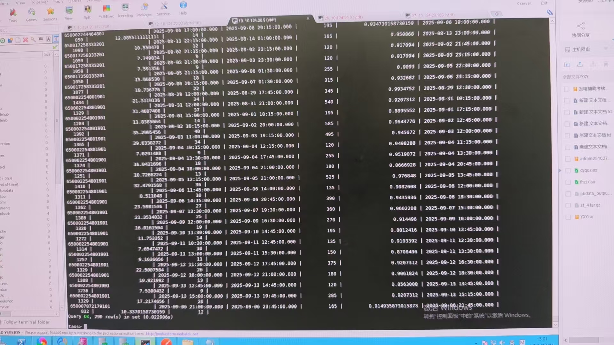

##### 4.3.4 **界面查询验证：指定负载率区间、单日累计时长条件下，配变统计信息查询**

- 静态属性：台区GIS编码(gis_code)、额定容量、配变类型、配变属性
- 计算列：出现天数、累计时长、日均时长、三相最大电流、最高负载率发生时间、最高负载率、最小电流、最大三相不平衡
- 示例SQL说明：查询2025-10-1 ~ 2025-12-31之间，负载率在100~110%之间且单日累计时长超过150分钟的配变，按每台配变分组显示：出现天数、累计时长、日均时长、三相最大电流、最高负载率发生时间、最高负载率、最小电流、最大三相不平衡
  - 如需统计区间为多个负载率区间之和，可将fzl100改为对应的表达式，如 fzl80+fzl85+fzl90 即可
**查询性能验证：天河区含“村”的配变，负载率100超过15分钟**
```sql {wrap}
select gis_code, bureau, pbname, rated, typedesc, 
count(*) as day_count, sum(total_dur) as sum_total_dur, 
sum(total_dur) / count(*) as avg_dur, 
max(maxvalue) as maxvalue, 
cols(max(max_lr), max_ts as max_ts), 
max(max_lr) as peak_loadrate, 
min(minvalue) as minvalue, 
max(rate) as max_rate
from(
select /*+ hash_join() */ a.gis_code, a.bureau, a.pbname, a.rated, a.typedesc, b.ts, a.total_dur, a.max_lr, a.max_ts, 
b.maxvalue, b.minvalue, b.rate 
from
(select _wstart as ts, name as gis_code, 
bureau, pbname, rated, typedesc, 
sum(fzl100) as total_dur, max(max_lr) as max_lr, cols(max(max_lr), ts as max_ts) 
from tx6_tjfzl_fzllj_pb_day 
where _rowts between '2025-1-1' and '2025-11-1' 
and fzl100 > 15 
and bureau like '%天河%' 
and pbname like '%村%'  
partition by tbname interval(1d)
) as a, 
(select ts, gis_code, 
maxvalue, minvalue, rate 
from tx6_tjfzl_unbalance_day 
where _rowts between '2025-1-1' and '2025-11-1'
) as b 
where a.gis_code = b.gis_code and a.ts = b.ts
) 
partition by gis_code, bureau, pbname, rated, typedesc

db313
查询1个月内，天河区含村的配变，负载率100超过15分钟 耗时0.167秒，结果集 0 条
查询10个月内，天河区含村的配变，负载率100超过15分钟 耗时1.14秒，结果集 9 条
```

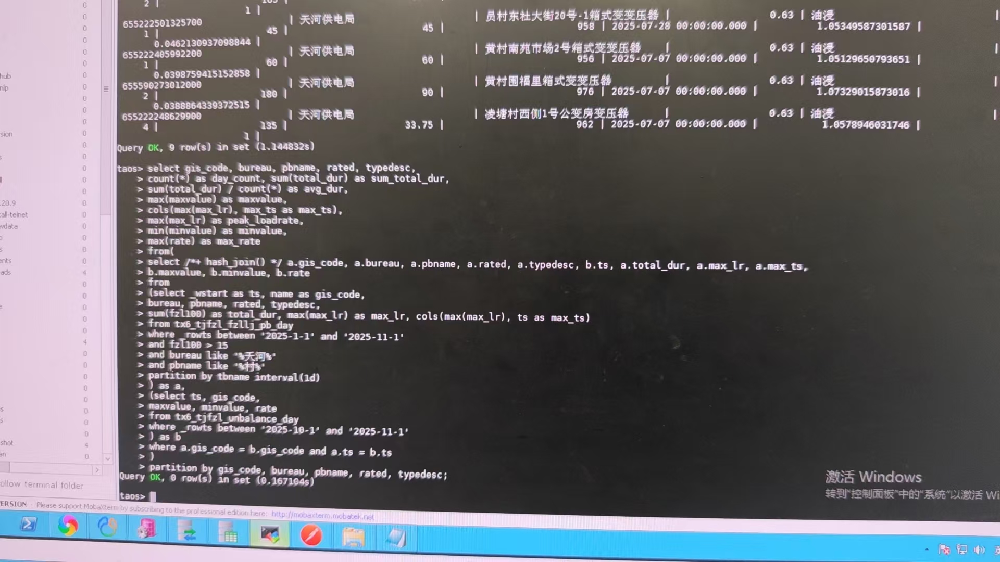

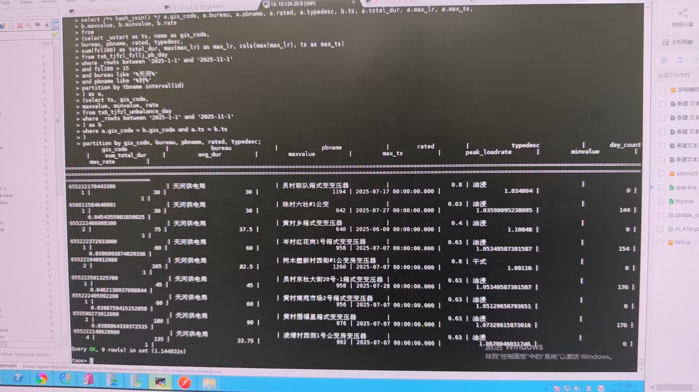

**查询性能验证：天河区含“村”的配变，负载率10+20+30+40+50+60超过1分钟**
```sql {wrap}
select gis_code, bureau, pbname, rated, typedesc, 
count(*) as day_count, sum(total_dur) as sum_total_dur, 
sum(total_dur) / count(*) as avg_dur, 
max(maxvalue) as maxvalue, 
cols(max(max_lr), max_ts as max_ts), 
max(max_lr) as peak_loadrate, 
min(minvalue) as minvalue, 
max(rate) as max_rate
from(
select /*+ hash_join() */ a.gis_code, a.bureau, a.pbname, a.rated, a.typedesc, b.ts, a.total_dur, a.max_lr, a.max_ts, 
b.maxvalue, b.minvalue, b.rate 
from
(select _wstart as ts, name as gis_code, 
bureau, pbname, rated, typedesc, 
sum(ifnull(fzl10,0)+ifnull(fzl20,0)+ifnull(fzl30,0)+ifnull(fzl40,0)+ifnull(fzl50,0)+ifnull(fzl60,0)) as total_dur, 
max(max_lr) as max_lr, cols(max(max_lr), ts as max_ts) 
from tx6_tjfzl_fzllj_pb_day 
where _rowts between '2025-1-1' and '2025-11-1' 
and 
ifnull(fzl10,0)+ifnull(fzl20,0)+ifnull(fzl30,0)+ifnull(fzl40,0)+ifnull(fzl50,0)+ifnull(fzl60,0) > 1  
and bureau like '%天河%' 
and pbname like '%村%'  
partition by tbname interval(1d)
) as a, 
(select ts, gis_code, 
maxvalue, minvalue, rate 
from tx6_tjfzl_unbalance_day 
where _rowts between '2025-1-1' and '2025-11-1'
) as b 
where a.gis_code = b.gis_code and a.ts = b.ts
) 
partition by gis_code, bureau, pbname, rated, typedesc

db313
查询1个月内，天河区含村的配变，负载率10-60超过1分钟 耗时0.28秒，结果集 527 条
查询10个月内，天河区含村的配变，负载率10-60超过1分钟 耗时0.62秒，结果集 527 条
```

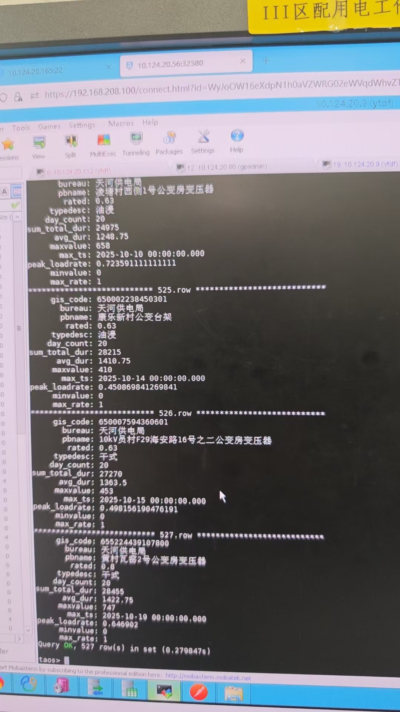

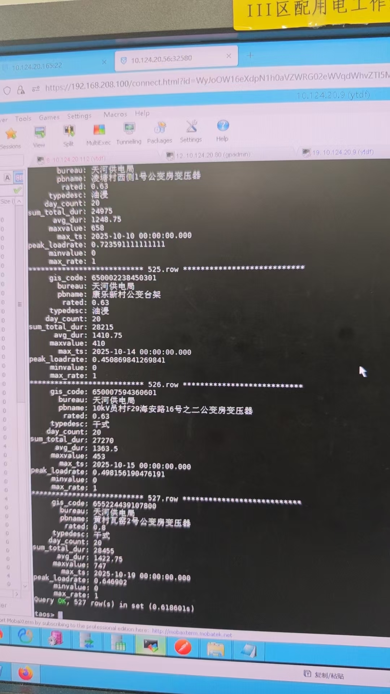


#### 4.4 三相不平衡查询验证 - TX6_TJFZL_UNBALANCE_DAY表

##### 4.4.1 **查询性能验证**

查询一个月所有配变的电流最大值、电流最小值、负载率平均值
```sql {wrap}
select max(maxvalue), min(minvalue), avg(rate) from tx6_tjfzl_unbalance_day where ts between '2025-10-1' and '2025-11-1'

db313 耗时0.075秒
```

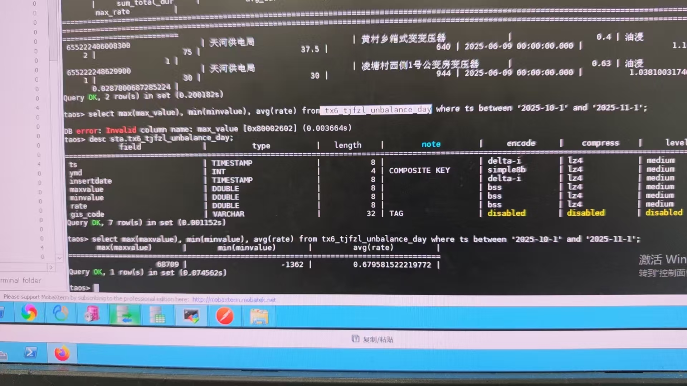

查询一年所有配变的电流最大值、电流最小值、负载率平均值
```sql {wrap}
select max(maxvalue), min(minvalue), avg(rate) from tx6_tjfzl_unbalance_day where ts between '2025-1-1' and '2025-12-31' 

db313 耗时0.141秒
```

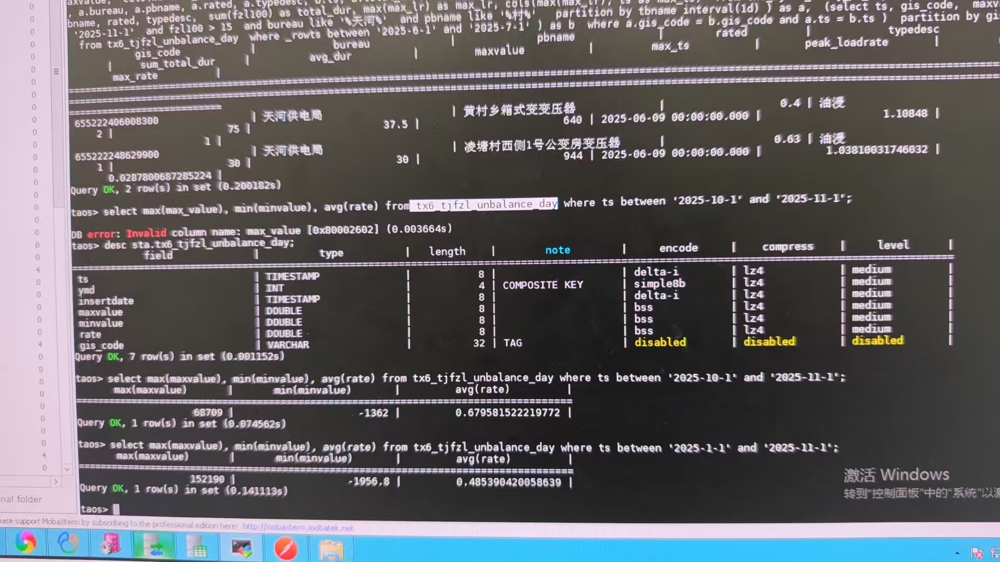

按配变分组查询一年各个配变的电流最大值、电流最小值、负载率平均值
```sql {wrap}
select gis_code, max(maxvalue), min(minvalue), avg(rate) from tx6_tjfzl_unbalance_day where ts between '2025-1-1' and '2025-12-31' partition by tbname

db313 耗时0.358秒，结果集 56862 条
```

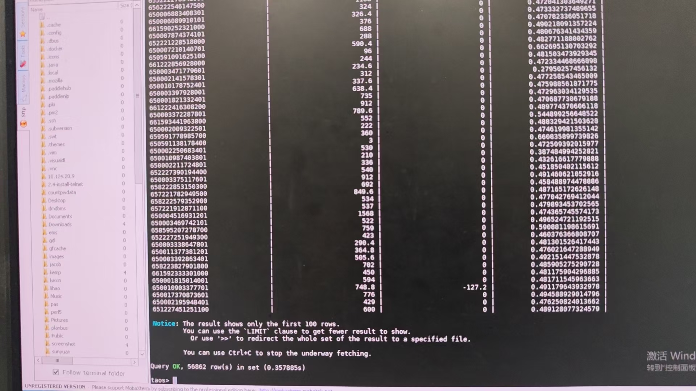

按配变分组查询各个配变入库数据：配变gis_code、日电流最大值、日电流最小值、三相不平衡，输出100组每组20条
```sql {wrap}
select gis_code, ymd, max_value, minvalue, rate from tx6_tjfzl_unbalance_day where ts between '2025-1-1' and '2025-12-31' partition by tbname slimit 100 limit 20

db313 耗时0.154秒
```

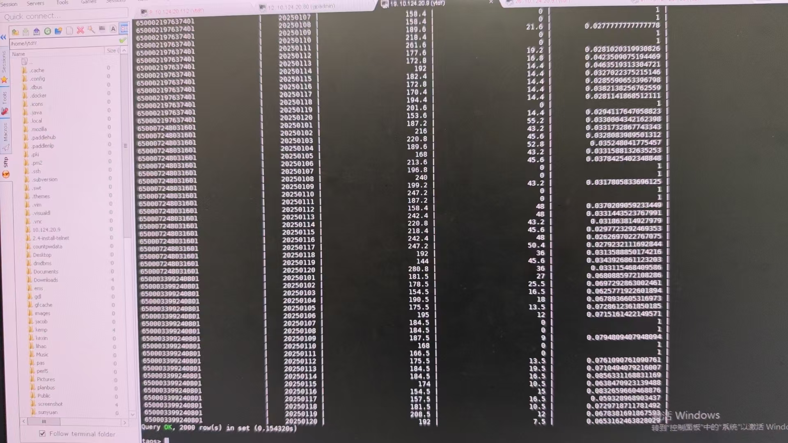


#### 4.5 负载率分区统计查询验证 - TX6_TJFZL_FZLLJ_PB_DAY表

##### 4.5.1 **查询性能验证**

按配变分组查询一个月各个配变各区间时长求和
```sql {wrap}
select name,sum(fzl0),sum(fzlless10),sum(fzl10), sum(fzl20), sum(fzl30), sum(fzl40), sum(fzl50), sum(fzl60), sum(fzl70), sum(fzl80), sum(fzl85), sum(fzl90), sum(fzl95), sum(fzl100), sum(fzl110), sum(fzl120), sum(fzl130), sum(fzl140), sum(fzl150), sum(fzlover200) from tx6_tjfzl_fzllj_pb_day where ts between '2025-10-1' and '2025-11-1' group by name

db313 耗时0.783秒
```

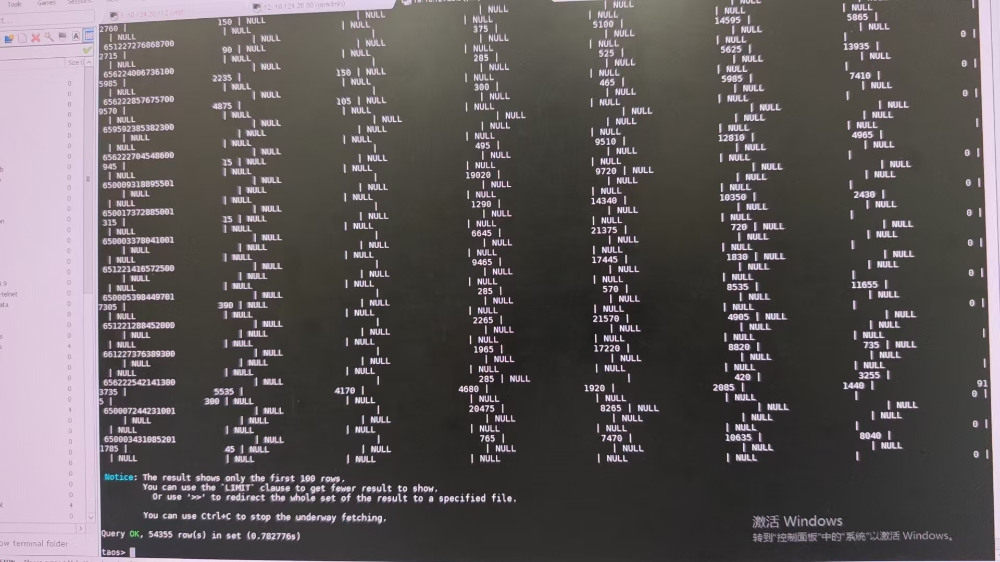

按配变分组查询一年各个配变各区间时长求和
```sql {wrap}
select name,sum(fzl0),sum(fzlless10),sum(fzl10), sum(fzl20), sum(fzl30), sum(fzl40), sum(fzl50), sum(fzl60), sum(fzl70), sum(fzl80), sum(fzl85), sum(fzl90), sum(fzl95), sum(fzl100), sum(fzl110), sum(fzl120), sum(fzl130), sum(fzl140), sum(fzl150), sum(fzlover200) from tx6_tjfzl_fzllj_pb_day where ts between '2025-1-1' and '2025-12-31' group by name

db313 耗时0.93秒
```

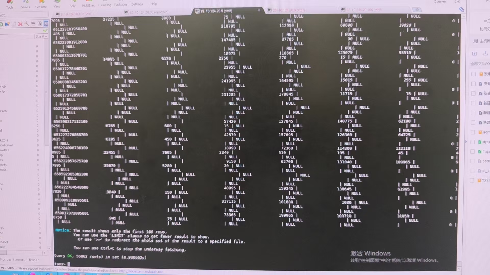

按配变分组查询一个月各个配变分区数据，输出100组每组20条
```sql {wrap}
select name,ymd,fzl0,fzlless10,fzl10, fzl20, fzl30, fzl40, fzl50, fzl60, fzl70, fzl80, fzl85, fzl90, fzl95, fzl100, fzl110, fzl120, fzl130, fzl140, fzl150, fzlover200 from tx6_tjfzl_fzllj_pb_day where ts between '2025-10-1' and '2025-11-1' partition by name slimit 100 limit 20

db313 耗时0.175秒
```

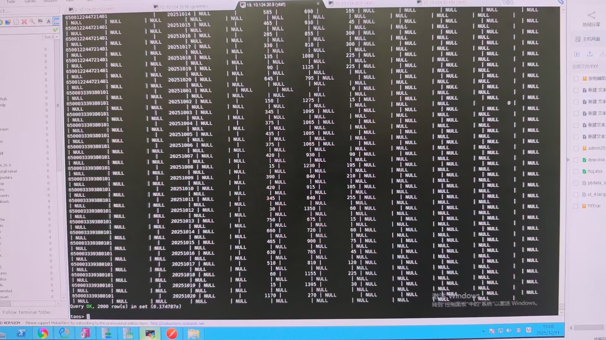

按配变分组查询一个月各个配变分区数据，筛选条件：30个配变名称，全部输出
```sql {wrap}
select name,ymd,fzl0,fzlless10,fzl10, fzl20, fzl30, fzl40, fzl50, fzl60, fzl70, fzl80, fzl85, fzl90, fzl95, fzl100, fzl110, fzl120, fzl130, fzl140, fzl150, fzlover200 from tx6_tjfzl_fzllj_pb_day where ts between '2025-10-1' and '2025-11-1' and tbname in ('fzllj_pb_655590120627200', 'fzllj_pb_662227179248100', 'fzllj_pb_653227513028200', 'fzllj_pb_656227009740000', 'fzllj_pb_661227376112500', 'fzllj_pb_650002247213201', 'fzllj_pb_658223101715400', 'fzllj_pb_650002240011601', 'fzllj_pb_662227179138400', 'fzllj_pb_662227179231400', 'fzllj_pb_662227179236000', 'fzllj_pb_662227120793400', 'fzllj_pb_661227376092800', 'fzllj_pb_661227376092200', 'fzllj_pb_650003455348101', 'fzllj_pb_661224414437000', 'fzllj_pb_661227376111900', 'fzllj_pb_662227137848200', 'fzllj_pb_652227218869400', 'fzllj_pb_650003455564901', 'fzllj_pb_659222705311300', 'fzllj_pb_650010963961901', 'fzllj_pb_650010948945401', 'fzllj_pb_650010962413801', 'fzllj_pb_650001818979601', 'fzllj_pb_650002141938601', 'fzllj_pb_650001820768401', 'fzllj_pb_656224106868500', 'fzllj_pb_650004863480801', 'fzllj_pb_661222847953800') partition by tbname

db313 耗时0.018秒
```

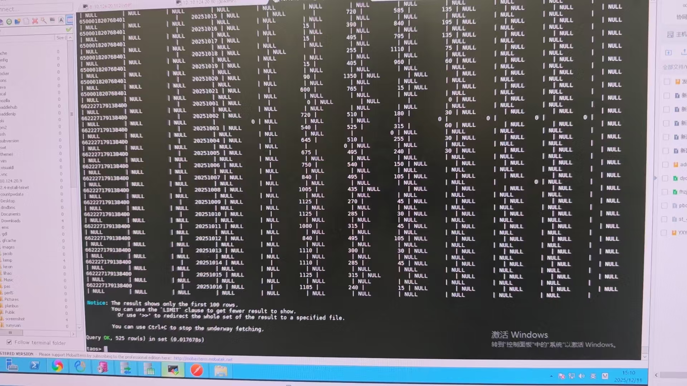

按配变分组查询一年各个配变分区数据，筛选条件：30个配变名称，全部输出
```sql {wrap}
select name,ymd,fzl0,fzlless10,fzl10, fzl20, fzl30, fzl40, fzl50, fzl60, fzl70, fzl80, fzl85, fzl90, fzl95, fzl100, fzl110, fzl120, fzl130, fzl140, fzl150, fzlover200 from tx6_tjfzl_fzllj_pb_day where ts between '2025-1-1' and '2025-12-31' and tbname in ('fzllj_pb_655590120627200', 'fzllj_pb_662227179248100', 'fzllj_pb_653227513028200', 'fzllj_pb_656227009740000', 'fzllj_pb_661227376112500', 'fzllj_pb_650002247213201', 'fzllj_pb_658223101715400', 'fzllj_pb_650002240011601', 'fzllj_pb_662227179138400', 'fzllj_pb_662227179231400', 'fzllj_pb_662227179236000', 'fzllj_pb_662227120793400', 'fzllj_pb_661227376092800', 'fzllj_pb_661227376092200', 'fzllj_pb_650003455348101', 'fzllj_pb_661224414437000', 'fzllj_pb_661227376111900', 'fzllj_pb_662227137848200', 'fzllj_pb_652227218869400', 'fzllj_pb_650003455564901', 'fzllj_pb_659222705311300', 'fzllj_pb_650010963961901', 'fzllj_pb_650010948945401', 'fzllj_pb_650010962413801', 'fzllj_pb_650001818979601', 'fzllj_pb_650002141938601', 'fzllj_pb_650001820768401', 'fzllj_pb_656224106868500', 'fzllj_pb_650004863480801', 'fzllj_pb_661222847953800') partition by tbname

db313 耗时0.032秒
```

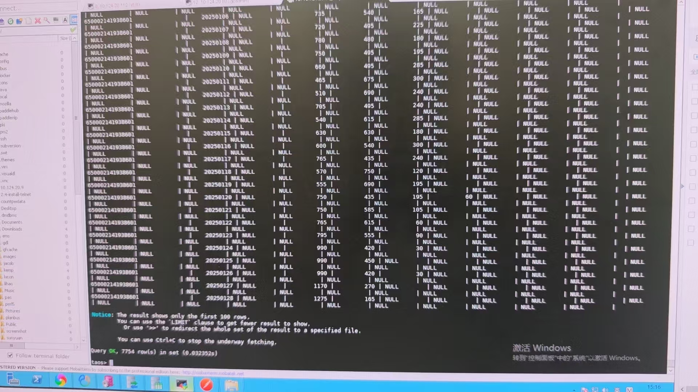


#### 4.6 **配变重载、过载实时计算**

##### 4.6.1 ** 一般过载+严重过载**

指定时间区间内，**实时计算**每台配变过载天数、累计时长、日均时长、三相最大电流、最高负载率、平均负载率
```sql {wrap}
select gis_code, rated_cap,
sum(overload_indicator) as overload_days,
sum(sum_ol_min) as sum_overload_min,
sum(sum_ol_min)/sum(overload_indicator) as average_overload_min_perday,
max(max_current) as max_current,
max(max_load_rate) as max_load_rate,
sum(sum_load_rate)/sum(sum_cnt) as average_load_rate
from (
select _wstart as ts, gis_code, rated_cap, 
case when count(*)>0 then 1 else 0 end as overload_indicator,  
sum(overload_duration) as sum_ol_min,  
max(max_cur) as max_current, max(max_lr) as max_load_rate, 
sum(sum_lr) as sum_load_rate, sum(cnt) as sum_cnt 
from (
select _wstart, _wduration/60000 as overload_duration, 
gis_code, rated_cap, 
max(greatest(a_current,b_current,c_current)) as max_cur,
max(greatest(a_current,b_current,c_current)*0.4*1.732/rated_cap) as max_lr,
sum(greatest(a_current,b_current,c_current)*0.4*1.732/rated_cap) as sum_lr,
count(*) as cnt  
from df8600.pbdata 
where ts between '2025-10-1' and '2025-10-8'
partition by tbname
event_window
start with 
greatest(a_current,b_current,c_current)*0.4*1.732/rated_cap >= 1 
end with 
greatest(a_current,b_current,c_current)*0.4*1.732/rated_cap < 1 
having _wduration >= case classify_id when 13141 then 2h else 1h end
)
partition by gis_code,rated_cap 
interval(1d)
)
partition by gis_code,rated_cap

db313 
一周查询耗时2.07秒，返回 7 条记录
一个月查询耗时4.93秒，返回 19 条记录
```

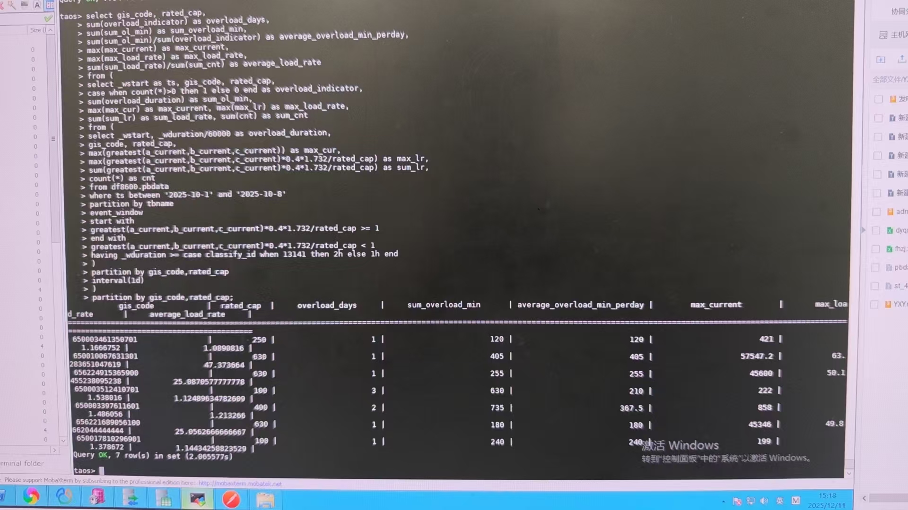

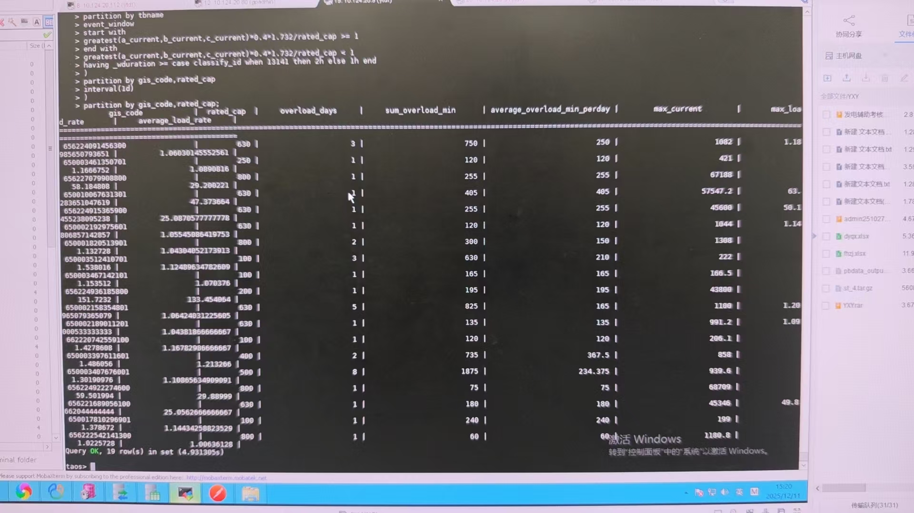

##### 4.6.2 重载

```sql {wrap}
select gis_code, rated_cap,
sum(overload_indicator) as overload_days,
sum(sum_ol_min) as sum_overload_min,
sum(sum_ol_min)/sum(overload_indicator) as average_overload_min_perday,
max(max_current) as max_current,
max(max_load_rate) as max_load_rate,
sum(sum_load_rate)/sum(sum_cnt) as average_load_rate
from (
select _wstart as ts, gis_code, rated_cap, 
case when count(*)>0 then 1 else 0 end as overload_indicator,  
sum(overload_duration) as sum_ol_min,  
max(max_cur) as max_current, max(max_lr) as max_load_rate, 
sum(sum_lr) as sum_load_rate, sum(cnt) as sum_cnt 
from (
select _wstart, _wduration/60000 as overload_duration, 
gis_code, rated_cap, 
max(greatest(a_current,b_current,c_current)) as max_cur,
max(greatest(a_current,b_current,c_current)*0.4*1.732/rated_cap) as max_lr,
sum(greatest(a_current,b_current,c_current)*0.4*1.732/rated_cap) as sum_lr,
count(*) as cnt  
from df8600.pbdata 
where ts between '2025-10-1' and '2025-10-8'
partition by tbname
event_window
start with 
greatest(a_current,b_current,c_current)*0.4*1.732/rated_cap >= 0.8 
and greatest(a_current,b_current,c_current)*0.4*1.732/rated_cap < 1  
end with 
greatest(a_current,b_current,c_current)*0.4*1.732/rated_cap < 0.8 
or greatest(a_current,b_current,c_current)*0.4*1.732/rated_cap >= 1 
having _wduration >= case classify_id when 13141 then 2h else 1h end
)
partition by gis_code,rated_cap 
interval(1d)
)
partition by gis_code,rated_cap

db313  
一周查询耗时2.4秒，返回 101 条记录
一个月查询耗时5.72秒，返回 233 条记录
10个月查询耗时66.56秒，返回 3392 条记录
```

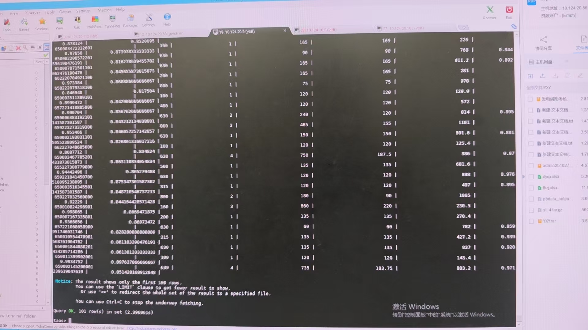

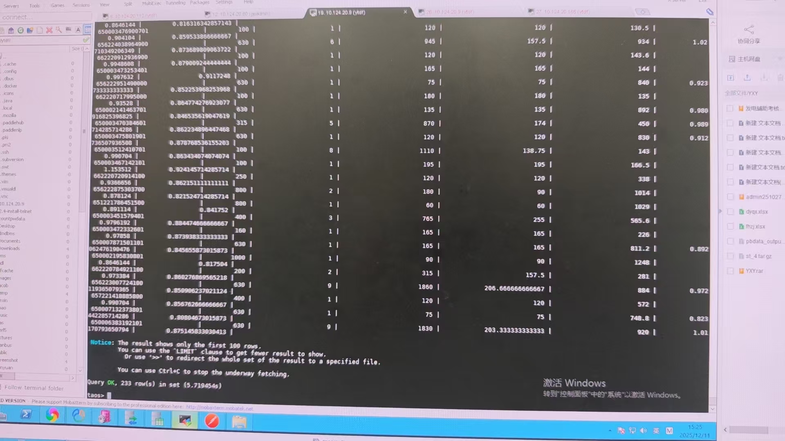

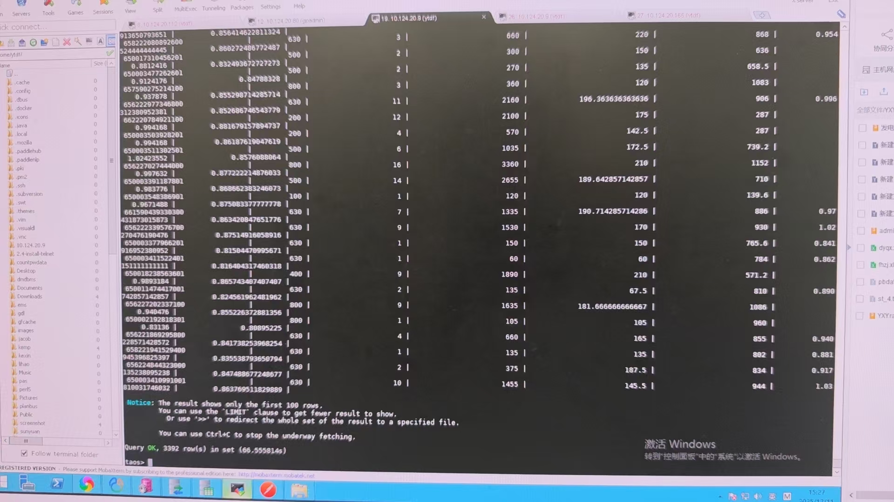


#### 4.7 Backup 

**返回结果集：最高负载率发生时间、最高负载率、平均负载率是指重载、一般过载、严重过载的在一天内的最大值**
```sql {wrap}
select gis_code, count(*) as day_count, sum(total_dur) as all_total_dur, 
sum(total_dur) / count(*) as avg_dur, 
max(peak_loadrate) as peak_loadrate, 
cols(max(peak_loadrate), peak_ts), 
sum(total_loadrate) / sum(total_cnt) as avg_loadrate, 
max(maxvalue) as maxvalue, min(minvalue) as minvalue, max(rate) as rate
from
(
select ab.ts, ab.gis_code, ab.total_fzl, ab.total_dur, ab.peak_loadrate, ab.peak_ts, ab.total_loadrate, ab.total_cnt, 
c.maxvalue, c.minvalue, c.rate
from 

(
select a.ts, a.gis_code, a.total_fzl, b.total_dur, b.peak_loadrate, b.peak_ts, b.total_loadrate, b.total_cnt 
from
(select _wstart as ts, name as gis_code, 
sum(fzl100) as total_fzl 
from tx6_tjfzl_fzllj_pb_day 
where _rowts between '2025-10-1' and '2025-12-31' 
and fzl100 > 150 
partition by tbname interval(1d) order by ts
) as a, 
(select _wstart as ts, gis_code, sum(dur) as total_dur, 
max(max_loadrate) as peak_loadrate, 
cols(max(max_loadrate), max_ts as peak_ts), 
sum(sum_loadrate) as total_loadrate, 
sum(cnt) as total_cnt 
from overload 
where _rowts between '2025-10-1' and '2025-12-31' 
partition by tbname interval(1d) order by ts
) as b 
where a.ts = b.ts and a.gis_code = b.gis_code
) as ab,

(select _wstart as ts, gis_code, 
max(maxvalue) as maxvalue, min(minvalue) as minvalue, max(rate) as rate 
from tx6_tjfzl_unbalance_day 
where _rowts between '2025-10-1' and '2025-12-31' 
partition by tbname interval(1d) order by ts
) as c
where ab.ts = c.ts and ab.gis_code = c.gis_code
)
partition by gis_code

u1-61 

```
