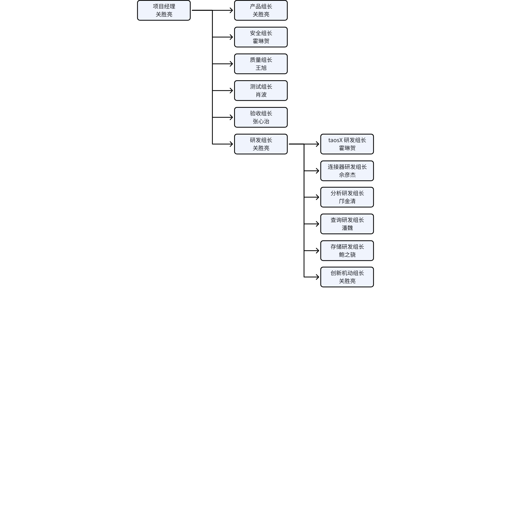
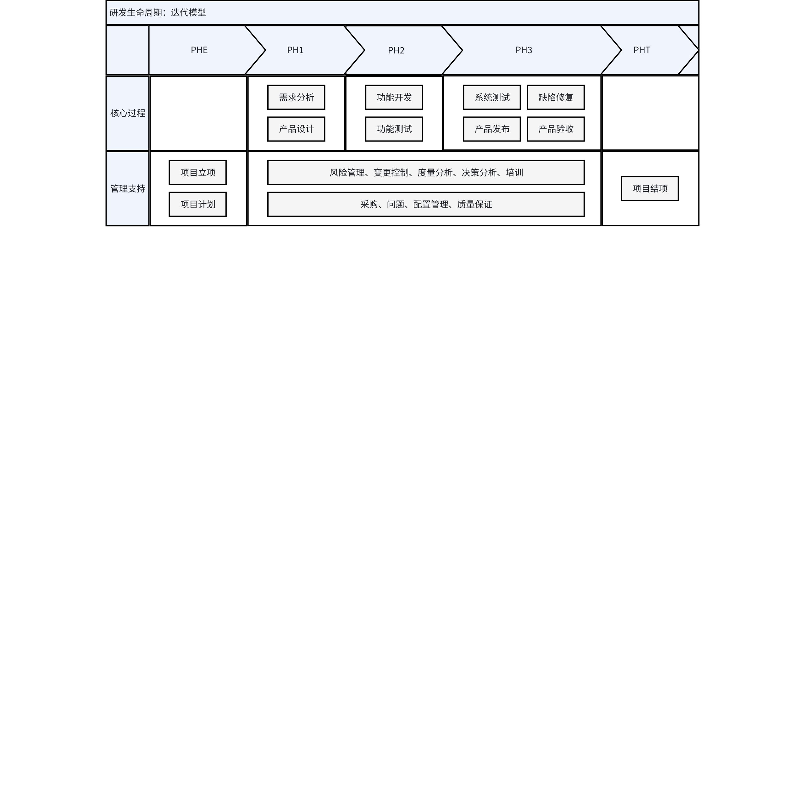

# TSDB v3.4.1 项目计划文档

## 1. 修订记录

| 编写日期 | 发布日期 | 版本 | 修订人 | 主要修改内容 |
| --- | --- | --- | --- | --- |
| 2025-12-17 | 2025-12-19 | 1.0 | 关胜亮 | 项目计划、详细的工作范围 |
| 2026-01-07 | 2026-01-09 | 1.1 | 关胜亮 | 按 20260105 闭门会决定更新项目计划 |
| 2026-01-21 | 2026-01-21 | 1.2 | 关胜亮 | 更正部分错别字 |

## 2. 项目目标

本项目聚焦于开发与发布 TDengine v3.4.1​​，致力于达成以下核心目标：
1. 引擎
   - 安全：安全功能开发、安全漏洞修复
   - 存储：数据修复工具、批量标签修改、动态调整数据缓存的 LRU
   - 查询：子查询、外部窗口、ANY/SOME/ALL/EXISTS 运算符、窗口插值增强、Explain 和 ShowQueries 优化
   - 虚拟表：虚拟表支持引用虚拟表、虚拟表查询性能优化、订阅虚拟表的元数据变更
   - 流计算：自然周/月/季/年触发、事件触发条件优化、分组计算性能优化、虚拟超级表触发支持子表增删改
2. 工具
   - 授权服务：中心化授权服务，支持 TSDB、IDMP 独立授权
   - 认证：Explorer 支持 TOTP 认证，连接器、taosX 支持 TOKEN 认证
   - 安全加固：Explorer 明文密码、SQL 注入问题修复，taosX 安全加固，Adapter、连接器安全加固：明文密码、日志信息防信息泄漏，连接器安全开发用户指南等
   - 漏洞扫描和修复：adapter/连接器/taosx 第三方依赖漏洞扫描和修复，Web 端口漏洞扫描和修复，棱镜七彩工具接入 CI
   - taosX：适配 TSDB 权限管理，Windows 适配，扩展 Transform 解析功能，导出导入顺序一致性优化，力控实时库，KingHistorian 数据源优化，MQTT 支持多个 Broker 等
3. 平台
   - 飞书项目与销售易集成
   - IDMP Code Coverage 监控
   - IDMP SDK 发布
   - 建立 Github 分支清理工作办法
  
## 3. 项目范围

### 3.1 业务

#### 3.1.1 引擎

| 序号 | 名称 | 优先级 | 报告人 | 链接 |
| --- | --- | --- | --- | --- |
| 1 | [交付][卡奥斯] mybatis stmt查询支持的参数绑定优化 | P3 | Kian Wang | [链接](https://project.feishu.cn/taosdata_td/feature/detail/6671312705?node=26742312) |
| 2 | [交付] Explain analyais 可读性增强，清晰看出语句执行过程 | P3 | Steven Zhang | [链接](https://project.feishu.cn/taosdata_td/feature/detail/6659962841?node=26742312) |
| 3 | [售前] TDlite 授权支持 taosX 部分连接器 | P3 | Derek Chen | [链接](https://project.feishu.cn/taosdata_td/feature/detail/6628216389?node=26742312) |
| 4 | [交付] taosd 停服后 taosc 重连占用了太高的 cpu | P3 | Hui Li | [链接](https://project.feishu.cn/taosdata_td/feature/detail/6598121270?node=26742312) |
| 5 | [售前][新奥数能] 实现 stmt 查询结果集和 stmt 解耦 | P3 | Zee Lv | [链接](https://project.feishu.cn/taosdata_td/feature/detail/6597880825?node=26742312) |
| 6 | [交付][河北电力] 一次性批量修改多个子表的多个 tag 值功能 | P3 | Zee Lv | [链接](https://project.feishu.cn/taosdata_td/feature/detail/6594391614?node=26742312) |
| 7 | [交付][深开鸿] blob 类型支持 cast、substr 函数 | P3 | Raistlin Chen | [链接](https://project.feishu.cn/taosdata_td/feature/detail/6567926427?node=26742312) |
| 8 | [交付][天合富家] 动态调整 LRU 分片数量以提高 Last 查询性能 | P3 | Yanqiong Dong | [链接](https://project.feishu.cn/taosdata_td/feature/detail/6568211421?node=26742312) |
| 9 | [交付][三峡云化集控] show queries 显示执行进度 | P3 | Yanqiong Dong | [链接](https://project.feishu.cn/taosdata_td/feature/detail/6570714028?node=26742312) |
| 10 | [北美][Nevados] Support subqueries "IN" clauses | P3 | Simon Guan | [链接](https://project.feishu.cn/taosdata_td/feature/detail/6539521758?node=26742312) |
| 11 | [交付] Audit 库可以记录客户端 IP | P3 | Hui Li | [链接](https://project.feishu.cn/taosdata_td/feature/detail/6511301953?node=26742312) |
| 12 | [售前] join/window join 支持基于选择函数结果集进行运算 | P3 | Bo Xiao | [链接](https://project.feishu.cn/taosdata_td/feature/detail/6510828917?node=26742312) |
| 13 | [售前] TDengine TSDB 适配 risc-v 硬件（外包，内部仅 Review 工作） | P3 | Simon Guan | [链接](https://project.feishu.cn/taosdata_td/feature/detail/6510735772?node=26742312) |
| 14 | [交付][海澜智云] 自动清理无效 sql 信息 | P3 | Hui Li | [链接](https://project.feishu.cn/taosdata_td/feature/detail/6512028015?node=26742312) |
| 15 | [售前][硕橙科技] In 支持嵌套查询 | P3 | Jack Dong | [链接](https://project.feishu.cn/taosdata_td/feature/detail/6510267752?node=26742312) |
| 16 | [售前][三峡集团] 支持发生状态改变机组的原始数值查询 | P3 | Jack Dong | [链接](https://project.feishu.cn/taosdata_td/feature/detail/6510828810?node=26742312) |
| 17 | [交付][东方电子] 支持配置多个监控目标地址 | P3 | Raistlin Chen | [链接](https://project.feishu.cn/taosdata_td/feature/detail/6507093771?node=26742312) |
| 18 | [交付][三峡]优化高负载情况下选主行为（尽量完成） | P3 | Yanqiong Dong | [链接](https://project.feishu.cn/taosdata_td/feature/detail/6507042141?node=26742312) |
| 19 | [售前][社区] Interval 窗口支持插值时间范围 | P3 | ​Richard Li | [链接](https://project.feishu.cn/taosdata_td/feature/detail/6506145499?node=26742312) |
| 20 | [售前][红河卷烟厂] 事件窗口功能增强 | P3 | ​Richard Li | [链接](https://project.feishu.cn/taosdata_td/feature/detail/6507054803?node=26742312) |
| 21 | [交付][三峡新能源] fill prev 支持填充前一个非 null 值 | P3 | Yanqiong Dong | [链接](https://project.feishu.cn/taosdata_td/feature/detail/6506970855?node=26742312) |
| 22 | [交付] 调用订阅服务密码错误返回含义不明确的错误信息 | P3 | Steven Zhang | [链接](https://project.feishu.cn/taosdata_td/feature/detail/6490634781?node=26742312) |
| 23 | [产品] taos_register_instance 接口使用 firstep 和 secondep | P3 | Xuefeng Tan | [链接](https://project.feishu.cn/taosdata_td/feature/detail/6487556383?node=26742312) |
| 24 | [社区] TDgpt restful 驱动支持 Gunicorn | P3 | Haojun Liao | [链接](https://project.feishu.cn/taosdata_td/feature/detail/6484950091?node=26742312) |

#### 3.1.2 工具

| 序号 | 名称 | 优先级 | 报告人 | 链接 |
| --- | --- | --- | --- | --- |
| 1 | [冀南钢铁集团有限公司] 力控pSpace实时同步/历史迁移 | P1 | Jack Dong | [链接](https://project.feishu.cn/taosdata_td/feature/detail/6653327869) |
| 2 | [瑞幸咖啡] 说明taoskeeper上传的promethues的metrics指标与grafana中默认报警规则使用的字段对应关系 | P1 | Yanjie She | [链接](https://project.feishu.cn/taosdata_td/feature/detail/6622579928) |
| 3 | [中石化]6041/6060/6043/6050 扫描出漏洞，希望优化 | P3 | Zee Lv | [链接](https://project.feishu.cn/taosdata_td/feature/detail/6659862768) |
| 4 | [神东集团] KH迁移过程中结束时间为空时，应表示一直进行迁移 | P3 | Jack Dong | [链接](https://project.feishu.cn/taosdata_td/feature/detail/6600045300) |
| 5 | [售前][上海电气中央研究院] 扩展 taosX 解析功能 | P3 | Tyler Liu | [链接](https://project.feishu.cn/taosdata_td/feature/detail/6622709348) |
| 6 | [河北电力新一代调度项目]taosx 增加对于建立数据写入任务权限、数量控制 | P3 | Zee Lv | [链接](https://project.feishu.cn/taosdata_td/feature/detail/6622713900) |
| 7 | [一汽红旗] taosExplorer Kafka 写入任务配置页面中，json 解析规则输入框可以放大显示 | P3 | Tyler Liu | [链接](https://project.feishu.cn/taosdata_td/feature/detail/6622581453) |
| 8 | [交付] Explorer SQL 注入问题修复 | P3 | Zee Lv | [链接](https://project.feishu.cn/taosdata_td/feature/detail/6622823622) |
| 9 | [河北电力]taosX 导出导入任务保证顺序一致且子表对应关系正确 | P3 | Zee Lv | [链接](https://project.feishu.cn/taosdata_td/feature/detail/6624113545) |
| 10 | [世窗信息] influxdb迁移到TDengine时需根据原有tag值定义表名 | P2 | Zach Wang | [链接](https://project.feishu.cn/taosdata_td/feature/detail/6660065587) |
| 11 | [售前] explorer 登录增加CAPTCHA功能 | P3 | Zach Wang | [链接](https://project.feishu.cn/taosdata_td/feature/detail/6663139939) |
| 12 | [积成电子]未配置 ssl 时出现明文密码传输，应改进 | P3 | Tyler Liu | [链接](https://project.feishu.cn/taosdata_td/feature/detail/6665149034) |

#### 3.1.3 平台

| 序号 | 名称 | 优先级 | 报告人 | 链接 |
| --- | --- | --- | --- | --- |
| 1 | 自动化巡检工具优化 | P3 | Xu Wang | [链接](https://project.feishu.cn/taosdata_td/job/detail/6659710381) |
| 2 | 授权码申请审批通过后自动发放至申请人 | P3 | Xu Wang | [链接](https://project.feishu.cn/taosdata_td/job/detail/6660010660) |
| 3 | 中英文官网服务器升级和服务迁移 | P3 | Xu Wang | [链接](https://project.feishu.cn/taosdata_td/job/detail/6603629392) |
| 4 | 飞书项目“最终用户”从销售易中动态模糊检索 | P3 | Bo Xiao | [链接](https://project.feishu.cn/taosdata_td/feature/detail/6590722532) |

### 3.2 IDMP

#### 3.2.1 引擎

| 序号 | 名称 | 优先级 | 报告人 | 链接 |
| --- | --- | --- | --- | --- |
| 1 | [IDMP] 给定的 SQL 集合提供易于定位的明确错误信息 | P3 | Yaqiang Li | [链接](https://project.feishu.cn/taosdata_td/feature/detail/6659988199?node=26746283) |
| 2 | [IDMP] 元数据更新支持事务（折衷方案） | P3 | Yaqiang Li | [链接](https://project.feishu.cn/taosdata_td/feature/detail/6659965197?node=26746283) |
| 3 | [IDMP] 支持 ANY/SOME/ALL/EXISTS 运算符 | P3 | Wei Pan | [链接](https://project.feishu.cn/taosdata_td/feature/detail/6659773695?node=26746283) |
| 4 | [IDMP] 支持不带 FROM 的标量子查询 | P3 | Wei Pan | [链接](https://project.feishu.cn/taosdata_td/feature/detail/6641525627?node=26750033) |
| 5 | 流计算支持虚拟超级表聚合查询优化 | P3 | Joey Sima | [链接](https://project.feishu.cn/taosdata_td/feature/detail/6619755141?node=26746283) |
| 6 | [售前][一汽红旗] 流计算中能够支持子查询过滤条件 | P1 | Tyler Liu | [链接](https://project.feishu.cn/taosdata_td/feature/detail/6598056767?node=26746283) |
| 7 | [售前][瑞幸咖啡] 数据订阅支持虚拟表的元数据变更 | P3 | Kane Kuang | [链接](https://project.feishu.cn/taosdata_td/feature/detail/6593807450?node=26746283) |
| 8 | [售前][广汽] 流计算事件窗口，满足条件除时长外，还增加记录条数 | P1 | Jeff Tao | [链接](https://project.feishu.cn/taosdata_td/feature/detail/6589462594?node=26746283) |
| 9 | [北美][TASA] 虚拟表支持引用虚拟表 | P1 | Yaqiang Li | [链接](https://project.feishu.cn/taosdata_td/feature/detail/6589380578?node=26746283) |
| 10 | [IDMP] 源表的 meta 自动更新到虚拟表和虚拟超级表（折衷方案） | P1 | Yaqiang Li | [链接](https://project.feishu.cn/taosdata_td/feature/detail/6589101088?node=26746283) |
| 11 | [IDMP] 流计算在源子表/虚拟子表长时间没有新数据写入时，也能提供发送通知的功能 | P1 | Yaqiang Li | [链接](https://project.feishu.cn/taosdata_td/feature/detail/6572489317?node=26746283) |
| 12 | [售前][陕西中烟] 提升虚拟表按批次查询性能 | P3 | Joey Sima | [链接](https://project.feishu.cn/taosdata_td/feature/detail/6548485194?node=26746283) |
| 13 | [规划] 外部窗口 | P3 | Simon Guan | [链接](https://project.feishu.cn/taosdata_td/feature/detail/6550634959?node=26746283) |
| 14 | [IDMP] 批量更新、增加和删除虚拟子表的标签和标签值 | P3 | Yaqiang Li | [链接](https://project.feishu.cn/taosdata_td/feature/detail/6491345559?node=26746283) |
| 15 | 流计算虚拟超级表触发支持新增、删除子表、子表 tag 值修改、修改列映射关系 | P2 | Wei Pan | [链接](https://project.feishu.cn/taosdata_td/feature/detail/6491267649?node=26746283) |
| 16 | [售前][陕西中烟] 支持按自然周、月、季、年的定时计算 | P1 | Abraham Liu | [链接](https://project.feishu.cn/taosdata_td/feature/detail/6490755304?node=26746283) |
| 17 | [售前][陕西中烟] 分析产生的新属性，可以作为输入继续进行分析 | P1 | Abraham Liu | [链接](https://project.feishu.cn/taosdata_td/feature/detail/6490870739?node=26746283) |
| 18 | [规划] 虚拟表查询性能优化 | P3 | Joey Sima | [链接](https://project.feishu.cn/taosdata_td/feature/detail/6483450778?node=26746283) |

#### 3.2.2 工具

| 序号 | 名称 | 优先级 | 报告人 | 链接 |
| --- | --- | --- | --- | --- |

#### 3.2.3 平台

| 序号 | 名称 | 优先级 | 报告人 | 链接 |
| --- | --- | --- | --- | --- |
| 1 | IDMP Code Coverage 监控 | P3 | Xu Wang | [链接](https://project.feishu.cn/taosdata_td/job/detail/6660059913) |
| 2 | 提供 IDMP Staging 环境 | P3 | Bo Xiao | [链接](https://project.feishu.cn/taosdata_td/job/detail/6659811256) |
| 3 | 支持自动打包测试发布 IDMP SDK | P3 | Bo Ding | [链接](https://project.feishu.cn/taosdata_td/job/detail/6662825733) |
| 4 | IDMP CD 自动化 -  任何人可按需发版、按需运行指定测试项 |  | Bo Xiao | [链接](https://project.feishu.cn/taosdata_td/job/detail/6660036669) |

### 3.3 规划

#### 3.3.1 引擎

| 序号 | 名称 | 优先级 | 报告人 | 链接 |
| --- | --- | --- | --- | --- |
| 1 | [安全可靠测评] 强制访问控制，主体级别、客体级别（1-5） | P1 | Beryl Bao | [链接](https://project.feishu.cn/taosdata_td/feature/detail/6671585124?node=27329741) |
| 2 | [安全可靠测评] 防 SQL 注入：防火墙机制 | P2 | Kane Kuang | [链接](https://project.feishu.cn/taosdata_td/feature/detail/6670404791?node=27329741) |
| 3 | [安全可靠测评] taosc/taosd 防拒绝服务攻击 | P1 | Wei Pan | [链接](https://project.feishu.cn/taosdata_td/feature/detail/6670390631?node=27329741) |
| 4 | [安全可靠测评] taosc/taosd 防溢出攻击 | P1 | Wei Pan | [链接](https://project.feishu.cn/taosdata_td/feature/detail/6670169846?node=27329741) |
| 5 | [安全可靠测评] 引擎侧支持三元权限 | P1 | Beryl Bao | [链接](https://project.feishu.cn/taosdata_td/feature/detail/6670071929?node=27329741) |
| 6 | [规划] NULL 值比较结果修正 | P3 | Wei Pan | [链接](https://project.feishu.cn/taosdata_td/feature/detail/6668153717?node=27329741) |
| 7 | [安全可靠测评] 整理仓库代码以提高自研率 | P3 | Simon Guan | [链接](https://project.feishu.cn/taosdata_td/feature/detail/6659850619?node=27329741) |
| 8 | [安全可靠测评] 安全漏洞修复 | P3 | Simon Guan | [链接](https://project.feishu.cn/taosdata_td/feature/detail/6659822076?node=27329741) |
| 9 | [安全可靠测评] 数据订阅支持的 token登录 | P3 | Xuefeng Tan | [链接](https://project.feishu.cn/taosdata_td/feature/detail/6659792966?node=27329741) |
| 10 | [等保四级] root 用户使用默认密码登录后，强制其修改密码 | P3 | Beryl Bao | [链接](https://project.feishu.cn/taosdata_td/feature/detail/6641469804?node=27329741) |
| 11 | [等保四级] 审计信息不经过 taoskeeper 记录 | P3 | Beryl Bao | [链接](https://project.feishu.cn/taosdata_td/feature/detail/6641435300?node=27329741) |
| 12 | [等保四级] 支持敏感数据删除后的强制覆盖 | P3 | Beryl Bao | [链接](https://project.feishu.cn/taosdata_td/feature/detail/6641346408?node=27329741) |
| 13 | [安全可靠测评] 列权限生效 | P3 | Beryl Bao | [链接](https://project.feishu.cn/taosdata_td/feature/detail/6640315568?node=27329741) |
| 14 | [安全可靠测评] 完善存储加密功能 | P3 | Beryl Bao | [链接](https://project.feishu.cn/taosdata_td/feature/detail/6640296081?node=27329741) |
| 15 | [安全可靠测评] 增加 token 相关的通知机制 | P3 | Beryl Bao | [链接](https://project.feishu.cn/taosdata_td/feature/detail/6640223025?node=27329741) |
| 16 | [安全可靠测评] 支持用户修改权限控制 | P3 | Beryl Bao | [链接](https://project.feishu.cn/taosdata_td/feature/detail/6640208544?node=27329741) |
| 17 | [安全可靠测评] 完善权限控制 | P3 | Beryl Bao | [链接](https://project.feishu.cn/taosdata_td/feature/detail/6640186564?node=27329741) |
| 18 | [安全可靠测评] 支持从旧的加密集群升级到新的版本 | P3 | Beryl Bao | [链接](https://project.feishu.cn/taosdata_td/feature/detail/6640162570?node=27329741) |
| 19 | [安全可靠测评] create totp 时返回结果集 | P3 | Beryl Bao | [链接](https://project.feishu.cn/taosdata_td/feature/detail/6640162509?node=27329741) |
| 20 | [安全可靠测评] 权限控制的兼容性处理 | P3 | Beryl Bao | [链接](https://project.feishu.cn/taosdata_td/feature/detail/6640076601?node=27329741) |
| 21 | [安全可靠测评] 禁止篡改配置文件 | P3 | Beryl Bao | [链接](https://project.feishu.cn/taosdata_td/feature/detail/6640062620?node=27329741) |
| 22 | [规划] 子查询做主键过滤条件时的性能优化 | P3 | Wei Pan | [链接](https://project.feishu.cn/taosdata_td/feature/detail/6617004723?node=27329741) |
| 23 | [规划] dataOrderLevel 使用及 table merge scan 有序传递 | P3 | Xinsheng Ren | [链接](https://project.feishu.cn/taosdata_td/feature/detail/6581335366?node=27329741) |
| 24 | [规划] explain analyze 算子显示的执行时间 | P4 | Wei Pan | [链接](https://project.feishu.cn/taosdata_td/feature/detail/6548173402?node=27329741) |
| 25 | [产品] 优化 explain 输出结果 | P3 | Wei Pan | [链接](https://project.feishu.cn/taosdata_td/feature/detail/6545510969?node=27329741) |
| 26 | [规划] 流计算多分组批量计算 | P3 | Wei Pan | [链接](https://project.feishu.cn/taosdata_td/feature/detail/6491136498?node=27329741) |
| 27 | [规划] 数据修复工具 | P3 | Simon Guan | [链接](https://project.feishu.cn/taosdata_td/feature/detail/6469793274?node=27329741) |

#### 3.3.2 工具

| 序号 | 名称 | 优先级 | 报告人 | 链接 |
| --- | --- | --- | --- | --- |
| 1 | [规划] License Center | P1 | Leo Huo | [链接](https://project.feishu.cn/taosdata_td/feature/detail/6665336277) |
| 2 | [安全] Explorer 安全加固 | P2 | Leo Huo | [链接](https://project.feishu.cn/taosdata_td/feature/detail/6658919461) |
| 3 | [安全] Explorer：TOTP 认证 | P2 | Leo Huo | [链接](https://project.feishu.cn/taosdata_td/feature/detail/6506023136) |
| 4 | [安全] Explorer支持TOKEN认证 | P2 | Leo Huo | [链接](https://project.feishu.cn/taosdata_td/feature/detail/6658975929) |
| 5 | [安全] 连接器安全加固 | P2 | Leo Huo | [链接](https://project.feishu.cn/taosdata_td/feature/detail/6659285650) |
| 6 | [安全] taosX 权限管理 | P2 | Leo Huo | [链接](https://project.feishu.cn/taosdata_td/feature/detail/6658956251) |
| 7 | [安全] 修复 JDBC sonar 检查的错误和安全问题 | P3 | Yanjie She | [链接](https://project.feishu.cn/taosdata_td/feature/detail/6482039483) |
| 8 | [安全] 连接器安全开发 - 指南文档 | P3 | Yanjie She | [链接](https://project.feishu.cn/taosdata_td/feature/detail/6658900952) |
| 9 | [安全] taosKeeper 密码信息脱敏处理 | P3 | Ethan Guo | [链接](https://project.feishu.cn/taosdata_td/feature/detail/6600039687) |
| 10 | [产品] XNODE: CREATE TASK ... 添加 created_by, task_type 字段 | P3 | Leo Huo | [链接](https://project.feishu.cn/taosdata_td/feature/detail/6659009378) |
| 11 | [连接器] jdbc WebSocket 参数绑定支持 decimal 类型和 blob 类型 | P3 | Leo Huo | [链接](https://project.feishu.cn/taosdata_td/feature/detail/6662931308) |
| 12 | [文档] jmeter 测试查询方案 | P2 | Leo Huo | [链接](https://project.feishu.cn/taosdata_td/feature/detail/6660015604) |
| 13 | [连接器] nodejs 支持上报连接器类型和版本，方便交付排查版本兼容性 | P3 | Yanjie She | [链接](https://project.feishu.cn/taosdata_td/feature/detail/6666017184) |
| 14 | [产品] taosx 高可用支持双活 | P3 | Leo Huo | [链接](https://project.feishu.cn/taosdata_td/feature/detail/6646286429) |
| 15 | [产品] taosx 任务运行不受密码修改影响 | P3 | Leo Huo | [链接](https://project.feishu.cn/taosdata_td/feature/detail/6658967000) |
| 16 | [产品] xnoded 支持 Windows | P3 | Leo Huo | [链接](https://project.feishu.cn/taosdata_td/feature/detail/6646294817) |
| 17 | [产品] taosgen: 社区新增数据源简化修改范围 | P3 | Leo Huo | [链接](https://project.feishu.cn/taosdata_td/feature/detail/6659799103) |
| 18 | [产品] taosgen 参数管理/数据结构框架与业务分离 | P3 | Cris Pei | [链接](https://project.feishu.cn/taosdata_td/feature/detail/6657217599) |
| 19 | [安全] C WebSocket 连接器密码信息脱敏处理 | P3 | Leo Huo | [链接](https://project.feishu.cn/taosdata_td/feature/detail/6599885679) |

#### 3.3.3 平台

| 序号 | 名称 | 优先级 | 报告人 | 链接 |
| --- | --- | --- | --- | --- |
| 1 | 建立 Github 例行维护清理工作办法 | P3 | Bo Xiao | [链接](https://project.feishu.cn/taosdata_td/job/detail/6659951656) |
| 2 | 迁移Jira中除TX项目外未关闭问题 | P3 | Bo Xiao | [链接](https://project.feishu.cn/taosdata_td/job/detail/6659859717) |
| 3 | 统一公司操作系统：基础镜像、公司官网 | P3 | Bo Xiao | [链接](https://project.feishu.cn/taosdata_td/job/detail/6659987156) |
| 4 | 清理 Github 仓库无用、重复代码及文件 | P3 | Bo Xiao | [链接](https://project.feishu.cn/taosdata_td/job/detail/6659711335) |
| 5 | 梳理 7*24 运行的测试并查漏补缺 | P3 | Xu Wang | [链接](https://project.feishu.cn/taosdata_td/job/detail/6659802448) |
| 6 | 建立云服务运维相关需求和缺陷的反馈机制 | P3 | Xu Wang | [链接](https://project.feishu.cn/taosdata_td/job/detail/6660054317) |
| 7 | 解决发版流程中暴露问题滞后的问题 | P3 | Xu Wang | [链接](https://project.feishu.cn/taosdata_td/job/detail/6659962906) |

## 4. 项目计划

### 4.1 项目组织结构

### 4.2 项目管理策略

1. 计划管理：在每个里程碑后，根据情况，重新调整项目进度计划
2. 监控策略：通过周报查看组员工作进行情况和完成情况
3. 沟通及汇报策略：每个里程碑结束，提交月度总结
4. 决策机制：由项目经理和 “[技术评审与决策委员会](https://taosdata.feishu.cn/wiki/ARNCwJazTi9qRfkqHWAcbUfKnMh)” 共同完成，涉及重大变更的，撰写决策报告
5. 问题管理：发现的问题报告到任务管理工具（当前为飞书），跟踪纠正至关闭
6. 变更控制：按照 “[项目变更规则](https://taosdata.feishu.cn/wiki/JcOZwqhO3iE3qIkGTrVccER8nIf)” 进行

### 4.3 项目生命周期模型

### 4.4 项目进度计划

项目总工期为 4个月，自 2026-01-01 至 2026-04-30。项目进度计划遵循经典的“设计-开发-测试”瀑布模型，但各子功能的开发可以敏捷迭代，确保在紧凑的工期内高效交付。
1. 需求与设计阶段：2026-01-01 ~ 2026-01-31，完成需求分析和功能设计。
2. 开发及功能测试阶段：2026-02-01 ~ 2026-03-31 ，完成代码开发和功能测试，发布可测试的软件版本。
3. 系统测试与验收阶段：2026-04-01 ~ 2026-04-25，完成系统测试和缺陷修复，完成软件版本的验收。
4. 项目总结阶段：2026-04-25 ~ 2026-04-30，项目成果评审、文档归档、经验总结与复盘。

### 4.5 风险管理计划

风险的状态跟踪，及新增风险，将在项目进度跟踪表 中描述。截止项目计划时，已经识别的风险如下
1. 漏洞扫描服务器的采购时间
2. 漏洞修复的研发工作量超过人均两周

### 4.6 配置管理计划

本项目的配置项管理方法参照 “[配制管理制度](https://taosdata.feishu.cn/wiki/Cq7AwqC99iVRgOkjT3gcZnFzn7d)”，不需要额外说明。

### 4.7 质量保证计划

本项目的质量保证方法参照 “[质量保证制度](https://taosdata.feishu.cn/wiki/Jiw3wmLZAi3DUZkM5nEcfkpGnNg)”，计划文档参见 “[TSDB v3.4.1 质量管理计划](https://taosdata.feishu.cn/wiki/EcazwZzV2iV6lakRH3ccS35bn2b)”。

### 4.8 安全管理计划

本项目的质量保证方法参照 “[质量保证制度](https://taosdata.feishu.cn/wiki/Jiw3wmLZAi3DUZkM5nEcfkpGnNg)”，计划文档参见 “[TSDB v3.4.1 安全管理计划](https://taosdata.feishu.cn/wiki/SkXpwJAOOiyuj6kJmUicVqKynNf)”。

### 4.9 项目干系人参与计划

研发中心之外其他部门的主要参与人如下，在评审节点时参与。

| 姓名 | 部门 | 主要职责 |
| --- | --- | --- |
| 陈肃 | 解决方案中心 | 需求澄清与技术评审 |
| 张心治 | 交付中心 | 需求澄清与技术评审，产品验收 |
| 李广 | 销售一组 | 项目范围变更评审 |
| 侯江燚 | 销售二组 | 项目范围变更评审 |
| 张文健 | 销售三组 | 项目范围变更评审 |
| 魏明慧 | 销售四组 | 项目范围变更评审 |
| 王寅 | 中国业务部 | 项目范围变更评审 |

### 4.10 采购计划

漏洞扫描服务器，已由平台部进入采购流程。

### 4.11 项目度量计划

在每个自然月的第三个周四，对项目进行度量，参照 “[度量指标规范](https://taosdata.feishu.cn/wiki/L50dwsyiciOW8TkkbFZcZEpnn9e)”。其中最为关注的指标有：
1. 缺陷关闭周期
2. 各类缺陷数目
3. 需求增加率

### 4.12 评审及决策计划

1. 项目立项评审：在项目立项时完成，参与者 “项目立项委员会”。
2. 项目计划评审：在项目计划时完成，参与者 “项目立项委员会”。
3. 项目进度评审：在每个自然月的第三个周五，召开项目进度讨论会，汇报当前项目进度，并讨论可能的范围变更，参与者 “项目立项委员会”。
4. 研发文档评审：按照 “[研发任务管理制度](https://taosdata.feishu.cn/wiki/Ap8iwYFY8iOcMgkrHAacHxEXnmO)”，对标记需要编写需求、设计、测试等文档的任务，当文档编写完成后组织评审，包括需求评审、设计评审、测试评审。由各个功能的开发人员组织， “需求评审委员会”、“设计评审委员会”、“测试评审委员会” 参与。
5. 质量评审：按照 “[质量保证制度](https://taosdata.feishu.cn/wiki/Jiw3wmLZAi3DUZkM5nEcfkpGnNg)” 进行。
6. 安全评审：按照 “[安全开发管理制度](https://taosdata.feishu.cn/wiki/Pjw6wknqQiFCPTksFUvcHI21nFf)” 进行。
7. 系统测试评审：在系统测试开始前和结束时，分别进行测试计划、测试报告的评审，参与者 “测试评审委员会”、“投产发布委员会”。
8. 项目结项评审：项目结束后，汇总所有资料进行总结，参与者 “项目立项委员会”。

### 4.13 培训计划

本项目的人员知识技能培训参照 “[培训制度](https://taosdata.feishu.cn/wiki/Fc46wcr8Di3YO8kvfcOcu2iEnFg)”。对应的产品版本进入测试阶段后，还需要进行如下培训，培训对象包括售前部门、交付部门、研发部门的所有员工。计划如下：
1. 2026-04-01 ~ 2026-04-10：
   - 制作培训材料，以在线 PPT 方式呈现。
   - 组织线下会议培训，不在公司的员工可以线上参与。
2. 2026-04-11 ~ 2025-04-15：制作考试题目，并为考试题目编写参考答案。
3. 2026-04-16 ~ 2025-04-20：组织考试并进行评分，考试不通过的要继续参加考试，直到通过为止。

### 4.14 办公网络及项目工作环境

本项目的办公网络及项目工作环境参照 “[开发环境制度](https://taosdata.feishu.cn/wiki/Ci4Aw6TnRiCAXqkg36GcMurQnPc)”，不需要进行额外说明。
