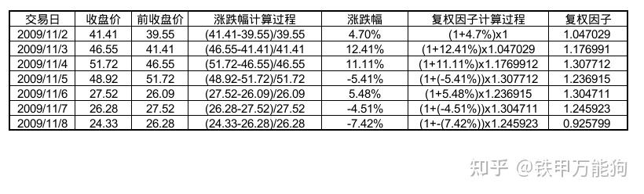

# External Window RS

## 1. 修订记录

| 编写日期 | 发布日期 | 版本 | 修订人 | 主要修改内容 |
| --- | --- | --- | --- | --- |
| 2024-04-16 | 2024-04-16 | 1.0 | 关胜亮 | 新建 |
| 2026-01-16 | 2026-01-16 | 1.1 | 任新胜 | 根据新需求修订 |
| 2026-02-05 | 2026-02-05 | 1.2 | 关胜亮 | 按新格式修订 |

## 2. 引言

### 2.1 相关文档资料

### 2.2 优先级要求

预期在 3.3.2.0 发布，但是越早越好。

### 2.3 版本要求

企业版支持，社区版支持。

## 3. 需求目标

### 3.1 EXTERNAL_WINDOW 语法

EXTERNAL_WINDOW 的内部查询返回一个多行多列的数据集，其中的前两列为窗口的开始时间和结束时间，必须为 TIMESTAMP 类型。EXTERNAL_WINDOW 的外部查询基于内部查询定义的窗口边界，对数据进行聚合、标量计算，计算时可以引用内部查询中的其他数据列。 
```sql
SELECT ... 
  FROM ... 
  [WHERE ...] 
  [PARTITION BY ...] 
  EXTERNAL_WINDOW(subquery) alias_name 
  [ON ...] 
  [HAVING ...] 
```

要求：
1. 内部查询支持标准子查询，或者由 CSV 文件、文本串构成的子查询
2. 支持列引用：外部查询可以引用内部查询的数据列
3. 支持分组查询：外部查询和内部查询的分组可以关联在一起
4. 支持嵌套调用：一个 SQL 语句可以出现多次  EXTERNAL WINDOW 关键字
5. 窗口定义为半闭半开区间：ts >= start_ts and ts < end_ts
6. 支持窗口内聚合计算、标量计算

### 3.2 从 CSV 文件生成子查询

在 `INSERT INTO d1001 FILE '/tmp/csvfile.csv'` 语法中，通过 `FILE` 关键字引入一个子查询。扩展这个子查询，使其能嵌入到 external_window 及其他可用到子查询的位置。
```sql
select * from FILE (
    file_name
    ……
  ) aliasName
```

### 3.3 从文本串生成子查询

与 2.2 类似，但数据从一个给定的文本字符串中获取
```sql
select * from TEXT (
    (fields ……) [,(fields ……)] ... 
  ) aliasName
```

### 3.4 mintime 函数

```sql
mintime()
```

**功能说明**：返回系统支持的最小时间
**返回结果数据类型**：TIMESTAMP
**适用于**：表和超级表
**嵌套子查询支持**：适用于内层查询和外层查询
**使用说明**：
1. 返回的时间戳精度与当前 DATABASE 设置的时间精度一致
2. 该函数可以当做常量使用，与 now() 行为类似

### 3.5 maxtime 函数

```sql
maxtime()
```

**功能说明**：返回系统支持的最大时间
**返回结果数据类型**：TIMESTAMP
**适用于**：表和超级表
**嵌套子查询支持**：适用于内层查询和外层查询
**使用说明**：
1. 返回的时间戳精度与当前 DATABASE 设置的时间精度一致
2. 该函数可以当做常量使用，与 now() 行为类似

### 3.6 neighbor 函数

```sql
neighbor(column, offset[, default_value])
```

**功能说明**：用于排序后取前后第 N 行某列的字段值，常用于计算同比、环比等指标。
**返回结果数据类型**：同应用的字段
**适用于**：表和超级表，应用于超级表时通常配合关键字 PARTITION 使用
**嵌套子查询支持**：适用于内层查询和外层查询
**使用说明**：
1. column：列名或者表达式
2. offset：当前行之前或之后的行数，Int64
3. default_value：可选
   - 设置默认值时，如果 offset 处没有记录，则返回默认值，默认值可以为 NULL
   - 未设置默认值时，如果 offset 处没有记录，返回当前行的字段值
4. 该函数可以被嵌套在 avg、sum 等函数内部，例如 avg(neighbor(a, ……) / a)
**示例**
```sql
select neighbor(voltage, 1, 0) from d1001
```

## 4. 调用示例

### 4.1 场景一

#### 4.1.1 查询一

在 60 秒内没有收到 alarm 事件的 fault 事件有哪些？
1. fault 事件：event = 1
2. alarm 事件：event = 6
```sql {wrap}
select f.ts, f.event, f.val, count(a.*), avg(a.val)
from alarm1 a 
where event = 6 
external_window (
  select ts, ts + 60s, event, val 
  from fault1
  where event = 1
) f
having count(a.*) <= 0；
```

#### 4.1.2 查询二

在 60 秒内收到 alarm 事件的 fault 事件，列出这些 fault  事件和 60 秒内的所有 alarm 事件。注意：没有找到 alarm 事件的 fault 事件，其 a.ts, a.event, a.val 应该显示为 NULL）
```sql {wrap}
select f.ts, f.event, f.val, a.ts, a.event, a.val,
from alarm1 a 
where event = 6 
external_window (
  select ts, ts + 60s, event, val 
  from fault1
  where event = 1
) f
```

#### 4.1.3 查询三

在 60 秒内收到 alarm 事件的 fault 事件，列出这些 fault  事件和第一次发生的 alarm 事件。
```sql {wrap}
select f.ts, f.event, f.val, first(a.ts), first(a.event), first(a.val) 
from alarm1 a 
where event = 6 
external_window (
  select ts, ts + 60s, event, val 
  from fault1
  where event = 1
) f
having count(a.*) > 0
```

#### 4.1.4 查询四

找到 fault 事件后 60 秒内第一次发生的 alarm 事件，计算两者之间的时间间隔的平均值。
```sql {wrap}
select f.ts, f.event, f.val, avg(ats - fts) from 
(
  select f.ts fts, f.event, f.val, first(a.ts) ats, 
  from alarm1 a 
  where event = 6 
  external_window (
    select ts, ts + 60s, event, val 
    from fault1
    where event = 1
  ) f
  having count(a.*) > 0
)
```

#### 4.1.5 查询五

在查询四的基础上增加判断，如果未找到任何 alarm 事件，认为时间间隔为 60 秒。
```sql {wrap}
select f.ts, f.event, f.val, avg(fts - CASE ats WHEN NULL THEN 60 ELSE ats END) from 
(
  select f.ts fts, f.event, f.val, first(a.ts) ats
  from alarm1 a 
  where event = 6 
  external_window (
    select ts, ts + 60s, event, val 
    from fault1
    where event = 1
  ) f
)
```

#### 4.1.6 查询六

在查询五的基础上，按照 1 小时进行聚合，查看每小时的 fault 事件响应速度。
```sql
select _wstart, avg(sp) from 
(
  select f.ts, f.event, f.val, avg(fts - CASE ats WHEN NULL THEN 60 ELSE ats END) sp from 
  (
    select f.ts fts, f.event, f.val, first(a.ts) ats
    from alarm1 a 
    where event = 6 
    external_window (
      select ts, ts + 60s, event, val 
      from fault1
      where event = 1
    ) f
  )
)  
interval(1h)
```

#### 4.1.7 查询七

在查询六的基础上，对超级表进行分组。认为超级表 alarm、fault 之间通过 deviceId 进行关联。
```sql
select deviceId, _wstart, avg(sp) from 
(
  select f.ts, f.event, f.val, deviceId, avg(fts - CASE ats WHEN NULL THEN 60 ELSE ats END) sp from 
  (
    select f.ts fts, f.event, f.val, first(a.ts) ats, deviceId
    from alarm a 
    where event = 6 
    partition by deviceId
    external_window (
      select ts, ts + 60s, event, val, deviceId 
      from fault
      where event = 1
      partition by deviceId
    ) f
    on a.deviceId = f.deviceId
  )
)
partition by deviceId
interval(1h)
```

### 4.2 场景二

#### 4.2.1 查询一

fault 事件后 10 分钟以内没有恢复的。
1. fault 事件发生：event = 1
2. fault 事件恢复：event = 2
```sql
select fw1.t1, fw1.t2, fw1.event, fw1.val, count(f2.*)
from fault1 f2 
where event = 2 
external_window (
  select ts t1, ts + 10m t2, event, val 
  from fault1 f1
  where event = 1
) fw1
having count(f2.*) <= 0；
```

#### 4.2.2 查询二

fault 事件后 10 分钟以内没有恢复，且没有 car 事件的。
```sql
select fw2.t1, fw2.t2, fw2.event, fw2.val, count(c.*) 
from car1 c
external_window (
  select fw1.t1, fw1.t2, fw1.event, fw1.val, count(f2.*)
  from fault1 f2 
  where event = 2 
  external_window (
    select ts t1, ts + 10m t2, event, val 
    from fault1 f1
    where event = 1
  ) fw1
  having count(f2.*) <= 0；
) fw2
having count(c.*) <= 0
```

#### 4.2.3 查询三

fault 事件后 10 分钟以内没有恢复，且没有 car 事件，且故障后的 1 分钟以内有两次 alarm 事件的。
```sql
select fw3.t1, fw3.event, fw3.val, count(a.*) 
from alarm1 a
external_window (
  select fw2.t1, fw2.t1 + 1m, fw2.event, fw2.val, count(c.*) 
  from car1 c
  external_window (
    select fw1.t1, fw1.t2, fw1.event, fw1.val, count(f2.*)
    from fault1 f2 
    where event = 2 
    external_window (
      select ts t1, ts + 10m t2, event, val 
      from fault1 f1
      where event = 1
    ) fw1
    having count(f2.*) <= 0；
  ) fw2
  having count(c.*) <= 0
) fw3
having count(a.*) = 2
```

#### 4.2.4 查询四

在查询四的基础上，对超级表进行分组。超级表 alarm、fault、car 之间通过 deviceId 进行关联。
```sql
select fw3.t1, fw3.event, fw3.val, fw3.deviceId, count(a.*) 
from alarm a
partition by deviceId
external_window (
  select fw2.t1, fw2.t1 + 1m, fw2.event, fw2.val, fw2.deviceId, count(c.*) 
  from car c
  partition by deviceId
  external_window (
    select fw1.t1, fw1.t2, fw1.event, fw1.val, fw1.deviceId count(f2.*)
    from fault f2 
    where event = 2 
    partition by deviceId
    external_window (
      select ts t1, ts + 10m t2, event, val, deviceId 
      from fault f1
      where event = 1
      partition by deviceId
    ) fw1
    on fw1.deviceId = f2.deviceId
    having count(f2.*) <= 0；
  ) fw2
  on fw2.deviceId = c.deviceId
  having count(c.*) <= 0
) fw3
on fw3.deviceId = a.deviceId
having count(a.*) = 2
```

### 4.3 场景三

找出 button 事件后第一次电梯运动的时间（第一次对应的 door 事件的时间）。其中对于 button 类型为 landing call 的， 要求 door 的 floor 跟 landing floor 一致。对于 button 类型为car call 的，要求 target floor 与 door 的 floor 一致。
- Landing call : event = 1
- Target call: event = 2

#### 4.3.1 查询一

查询只针对子表。为了防止无限寻找，把窗口定义为 10 分钟。
```sql
select f.t1, first(d.ts)
from door1 d
where (event = 1 and targetFloor = d.door) or (event = 2 and landingFloor = d.door)
external_window (
  select ts t1, ts + 10m t2, event, targetFloor, landingFloor
  from button1 b
) f
having count(d.*) > 0
```

#### 4.3.2 查询二

查询针对超级表进行。
```sql
select f.t1, first(d.ts)
from door d
partition by deviceId
where (event = 1 and targetFloor = door) or (event = 2 and landingFloor = door)
external_window (
  select ts t1, ts + 10m t2, event, deviceId
  from button b
  partition by deviceId
) f
on f.deviceId = d.deviceId
having count(d.*) > 0
```

### 4.4 场景四

两次连续的 alarm event 之间，产生 car event 的次数。最近一次 alarm event 的窗口一直持续到永远。

#### 4.4.1 查询一

查询只针对子表。
```sql
select f.t1, count(c.*)
from car1 c
external_window (
  (
    select ts - diff(ts) t1, ts t2
    from alarm1 a
  )
  union
  ( 
    select last(ts) t1, maxtime() t2
    from alarm1 a
  )
) f
```

#### 4.4.2 查询二

查询针对超级表进行。
```sql
select f.t1, count(c.*)
from car c
external_window (
  (
    select ts - diff(ts) t1, ts t2, deviceId
    from alarm1 a
    partition by deviceId
  )
  union
  ( 
    select last(ts) t1, maxtime() t2, deviceId
    from alarm1 a
    partition by deviceId
  )
) f
on f.deviceId = c.deviceId


```

#### 4.4.3 查询三

和查询一目标相同，使用 neighbor 函数。
```sql
select f.t1, count(c.*)
from car1 c
external_window (
  select ts t1, neighbor(ts, 1, maxtime()) t2
  from alarm1 a
) f
```

#### 4.4.4 查询四

和查询三目标相同，使用 neighbor 函数。
```sql
select f.t1, count(c.*)
from car c
external_window (
  select ts t1, neighbor(ts, 1, maxtime()) t2
  from alarm a
  partition by deviceId
) f
on f.deviceId = c.deviceId
```

### 4.5 场景五

#### 4.5.1 查询一

有这样的一个复权因子表 factor，数据如下
```sql
-- ts                   ratio cmplno
2022-01-03 00:00:00.000 1.2   a001
2022-06-15 00:00:00.000 1.4   a001
2023-05-12 00:00:00.000 1.3   a001
2024-02-29 00:00:00.000 2.5   a001
```

涉及的时间窗口有 5 个
```sql
-- t1                   t2                      ratio cmplno
最小时间                 2022-01-03 00:00:00.000 1.0   a001
2022-01-03 00:00:00.000 2022-06-15 00:00:00.000 1.2   a001
2022-06-15 00:00:00.000 2023-05-12 00:00:00.000 1.4   a001
2023-05-12 00:00:00.000 2024-02-29 00:00:00.000 1.3   a001
2024-02-29 00:00:00.000 最大时间                 2.5   a001
```

复权：Tick 表的数据在不同时间窗口需要与 factor 的数据做乘法计算。

#### 4.5.2 查询一

将 tick 的数据进行复权。
```sql
select t.ts, t.price * f.ratio
from tick t
external_window (
  (
    select mintime() t1, first(ts) t2, 1 as ratio
    from factor 
  )
  union
  (
    select ts t1, neighbor(ts, 1, maxtime()), t2, ratio
    from factor
  )
) f
```

#### 4.5.3 查询二

查询针对超级表进行。
```sql
select t.ts, t.price * f.ratio
from tick t
partition by cmpl_no
external_window (
  (
    select mintime() t1, first(ts) t2, 1 as ratio
    from factor 
    partition by cmpl_no
  )
  union
  (
    select ts t1, neighbor(ts, 1, maxtime()), t2, ratio
    from factor
    partition by cmpl_no
  )
) f
on f.cmpl_no = t.cmpl_no
```

#### 4.5.4 查询三

如果复权因子表是通过其他关系库计算出来的，那么需要输入计算结果
```sql
select t.ts, t.price * f.ratio
from tick t
partition by cmpl_no
external_window (
  select * from TEXT (
    (t1, t2, ratio, cmplno),
    (timestamp, timestamp, float, varchar(10)),
    (1970-01-01 00:00:00.000, 2022-01-03 00:00:00.000, 1.0, 'a001'),
    (2022-01-03 00:00:00.000, 2022-06-15 00:00:00.000, 1.2, 'a001'),
    (2022-06-15 00:00:00.000, 2023-05-12 00:00:00.000, 1.4, 'a001'),
    (2023-05-12 00:00:00.000, 2024-02-29 00:00:00.000, 1.3, 'a001'),
    (2024-02-29 00:00:00.000, 2025-01-01 00:00:00.000, 2.5, 'a001')
  ) factor
  partition by cmplno
) f
on f.cmpl_no = t.cmpl_no
```

### 4.6 场景六

另外一种复权的计算方法，复权因子 = (1 + 涨跌幅) x 上一个交易日的复权因子。首条记录的前一个交易日的复权因子实际上是不存在的，因此约定为 1。


#### 4.6.1 查询一

根据日 K 线表计算复权因子
```sql
select ts, (a-b)/b, (a/b) * neighbor(a/b, -1) from k_day;
```

#### 4.6.2 查询二

根据复权因子，处理五分钟 k 线表的记录
```sql
select ts, price*ratio 
  from k_1m m
  partition by cmplno
  external_window (
    select ts t1, 
           neighbor(ts, 1, maxtime()) t2, 
           (a/b) * neighbor(a/b, -1, 1) ratio 
    from k_day
    partition by cmplno
  ) f
  on t.cmplno = f.cmplno

```

#### 4.6.3 查询三

对 1 分钟 k 线表的数据做窗口计算
```sql

select _wstart, max(p), min(p), avg(p), first(p), last(p)
from (
    select ts, price*ratio p
      from k_1m m
      partition by cmplno
      external_window (
        select ts t1, 
               neighbor(ts, 1, maxtime()) t2, 
               (a-b)/b inc,
               (a/b) * neighbor(a/b, -1, 1) ratio 
        from k_day
        partition by cmplno
      ) f
      on t.cmplno = f.cmplno
) t
interval(5m)
```
