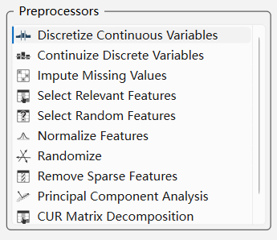
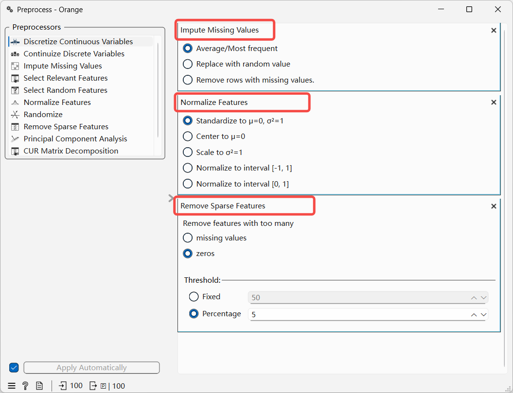
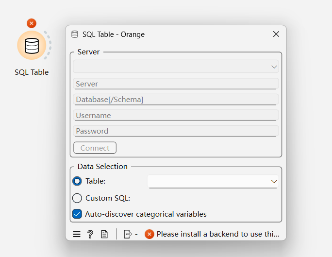
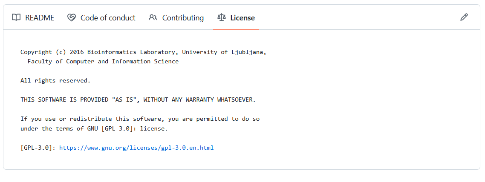

# 时序数据预处理功能说明

## 1. 背景介绍

### 1.1 定义

数据预处理（Data Preprocessing）就是将“杂乱无章”的原始数据转化为“高质量”输入的过程。它不仅能提高模型的准确性，还能显著加快训练速度。

### 1.2 数据预处理技术

1. 数据归一化、标准化
2. 缺失值填充
3. 连续数值离散化、二值化
4. 连续数值分箱
5. 非线性变换
6. 特征编码等

### 1.3 开源工具

Pandas、NumPy、scikit-learn 能够提供面向机器学习训练的所有数据预处理功能。
缺点是需要相关人员编写代码，使用门槛较高。

### 1.4 可视化数据预处理工具（Gemini 3 推荐）

1. **Orange** 是目前最受欢迎的可视化机器学习工具之一。它将数据预处理、可视化和建模通过“积木盒”的形式串联起来
采用  工作流（Workflow）模式，通过拖拽不同的组件（Widget）来完成操作。
**预处理功能**：内置丰富的预处理组件，如：
- **Impute**：处理缺失值。
- **Select Columns**：特征选择。
- **Continuize**：离散特征连续化（One-hot 编码）。
- **Preprocess**：包含归一化、随机化、离散化等集成功能。

1. **KNIME** 是一款企业级的开源数据分析平台，其预处理能力的深度和广度在开源界首屈一指。
- **特点**：支持极其复杂的数据整合和清洗逻辑。
- **预处理功能**：
  - **Data Blending**：支持从 SQL、NoSQL、Excel 等数百个数据源提取并混合。
  - **Row/Column Filter**：极度精细的数据筛选。
  - **Pivoting/Grouping**：强大的聚合操作。

## 2. 数据预处理功能

参考 Orange 提供的预处理功能，基础数据预处理功能如下（共 10 项）：

## 3. 可行的方案

可行的进行数据预处理的方案，有以下三个方案供选择：

### 3.1 开发自有工具

提供通过**配置文件+预处理工具包**的方式交付。用户通过配置配置文件，设置需要处理的流程， 数据输入、处理流程参数、数据输出等配置，预处理工具根据配置选项完成预处理过程。

#### 3.1.1 预处理功能

#### 3.1.2 配置文件流程化执行

通过配置文件（YAML/TOML）将数据预处理的流程标准化，通过调整配置文件来执行数据预处理过程。
通过配置文件，让用户调整配置文件进行上述处理。上述功能通过配置组合追加，下图所示。

上述的数据预处理包含三个步骤，分别是1. 丢失值填充；2. 数值归一化；3. 删除稀疏属性。
上述过程完全可以通过配置文件配置完成，并将处理结果可视化后，输出保存。

##### 3.1.2.1 输入与输出

数据预处理输入是**TDengine 内部已经存在的表、虚拟表、超级表 或 本地 CSV 文件**。
输出到 **TDengine 数据库中或本地保存的 CSV 文件**。

##### 3.1.2.2 问题与挑战

数据预处理需要数据的可视化。使用脚本的方案交互性不够，用户体验可能不够好。完整的开发时间估计得 1 个月左右的时间。

### 3.2 可视化执行数据预处理

在 IDMP 上 复刻一个 Orange 软件的 Preprocessor 功能，不包括Orange 的流程+组件的功能。开发时间不太好评估，设计前端的开发和后端的适配处理。

### 3.3 适配 Orange 软件

Orange 支持从 DB 中读取数据并进行本地化的数据预处理、分析、可视化、数据挖掘等一系列的操作。

Orange 能够支持连接数据库，我们可以适配 Orange。然后推荐客户使用 Orange 即可，Orange 是开源软件，使用 GPL 3.0 协议发布。

## 4. 参考文献

1. https://orangedatamining.com
2. https://www.knime.com/

ChatGPT的回答 （Added by Jeff)
<view type="1">

  > ⚠ 嵌入文件，需在飞书中查看 (token: YqHJbJMsqobhsXxxYxscJh2mnT4)

</view>
