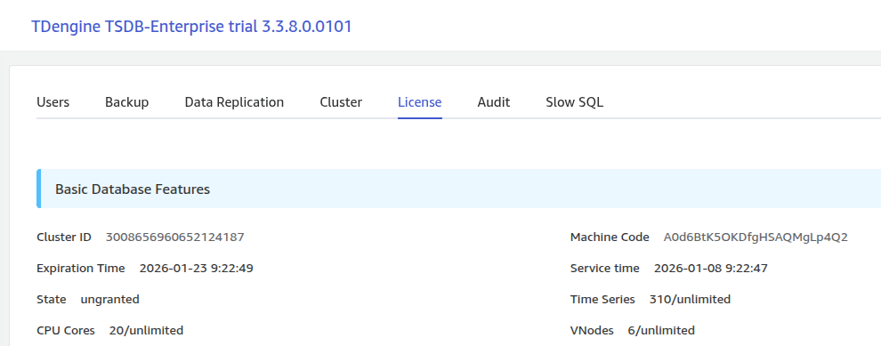

# Explorer License 页面显示机器码 - FS

## 1. 修订记录

| 编写日期 | 发布日期 | 版本 | 修订人 | 主要修改内容 |
| --- | --- | --- | --- | --- |
| 2026-01-20 | 2026-01-20 | 1.0 | 霍琳贺 | 初始版本 |

## 2. 背景

目前 Explorer 的 License 管理页面仅显示 Cluster ID，用户在申请 license 激活时需要提供机器码（Machine Code）。为了获取机器码，用户必须手动执行 `show cluster machines` SQL 命令，这增加了操作步骤，降低了用户体验。
本功能旨在在 License 管理页面直接显示机器码，使用户能够一次性获取激活所需的所有信息（Cluster ID 和 Machine Code），简化激活流程。

## 3. 定义

- **Machine Code**: 通过 `show cluster machines` 命令返回的 `machine` 字段，用于 license 激活
- **sendSQLReq**: Explorer 中用于执行 SQL 命令的 API 方法
- **el-descriptions-item**: Element Plus UI 组件，用于展示描述列表项

## 4. 行为说明

### 4.1 UI 变化

#### 4.1.1 License 页面基本信息区域

在"数据库基本功能"（Basic Database Features）区域的 `el-descriptions` 组件中，在 Cluster ID 之后新增机器码显示项：
**布局示例**：


#### 4.1.2 显示内容

- **有机器码**: 显示从 `show cluster machines` 查询返回的 `machine` 字段值
- **无机器码或查询失败**: 显示 "N/A"

#### 4.1.3 刷新功能

点击页面右上角的"刷新"按钮时，会重新执行 `show cluster machines` 查询，更新机器码显示。

### 4.2 SQL 命令

执行的命令
```sql
show cluster machines;
```

返回数据格式
```javascript
{
  "column_meta": [
    ["id", ...],
    ["dnode_num", ...],
    ["machine", ...],
    ["version", ...]
  ],
  "data": [
    [
      "3609687158593567855",  // id (cluster id)
      1,                       // dnode_num
      "Bdw+qvOCyvAOc3SS5GIyEOIi",  // machine (机器码)
      "3.3.8.9"                // version
    ]
  ]
}
```

#### 4.2.1 数据提取逻辑

- 获取返回数组中的第一条记录
- 提取 `machine` 字段的值
- 如果查询失败或无数据，设置为空字符串

### 4.3 代码变化

#### 4.3.1 国际化文件修改

**文件**: `explorer/src/lang/zh/topic.ts`
```typescript
export default {
  topic: {
    clusterId: '集群 ID',
    machineCode: '机器码',  // 新增
    version: '版本',
    // ... 其他字段
  }
}
```

**文件**: `explorer/src/lang/en/topic.ts`
```typescript
export default {
  topic: {
    clusterId: 'Cluster ID',
    machineCode: 'Machine Code',  // 新增
    version: 'Version',
    // ... 其他字段
  }
}
```

#### 4.3.2 Vue 组件修改

**文件**: `explorer/src/views/8_administrator/views/license.vue`
**新增状态变量**:
```typescript
const machineCode = ref('');
```

**修改 getData 函数**:
```typescript
async function getData() {
  try {
    // 获取机器码
    await sendSQLReq(`show cluster machines;`).then(res => {
      const array = res.data.map(data => {
        return Object.fromEntries(
          res.column_meta.map((item, index) => {
            return [item[0], data[index]];
          })
        );
      });
      // 获取第一个机器码
      if (array.length > 0) {
        machineCode.value = array[0].machine || '';
      }
    }).catch(() => {
      // 如果命令不支持，忽略错误
      machineCode.value = '';
    });
    
    // ... 原有的 show grants 等查询
  } catch (error) {
    loading.value = false;
  }
}
```

**UI 模板修改**:
```plaintext
<el-descriptions style="margin-bottom: 30px" :column="3">
  <el-descriptions-item :label="$t('topic.clusterId')" :label-style="style">
    <span>{{ clusterId }}</span>
  </el-descriptions-item>
  <!-- 新增机器码显示 -->
  <el-descriptions-item :label="$t('topic.machineCode')" :label-style="style">
    <span>{{ machineCode || 'N/A' }}</span>
  </el-descriptions-item>
  <!-- ... 其他字段 -->
</el-descriptions>
```

### 4.4 错误处理

1. **命令不支持**: 使用 `.catch()` 捕获错误，设置 `machineCode` 为空字符串，UI 显示 "N/A"
2. **无数据返回**: 检查 `array.length`，如果为 0 则不设置值
3. **network 错误**: 不影响页面其他信息的加载，继续执行后续的 `show grants` 查询

## 5. 性能

- **查询开销**: `show cluster machines` 是一个轻量级查询，通常在 10ms 内完成
- **并发查询**: 机器码查询与 `show grants` 查询串行执行，总加载时间增加约 10-50ms
- **页面加载**: 不影响页面首次加载速度，异步获取数据
- **刷新性能**: 刷新时重新执行所有查询，包括机器码查询

## 6. 安全

1. **权限控制**: 
  - 机器码仅在 License 管理页面显示
  - 该页面已有权限控制，仅管理员可访问
  - 使用现有的认证和授权机制
1. **数据传输**:
  - 通过现有的连接传输方式
  - 使用已有的 `sendSQLReq` API，遵循现有安全策略
1. **日志记录**:
  - 查询错误时不在前端控制台输出完整机器码
  - 使用 `.catch()` 静默处理错误

## 7. 兼容性

**无破坏性变化**
- 仅新增显示项，不修改现有功能
- 对于不支持 `show cluster machines` 命令的旧版本 TDengine，显示 "N/A"
- UI 布局采用 3 列自适应布局，不影响其他字段显示

## 8. 运维

**无特殊运维要求**
- 无需修改配置文件
- 无需数据库迁移
- 无需重启服务
- 部署方式与现有 Explorer 一致

## 9. 使用场景

### 9.1 场景 1: 新用户激活 License

1. 用户登录 Explorer
2. 进入 Management > License 页面
3. 同时查看 Cluster ID 和 Machine Code
4. 将两个信息提供给销售或支持团队申请 license
5. 获取 license 后在同一页面点击"激活 License"按钮
**改进点**: 用户无需执行命令行操作，直接在 UI 上获取所有激活信息

### 9.2 场景 2: 续费或更新 License

1. 用户 license 即将过期
2. 进入 License 页面查看当前状态
3. 确认 Cluster ID 和 Machine Code 信息
4. 联系销售团队续费
5. 在同一页面完成新 license 激活

## 10. 约束和限制

### 10.1 约束

- 需要 TDengine 3.x 版本支持 `show cluster machines` 命令
- 用户必须有权限访问 License 管理页面
- 需要有效的数据库连接

### 10.2 限制

- 仅显示第一个 dnode 的机器码（通常集群中所有节点的机器码相同）
- 机器码为只读信息，无法编辑
- 查询失败时不提供详细错误信息（为了用户体验）

## 11. 常见错误和排查

### 11.1 问题 1: 机器码显示 "N/A"

**可能原因**:
1. TDengine 版本过低，不支持 `show cluster machines` 命令
2. 数据库连接失败
3. 用户权限不足
**排查方法**:
1. 检查 TDengine 版本，确认是否支持该命令
2. 在 taos 命令行中手动执行 `show cluster machines;` 验证
3. 检查浏览器控制台的网络请求，查看是否有错误

### 11.2 问题 2: 机器码刷新不更新

**可能原因**:
- 浏览器缓存
- 网络请求失败
**排查方法**:
1. 清除浏览器缓存
2. 检查网络连接
3. 查看浏览器控制台的错误信息

## 12. 可观测性

### 12.1 Explorer 影响

- **新增显示项**: License 页面新增"机器码"字段
- **无其他 UI 变化**: 不影响其他页面和功能

### 12.2 TDinsight 影响

- 无

### 12.3 taos shell 影响

- 无

## 13. 安装和卸载

**无特殊要求**
- 作为 Explorer 前端代码的一部分，随 taosX 发布
- 无需独立安装或配置
- 无卸载需求

## 14. 文档

UI 有自解释性，不需要文档修改。

## 15. 参考文档

- TDengine SQL 命令文档: `show cluster machines`
- Element Plus Descriptions 组件文档
- Explorer 国际化实现规范
