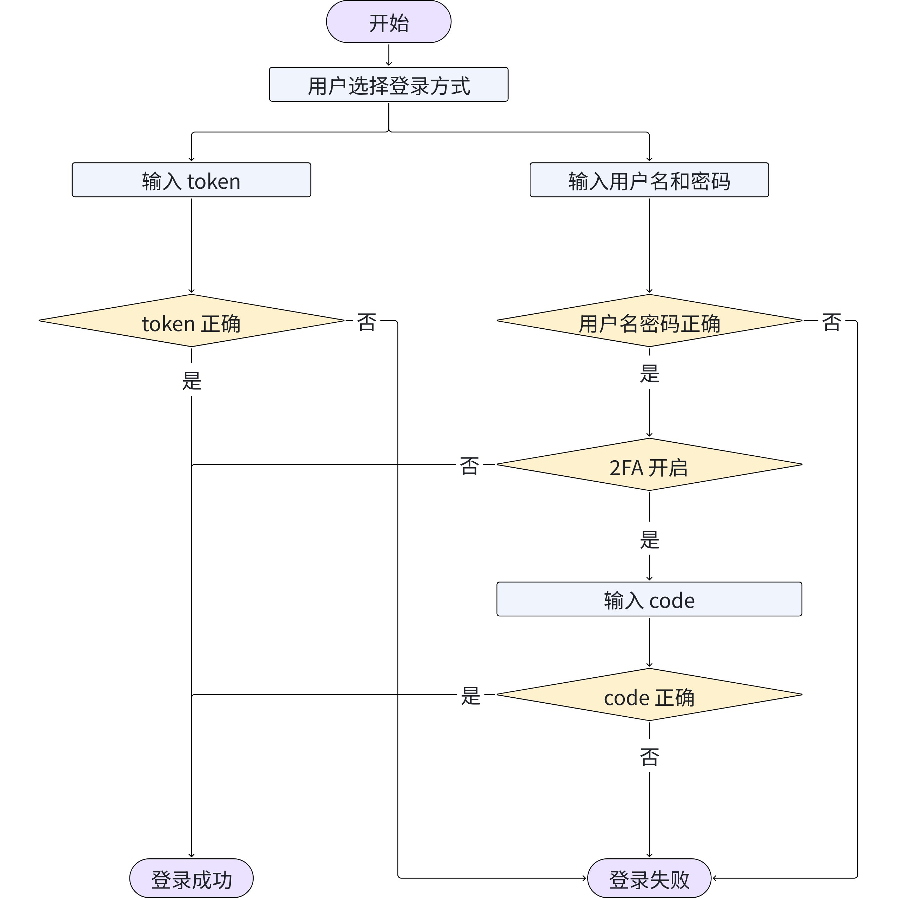
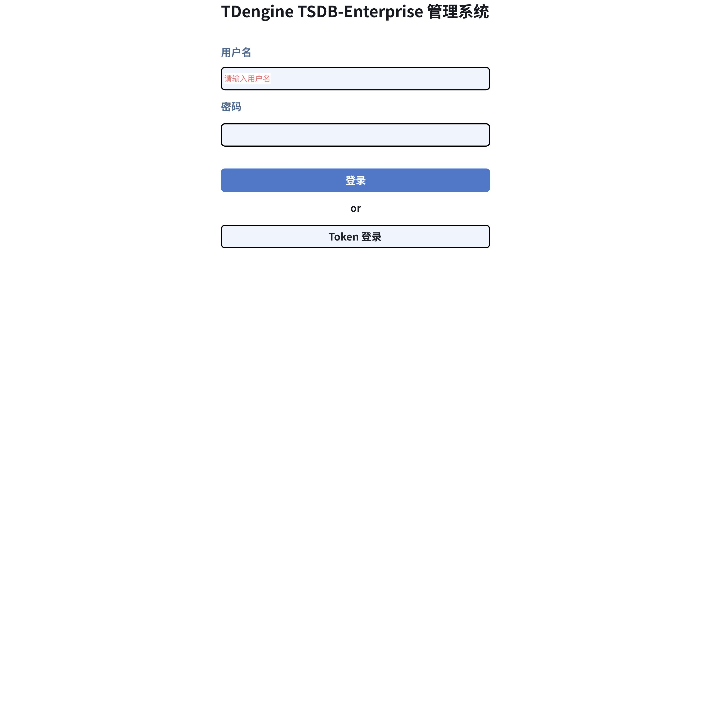
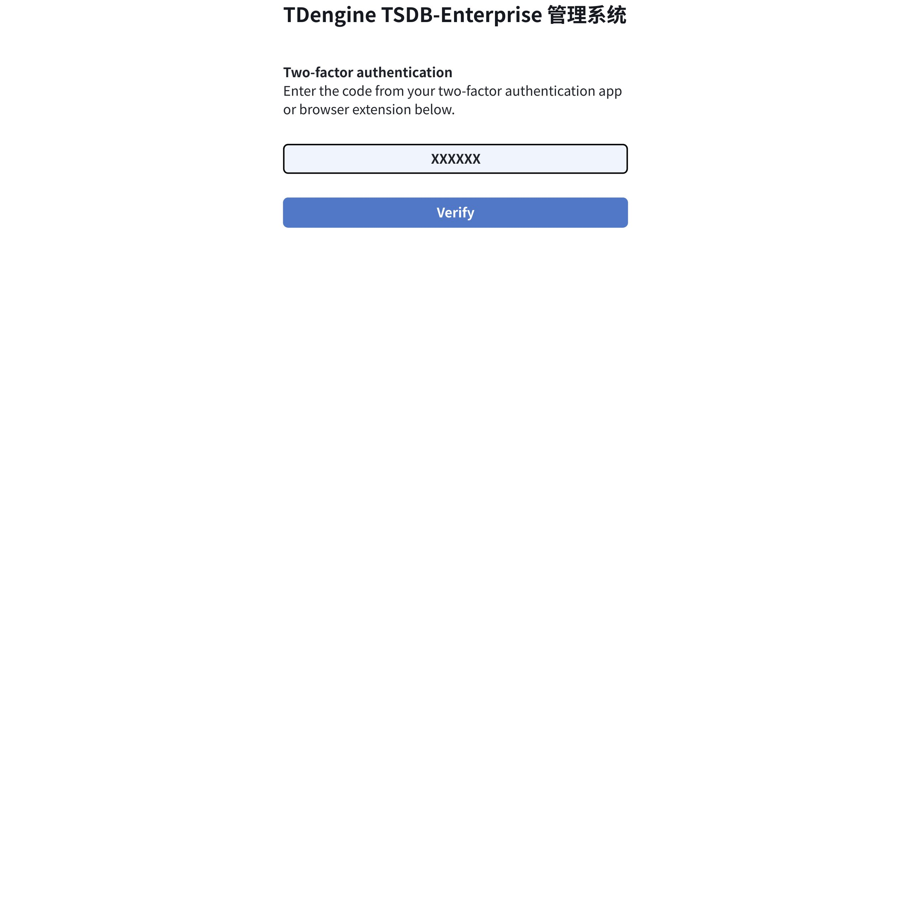
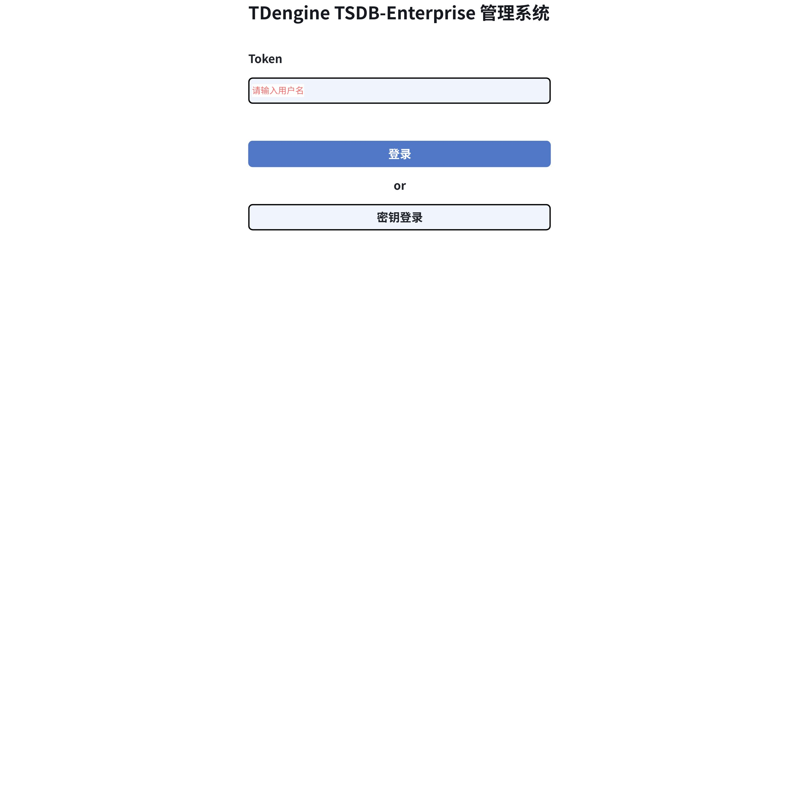
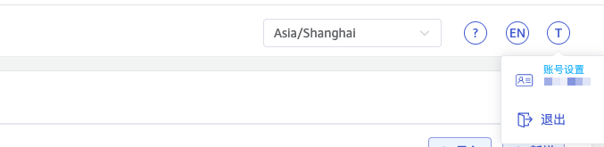
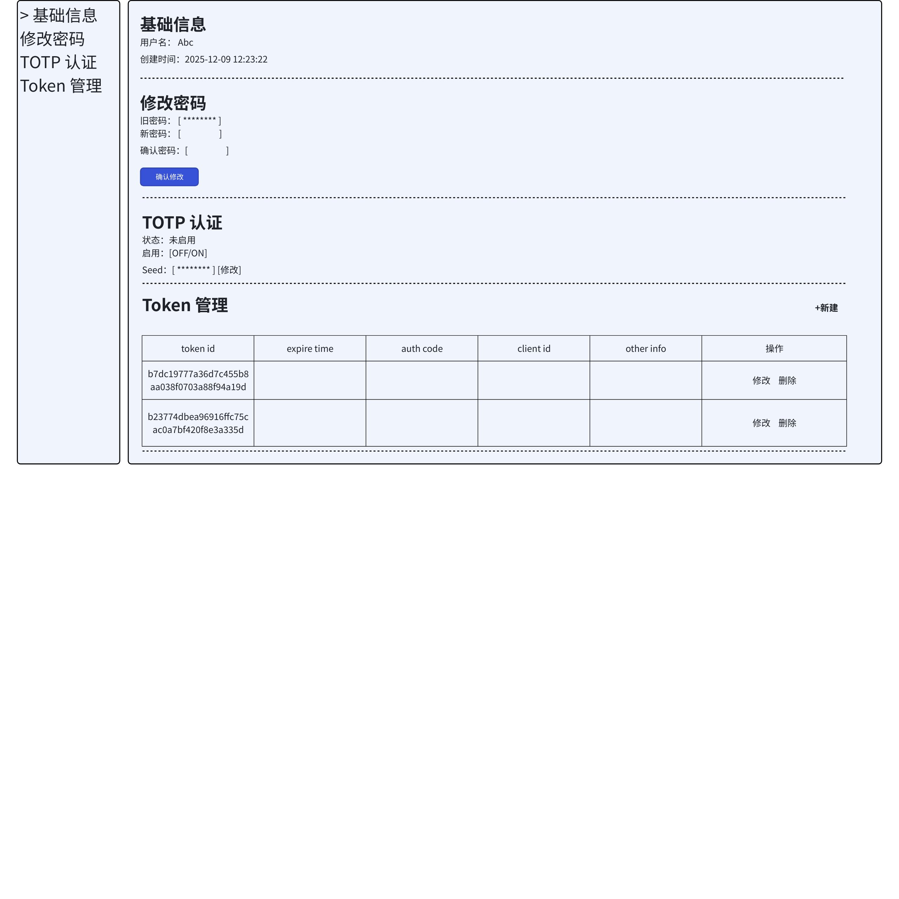

# Explorer 支持 Token 和 TOTP 认证 FS

## 1. 背景

根据 [身份鉴别 FS](https://taosdata.feishu.cn/wiki/CXXqwV3Fai36rQkby6zcmBWwnMd) 的变更，taos explorer 需要修改现有的认证，以支持 TOTP 和 Token 认证。

## 2. 变更历史

| 日期 | 版本 | 负责人 | 主要修改内容 |
| --- | --- | --- | --- |
| 2025/12/8 | 0.1 | @杨志宇 | 初稿 |

## 3. 定义

- 2FA（Two-Factor authentication）：双因素身份验证，是登录网站或应用程序时使用的额外安全层。使用 2FA，您必须使用用户名和密码登录，并提供只有您知道或有权访问的另一种身份验证形式。
- TOTP（Time-based one-time password）：基于时间和共享密钥生成一次性密码的算法。
- Token 认证：用户可以使用 token 访问 TSDB，token 有 expire time 等控制信息。

## 4. 行为说明

### 4.1 登录

#### 4.1.1 登录的认证流程



#### 4.1.2 密码登录

在 explorer 登录页面，用户可以选择使用**密钥**或 **token** 登录。
密码登录页面如下：


#### 4.1.3 2FA verify code

输入 2FA Authentication 的页面如下：


#### 4.1.4 Token 登录

Token 登录页面如下：


### 4.2 账号设置/Account Settings

#### 4.2.1 账号设置的导航

Explorer 的右上角，原有的“修改密码”改为“账号设置”。


#### 4.2.2 账号设置/Account Settings

由 explorer 右上角的导航进入“账号设置”，如下：


1. 原有的“修改密码”保持不变，修改密码不会改变用户的 totp secret。
2. 增加了 TOTP 认证、Token 管理

#### 4.2.3 TOTP 认证

支持 TOTP 的新建、开启/关闭 TOTP 认证。
```sql {wrap}

## 5. 查看用户是否开启了 TOTP

SHOW USERS

## 6. 创建用户，指定 TOTPSEED 并开启 TOTP

CREATE USER [IF NOT EXISTS] `Abc` PASS 'tbase125!' TOTPSEED 'b7dc1977';

## 7. 创建新用户，不开启 TOTP

CREATE USER [IF NOT EXISTS] `Abc` PASS 'tbase125!';

## 8. 修改用户的 TOTP 认证（可以为用户启用 TOTP）

ALTER USER `Abc` TOTPSEED 'b7dc1977';

## 9. 删除 TOTPSEED，关闭 TOTP 认证

ALTER USER <username> TOTPSEED NULL;
```

#### 9.0.1 Token 管理

支持 Token 的创建、修改、删除。
```sql {wrap}

## 10. 创建 token

CREATE token FROM USER `Abc` expire_time '2025-12-31T00:00:00Z';

## 11. 查找用户的 token

SELECT token FROM ins_tokens WHERE auth_code = <auth_code>

## 12. 修改 token

ALTER token SET expire_time=<time> WHERE token_id = <token_id>

## 13. 删除 token

DROP token <token_id>
```


## 14. 性能

无

## 15. 兼容性

1. 如果 explorer 连接的是社区版，没有 token 登录，也没有 2FA 登录。
2. 如果 explorer 连接的 3.4.0.0 之前的 TSDB，没有 token 登录，也没有 2FA 登录。
3. 如果 explorer 连接的是 3.4.0.0 之后的 TSDB，用户可以选择 token 登录/密钥登录。在用户启用了 TOTP 认证的情况下，explorer 才显示 2FA 登录。

## 16. 运维

无

## 17. 使用场景

无

## 18. 约束和限制

无

## 19. 常见错误和排查

无

## 20. 可观测性

无

## 21. 安装和卸载

无

## 22. 文档

## 23. 参考文档

## 24. 附录
