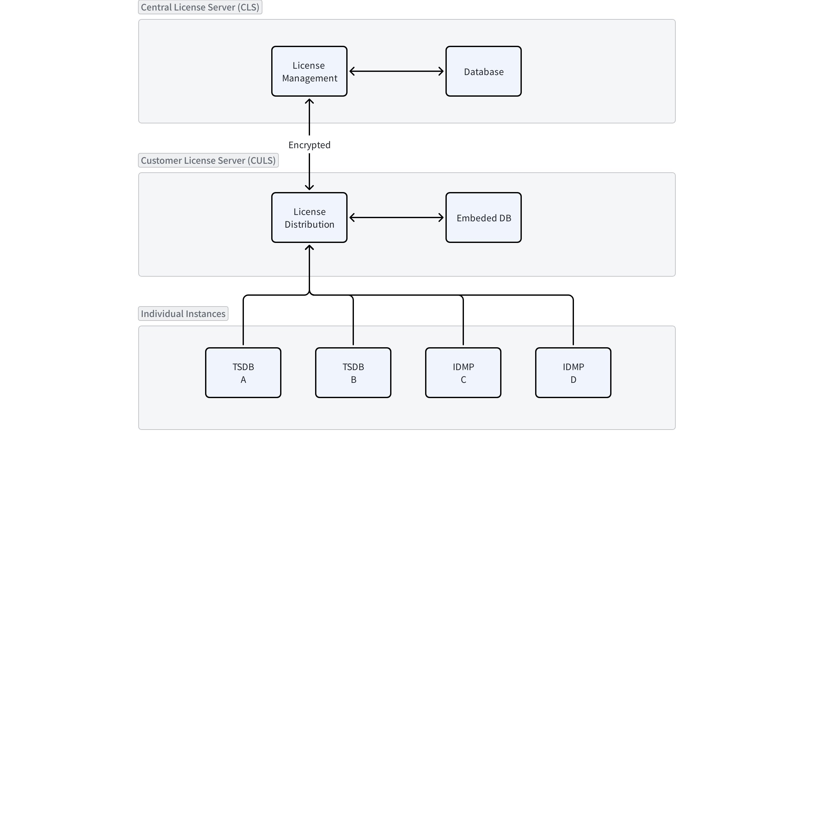

# License Center - FS

## 1. 修订记录

| 编写日期 | 发布日期 | 版本 | 修订人 | 主要修改内容 |
| --- | --- | --- | --- | --- |
| 2026-01-09 | 2026-01-09 | 1.0 | 霍琳贺 | 初始版本 |
| 2026-01-13 | 2026-01-13 | 1.1 | 霍琳贺 | 修改客户侧改造部分 |

## 2. 背景

当前 TDengine 和 IDMP 的授权管理采用 TSDB 中心 License 模式，每个实例独立配置和验证授权，IDMP 不能独立配置，依赖 TSDB 的授权信息。这种模式在多实例部署场景下存在显著问题：
1. 运维复杂度高，需要逐个实例手动更新 License
2. 缺乏统一视图，无法集中监控授权使用情况
3. 离线场景支持不足，授权更新困难
4. 缺乏安全管控手段，无法阻止非法实例使用
本设计旨在构建**独立的中心化授权管理系统（License Center）**，包含中心侧授权服务（CLS）和客户侧授权服务（CULS），实现授权的统一发放、更新、撤销和监控，支持在线和离线两种工作模式。

## 3. 定义

- **CLS (Central License Server)**: 中心侧授权服务，运行在 TDengine 服务商侧，负责授权的发放、撤销和全局管理
- **CULS (Customer License Server)**: 客户侧授权服务，运行在客户环境，作为授权代理服务器管理客户的所有 TSDB/IDMP 实例
- **Instance**: TSDB 或 IDMP 的运行实例
- **License Package**: 授权包，包含授权维度、有效期、签名等信息
- **Offline Token**: 离线授权码，用于离线环境的授权凭证
- **Grace Period**: 宽限期，License 失效后实例仍可全功能运行的时间（默认 2 周）
- **Blacklist**: 黑名单，包含 Instance ID 黑名单、CULS ID 黑名单和 License ID 黑名单

## 4. 行为说明

### 4.1 系统架构



### 4.2 中心侧授权服务（CLS）

使用 git-like 子命令方式的命令行参数解析方式，主命令为 `taos-cls-admin`，支持如下子命令：

#### 4.2.1 授权发放

**CLI 命令**:
```bash

## 5. 在线发放授权

taos-cls-admin issue \
  --customer-id "customer-001" \
  --culs-id "culs-abc123" \
  --license-type "enterprise" \
  --valid-until "2027-01-01" \
  --timeseries 1000000 \
  --cpu-cores 128 \
  --dnodes unlimited \
  --features "audit,data_sync,backup_restore" \
  --push

## 6. 生成离线授权码

taos-cls-admin issue \
  --customer-id "customer-001" \
  --culs-id "culs-abc123" \
  --license-type "enterprise" \
  --valid-until "2027-01-01" \
  --timeseries 1000000 \
  --offline \
  --output /tmp/offline-license.token
```

**API 接口**:
```rust
// POST /api/v1/licenses/issue
{
  "customer_id": "customer-001",
  "culs_id": "culs-abc123",
  "license_type": "enterprise",
  "valid_until": "2027-01-01T00:00:00Z",
  "grants": {
    "timeseries": 1000000,
    "cpu_cores": 128,
    "dnodes": -1,  // -1 表示 unlimited
    "vnodes": -1,
    "storage_size": -1,
    "features": ["audit", "data_sync", "backup_restore"]
  },
  "delivery_mode": "push"  // "push" 或 "offline"
}

// Response
{
  "license_id": "lic-xyz789",
  "status": "issued",
  "offline_token": null  // 如果是离线模式，返回 token
}
```

#### 6.0.1 授权查看

**CLI 命令**:
```bash

## 7. 查看所有客户授权

taos-cls-admin list --all

## 8. 查看特定客户授权

taos-cls-admin list --customer-id "customer-001"

## 9. 查看授权详情

taos-cls-admin show --license-id "lic-xyz789"
```

**Web UI**: 提供图表展示
- 客户列表及授权状态
- 实例使用情况统计（按客户、按授权维度）
- 授权到期时间提醒
- 资源使用趋势图

#### 9.0.1 授权撤销

**CLI 命令**:
```bash

## 10. 撤销特定授权

taos-cls-admin revoke \
  --license-id "lic-xyz789" \
  --reason "contract_expired" \
  --add-to-blacklist

## 11. 撤销客户所有授权

taos-cls-admin revoke \
  --customer-id "customer-001" \
  --add-to-blacklist
```

撤销后：
- License ID 加入黑名单
- 向 CULS 推送撤销消息
- CULS 停止向实例分发该授权
- 实例进入宽限期（2 周），之后停止服务

#### 11.0.1 黑名单管理

```bash

## 12. 添加 CULS 到黑名单

taos-cls-admin blacklist add \
  --type culs \
  --id "culs-abc123" \
  --reason "security_incident"

## 13. 查看黑名单

taos-cls-admin blacklist list --type culs

## 14. 移除黑名单

taos-cls-admin blacklist remove \
  --type culs \
  --id "culs-abc123"
```

#### 14.0.1 CRM 集成

**查询客户合同信息**:
```rust
// GET /api/v1/crm/customer/{customer_id}/contracts
// Response
{
  "customer_id": "customer-001",
  "contracts": [
    {
      "contract_id": "CNT-2026-001",
      "product": "TDengine Enterprise",
      "start_date": "2026-01-01",
      "end_date": "2027-01-01",
      "authorized_resources": {
        "timeseries": 1000000,
        "cpu_cores": 128
      }
    }
  ]
}
```

**自动发放（待定）**:
- 监听 CRM 合同签订事件
- 根据合同自动生成并推送 License
- 合同到期自动触发撤销流程

### 14.1 客户侧授权服务（CULS）

#### 14.1.1 初始化和注册

**安装和启动**:
```bash

## 15. 安装

wget https://download.taosdata.com/license-center/culs-linux-amd64.tar.gz
tar -xzf culs-linux-amd64.tar.gz
cd culs
./install.sh

## 16. 启动服务

systemctl start taos-culs

## 17. 首次运行生成密钥对并注册

taos-culs init \
  --central-server "https://license.taosdata.com:8443" \
  --customer-id "customer-001"    

## 18. 输出：CULS ID 和公钥，需提交给 TDengine 服务商

```

#### 18.0.1 在线授权接收

CULS 自动与 CLS 建立安全连接，接收推送的授权更新：
```bash

## 19. 查看当前授权状态

taos-culs status

## 20. 输出示例

CULS ID: culs-abc123
Connection: Online (connected to CLS)
Current License: lic-xyz789
  - Type: Enterprise
  - Valid Until: 2027-01-01
  - Resources:
    * Timeseries: 1000000 (unlimited)
    * CPU Cores: 128 (unlimited)
    * Dnodes: unlimited
  - Features: audit, data_sync, backup_restore

Managed Instances: 5
   - TSDB-001 (192.168.1.10:6030) - Active
   - TSDB-002 (192.168.1.11:6030) - Active
   - IDMP-001 (192.168.1.20:8080) - Active
   - IDMP-002 (192.168.1.21:8080) - Active
   - TSDB-003 (192.168.1.12:6030) - Grace Period (expires in 10 days)
```

#### 20.0.1 离线授权导入

```bash

## 21. 导入离线授权码

taos-culs import-offline \
  --token-file /path/to/offline-license.token

## 22. 输出（待定）

Offline license imported successfully
  - License ID: lic-offline-001
  - Valid Until: 2027-01-01
  - Offline Mode: Enabled
  - Expires: 2027-01-01 (365 days remaining)
```

#### 22.0.1 实例注册管理

**资源限制：**
- 自动注册：
  - 所有实例的资源总合不得超过 CULS 的授权总量
- 手动注册：
  - 允许限制某个实例的资源使用量
**实例自动注册**:
TSDB/IDMP 启动时通过服务发现（mDNS/环境变量）找到 CULS 并注册：
```rust
// TSDB/IDMP 配置文件
// taos.cfg 或 idmp.yaml
license_server_url = "culs://192.168.1.100:7443"
// 或自动发现
license_server_discovery = "auto"
```

**手动注册实例**:
```bash

## 23. 添加实例

taos-culs instance add \
  --instance-id "tsdb-001" \
  --instance-type "tsdb" \
  --endpoint "192.168.1.10:6030"

## 24. 限制实例资源

taos-culs instance add \
  --instance-id "tsdb-001" \
  --instance-type "tsdb" \
  --endpoint "192.168.1.10:6030"
  # resources for instance
  --timeseries 1000000 \
  --cpu-cores 128 \
  --dnodes unlimited \
  --features "audit,data_sync,backup_restore"

## 25. 列出所有实例

taos-culs instance list

## 26. 移除实例

taos-culs instance remove --instance-id "tsdb-001"
```

#### 26.0.1 强制授权解除 (drop license)

在 TSDB 实例上可通过 SQL 语句强制解除授权：
```sql
-- 仅安全员或超级管理员可执行
DROP LICENSE;
```

执行后：
- 当前 License ID 加入 CULS 的黑名单
- CULS 向 CLS 报告该 License ID（如在线）
- CLS 将 License ID 加入全局黑名单
- 该 License 不可复用，即使重新获取也无法使用
- 需要重新申请新的 License

#### 26.0.2 实例黑名单

```bash

## 27. 添加实例到黑名单（阻止其获取授权）

taos-culs blacklist add \
  --instance-id "tsdb-rogue-001" \
  --reason "unauthorized_instance"

## 28. 查看黑名单

taos-culs blacklist list

## 29. 移除黑名单

taos-culs blacklist remove --instance-id "tsdb-rogue-001"
```

### 29.1 实例侧改造

#### 29.1.1 License Server 认证

**认证流程**:
1. 实例启动时连接 CULS
2. CULS 出示证书（基于密钥对签名）
3. 实例验证 CULS 的公钥签名
4. 实例检查 CULS ID 是否在黑名单中
5. 如果 CULS 在黑名单，拒绝连接并记录日志
**配置示例**:
```toml

## 30. taos.cfg

## 31. CULS 连接配置

server_url = "culs://192.168.1.100:7443"

## 32. CULS 公钥（用于验证身份）

server_public_key = "ed25519:AABBCCDD..."
```

#### 32.0.1 授权更新机制

在新授权机制启用后，客户端需要每日更新本机授权与黑名单：
1. 试用版
   - 试用版提供 14 天临时授权，临时授权从第一次启动开始计算。
2. 正式版
   - 客户端每日尝试连接 CULS 并更新本机授权与黑名单；
   - 每日更新授权时，当连接失败，进行多次重试，重试后仍然失败的，记录日志并告警，并在第二天重新连接，多次重试仍然失败的，将进入宽限期，日志发出临时授权警告。

#### 32.0.2 宽限期机制

**触发条件**:
- License 已过期
- 无法连接到 CULS（网络故障）
- CULS 返回授权已撤销
**行为**:
- 实例记录宽限期开始时间
- 继续全功能运行 14 天
- 每天在日志中输出警告信息
- 宽限期结束后，实例停止服务（拒绝新连接，保留数据）
**日志示例**:
```plaintext
[WARN] License expired, entering grace period (14 days remaining)
[WARN] Grace period: 10 days remaining, please renew license
[ERROR] Grace period expired, service stopped
```

#### 32.0.3 drop license 命令

**SQL 语法**:
```sql
DROP LICENSE;
```

**权限要求**:
- 仅 `security_officer` 角色可执行
- 需要通过安全审计
**执行效果**:
```sql
taos> DROP LICENSE;
Query OK, 0 row(s) affected (0.001234s)
License ID 'lic-xyz789' has been revoked and added to blacklist.
Please contact TDengine support to obtain a new license.
```

**错误码**:
- `0x2601`: 权限不足（非安全员）
- `0x2602`: 当前无有效 License
- `0x2603`: 无法连接 CULS

### 32.1 通信协议

#### 32.1.1 TLS 1.3 安全传输

**加密传输**:
- 传输层：QUIC with TLS 1.3
- 认证：Noise Protocol (XX handshake pattern)
- 密钥交换：Ed25519
**连接建立**:
```rust
// CLS <-> CULS
let mut swarm = libp2p::SwarmBuilder::with_new_identity()
    .with_tokio()
    .with_quic()
    .with_noise()
    .with_request_response(LicenseProtocol)
    .build();

// 监听地址
swarm.listen_on("/ip4/0.0.0.0/udp/8443/quic".parse()?)?;
```

#### 32.1.2 消息体

**授权推送**:
```protobuf
message LicensePush {
  string license_id = 1;
  string culs_id = 2;
  bytes license_data = 3;  // 加密的授权数据
  bytes signature = 4;     // CLS 私钥签名
  int64 timestamp = 5;
}
```

**授权查询**:
```protobuf
message LicenseQuery {
  string culs_id = 1;
  repeated string instance_ids = 2;
}

message LicenseResponse {
  map<string, InstanceLicense> licenses = 1;
}
```

**黑名单同步**:
```protobuf
message BlacklistUpdate {
  enum Type {
    CULS = 0;
    LICENSE = 1;
    INSTANCE = 2;
  }
  Type type = 1;
  repeated string ids = 2;
  string reason = 3;
}
```

### 32.2 授权维度

支持 `show grants full` 的所有维度：
```sql
-- 查看授权详情
SHOW GRANTS FULL;

-- 输出示例（与现有格式兼容）
+------------------+------------------------+---------------------------+---------------+
| name             | display_name           | expire                    | usage/total   |
+------------------+------------------------+---------------------------+---------------+
| service          | Service Time           | expire 2027-01-01 00:00:00|               |
| timeseries       | Timeseries             | expire 2027-01-01 00:00:00| 1500/1000000  |
| dnodes           | Dnodes                 | expire 2027-01-01 00:00:00| 3/unlimited   |
| cpu_cores        | CPU Cores              | expire 2027-01-01 00:00:00| 64/128        |
| vnodes           | Vnodes                 | expire 2027-01-01 00:00:00| 12/unlimited  |
| storage_size     | Storage Size           | expire 2027-01-01 00:00:00| 5.2TB/unlimited|
| audit            | Audit                  | expire 2027-01-01 00:00:00|               |
| data_sync        | Data Synchronization   | expire 2027-01-01 00:00:00|               |
| backup_restore   | Data Backup & Restore  | expire 2027-01-01 00:00:00|               |
+------------------+------------------------+---------------------------+---------------+
```

授权数据结构：
```rust
pub struct LicenseGrants {
    pub service_expire: DateTime<Utc>,
    pub timeseries: Option<u64>,      // None = unlimited
    pub dnodes: Option<u32>,
    pub cpu_cores: Option<u32>,
    pub vnodes: Option<u32>,
    pub storage_size: Option<u64>,    // bytes
    pub streams: Option<u32>,
    pub subscriptions: Option<u32>,
    pub views: Option<u32>,
    pub features: HashSet<String>,    // "audit", "data_sync", etc.
}
```

授权要求：
- 可扩展：使用 features 哈希表，可扩展包含的授权类型

### 32.3 数据存储

#### 32.3.1 中心侧（PostgreSQL）

**Schema**:
```sql
-- 客户表
CREATE TABLE customers (
    customer_id VARCHAR(64) PRIMARY KEY,
    name VARCHAR(255) NOT NULL,
    created_at TIMESTAMP NOT NULL DEFAULT NOW()
);

-- CULS 表
CREATE TABLE customer_license_servers (
    culs_id VARCHAR(64) PRIMARY KEY,
    customer_id VARCHAR(64) REFERENCES customers(customer_id),
    public_key TEXT NOT NULL,
    status VARCHAR(32) NOT NULL,  -- 'active', 'blacklisted'
    last_seen TIMESTAMP,
    created_at TIMESTAMP NOT NULL DEFAULT NOW()
);

-- 授权表
CREATE TABLE licenses (
    license_id VARCHAR(64) PRIMARY KEY,
    culs_id VARCHAR(64) REFERENCES customer_license_servers(culs_id),
    license_type VARCHAR(32) NOT NULL,
    grants JSONB NOT NULL,
    valid_until TIMESTAMP NOT NULL,
    status VARCHAR(32) NOT NULL,  -- 'active', 'revoked', 'expired'
    created_at TIMESTAMP NOT NULL DEFAULT NOW(),
    revoked_at TIMESTAMP
);

-- 实例表
CREATE TABLE instances (
    instance_id VARCHAR(64) PRIMARY KEY,
    culs_id VARCHAR(64) REFERENCES customer_license_servers(culs_id),
    instance_type VARCHAR(16) NOT NULL,  -- 'tsdb', 'idmp'
    endpoint VARCHAR(255),
    last_heartbeat TIMESTAMP,
    status VARCHAR(32) NOT NULL  -- 'active', 'grace_period', 'stopped'
);

-- 黑名单表
CREATE TABLE blacklist (
    id SERIAL PRIMARY KEY,
    entity_type VARCHAR(16) NOT NULL,  -- 'culs', 'license', 'instance'
    entity_id VARCHAR(64) NOT NULL,
    reason TEXT,
    created_at TIMESTAMP NOT NULL DEFAULT NOW(),
    UNIQUE(entity_type, entity_id)
);

-- 审计日志表
CREATE TABLE audit_logs (
    id SERIAL PRIMARY KEY,
    timestamp TIMESTAMP NOT NULL DEFAULT NOW(),
    operation VARCHAR(64) NOT NULL,
    actor VARCHAR(128),
    target_type VARCHAR(32),
    target_id VARCHAR(64),
    details JSONB,
    result VARCHAR(32)
);
```

#### 32.3.2 客户侧（Embedded DB）

使用 RocksDB 或 REDB，存储：
- 当前 License 数据
- 注册的实例列表
- 实例黑名单
- 本地审计日志

## 33. 性能

- **授权验证**: 实例启动时验证 < 1s（本地缓存 + CULS 查询）
- **授权更新延迟**: CLS -> CULS < 10s（libp2p 实时推送）
- **并发能力**: 
  - CLS 支持 10,000+ CULS 连接
  - CULS 支持 1,000+ 实例连接
- **状态查询**: < 3s（含所有实例）

## 34. 安全

1. **端到端加密**: libp2p + TLS 1.3
2. **身份认证**: Ed25519 密钥对
3. **授权签名**: 防止 License 数据篡改
4. **黑名单机制**: 三级黑名单（CULS/License/Instance）
5. **审计日志**: 所有敏感操作记录，保留 1 年
6. **权限控制**: `drop license` 仅限安全员

## 35. 兼容性

- **向后兼容**: 保留单机 License 文件模式作为 fallback
- **平滑迁移**: 提供迁移工具从文件模式迁移到 License Center
- **多版本支持**: CLS 兼容 TDengine 3.4.x 和 IDMP 1.x

## 36. 运维

### 36.1 部署方式

**中心侧（CLS）**:
```bash

## 37. Systemd

systemctl start taos-cls.service

## 38. Docker Compose

docker-compose up -d

## 39. Kubernetes

kubectl apply -f license-center-deployment.yaml
```

**客户侧（CULS）**:
```bash

## 40. 系统服务

systemctl enable taos-culs
systemctl start taos-culs

## 41. Docker

docker run -d \
  -v /etc/taos-culs:/etc/taos-culs \
  -p 7443:7443 \
  taosdata/culs:latest
```

### 41.1 高可用

- CLS 支持高可用
- PostgreSQL 使用主从复制
- CULS 支持单节点、双机热备

### 41.2 监控

Prometheus metrics:
```plaintext

## 42. CLS

license_center_connected_culs{status="online"} 1250
license_center_issued_licenses_total 5000
license_center_blacklist_entries{type="culs"} 5

## 43. CULS

culs_managed_instances{type="tsdb",status="active"} 10
culs_license_expires_in_days 365
culs_connection_status{target="cls"} 1
```

## 44. 使用场景

### 44.1 场景 1: 新客户首次部署

1. 客户部署 CULS 并初始化，获得 CULS ID
2. 提交 CULS ID 给 TDengine 服务商
3. 服务商在 CLS 发放授权（在线推送）
4. 客户部署 TSDB/IDMP 实例，自动连接 CULS 获取授权

### 44.2 场景 2: 离线环境授权

1. 客户提供 CULS ID
2. 服务商生成离线授权码（有效期 1 年）
3. 客户通过 U 盘或邮件获得离线授权码
4. 在 CULS 上导入离线授权码
5. CULS 向实例分发授权

### 44.3 场景 3: 授权升级

1. 客户购买更多资源（如增加 timeseries）
2. 服务商在 CLS 更新授权
3. CLS 自动推送到客户 CULS
4. CULS 自动推送到所有实例
5. 实例热更新授权，无需重启

### 44.4 场景 4: 合同到期

1. 合同到期，CRM 触发事件
2. CLS 自动撤销授权
3. 推送撤销消息到 CULS
4. 实例进入宽限期（14 天）
5. 宽限期结束，实例停止服务

### 44.5 场景 5: 安全事件响应

1. 发现客户环境存在安全问题
2. 服务商将 CULS 加入黑名单
3. 所有该客户的实例无法获取授权
4. 实例进入宽限期，待问题解决后恢复

### 44.6 场景 6: 客户申请新授权

1. 客户在实例上执行 `DROP LICENSE`（安全员）
2. 旧 License ID 加入黑名单
3. CULS 向 CLS 报告
4. 客户向服务商申请新 License
5. 服务商发放新授权（新 License ID）

## 45. 约束和限制

### 45.1 约束

- CULS 必须能够访问所管理的所有实例（网络可达）
- 离线授权码有效期不超过 2 年
- 宽限期固定为 14 天，不可配置
- `drop license` 操作不可撤销

### 45.2 限制

- 单个 CULS 建议管理不超过 1,000 个实例（性能考虑）
- 离线模式下无法实时撤销授权（依赖离线码到期）
- 授权总量由 License Package 定义，不能超额分配

## 46. 常见错误和排查

### 46.1 错误 1: 实例无法连接 CULS

```plaintext
Error: Failed to connect to license server at culs://192.168.1.100:7443
```

**排查**:
1. 检查网络连通性：`ping 192.168.1.100`
2. 检查 CULS 服务状态：`systemctl status taos-culs`
3. 检查防火墙：`telnet 192.168.1.100 7443`
4. 查看 CULS 日志：`journalctl -u taos-culs -n 100`

### 46.2 错误 2: CULS 在黑名单中

```plaintext
Error: License server 'culs-abc123' is in blacklist
```

**排查**:
1. 联系 TDengine 服务商确认黑名单原因
2. 如果是误操作，请求移除黑名单
3. 如果是安全问题，解决后重新申请授权

### 46.3 错误 3: License 已过期

```plaintext
Warning: License expired, entering grace period (14 days remaining)
```

**排查**:
1. 检查授权状态：`taos-culs status`
2. 联系服务商续费
3. 在宽限期内完成授权更新

### 46.4 错误 4: drop license 权限不足

```plaintext
Error [0x2601]: Permission denied. Only security officer can execute DROP LICENSE.
```

**排查**:
1. 确认当前用户角色：`SELECT current_user()`
2. 切换到安全员账户执行
3. 如无安全员账户，联系管理员创建

## 47. 可观测性

### 47.1 taos shell

新增 `select license_server_status()` 语句。
```sql
-- 查看授权详情
SHOW GRANTS FULL;

-- 查看 License Server 连接状态
select license_server_status();
-- 输出：
-- +------------------+------------------------+
-- | server_id        | status                 |
-- +------------------+------------------------+
-- | culs-abc123      | connected              |
-- +------------------+------------------------+
```

### 47.2 taos Explorer

- Dashboard 展示授权状态和资源使用情况
- 实例列表显示授权到期时间
- 告警：授权即将到期（30 天提醒）

### 47.3 TDinsight

- 新增 License 监控面板
- Metrics:
  - License 有效期倒计时
  - 资源使用率（timeseries、cpu_cores 等）
  - CULS 连接状态

## 48. 安装和卸载

### 48.1 安装 CULS

```bash

## 49. 下载安装包

wget https://download.taosdata.com/license-center/culs-linux-amd64.tar.gz
tar -xzf culs-linux-amd64.tar.gz
cd culs

## 50. 安装

sudo ./install.sh

## 51. 初始化

sudo taos-culs init \
  --central-server "https://license.taosdata.com:8443" \
  --customer-id "customer-001"

## 52. 启动

sudo systemctl start taos-culs
sudo systemctl enable taos-culs
```

### 52.1 卸载 CULS

```bash

## 53. 停止服务

sudo systemctl stop taos-culs
sudo systemctl disable taos-culs

## 54. 卸载

sudo /usr/local/taos-culs/uninstall.sh

## 55. 清理数据（可选）

sudo rm -rf /var/lib/taos-culs
```

### 55.1 TSDB/IDMP 配置

在 `taos.cfg` 或 `idmp.yaml` 中添加：

```toml
[license]

## 56. 启用 License Center 模式

mode = "center"

## 57. CULS 地址（自动发现或手动配置）

server_url = "culs://192.168.1.100:7443"

## 58. 或使用自动发现

server_discovery = "auto"
```

## 59. 文档

### 59.1 需要修改的文档

- **企业版文档**: 
  - License Center 部署和配置指南
  - 从单机模式迁移到中心化模式
  - 故障排查手册
- **官网文档**:
  - License Center 产品介绍
  - 快速开始指南
  - API 参考文档

### 59.2 文档 PR 准备

在产品发布前准备：
1. `license-center-deployment.md`: 部署指南
2. `license-center-api.md`: API 文档
3. `license-center-troubleshooting.md`: 故障排查
4. `license-center-migration.md`: 迁移指南

## 60. 参考文档

- Noise Protocol: https://noiseprotocol.org/
- TDengine License 机制（内部文档）
- PostgreSQL 高可用方案
- RS [License Center - RS](https://taosdata.feishu.cn/wiki/XDx1wB1KGiDPZAkl2UkcCOJ3nCb)

## 61. 附录

### 61.1 安全审计事件

需要审计的事件：
- `license.issue`: 授权发放
- `license.revoke`: 授权撤销
- `license.drop`: 授权解除（实例侧）
- `blacklist.add`: 添加黑名单
- `blacklist.remove`: 移除黑名单
- `culs.register`: CULS 注册
- `instance.register`: 实例注册
