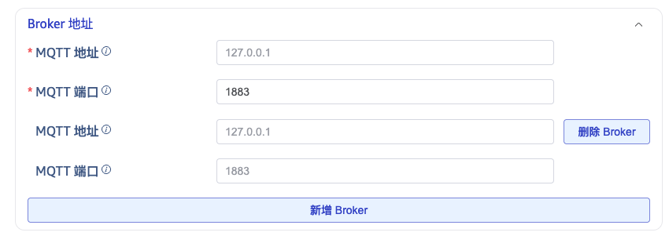
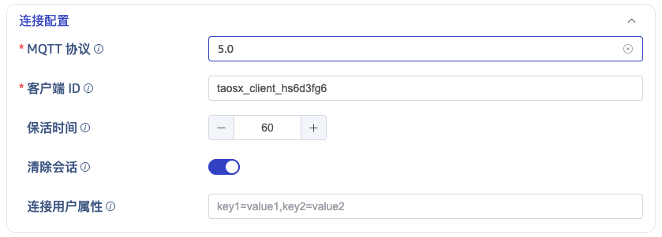
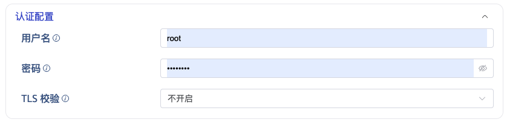
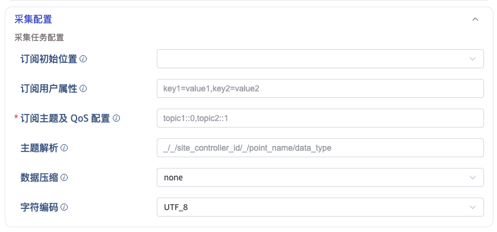

# MQTT 多地址故障转移与用户属性 — FS

## 1. 修订记录

| 编写日期 | 发布日期 | 版本 | 修订人 | 主要修改内容 |
| --- | --- | --- | --- | --- |
| 2026-03-18 | 2026-03-18 | 1.0 | AI | 初始版本 |

## 2. 背景

MQTT 数据源在 taosx 中广泛用于物联网数据采集场景。当前实现存在以下不足：
1. **单点连接风险**：仅支持单个 Broker 地址，Broker 宕机时任务中断，缺乏高可用能力。
2. **v5 特性利用不足**：MQTT v5 支持在 CONNECT 和 SUBSCRIBE 报文中附带用户属性，但 taosx 未予支持。
3. **UI 配置混乱**：连接参数与认证参数混在同一区块，用户体验不佳。
本功能旨在增加多地址故障转移、MQTT v5 用户属性（拆分为连接/订阅两组）、以及 UI 配置区块重组。

## 3. 定义

| 术语 | 定义 |
| --- | --- |
| Broker Addresses | MQTT Broker 的多地址列表，支持故障转移 |
| connect_user_properties | MQTT v5 CONNECT 报文中的自定义用户属性 |
| subscribe_user_properties | MQTT v5 SUBSCRIBE 报文中的自定义用户属性 |
| sub-offset | 订阅初始位置偏移（earliest/latest），合并到 subscribe_user_properties |
| parse_kv_pairs | 通用 DSN 键值对解析函数 |
| connection_options | UI 连接配置区块 |
| auth_options | UI 认证配置区块 |

## 4. 行为说明

### 4.1 DSN 参数格式

#### 4.1.1 多地址配置

多个 Broker 地址通过 endpoint 参数传递，以逗号分隔：
```plaintext
mqtt://192.168.1.1:1883,192.168.1.2:1883?client_id=test&version=5.0

```

#### 4.1.2 用户属性

连接用户属性和订阅用户属性分别通过独立的 DSN 参数传递：
```plaintext
mqtt://host:1883?connect_user_properties=client-type=sensor,env=prod&subscribe_user_properties=sub-offset=earliest,priority=high

```

#### 4.1.3 完整示例

```plaintext
mqtt://192.168.1.1:1883,192.168.1.2:1883?client_id=test&version=5.0&connect_user_properties=client-type=sensor&subscribe_user_properties=sub-offset=earliest

```

### 4.2 前端配置界面

#### 4.2.1 Broker 地址区块



- 类型：grouping（使用 HostPort 组件）
- 动态添加/删除地址对（host + port）
- 最少 1 个地址，顺序决定故障转移优先级

#### 4.2.2 连接配置区块 (connection_options)




| 字段 | 类型 | 说明 |
| --- | --- | --- |
| version | select | MQTT 协议版本：3.1 / 3.1.1 / 5.0 |
| client_id | customId | 客户端 ID |
| keep_alive | number | 保活时间，默认 60 秒 |
| clean_session | switch | 清除会话，默认 true |
| connect_user_properties | input | 连接用户属性，仅 v5 可见 |

#### 4.2.3 认证配置区块 (auth_options)




| 字段 | 类型 | 说明 |
| --- | --- | --- |
| username | input | 认证用户名 |
| password | password | 认证密码 |
| tsl_verify | select | TLS 校验模式：不开启/单向/双向 |
| ca | file | CA 证书，根据 tsl_verify 显示 |
| cert | file | 客户端证书，根据 tsl_verify 显示 |
| cert_key | file | 客户端私钥，根据 tsl_verify 显示 |

#### 4.2.4 采集配置区块




| 字段 | 依赖路径 | 显示条件 |
| --- | --- | --- |
| connect_user_properties | connection_options/version | version = 5.0 |
| sub-offset | connection_options/version | version = 5.0 |
| subscribe_user_properties | connection_options/version | version = 5.0 |
| ca | auth_options/tsl_verify | tsl_verify = single / both |
| cert, cert_key | auth_options/tsl_verify | tsl_verify = both |

### 4.3 DSN 序列化行为

#### 4.3.1 提交时

1. 将 sub-offset 值追加到 subscribe_user_properties 字符串中
2. 从数据对象中删除 sub-offset
3. 若 subscribe_user_properties 合并后为空，则省略
4. connect_user_properties 直接传递

#### 4.3.2 编辑/恢复时

1. 从 subscribe_user_properties 字符串中提取 sub-offset
2. 设置 sub-offset 下拉框值
3. 从 subscribe_user_properties 显示文本中移除 sub-offset 部分

### 4.4 错误处理

| 错误场景 | 处理方式 |
| --- | --- |
| 用户属性 key 为空 | 返回错误：property key cannot be empty |
| 用户属性 value 为空 | 返回错误：property value cannot be empty |
| 所有 Broker 地址连接失败 | 返回最后一个地址的连接错误 |
| MQTT v3 下传入用户属性 | 静默忽略，不报错 |

## 5. 性能

本功能对性能无显著影响：
- 多地址故障转移仅在连接建立阶段生效，运行时不增加开销
- 用户属性解析为 O(n) 线性复杂度，n 通常小于 10

## 6. 安全

- 用户名密码通过 password 类型输入框输入，不以明文展示
- TLS 证书上传保持现有安全机制不变
- 用户属性值不进行任何特殊解释或执行，避免注入风险
- 后端严格校验键值对格式，拒绝空 key 和空 value

## 7. 兼容性

- **DSN 兼容性**：旧版 user_properties 参数不再被解析，已更名为 connect_user_properties / subscribe_user_properties
- **MQTT v3 兼容性**：v3 任务完全不受影响
- **升级兼容性**：已有的不带用户属性的 v5 任务无需修改

## 8. 运维

- 故障转移过程产生日志，记录每个地址的连接尝试和结果
- 无需额外部署步骤或配置文件修改
- 功能随 taosx 版本升级自动启用

## 9. 使用场景

### 9.1 场景 1：高可用 MQTT 采集

用户部署了多个 MQTT Broker（主备模式），配置多个地址后，主 Broker 宕机时系统自动尝试备用 Broker。

### 9.2 场景 2：v5 自定义属性传递

用户的 MQTT Broker 需要通过 CONNECT 报文的用户属性传递客户端类型、环境标识等元数据。

### 9.3 场景 3：订阅级别参数控制

用户需要通过 SUBSCRIBE 报文的用户属性传递 sub-offset 参数，控制消费起始位置。

### 9.4 场景 4：TLS 认证分离管理

用户希望连接参数与认证参数分开管理，减少配置混淆。

## 10. 约束和限制

**约束：**
- 用户属性仅适用于 MQTT v5，v3 下自动隐藏并忽略
- 至少需要配置 1 个 Broker 地址
**限制：**
- 多地址故障转移为顺序尝试，非并发探测
- 用户属性值不支持包含逗号
- 旧版 user_properties DSN 参数不再自动迁移

## 11. 常见错误和排查

| 错误信息 | 原因 | 排查方法 |
| --- | --- | --- |
| property key cannot be empty | key 为空 | 检查键值对格式 |
| property value cannot be empty | value 为空 | 确保每个 key 有非空 value |
| 连接失败 | 所有 Broker 不可达 | 检查网络和 Broker 状态 |
| v5 属性不生效 | 版本未选 5.0 | 确认 version 选择 5.0 |

## 12. 可观测性

- **taos Explorer**：MQTT 配置页面新增 Broker 地址列表、连接/认证分区、v5 用户属性输入框
- **TDinsight**：无影响
- **taos shell**：无影响

## 13. 安装和卸载

无特殊要求。功能随 taosx 版本升级自动启用。

## 14. 文档

- 需要修改企业版文档：是
- 需要修改官网文档：是

## 15. 参考文档

- MQTT 5.0 Specification
- rumqttc 0.25.x API Documentation

## 16. 附录

无。
