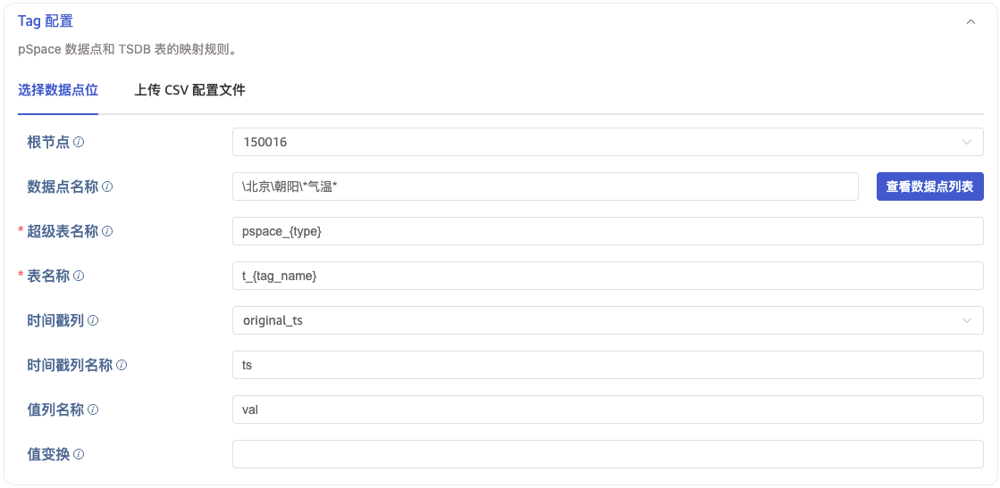
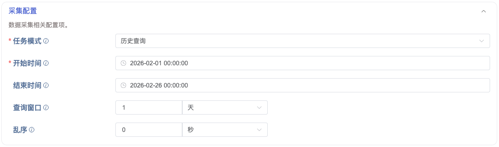

# pSpace 数据源接入 - FS

## 1. 背景

pSpace 是力控科技的企业级实时历史数据库，taosX 基于 pSpace 的 Java SDK 开发了 pSpace 数据源，实现了 pSpace 的 TDengine TSDB 的数据接入功能，支持：历史数据迁移、实时数据订阅、查询同步等任务模式。

## 2. 变更历史

| 日期 | 版本 | 负责人 | 主要修改内容 |
| --- | --- | --- | --- |
| 2026/1/12 | 0.1 | @杨志宇 | 初稿 |
| 2026/3/5 | 1.0 | @杨志宇 | 定稿 |

## 3. 定义

- pSpace 节点：树状结构上的非叶子节点，用来组织 pSpace 数据点。
- pSpace 数据点：树状结构上的叶子节点，用于存储数据的点位。
- pSpace plugin：用 Java 开发的 taosx-pspace plugin，是对 pSpace SDK 的封装。

## 4. 行为说明

### 4.1 点位的配置模式

#### 4.1.1 选择数据点位



在“数据数据点位”中，用户需要填写的配置项包括：
1. 起始节点：开始遍历的根结点，填写根节点的 LongName。例如：\北京\朝阳\望京，表示“\北京\朝阳\望京”节点开始，向下遍历。默认从根节点开始遍历。
2. 测点名称：支持根据测点的 LongName 过滤。例如：\北京\朝阳\望京\气温-*，表示：\北京\朝阳\望京 下，所有以“气温-”开头的测点。
配置“起始节点”和“测点名称”后，可以点击“查看点位列表”按钮，查看符合条件的点位。
1. 超级表名：测点映射到 TSDB 的超级表名称，支持用 `{type}`表示数据类型。
2. 子表名：测点映射到 TSDB 的子表名称，支持用`{id}`表示测点名称。
3. 主键列：子表的主键列，可以选择：origin_ts / request_ts / received_ts。默认为 origin_ts
4. 主键列名称：主键的名称，默认为 ts。

#### 4.1.2 上传 CSV 配置文件

CSV 配置文件示例
```plaintext {wrap}
No.,point_id,stable,tbname,value_col,value_transform,type,quality_col,ts_col,ts_transform,request_ts_col,request_ts_transform,received_ts_col,received_ts_transform,tag::VARCHAR(1024)::name,tag::VARCHAR(1024)::LongName,tag::VARCHAR(1024)::Description
1,150017,pspace_double,t_150017,val,,double,quality,ts,,qts,,rts,,气温,\北京\气温,
2,150019,pspace_double,t_150019,val,,double,quality,ts,,qts,,rts,,气温,\北京\朝阳\气温,
3,150021,pspace_double,t_150021,val,,double,quality,ts,,qts,,rts,,气温,\北京\朝阳\望京\气温,
4,150023,pspace_double,t_150023,val,,double,quality,ts,,qts,,rts,,气温,\北京\朝阳\酒仙桥\气温,
5,150025,pspace_double,t_150025,val,,double,quality,ts,,qts,,rts,,气温,\北京\海淀\气温,
6,150027,pspace_double,t_150027,val,,double,quality,ts,,qts,,rts,,气温,\北京\海淀\中关村\气温,
```

### 4.2 任务的采集模式



#### 4.2.1 历史查询

通过查询，指定开始时间、结束时间等查询条件，将满足条件的历史数据，从 pSpace 中查询出来，并写入到 TSDB 数据库，完成一次性的数据迁移任务。
配置参数：
1. 开始时间：数据点的开始时间时间戳，必填。
2. 结束时间：数据点的开始时间时间戳，默认为当前时间。
3. 查询窗口：划分子查询的时间窗口，默认为 1 天。
4. 乱序：每个查询窗口向前偏移一个时间间隔，默认 0 秒。

#### 4.2.2 实时订阅

通过实时订阅接口，接收 pSpace 推送的实时数据，写入 TSDB 数据库，完成实时数据同步。

#### 4.2.3 查询同步

从开始时间到现在的历史数据迁移后，不退出，继续按照固定的时间间隔，同步实时数据到 TSDB 中。
配置参数：
1. 开始时间：数据点的开始时间时间戳，必填。
2. 查询窗口：划分子查询的时间窗口，默认为 1 天。
3. 乱序：每个查询窗口向前偏移一个时间间隔，默认 0 秒。
4. 查询间隔：两次查询之间的时间间隔，多长时间同步一次，默认是 10 秒。

### 4.3 pSpace 的 DSN 参数列表

```plaintext {wrap}
pspace://[username]:[passwd]@[host]:[port]/[param1=value1&param2=value2...]
```


| **参数** | **说明** | **值域** | **必填** |
| --- | --- | --- | --- |
| host | pspace 的 host | Hostname 或 IP | 是 |
| port | pspace 的端口，默认为 8889 | port | 否 |
| username | pspace 用户名 | 用户名 | 是 |
| passwd | pspace 密码 | 密码 | 是 |
| conn_timeout | 连接超时，单位是秒 | 正整数 | 否 |
| csv_config_file | csv 配置文件的路径 | 路径 | 是 |
| mode | 任务模式 | - history：历史数据 - realtime：实时数据 - continuous_query：持续查询 | 是 |
| start | 历史数据，查询的开始时间 | 日期时间 | 是 |
| end | 历史数据，查询的结束时间，默认值是当前时间 | 日期时间 | 否 |
| time_range | 历史数据，查询的窗口大小，默认值是1天 | 时间间隔 | 否 |
| restro | 历史数据，允许乱序的时间跨度，默认值是0分钟 | 时间间隔 | 否 |
| interval | 历史数据，两次查询之间的间隔，单位是：毫秒（ms），默认值是 1000 | 正整数 | 否 |
| min_elapsed | KingHistorian 订阅时的最小间隔时间，单位：毫秒，默认值是 1000 | 正整数 | 否 |
| max_retries | 最大错误重试次数。默认为：10 | 正整数，>= 0 | 否 |
| retry_interval | 错误重试的间隔，单位：秒。默认为 5s。 | 正整数，>= 5s | 否 |
| root | 起始节点，选择 Point 时，使用的根节点 ID。默认是 0，表示 root Node | 正整数，>= 0 | 否 |
| point_name_pattern | 测点名称，选择 Point 时，LongName 的 pattern | 字符串 | 否 |
| super_table_expression | 超级表名，映射到 TSDB 中的超级表的名称 pattern。支持用 `{type}`表示数据类型。例如： `pspace_{type}`。 | 字符串 | 否 |
| child_table_expression | 子表名：测点映射到 TSDB 的子表名称，支持用`{id}`表示测点名称。例如：`t_{id}` | 字符串 | 否 |
| table_primary_key | 主键列：子表的主键列，可以选择：origin_ts / request_ts / received_ts。默认为 origin_ts | 字符串 | 否 |
| table_primary_key_alias | 主键列名称：主键的名称，默认为 ts | 字符串 | 否 |

### 4.4 Metrics

复用 point message 的统计指标

### 4.5 pSpace plugin

#### 4.5.1 打印版本

```shell
$ java -jar taosx-pspace.jar -V
version: 1.11.0 (core-1.11.0 debug)
git: 7ecbefe5e307597640f3a16f1e389733c0b34ed6
build: macos-x86_64 2026-01-20 18:35:19 +08:00
```

#### 4.5.2 打印帮助

```sql
$ java -jar taosx-pspace.jar -h
Usage: taosx-pspace [-hV] [-c=<config>] [-m=<mode>]
taosX pSpace plugin - command line tool to run pSpace tasks
  -c, --config=<config>   Path to configuration file
  -h, --help              Show this help message and exit.
  -m, --mode=<mode>       Task mode: check|points|run
  -V, --version           Print version information and exit.
```

#### 4.5.3 连通性检查

```toml
$ java -jar taosx-pspace.jar -m check -c ./example/check.toml
```

配置文件
```toml
[connect]
server = "192.168.2.149"
port = 8889
username = "admin"
password = "admin888"
```

输出
```json
{
  "valid": true,
  "support": true,
  "data_source": "pspace",
  "version": "7.1"
}
```

#### 4.5.4 查询节点

```shell
$ java -jar taosx-pspace.jar -m nodes -c ./nodes.toml
```

配置文件
```toml
[connect]
server = "192.168.2.149"
port = 8889
username = "admin"
password = "admin888"

[nodes]
root = 0
```

输出
```json
[
  {
    "id": 150016,
    "name": "北京",
    "long_name": "\\北京",
    "is_leaf": false
  },
  {
    "id": 150028,
    "name": "上海",
    "long_name": "\\上海",
    "is_leaf": true
  }
]
```

#### 4.5.5 查询数据点

```json {wrap}
java -jar taosx-pspace.jar -m points -c ./points.toml
```

配置文件
```toml {wrap}
[connection]
server = "192.168.2.149"
port = 8889
username = "admin"
password = "admin888"

[nodes]
root = 150016

[points]
name_filter = "\\北京\\朝阳\\*气温*"
include_data_type = true
```

输出
```json {wrap}
[
  {
    "id": 150019,
    "name": "气温",
    "type": "PS_ANALOG",
    "long_name": "\\北京\\朝阳\\气温",
    "desc": "",
    "data_type": "psDataType_Double"
  },
  {
    "id": 150021,
    "name": "气温",
    "type": "PS_ANALOG",
    "long_name": "\\北京\\朝阳\\望京\\气温",
    "desc": "",
    "data_type": "psDataType_Double"
  },
  {
    "id": 150023,
    "name": "气温",
    "type": "PS_ANALOG",
    "long_name": "\\北京\\朝阳\\酒仙桥\\气温",
    "desc": "",
    "data_type": "psDataType_Double"
  }
]
```

#### 4.5.6 历史查询

```shell {wrap}
java -jar target/taosx-pspace.jar -m run -c pspace-query-local.toml
```

配置文件
```toml {wrap}
[connection]
server = "192.168.2.149"
port = 8889
username = "admin"
password = "admin888"

[nodes]
root = 150016

[points]

## 5. name_filter = "\\北京\\朝阳\\*气温*"

include_data_type = true
point_ids = [150019]

[run]
mode = "Query"
start_time = "2026-03-01T00:00:00+08:00"
end_time = "2026-03-01T05:00:00+08:00"
time_window = 3600
time_excursion = 0

[report]
local_only = true # 不需要 taosX 运行

[advanced_options]
log_level = "info"
keep_raw_data = true
keep_raw_data_days = 7
keep_raw_data_dir = "./raw_data" # 数据写入 `./raw_data/` 目录
```

#### 5.0.1 实时订阅

```shell {wrap}
java -jar target/taosx-pspace.jar -m run -c pspace-subscribe-local.toml
```

配置文件
```toml {wrap}
[connection]
server = "192.168.2.149"
port = 8889
username = "admin"
password = "admin888"

[nodes]
root = 150016

[points]
name_filter = "\\北京\\朝阳\\*气温*"
include_data_type = true

[run]
mode = "Subscribe"

[report]
local_only = true

[advanced_options]
log_level = "info"
keep_raw_data = true
keep_raw_data_days = 7
keep_raw_data_dir = "./raw_data"
```

#### 5.0.2 查询同步

```shell {wrap}
java -jar target/taosx-pspace.jar -m run -c pspace-querysync-local.toml
```

配置文件
```toml {wrap}
[connection]
server = "192.168.2.149"
port = 8889
username = "admin"
password = "admin888"

[nodes]
root = 150016

[points]

## 6. name_filter = "\\北京\\朝阳\\*气温*"

include_data_type = true
point_ids = [150019, 150021, 150023]

[run]
mode = "QuerySync"
start_time = "2026-03-03T00:00:00+08:00"
time_window = 86400
time_excursion = 0
query_interval = 10

[report]
local_only = true

[advanced_options]
log_level = "info"
keep_raw_data = true
keep_raw_data_days = 7
keep_raw_data_dir = "./raw_data"
```

## 7. 性能

要求单任务支持测点数不小于 5w 点，实时同步要求不小于 10w rows/sec，历史同步要求不小于 30w rows/sec。

## 8. 兼容性

无。新的 DataIn 数据源，无兼容性要求。

## 9. 运维

无。

## 10. 使用场景

### 10.1 连通性检查

用户在 taos-Explorer 中，输入 pSpace Server 的地址、端口、用户名、密码，验证 pSpace 服务器连接是否正常。

### 10.2 **查询 pSpace 节点**

用户在 explorer 中选择根节点时，需要加载 pSpace 的节点树。pSpace 的数据组织为树形 Node 结构，用户需要逐级展开选择。

### 10.3 **查询 pSpace 数据点**

用户在 explorer 中通过根节点 + 数据点名称表达式，过滤需要的数据点。

### 10.4 数据采集

支持三种采集模式，将 pSpace 数据点的时序数据写入 TDengine。

| **模式** | **说明** | **必填参数** |
| --- | --- | --- |
| 历史查询 | 按时间范围批量查询历史数据，查询完成后任务结束 | `start_time`，可选 `end_time`、`time_window` |
| 实时订阅 | 订阅数据点的实时变化，持续运行直到取消 | 无额外必填参数 |
| 查询同步 | 增量同步，以固定间隔轮询新数据，持续运行 | `start_time`，可选 `time_window`、`time_excursion`、`query_interval` |

## 11. 约束和限制

无。

## 12. 常见错误和排查

无。

## 13. 可观测性

性能指标，复用 Point 类型的数据源。

## 14. 安装和卸载

新增了 `plugins/pspace`插件，JAVA 代码开发，修改打包脚本。

## 15. 文档

用户手册：
官网文档：

## 16. 参考文档

[pSpace 开发指南](https://taosdata.feishu.cn/wiki/RfhWwQq7hiEApnktoVBcRDMxnRe)

## 17. 附录

无。
