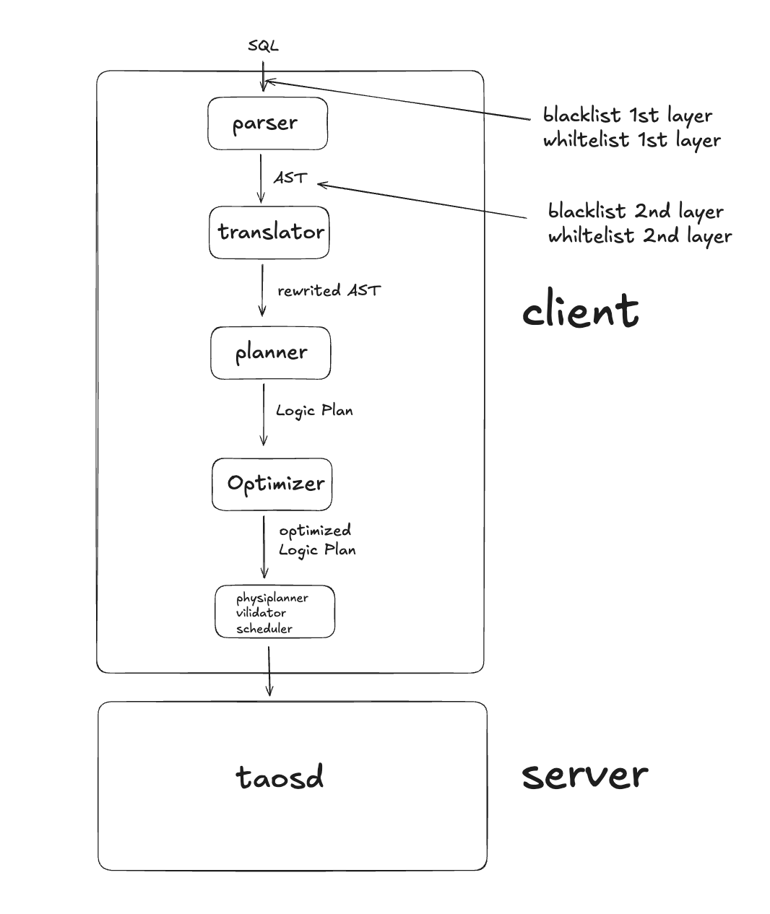

# 防 SQL 注入 - FS

## 1. 修订记录

| 日期 | 版本 | 负责人 | 主要修改内容 |
| --- | --- | --- | --- |
| 2026-01-20 | 1.0 | 彭荣坤 | 创建文档 |

## 2. 背景

本文档旨在详细描述 TDengine 数据库系统中防止 SQL 注入的安全设计方案，通过多层次防护机制确保数据库免受 SQL 注入攻击，保障数据安全和系统稳定。

## 3. 定义

| 术语 | 解释 |
| --- | --- |
| **SQL 注入** | 一种通过在 SQL 语句中插入恶意代码，从而欺骗数据库执行非预期操作的攻击方式 |
| **参数绑定** | 在 SQL 语句中使用占位符替代具体值的技术，可以防止 SQL 注入并提高性能 |
| **黑名单机制** | 在 SQL 构造或执行前，通过拒绝一组被认为“危险”的模式、关键字、结构或行为，来试图阻止 SQL 注入的防御策略 |
| **白名单机制** | 在 SQL 构造或执行前，通过只允许一组被明确定义为“安全且必要”的 SQL 结构、参数形式或行为，其余一律拒绝，从而防止 SQL 注入的防御策略 |

## 4. 行为说明

### 4.1 基本工作原理

TDengine SQL 黑白名单功能提供多层防护机制，用于防止 SQL 注入攻击和限制非法 SQL 执行。系统支持两种工作模式：
- **黑名单模式（Blacklist Mode）**：默认模式，拒绝匹配规则的 SQL
- **白名单模式（Whitelist Mode）**：仅允许匹配规则的 SQL

#### 4.1.1 架构介绍

TDengine的客户端架构如下图所示，根据结构设计了两层过滤功能：
1. 第一层是在SQL解析之前进行字符串级别的过滤，该层是基于原始 SQL 字符串的正则表达式匹配，实现快速过滤明显恶意模式，减少后续处理开销
2. 第二层是SQL解析称为AST抽象语法树之后进行过滤，该层基于 SQL 语法结构进行精确检查，能够理解 SQL 的语法结构，不受格式化影响


#### 4.1.2 第一层过滤说明

**位置**：`buildRequest()` 之后，SQL 解析之前
**目的**：快速过滤明显恶意模式，减少后续处理开销
**功能：**
1. 关键字黑名单检查**：**检测危险 SQL 关键字组合，例如：`UNION SELECT`、`DROP TABLE`、`DELETE FROM` 等
2. 注释注入检测**：**检测 SQL 注释符号：`--`、`/* */`，防止通过注释绕过检查
3. 编码绕过检测**：**检测常见的编码绕过尝试，例如：十六进制编码、Unicode 编码等
4. 长度限制检查**：**检测异常长的 SQL 语句，防止缓冲区溢出攻击
**实现方式：**字符串级别检查，使用 PCRE（Perl Compatible Regular Expressions）库或类似实现，根据allow/deny的规则对匹配到的字符串进行相应操作
**示例：**
```sql {wrap}

-- 以下 SQL 会在字符串级别被拒绝：
-- 1. UNION SELECT 注入
SELECT * FROM t UNION SELECT * FROM t2

-- 2. 注释注入
SELECT * FROM t WHERE id=1 -- OR 1=1

-- 3. 危险函数调用
SELECT LOAD_FILE('/etc/passwd')

-- 4. DROP 语句
DROP TABLE important_table
```

#### 4.1.3 第二层过滤说明

**位置**：`qAnalyseSqlSemantic()` 之后，`translate()` 之前
**目的**：基于 SQL 语法结构进行精确检查，不受格式化影响
**实现方式： **使用 `nodesWalkQuery`等函数遍历 AST，在此基础上实现安全检查。
```java {wrap}
static EDealRes astNodeChecker(SNode* pNode, void* pContext) {
  SSqlASTCheckContext* pCxt = (SSqlASTCheckContext*)pContext;
  
  if (pNode == NULL) {
    return DEAL_RES_CONTINUE;
  }
  
  ENodeType nodeType = nodeType(pNode);
  
  // 检查 SELECT 语句
  if (nodeType == QUERY_NODE_SELECT_STMT) {
    SSelectStmt* pSelect = (SSelectStmt*)pNode;
    
    // 检查 WHERE 子句
    if (pSelect->pWhere != NULL) {
      EDealRes res = checkWhereClause(pSelect->pWhere, pCxt);
      if (res == DEAL_RES_ERROR) {
        return res;
      }
    }
    
    // 检查 HAVING 子句
    if (pSelect->pHaving != NULL) {
      EDealRes res = checkHavingClause(pSelect->pHaving, pCxt);
      if (res == DEAL_RES_ERROR) {
        return res;
      }
    }
    
    // 检查 JOIN 条件
    if (pSelect->pFromTable != NULL) {
      EDealRes res = checkJoinConditions(pSelect->pFromTable, pCxt);
      if (res == DEAL_RES_ERROR) {
        return res;
      }
    }
  }
  
  // 检查逻辑条件节点（AND/OR）
  if (nodeType == QUERY_NODE_LOGIC_CONDITION) {
    EDealRes res = checkLogicCondition((SLogicConditionNode*)pNode, pCxt);
    if (res == DEAL_RES_ERROR) {
      return res;
    }
  }
  
  // 检查操作符节点
  if (nodeType == QUERY_NODE_OPERATOR) {
    EDealRes res = checkOperator((SOperatorNode*)pNode, pCxt);
    if (res == DEAL_RES_ERROR) {
      return res;
    }
  }
  
  // 检查函数节点
  if (nodeType == QUERY_NODE_FUNCTION) {
    EDealRes res = checkFunction((SFunctionNode*)pNode, pCxt);
    if (res == DEAL_RES_ERROR) {
      return res;
    }
  }
  
  // 检查子查询
  if (nodeType == QUERY_NODE_TEMP_TABLE) {
    STempTableNode* pTempTable = (STempTableNode*)pNode;
    if (pTempTable->pSubquery != NULL) {
      EDealRes res = checkSubquery(pTempTable->pSubquery, pCxt);
      if (res == DEAL_RES_ERROR) {
        return res;
      }
    }
  }
  
  // 继续遍历子节点
  return DEAL_RES_CONTINUE;
}
```

**功能**
   - WHERE 条件安全检查：检测 `OR 1=1`、`OR 1=2` 等恒真/恒假条件、 `AND 1=1` 等冗余条件、嵌套的复杂条件注入
1. 函数调用安全检查：检测危险函数：`LOAD_FILE`、`INTO OUTFILE`、`EXEC` 等，检测系统函数的不当使用，检测用户定义函数的权限
2. 操作符安全检查：检测逻辑操作符的异常组合、比较操作符的异常使用、检测位操作符的潜在风险
3. 子查询安全检查：检测嵌套子查询的深度、相关子查询的异常模式、`EXISTS/IN `子查询的注入
4. JOIN 安全检查：检测异常的 JOIN 条件、笛卡尔积风险、JOIN 注入攻击
5. 表名和列名验证：验证表名是否符合命名规范、列名是否存在、表名/列名注入
**示例：**
```sql
-- 以下 SQL 会在 AST 级别被拒绝：

-- 1. OR 1=1 注入（精确检测）
SELECT * FROM t WHERE id=1 OR 1=1
SELECT * FROM t WHERE id=1 OR 1 = 1
SELECT * FROM t WHERE id=1 or 1=1  -- 大小写不敏感
SELECT * FROM t WHERE id=1 OR /*comment*/ 1=1  -- 不受注释影响

-- 2. 恒真条件
SELECT * FROM t WHERE 1=1
SELECT * FROM t WHERE 'a'='a'
SELECT * FROM t WHERE TRUE

-- 3. 危险函数
SELECT LOAD_FILE('/etc/passwd')
SELECT INTO OUTFILE '/tmp/data.txt' FROM t

-- 4. 异常 JOIN 条件
SELECT * FROM t1 JOIN t2 ON 1=1

-- 5. 深度嵌套子查询（超过限制）
SELECT * FROM t WHERE id IN (
  SELECT id FROM t2 WHERE id IN (
    SELECT id FROM t3 WHERE id IN (...)
  )
)
```

### 4.2 SQL安全的用户配置项

#### 4.2.1 配置项内容

黑白名单配置是通过服务端进行的，生效的范围是所有用户和连接，默认启动初始化数据库时一同配置，在taos.cfg中配置客户端级别的配置项：
```plaintext {wrap}
sqlSecurity              true              # 是否启用 SQL 安全检查，默认 false
sqlSecurityWhitelistMode 0       # 0表示黑白名单禁用模式，1表示仅使用白名单模式，2表示仅使用黑名单模式，3表示黑白名单都使用
sqlSecurityStringCheck  true                 # 启用字符串级别检查，默认 true
sqlSecurityASTCheck      true                 # 启用 AST 级别检查，默认 true
sqlSecurityRuleFile      /etc/taos/sql_rules.json  # 规则文件路径

## 5. 白名单相关配置

whitelistLearning 1 #启用学习模式
whitelistLearningPeriod 7    # 记录时间长度为7天
whitelistLearningThreshold 10. # 超过10条后记录进入白名单，并持久化下来
```

用户可以在数据库启动之前在文件` /etc/taos/sql_rules.json`中添加自定义正则表达式，手动配置黑名单和白名单的SQL。该规则是第一层过滤时生效，在SQL解析之前进行过滤，详细见4.1
```json {wrap}
{
  "version": "1.0",
  "rules": [
    {
      "ruleId": 1,
      "ruleName": "OR_1_EQUAL_1",
      "action": "DENY",
      "priority": "HIGH",
      "pattern": "(?i)\bwhere\b[\s\S]*?\bor\b\s*1\s*=\s*1\b",
      "description": "禁止 WHERE 条件中的 OR 1=1 模式",
      "enabled": true
    },
    {
      "ruleId": 2,
      "ruleName": "UNION_SELECT_INJECTION",
      "action": "DENY",
      "priority": "HIGH",
      "pattern": "(?i)\\bunion\\s+select\\b",
      "description": "禁止 UNION SELECT 注入攻击",
      "enabled": true
    },
    {
      "ruleId": 3,
      "ruleName": "ALLOWED_SELECT_PATTERN",
      "action": "ALLOW",
      "priority": "MEDIUM",
      "pattern": "^SELECT\\s+.*\\s+FROM\\s+[a-zA-Z_][a-zA-Z0-9_]*\\s*$",
      "description": "允许基本的 SELECT 查询模式",
      "enabled": true
    }
  ]
}
```

其中：
- `atcion`：表示属于黑名单还是白名单，ALLOW表示白名单，DENY表示黑名单
- `priority`：表示优先级，分为HIGH > MIDIUM > LOW三个级别
- `pattern`：表示符合正则匹配的字符串
- `description`：表示规则的描述信息
- `enabled`：表示规则是否生效
增删改：该版本支持动态增删改规则，可以通过`alter local 'config' 'value'`进行修改

#### 5.0.1 配置项安全管理

`sql_rules.json` 和`taos.cfg` 的文件会在同时本地存储的配置项可以通过 taosk 生成的密钥加密，想要修改配置参数只能通过SQL的 alter 命令（包含权限检查），这样的组合就保证了配置参数无法被随意篡改。具体的原理和使用方式可以参考：[存储安全 FS](https://taosdata.feishu.cn/wiki/KojBwzktkihgLRk2YIocWwFInxb)
`taos.cfg` 中的相关SQL安全配置项只在taosd第一次启动的时候被加载进数据库中，之后即使对文件进行修改或者替换，都无法生效，必须通过上述taosk的机制对配置项进行修改和查询。
客户端第一次连接服务端的时候会获取到配置参数，并且保存在客户端缓存中，如果配置项有更新，需要等待客户端的下一次心跳获取到更新后的值，存在一个心跳周期的延迟。配置项不在客户端进行持久化存储，当客户端重新启动时，需要重新去服务端拉去配置信息。

### 5.1 白名自动学习模式

学习模式可以自动学习正常 SQL 模式，生成白名单规则。

#### 5.1.1 工作流程

**1. 白名单收集阶段：**系统记录所有执行的 SQL 语句，统计每个 SQL 模式的执行次数，记录 SQL 的执行上下文（用户、数据库、时间等）
```sql {wrap}
-- 先关闭白名单，保证SQL能正常写入
ALTER LOCAL 'sqlSecurityWhitelistMode' '0';
-- 启用学习模式
ALTER LOCAL 'whitelistLearning' '1';
-- 记录时间长度为7天
ALTER LOCAL 'whitelistLearningPeriod' '7';
-- 超过阈值10次之后再进行记录
ALTER LOCAL 'whitelistLearningThreshold' '10';
```

**2. SQL分析阶段：**分析 SQL 模式的特征，识别正常业务 SQL 模式，排除异常和攻击模式
```sql {wrap}
-- 正常写入sql
SELECT * FROM sensors WHERE ts > now() - 1h
SELECT avg(temperature) FROM sensors WHERE device_id = 'D001'
SELECT * FROM sensors WHERE ts BETWEEN '2024-01-01' AND '2024-01-02'
```

**3. 自动生成规则阶段：**自动生成白名单规则，规则包含 SQL 模式、执行上下文等，规则优先级根据执行频率设置，白名单规则自动保存在`/etc/taos/sql_rules.json`
```sql {wrap}
-- 规则 1: 允许 SELECT * FROM sensors WHERE ts > ...
-- 规则 2: 允许 SELECT avg(...) FROM sensors WHERE device_id = ...
-- 规则 3: 允许 SELECT * FROM sensors WHERE ts BETWEEN ... AND ...
```

**4. 保护阶段：**启动白名单功能，根据生成的规则，对白名单之外的SQL进行屏蔽
```sql {wrap}
ALTER local 'sqlSecurityWhitelistMode' '1';
```

### 5.2 黑名单屏蔽常见的SQL注入

常见的SQl注入有以下几种：
1. 恒真条件注入
绕过 WHERE 条件、返回更多数据
```sql {wrap}

OR <恒真表达式>
AND <恒假表达式>
-- 例子
OR 1=1
OR TRUE
OR 'a'='a'
OR 0=0
AND 1=0
AND FALSE
```

1. UNION 结果集拼接注入
  把“不属于当前查询语义的数据”拼进结果集，导致跨表 / 跨语义数据泄露
```sql {wrap}

UNION SELECT
UNION ALL SELECT
```

1. 注释截断注入
截断原 SQL 后半部分，破坏语义
```sql {wrap}

-- 典型字符
--
##
/* ... */
```

1. 多语句注入
执行额外的SQL，可能产生非预期操作
```sql {wrap}
; SELECT
; UPDATE
; DROP
```

1. 系统表/元数据探测
information_schema、performance_schema库以及其中的表
1. 子查询/EXISTS
通过子查询构造恒真/恒假条件
```sql {wrap}
EXISTS (SELECT …)
IN (SELECT …)
```

1. 编码混淆
  绕过简单字符串检测，从而绕过第一层正则匹配式的检测，常见的编码方式有：URL 编码 %27、十六进制 0x、Unicode 变体、大小写混合
1. 权限和用户相关操作
可能导致提升权限、破坏系统
```sql {wrap}
DROP
ALTER
GRANT
REVOKE
```

### 5.3 **审计功能和日志记录**

系统会记录所有安全相关事件，包括：
1. 被拒绝的 SQL 语句
2. 触发的安全规则
3. 学习模式添加进入规则的SQL语句
日志信息复用TSC的cDebugFlag，对于黑名单过滤掉的SQL采取WARN日志级别，对于白名单过滤掉的SQL采用DEBUG日志级别，学习模式添加进入规则的SQL语句采用INFO日志级别，日志保存在taoslog中。

### 5.4 规则优先级

1. 如果采用白名单和黑名单模式，同等优先级的规则下，黑名单优先级 > 白名单优先级，也就是如果一个SQL即在白名单里又在黑名单里，且设置的优先级级别相同，那么该SQL会被拒绝执行
2. 如果采用白名单和黑名单模式，不同优先级的规则，遵循优先级高的那条
3. 如果只采用白名单模式，且SQL没有匹配任何白名单规则，则拒绝执行
4. 如果只采用黑名单模式，SQL没有匹配任何黑名单规则，可以正常执行，如果匹配到黑名单，会被拒绝执行

## 6. 性能

- 关闭黑白名单不影响性能，打开黑白名单会导致性能略微下降
- 性能有几个点可以优化：
   - 高优先级的条件先检查
   - 对解析之后AST进行缓存

## 7. 兼容性

- 无

## 8. 运维

- 无

## 9. 使用场景

- 无

## 10. 可观测性

- 无

## 11. 安装和卸载

- 无特殊要求

## 12. 文档

- 仅用于安可

## 13. 参考文档

## 14. 附录
