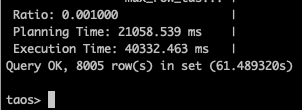
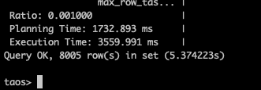
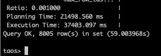
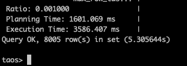
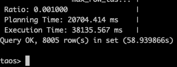
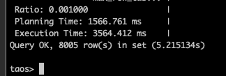
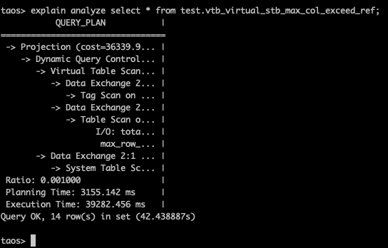
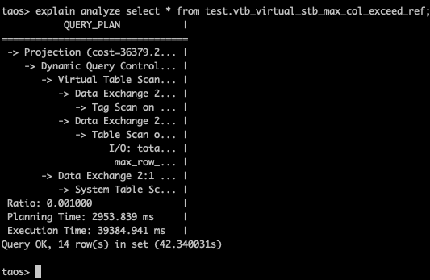

# [6690002267] 优化虚拟表列多/原始表数量多时的查询性能

### 1. 测试背景

### 2. 环境准备

1. 环境准备
2. CPU 信息：
  ```yaml
  $ lscpu
  Architecture:                x86_64
    CPU op-mode(s):            32-bit, 64-bit
    Address sizes:             46 bits physical, 48 bits virtual
    Byte Order:                Little Endian
  CPU(s):                      72
    On-line CPU(s) list:       0-71
  Vendor ID:                   GenuineIntel
    Model name:                Intel(R) Xeon(R) CPU E5-2686 v4 @ 2.30GHz
      CPU family:              6
      Model:                   79
      Thread(s) per core:      2
      Core(s) per socket:      18
      Socket(s):               2
      Stepping:                1
      CPU(s) scaling MHz:      40%
      CPU max MHz:             3000.0000
      CPU min MHz:             1200.0000
      BogoMIPS:                4588.97
      Flags:                   fpu vme de pse tsc msr pae mce cx8 apic sep mtrr pge mca cmov pat pse36 clflush dts acpi mmx fxsr sse sse2 ss ht tm pbe syscall nx pdpe1gb rdtscp lm constant_tsc arch_perfmon pebs bts rep_good nopl xtopology nonstop_tsc cpuid aperfmperf pni pc
                               lmulqdq dtes64 monitor ds_cpl vmx smx est tm2 ssse3 sdbg fma cx16 xtpr pdcm pcid dca sse4_1 sse4_2 x2apic movbe popcnt tsc_deadline_timer aes xsave avx f16c rdrand lahf_lm abm 3dnowprefetch cpuid_fault epb cat_l3 cdp_l3 pti intel_ppin ssbd ibr
                               s ibpb stibp tpr_shadow flexpriority ept vpid ept_ad fsgsbase tsc_adjust bmi1 hle avx2 smep bmi2 erms invpcid rtm cqm rdt_a rdseed adx smap intel_pt xsaveopt cqm_llc cqm_occup_llc cqm_mbm_total cqm_mbm_local dtherm ida arat pln pts vnmi md_cle
                               ar flush_l1d
  Virtualization features:
    Virtualization:            VT-x
  Caches (sum of all):
    L1d:                       1.1 MiB (36 instances)
    L1i:                       1.1 MiB (36 instances)
    L2:                        9 MiB (36 instances)
    L3:                        90 MiB (2 instances)
  NUMA:
    NUMA node(s):              1
    NUMA node0 CPU(s):         0-71
  Vulnerabilities:
    Gather data sampling:      Not affected
    Ghostwrite:                Not affected
    Indirect target selection: Not affected
    Itlb multihit:             KVM: Mitigation: Split huge pages
    L1tf:                      Mitigation; PTE Inversion; VMX conditional cache flushes, SMT vulnerable
    Mds:                       Mitigation; Clear CPU buffers; SMT vulnerable
    Meltdown:                  Mitigation; PTI
    Mmio stale data:           Mitigation; Clear CPU buffers; SMT vulnerable
    Reg file data sampling:    Not affected
    Retbleed:                  Not affected
    Spec rstack overflow:      Not affected
    Spec store bypass:         Mitigation; Speculative Store Bypass disabled via prctl
    Spectre v1:                Mitigation; usercopy/swapgs barriers and __user pointer sanitization
    Spectre v2:                Mitigation; Retpolines; IBPB conditional; IBRS_FW; STIBP conditional; RSB filling; PBRSB-eIBRS Not affected; BHI Not affected
    Srbds:                     Not affected
    Tsx async abort:           Mitigation; Clear CPU buffers; SMT vulnerable
  ```

1. 内存信息：
  ```sql
  free -h
                 total        used        free      shared  buff/cache   available
  Mem:            62Gi       2.1Gi        50Gi        14Mi        10Gi        60Gi
  Swap:          8.0Gi          0B       8.0Gi
  ```

1. 磁盘信息：
  ```bash
  lsblk
  
  NAME        MAJ:MIN RM   SIZE RO TYPE MOUNTPOINTS
  loop0         7:0    0  63.8M  1 loop /snap/core20/2669
  loop1         7:1    0     4K  1 loop /snap/bare/5
  loop2         7:2    0  73.9M  1 loop /snap/core22/2133
  loop3         7:3    0  73.9M  1 loop /snap/core22/2045
  loop4         7:4    0  11.1M  1 loop /snap/firmware-updater/167
  loop6         7:6    0   516M  1 loop /snap/gnome-42-2204/202
  loop7         7:7    0   1.7M  1 loop /snap/jump/81
  loop8         7:8    0  91.7M  1 loop /snap/gtk-common-themes/1535
  loop9         7:9    0  10.8M  1 loop /snap/snap-store/1270
  loop10        7:10   0  49.3M  1 loop /snap/snapd/24792
  loop11        7:11   0  50.8M  1 loop /snap/snapd/25202
  loop12        7:12   0   576K  1 loop /snap/snapd-desktop-integration/315
  loop13        7:13   0 516.2M  1 loop /snap/gnome-42-2204/226
  loop14        7:14   0 247.6M  1 loop /snap/firefox/6966
  loop15        7:15   0  18.5M  1 loop /snap/firmware-updater/210
  loop16        7:16   0 248.8M  1 loop /snap/firefox/7024
  nvme0n1     259:0    0 476.9G  0 disk
  ├─nvme0n1p1 259:1    0     1G  0 part /boot/efi
  └─nvme0n1p2 259:2    0 475.9G  0 part /
  ```

1. 操作系统信息：
  ```bash
  uname -a
  Linux simon-X99 6.14.0-35-generic #35~24.04.1-Ubuntu SMP PREEMPT_DYNAMIC Tue Oct 14 13:55:17 UTC 2 x86_64 x86_64 x86_64 GNU/Linux
  ```

### 3. 数据准备

1. 原始表数据准备
  ```bash
  taosBenchmark -n 1000 -t 3000
  ```

1. 使用如下脚本生成虚拟表创建语句，得到 create_vtable.sql：
  ```bash
  #!/usr/bin/env bash
  
  OUTPUT_FILE="create_vtable.sql"
  
  {
    printf "CREATE VTABLE \`vtb_virtual_ntb_max_col_exceed_ref\` (ts timestamp"
  
    for ((i=0; i<32766; i++)); do
      printf ", col_%d int from d%d.voltage" "$i" "$((i % 2000))"
    done
  
    printf ");\n"
  
    printf "CREATE STABLE \`vtb_virtual_stb_max_col_exceed_ref\` (ts timestamp"
  
    for ((i=0; i<32763; i++)); do
      printf ", col_%d int" "$i"
    done
  
    printf ") TAGS (tint int) virtual 1;\n"
  
    printf "CREATE VTABLE \`vtb_virtual_ctb_max_col_exceed_ref\` (col_1 from d0.voltage"
  
    for ((i=1; i<32763; i++)); do
      printf ", col_%d from d%d.voltage" "$i" "$((i % 2000))"
    done
  
    printf ") using vtb_virtual_stb_max_col_exceed_ref tags (1);\n"
  
  } > "${OUTPUT_FILE}"
  
  
  echo "SQL written to ${OUTPUT_FILE}"
  echo "Total columns: 32766"
  ```

1. 在 taosc 中执行虚拟表创建语句
  ```sql
  source /home/simon/taosdata/insertJson/6570595001/create_vtable.sql;
  ```

1. 执行虚拟表查询语句：
  ```bash
  explain analyze select * from test.vtb_virtual_ntb_max_col_exceed_ref;
  explain analyze select * from test.vtb_virtual_stb_max_col_exceed_ref;
  ```

### 4. 测试结果

1. 虚拟普通表/虚拟子表查询

  | 优化前 | 优化后 | 优化前 | 优化后 |
| --- | --- | --- | --- |
| 61.489320s | 5.374223s |  |  |
| 59.003968s | 5.305644s |  |  |
| 58.939866s | 5.215134s |  |  |

1. 虚拟超级表查询

  | 优化前 | 优化后 | 优化前 | 优化后 |
| --- | --- | --- | --- |
| - | 42.438887s |  |
| - | 41.989471s |  |
| - | 42.3400315 |  |

### 5. 测试总结

1. 对于虚拟普通表/虚拟子表的场景，有大概 12 倍的性能提升，并且客户端的开销大幅减少。
2. 对于虚拟超级表的场景，优化前需要等400+s，并且内存占用太高还会报错。优化后只需 42s。
