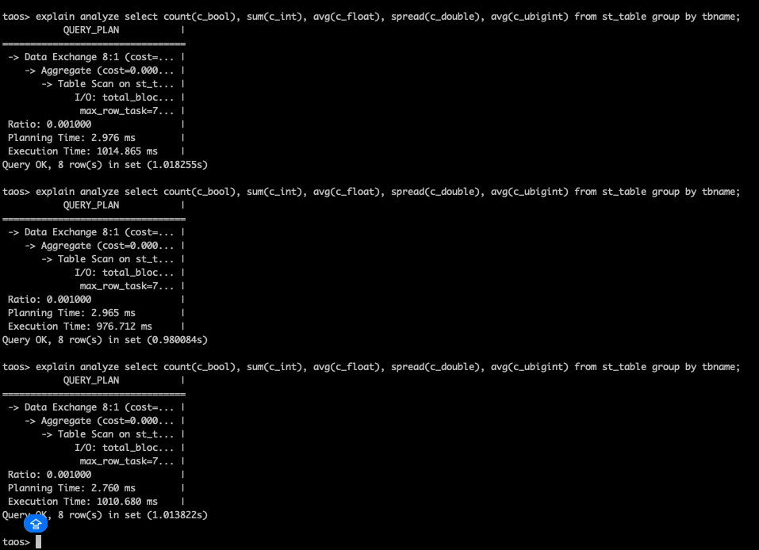
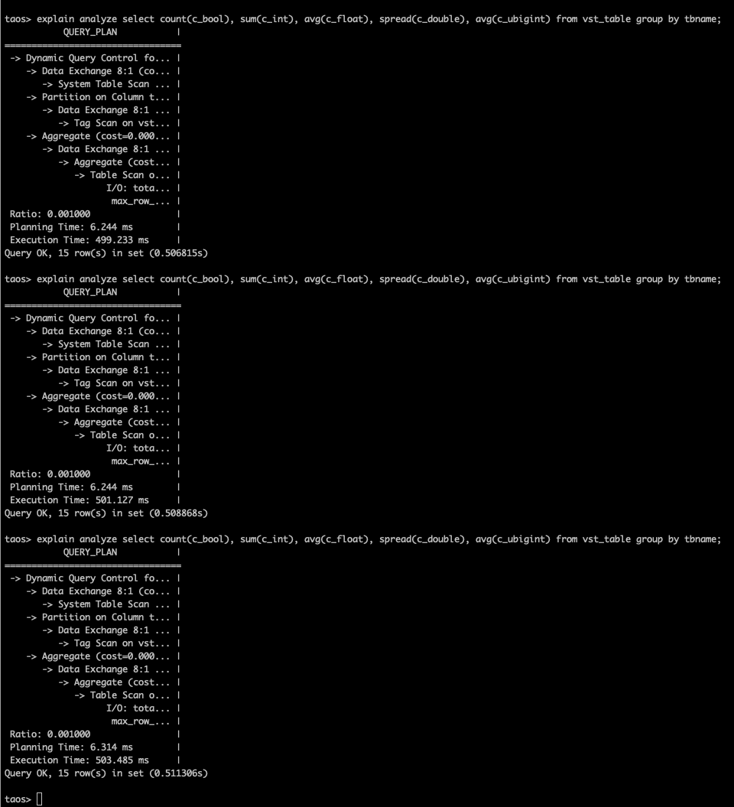
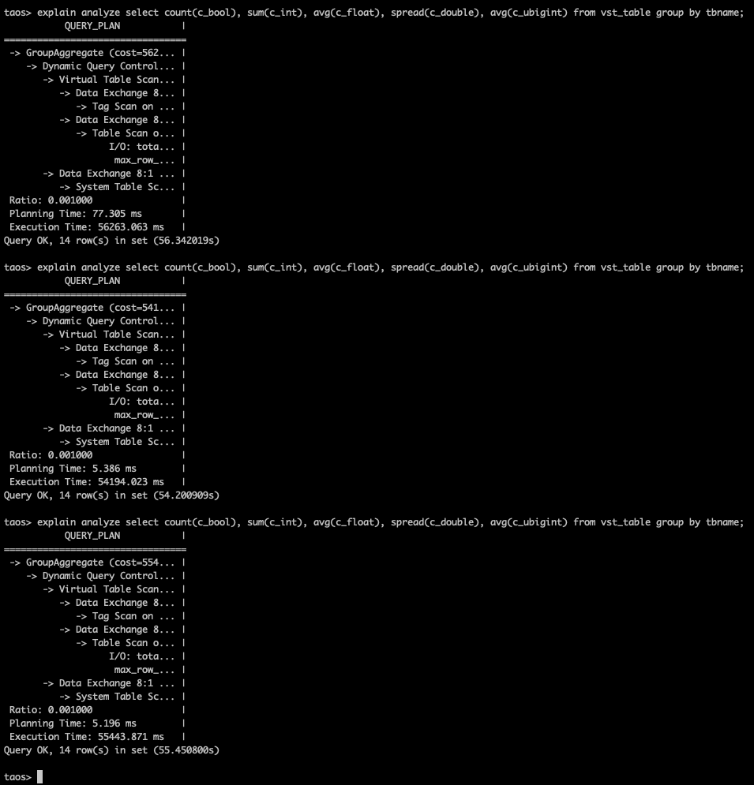
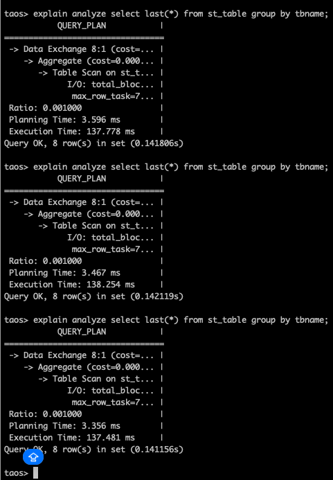
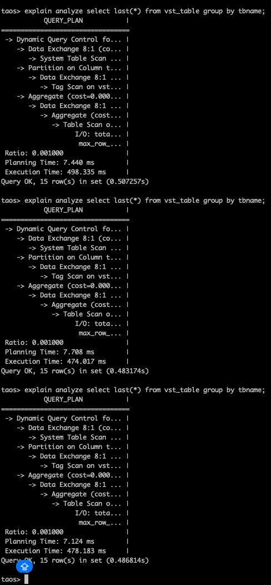
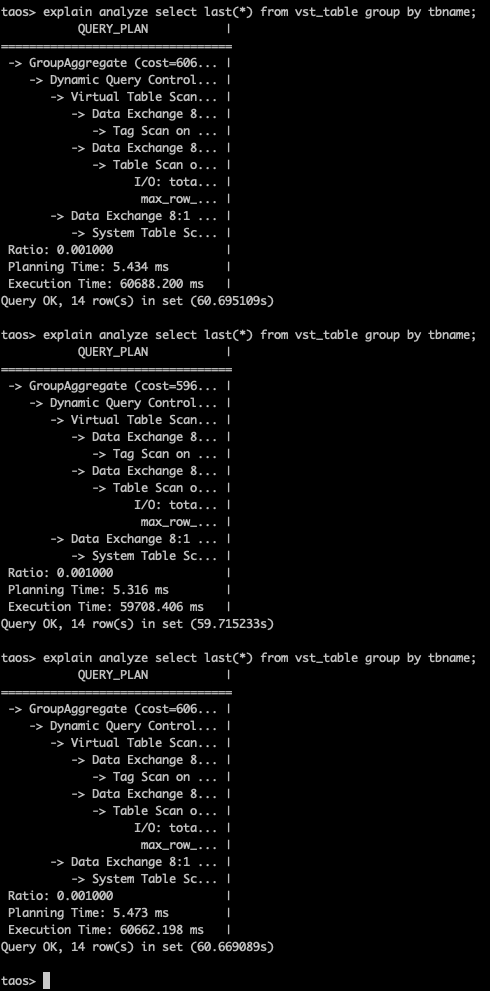
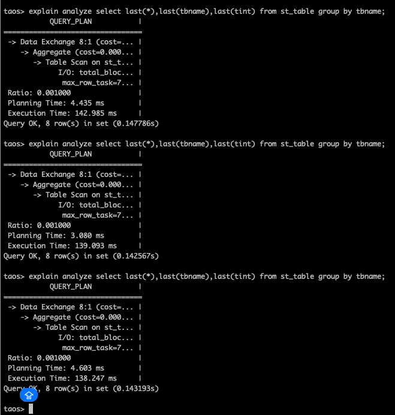
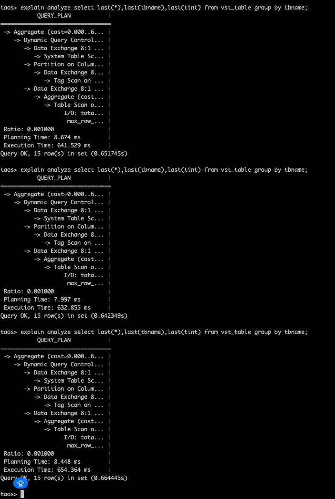
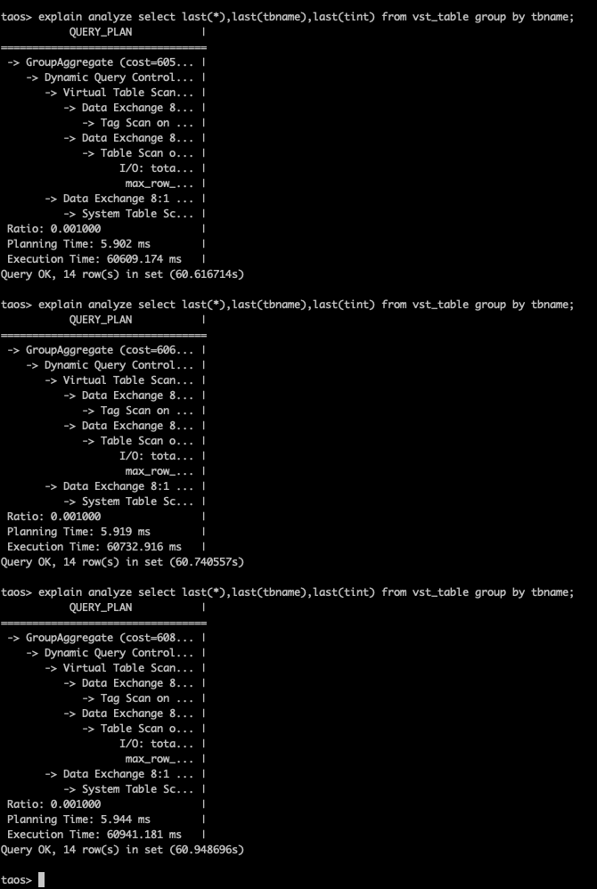

# [6922189593] 虚拟超级表聚合/选择函数查询 + group by 语句性能优化

## 1. 测试背景

测试针对  的优化效果

## 2. 测试方法

### 2.1 环境准备

1. CPU 信息：
  ```yaml
  $ lscpu
  Architecture:                x86_64
    CPU op-mode(s):            32-bit, 64-bit
    Address sizes:             46 bits physical, 48 bits virtual
    Byte Order:                Little Endian
  CPU(s):                      72
    On-line CPU(s) list:       0-71
  Vendor ID:                   GenuineIntel
    Model name:                Intel(R) Xeon(R) CPU E5-2686 v4 @ 2.30GHz
      CPU family:              6
      Model:                   79
      Thread(s) per core:      2
      Core(s) per socket:      18
      Socket(s):               2
      Stepping:                1
      CPU(s) scaling MHz:      40%
      CPU max MHz:             3000.0000
      CPU min MHz:             1200.0000
      BogoMIPS:                4588.97
      Flags:                   fpu vme de pse tsc msr pae mce cx8 apic sep mtrr pge mca cmov pat pse36 clflush dts acpi mmx fxsr sse sse2 ss ht tm pbe syscall nx pdpe1gb rdtscp lm constant_tsc arch_perfmon pebs bts rep_good nopl xtopology nonstop_tsc cpuid aperfmperf pni pc
                               lmulqdq dtes64 monitor ds_cpl vmx smx est tm2 ssse3 sdbg fma cx16 xtpr pdcm pcid dca sse4_1 sse4_2 x2apic movbe popcnt tsc_deadline_timer aes xsave avx f16c rdrand lahf_lm abm 3dnowprefetch cpuid_fault epb cat_l3 cdp_l3 pti intel_ppin ssbd ibr
                               s ibpb stibp tpr_shadow flexpriority ept vpid ept_ad fsgsbase tsc_adjust bmi1 hle avx2 smep bmi2 erms invpcid rtm cqm rdt_a rdseed adx smap intel_pt xsaveopt cqm_llc cqm_occup_llc cqm_mbm_total cqm_mbm_local dtherm ida arat pln pts vnmi md_cle
                               ar flush_l1d
  Virtualization features:
    Virtualization:            VT-x
  Caches (sum of all):
    L1d:                       1.1 MiB (36 instances)
    L1i:                       1.1 MiB (36 instances)
    L2:                        9 MiB (36 instances)
    L3:                        90 MiB (2 instances)
  NUMA:
    NUMA node(s):              1
    NUMA node0 CPU(s):         0-71
  Vulnerabilities:
    Gather data sampling:      Not affected
    Ghostwrite:                Not affected
    Indirect target selection: Not affected
    Itlb multihit:             KVM: Mitigation: Split huge pages
    L1tf:                      Mitigation; PTE Inversion; VMX conditional cache flushes, SMT vulnerable
    Mds:                       Mitigation; Clear CPU buffers; SMT vulnerable
    Meltdown:                  Mitigation; PTI
    Mmio stale data:           Mitigation; Clear CPU buffers; SMT vulnerable
    Reg file data sampling:    Not affected
    Retbleed:                  Not affected
    Spec rstack overflow:      Not affected
    Spec store bypass:         Mitigation; Speculative Store Bypass disabled via prctl
    Spectre v1:                Mitigation; usercopy/swapgs barriers and __user pointer sanitization
    Spectre v2:                Mitigation; Retpolines; IBPB conditional; IBRS_FW; STIBP conditional; RSB filling; PBRSB-eIBRS Not affected; BHI Not affected
    Srbds:                     Not affected
    Tsx async abort:           Mitigation; Clear CPU buffers; SMT vulnerable
  ```

1. 内存信息：
  ```sql
  free -h
                 total        used        free      shared  buff/cache   available
  Mem:            62Gi       2.1Gi        50Gi        14Mi        10Gi        60Gi
  Swap:          8.0Gi          0B       8.0Gi
  ```

1. 磁盘信息：
  ```bash
  lsblk
  
  NAME        MAJ:MIN RM   SIZE RO TYPE MOUNTPOINTS
  loop0         7:0    0  63.8M  1 loop /snap/core20/2669
  loop1         7:1    0     4K  1 loop /snap/bare/5
  loop2         7:2    0  73.9M  1 loop /snap/core22/2133
  loop3         7:3    0  73.9M  1 loop /snap/core22/2045
  loop4         7:4    0  11.1M  1 loop /snap/firmware-updater/167
  loop6         7:6    0   516M  1 loop /snap/gnome-42-2204/202
  loop7         7:7    0   1.7M  1 loop /snap/jump/81
  loop8         7:8    0  91.7M  1 loop /snap/gtk-common-themes/1535
  loop9         7:9    0  10.8M  1 loop /snap/snap-store/1270
  loop10        7:10   0  49.3M  1 loop /snap/snapd/24792
  loop11        7:11   0  50.8M  1 loop /snap/snapd/25202
  loop12        7:12   0   576K  1 loop /snap/snapd-desktop-integration/315
  loop13        7:13   0 516.2M  1 loop /snap/gnome-42-2204/226
  loop14        7:14   0 247.6M  1 loop /snap/firefox/6966
  loop15        7:15   0  18.5M  1 loop /snap/firmware-updater/210
  loop16        7:16   0 248.8M  1 loop /snap/firefox/7024
  nvme0n1     259:0    0 476.9G  0 disk
  ├─nvme0n1p1 259:1    0     1G  0 part /boot/efi
  └─nvme0n1p2 259:2    0 475.9G  0 part /
  ```

1. 操作系统信息：
  ```sql
  uname -a
  Linux simon-X99 6.14.0-33-generic #33~24.04.1-Ubuntu SMP PREEMPT_DYNAMIC Fri Sep 19 17:02:30 UTC 2 x86_64 x86_64 x86_64 GNU/Linux
  ```

### 2.2 数据准备

每个虚拟超级表有 100 个虚拟子表，每个虚拟子表有 6 列，其中非 ts 的 5 列分别来自 5 张不同的子表。
1. 原始表数据准备：insert.json
  ```json
  {
    "filetype": "insert",
    "cfgdir": "/etc/taos",
    "host": "127.0.0.1",
    "port": 6030,
    "user": "root",
    "password": "taosdata",
    "connection_pool_size": 8,
    "thread_count": 60,
    "create_table_thread_count": 4,
    "result_file": "./insert_res.txt",
    "confirm_parameter_prompt": "no",
    "num_of_records_per_req": 1000000,
    "prepared_rand": 10000,
    "chinese": "no",
    "escape_character": "yes",
    "continue_if_fail": "no",
    "databases": [
      {
        "dbinfo": {
          "name": "test_vtable_perf",
          "drop": "yes",
          "vgroups": 8,
          "precision": "ms"
        },
        "super_tables": [
          {
            "name": "stb_bool",
            "child_table_exists": "no",
            "childtable_count": 100,
            "childtable_prefix": "ctb_bool",
            "auto_create_table": "no",
            "batch_create_tbl_num": 5,
            "data_source": "rand",
            "insert_mode": "taosc",
            "non_stop_mode": "no",
            "line_protocol": "line",
            "insert_rows": 100000,
            "childtable_limit": 0,
            "childtable_offset": 0,
            "interlace_rows": 0,
            "insert_interval": 0,
            "partial_col_num": 0,
            "timestamp_step": 5,
            "start_timestamp": "2020-10-01 00:00:00.000",
            "sample_format": "csv",
            "sample_file": "./sample.csv",
            "use_sample_ts": "no",
            "tags_file": "",
            "columns": [
              {"type": "bool", "name": "bool_col", "count": 1, "max": 1, "min": 0 }
            ],
            "tags": [
              {"type": "TINYINT", "name": "groupid", "max": 10, "min": 1}
            ]
          },
          {
            "name": "stb_int",
            "child_table_exists": "no",
            "childtable_count": 100,
            "childtable_prefix": "ctb_int",
            "auto_create_table": "no",
            "batch_create_tbl_num": 5,
            "data_source": "rand",
            "insert_mode": "taosc",
            "non_stop_mode": "no",
            "line_protocol": "line",
            "insert_rows": 100000,
            "childtable_limit": 0,
            "childtable_offset": 0,
            "interlace_rows": 0,
            "insert_interval": 0,
            "partial_col_num": 0,
            "timestamp_step": 5,
            "start_timestamp": "2020-10-01 00:00:00.000",
            "sample_format": "csv",
            "sample_file": "./sample.csv",
            "use_sample_ts": "no",
            "tags_file": "",
            "columns": [
              {"type": "int", "name": "int_col", "count": 1, "max": 2147483647, "min": -2147483648 }
            ],
            "tags": [
              {"type": "TINYINT", "name": "groupid", "max": 10, "min": 1}
            ]
          },
          {
            "name": "stb_float",
            "child_table_exists": "no",
            "childtable_count": 100,
            "childtable_prefix": "ctb_float",
            "auto_create_table": "no",
            "batch_create_tbl_num": 5,
            "data_source": "rand",
            "insert_mode": "taosc",
            "non_stop_mode": "no",
            "line_protocol": "line",
            "insert_rows": 100000,
            "childtable_limit": 0,
            "childtable_offset": 0,
            "interlace_rows": 0,
            "insert_interval": 0,
            "partial_col_num": 0,
            "timestamp_step": 5,
            "start_timestamp": "2020-10-01 00:00:00.000",
            "sample_format": "csv",
            "sample_file": "./sample.csv",
            "use_sample_ts": "no",
            "tags_file": "",
            "columns": [
              {"type": "float", "name": "float_col", "count": 1, "max": 100000, "min": -100000 }
            ],
            "tags": [
              {"type": "TINYINT", "name": "groupid", "max": 10, "min": 1}
            ]
          },
          {
            "name": "stb_double",
            "child_table_exists": "no",
            "childtable_count": 100,
            "childtable_prefix": "ctb_double",
            "auto_create_table": "no",
            "batch_create_tbl_num": 5,
            "data_source": "rand",
            "insert_mode": "taosc",
            "non_stop_mode": "no",
            "line_protocol": "line",
            "insert_rows": 100000,
            "childtable_limit": 0,
            "childtable_offset": 0,
            "interlace_rows": 0,
            "insert_interval": 0,
            "partial_col_num": 0,
            "timestamp_step": 5,
            "start_timestamp": "2020-10-01 00:00:00.000",
            "sample_format": "csv",
            "sample_file": "./sample.csv",
            "use_sample_ts": "no",
            "tags_file": "",
            "columns": [
              {"type": "double", "name": "double_col", "count": 1, "max": 100000000, "min": -100000000 }
            ],
            "tags": [
              {"type": "TINYINT", "name": "groupid", "max": 10, "min": 1}
            ]
          },
          {
            "name": "stb_ubigint",
            "child_table_exists": "no",
            "childtable_count": 100,
            "childtable_prefix": "ctb_ubigint",
            "auto_create_table": "no",
            "batch_create_tbl_num": 5,
            "data_source": "rand",
            "insert_mode": "taosc",
            "non_stop_mode": "no",
            "line_protocol": "line",
            "insert_rows": 100000,
            "childtable_limit": 0,
            "childtable_offset": 0,
            "interlace_rows": 0,
            "insert_interval": 0,
            "partial_col_num": 0,
            "timestamp_step": 5,
            "start_timestamp": "2020-10-01 00:00:00.000",
            "sample_format": "csv",
            "sample_file": "./sample.csv",
            "use_sample_ts": "no",
            "tags_file": "",
            "columns": [
              {"type": "ubigint", "name": "u_bigint_col", "count": 1, "max": 18446744073709551615, "min": 0 }
            ],
            "tags": [
              {"type": "TINYINT", "name": "groupid", "max": 10, "min": 1}
            ]
          }
        ]
      }
    ]
  }
  ```

1. 虚拟表创建 sql 生成脚本 genVtable.sh：
  ```bash
  #!/bin/bash
  
  # 使用方法：
  # ./generate_sql.sh output.sql
  # 第一个参数是输出文件名（可选，默认 output.sql）
  #
  # 固定创建 100 个 vtable：
  # tag1：前 10 个为 0，后 10 个为 1 ... 最后 10 个为 9
  # tag2：1-100
  
  output_file=${1:-output.sql}
  count=100
  
  > "$output_file"
  
  echo "create stable vst_table (ts timestamp, c_bool bool, c_int int, c_float float, c_double double, c_ubigint bigint unsigned) tags(tint int, tchar varchar(20)) virtual 1;" >> "$output_file"
  
  for ((i=0; i<count; i++)); do
    tag1=$((i / 10))   # 0..9
    tag2=$((i))    # 1..100
  
    echo "create vtable vct_d${i} (c_bool from ctb_bool${i}.bool_col, c_int from ctb_int${i}.int_col, c_float from ctb_float${i}.float_col, c_double from ctb_double${i}.double_col, c_ubigint from ctb_ubigint${i}.u_bigint_col) using vst_table tags(${tag1}, '${tag2}');" >> "$output_file"
  done
  
  echo "✅ 已生成 ${count} 个 vtable 到文件：$output_file"
  ```

1. 与虚拟表同结构的超级表/子表创建 sql 生成脚本 genTable.sh:
  ```bash
  #!/bin/bash
  
  # 使用方法：
  # ./generate_sql.sh [输出文件名]
  # 固定创建 100 个 ct 表，并生成 insert 语句
  #
  # tag1：前 10 个为 0，后 10 个为 1 ... 最后 10 个为 9
  # tag2：1-100（写成字符串）
  
  output_file=${1:-output.sql}
  count=100
  
  > "$output_file"
  
  echo "create stable st_table (ts timestamp, c_bool bool, c_int int, c_float float, c_double double, c_ubigint bigint unsigned) tags(tint int, tchar varchar(20));" >> "$output_file"
  
  for ((i=0; i<count; i++)); do
    tag1=$((i / 10))   # 0..9
    tag2=$((i))    # 1..100
    echo "create table ct_d${i} using st_table tags(${tag1}, '${tag2}');" >> "$output_file"
  done
  
  for ((i=0; i<count; i++)); do
    echo "insert into ct_d${i} select * from vct_d${i};" >> "$output_file"
  done
  
  echo "✅ 已生成 ${count} 个 create + ${count} 个 insert 到文件：$output_file"
  ```

### 2.3 测试步骤 {folded="true"}

1. 使用 taosBenchmark + 3.1 中提供的 insert.json 生成原始表数据
```json
taosBenchmark -f insert.json
```

1. 使用 3.2 中提供的脚本 genVtable.sh 生成创建虚拟表的 sql 语句：
```json
./genVtable.sh
```

1. 执行 4.2 中生成的 sql 语句，创建虚拟表
```sql
taos> source /home/simon/taosdata/insertJson/TS-7591/output.sql;
```

1. 使用 3.3 中提供的脚本 genTable.sh 生成与虚拟表同结构的超级表/子表创建 sql
```sql
./genTtable.sh output2.sql
```

1. 执行 4.4 中生成的 sql 语句，创建对照超级表/子表，并将虚拟表的数据写入该表
```sql
taos> source /home/simon/taosdata/insertJson/TS-7591/output2.sql;
```

1. 执行测试语句，记录虚拟表查询性能

## 3. 测试结果

1. 聚合函数查询，有 group by
  ```sql
  explain analyze select count(c_bool), sum(c_int), avg(c_float), spread(c_double), avg(c_ubigint) from vst_table group by tbname;
  ```


  | 虚拟超级表（优化前） | 虚拟超级表（优化后） | 非虚拟超级表 |
| --- | --- | --- |
| 56.342019s | 0.506815s | 1.018255s |
| 54.200909s | 0.508868s | 0.980084s |
| 55.450800s | 0.511306s | 1.013822s |


  | 非虚拟超级表 |  |
| --- | --- |
| 虚拟超级表（优化后） |  |
| 虚拟超级表（优化前） |  |

1. 选择函数查询，有 group by，函数参数无 tag
  ```sql
  explain analyze select last(*) from vst_table group by tbname;
  ```


  | 虚拟超级表（优化前） | 虚拟超级表（优化后） | 非虚拟超级表 |
| --- | --- | --- |
| 60.695109s | 0.507257s | 0.141806s |
| 59.715233s | 0.483174s | 0.142119s |
| 60.669089s | 0.486814s | 0.141156s |


  | 非虚拟超级表 |  |
| --- | --- |
| 虚拟超级表（优化后） |  |
| 虚拟超级表（优化前） |  |

1. 选择函数查询，有 group by，函数参数有 tag
  ```sql
  explain analyze select last(*),last(tbname),last(tint) from vst_table group by tbname;
  ```


  | 虚拟超级表（优化前） | 虚拟超级表（优化后） | 非虚拟超级表 |
| --- | --- | --- |
| 60.616714s | 0.651745s | 0.147786s |
| 60.740557s | 0.642349s | 0.142567s |
| 60.948696s | 0.664445s | 0.143193s |


  | 非虚拟超级表 |  |
| --- | --- |
| 虚拟超级表（优化后） |  |
| 虚拟超级表（优化前） |  |

## 4. 测试总结

1. 测试结果汇总：

| 场景 | 虚拟优化前均值(s) | 虚拟优化后均值(s) | 非虚拟均值(s) | 优化后 vs 优化前 | 优化后 vs 非虚拟 |
| --- | --- | --- | --- | --- | --- |
| 聚合，有 group by | 55.331243 | 0.508996 | 1.004054 | 108.71x | 1.97x |
| 选择，有 group by，无 tag 参数 | 60.359810 | 0.492415 | 0.141694 | 122.58x | 0.29x |
| 选择，有 group by，有 tag 参数 | 60.768656 | 0.652846 | 0.144515 | 93.08x | 0.22x |

1. 测试结果总结：
   - 虚拟超级表在所有用例中由约 **55–60s** 降至 **0.492–0.652s**，提升约 **93x–122x**
   - **优化后在聚合+有 group by 的场景优于非虚拟超级表，性能提升约 1.97x （**看了下非虚拟超级表的执行计划，看起来是一部分读了 sma, 一部分读了 block, 感觉这个非虚拟超级表的性能不是很准确**）**
   - **优化后在其他场景仍落后于非虚拟超级表**：差距约 **3.4x–4.5x。**
